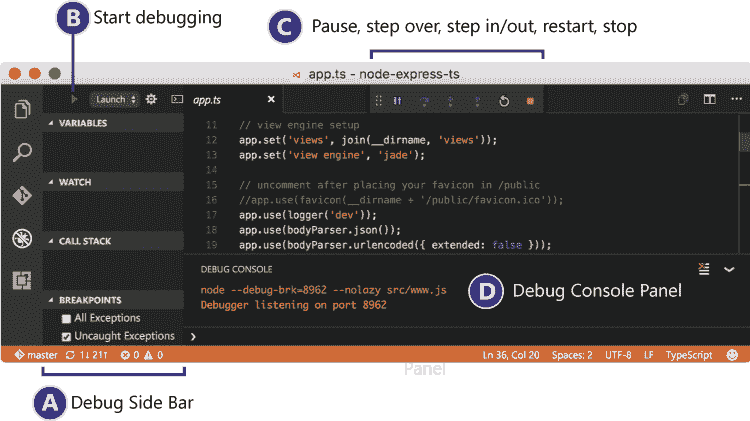

# 停止节点服务器如何终止一个节点进程

> 原文：<https://dev.to/dvddpl/how-to-kill-a-node-process-5d13>

在处理一个全栈应用程序时，可能会出现一堆节点进程同时运行的情况。它可能是一些自动化脚本，或者是在你编码/TDD 时观察和执行你的单元测试的脚本。
最有可能是 Webpack 在 localhost 上运行并服务于您的前端，以及服务于您的前端正在连接的 REST API 的节点应用程序。在这两种情况下**，这些进程将占用一个特定的端口**。

例如，我们当前的 React 应用程序在 localhost:3000 上提供服务，后端通过无服务器离线在 localhost:3001 上运行。

通常情况下，您可以通过命令行启动这些进程，比如:

```
npm run react-scripts start 
```

Enter fullscreen mode Exit fullscreen mode

或者

```
sls offline start --port 3001 
```

Enter fullscreen mode Exit fullscreen mode

当你运行它们时，你可以用
快速关闭它们

```
 <Ctrl> + C 
```

Enter fullscreen mode Exit fullscreen mode

如果您是通过 Visual Studio 代码或 IntelliJ IDEA 中的调试配置启动它们的，您可以单击“停止”按钮来停止该进程。

[](https://res.cloudinary.com/practicaldev/image/fetch/s--qsPY0kuK--/c_limit%2Cf_auto%2Cfl_progressive%2Cq_auto%2Cw_880/https://thepracticaldev.s3.amazonaws.com/i/auiwea35g4z8ofcaknci.png)

直到这里没问题。有时，尽管您启动了某个进程，但尽管关闭了 IDE 或终端，它们仍会在某个地方挂起，当您尝试再次运行它们时，会出现端口被占用的错误。

我不知道这是为什么或如何发生的，但时不时地(几周或几个月)，我发现自己在谷歌上搜索正确的命令来使用(**我倾向于很快忘记我不经常使用的东西——我可以在 20 秒内搜索到**)。因此，我将把它放在这里，它可能对其他人也有用！

```
ps -ef | grep node
# or 
ps aux | grep node 
```

Enter fullscreen mode Exit fullscreen mode

这个命令将打印所有正在运行的节点进程，起初可能会令人困惑，因为您可能有其他与您正在处理的项目无关的内容(如 Slack 或 Postman)。只需找到指向您的脚本或 js 文件的节点进程，并记下进程 ID(左起第二个值)

[](https://res.cloudinary.com/practicaldev/image/fetch/s--Tv6KRPiy--/c_limit%2Cf_auto%2Cfl_progressive%2Cq_auto%2Cw_880/https://thepracticaldev.s3.amazonaws.com/i/828ngsuiutvagooe3bx0.png)

如果您发现自己有一堵文本墙，因为您有许多进程正在运行，那么您可以搜索通过端口打开的进程(就像通常当我启动一个 react 应用程序时，它在端口 3000 上，而它的后端在端口 3001 上:

```
lsof -i :3001 
```

Enter fullscreen mode Exit fullscreen mode

一旦您有了流程及其 ID..

那就毫不留情的杀了它！

```
kill -9 PROCESS_ID 
```

Enter fullscreen mode Exit fullscreen mode

希望有帮助