# 如何限制前端 bug

> 原文：<https://dev.to/bnevilleoneill/how-to-limit-front-end-bugs-1nod>

[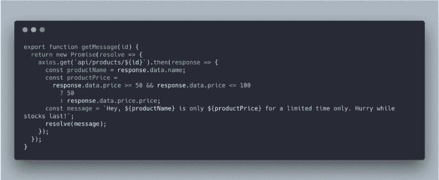](https://res.cloudinary.com/practicaldev/image/fetch/s--de-RVbCF--/c_limit%2Cf_auto%2Cfl_progressive%2Cq_auto%2Cw_880/https://cdn-images-1.medium.com/max/1024/1%2Avsxmr94zqk6HnKXXsP9Z5A.png)

bug 让我们的用户不高兴，并减缓了我们产品的开发速度。我们产品的前端可以说比后端更不稳定，所以可能更容易出问题。那么，如何才能限制我们引入产品的前端 bug 呢？

### 林挺

林挺是发现有问题的模式或代码的过程，这些模式或代码不符合特定的风格指南。林挺规则可以在编写代码时由我们的代码编辑器自动运行，也是我们 CI 流程的一部分。因此，它有助于在生产高质量可读代码时强制执行这些代码。

林挺工具存在于许多编程语言中，包括 JavaScript。事实上，在 JavaScript 世界中有一些 linters，但是目前最流行的是 [ESLint](https://eslint.org/) 。

ESLint 附带了许多适用于现代 JavaScript 代码的[规则](https://eslint.org/docs/rules/)。我们可以在一个. eslintrc JSON 文件中配置打开和关闭哪些规则，或者只是给我们一个警告，而不是让构建失败。我们也可以选择采用社区推荐的一套规则，而不是找出我们自己的一套规则来使用。

你能发现下面代码中的错误吗？

<figure>[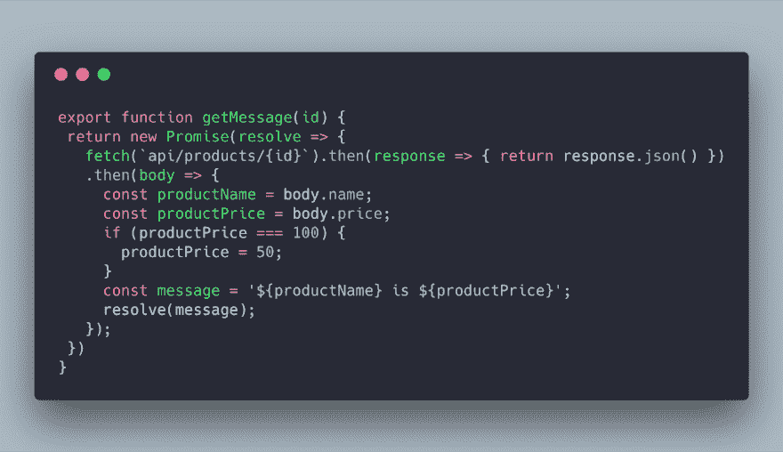](https://res.cloudinary.com/practicaldev/image/fetch/s--rEthqCGl--/c_limit%2Cf_auto%2Cfl_progressive%2Cq_auto%2Cw_880/https://cdn-images-1.medium.com/max/1024/0%2AmRL8Pd3s3aMoMAmu) 

<figcaption>漏洞百出的 JavaScript 代码</figcaption>

</figure>

ESLint 非常容易通过 npm 安装，并且有很多编辑器的插件，这些插件清楚地突出了 linter 已经发现的问题。看看下面的 [ESLint 扩展](https://marketplace.visualstudio.com/items?itemName=dbaeumer.vscode-eslint)中的[与](https://code.visualstudio.com/)中的问题代码中的问题有多清晰:

<figure>[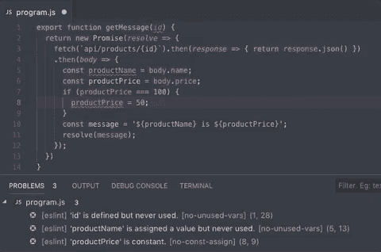](https://res.cloudinary.com/practicaldev/image/fetch/s--yksY5rUI--/c_limit%2Cf_auto%2Cfl_progressive%2Cq_auto%2Cw_880/https://cdn-images-1.medium.com/max/480/0%2A6Z5cs_sQkxrMPATp) 

<figcaption>ESLint 帮助我们快速解决 bug</figcaption>

</figure>

没错，不止一个问题！

如果我们用 TypeScript 编写前端代码，那么 [TSLint](https://palantir.github.io/tslint/) 是一个很好的 linter，我们可以用它来加强我们的风格指南。它的功能与 ESLint 非常相似——规则配置、预构建的规则集和强大的 VS 代码扩展。

林挺在任何前端项目中实现起来都相当简单，并且会带来显著的收益。所以，值得一试。

### 自动代码格式化

难道 linter 发现的一些样式问题不能被自动纠正吗？例如，工具可以自动添加丢失的分号吗？是啊！这就是代码格式化的用武之地。看看下面的代码:

<figure>[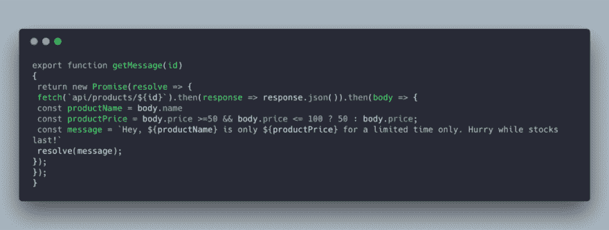](https://res.cloudinary.com/practicaldev/image/fetch/s--JMoNxlkP--/c_limit%2Cf_auto%2Cfl_progressive%2Cq_auto%2Cw_880/https://cdn-images-1.medium.com/max/1024/0%2A9Q-7TVv0uV5vnFLS) 

<figcaption>无格式代码</figcaption>

</figure>

这不是代码审查中最容易阅读的代码。代码是否包含 bug？

是一个代码格式化工具，当我们签入源代码时，我们可以用它来自动格式化我们的代码。编辑器扩展，比如 VS 代码中的[漂亮扩展](https://marketplace.visualstudio.com/items?itemName=esbenp.prettier-vscode)，也允许我们保存代码时自动格式化。

因此，只要将代码文件保存在 VS 代码中，我们就可以将代码转换成可读性更好的东西:

<figure>[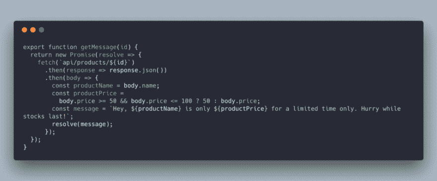](https://res.cloudinary.com/practicaldev/image/fetch/s--NdMsUshi--/c_limit%2Cf_auto%2Cfl_progressive%2Cq_auto%2Cw_880/https://cdn-images-1.medium.com/max/1024/0%2A4FzmZlu0vN0-RiiG) 

<figcaption>代码自动格式化为更漂亮的</figcaption>

</figure>

代码格式化非常容易实现，与 linter 配合得很好，让我们更容易发现代码中的错误。

### 静态类型检查

静态类型还允许我们在编写代码时尽早发现问题。你能发现下面 Javascript 函数中的错误吗？

<figure>[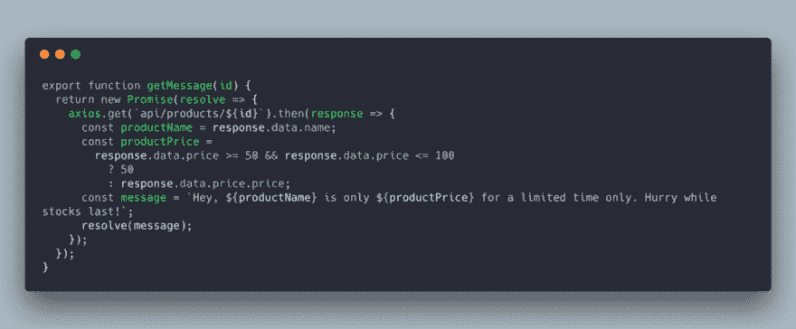](https://res.cloudinary.com/practicaldev/image/fetch/s--drwJgPAW--/c_limit%2Cf_auto%2Cfl_progressive%2Cq_auto%2Cw_880/https://cdn-images-1.medium.com/max/1024/0%2AW9exkdq6v_wZp_yQ) 

<figcaption>漏洞百出的 JavaScript 代码</figcaption>

</figure>

有一个 bug，我们引用了一个 linter 无法捕捉的响应对象，除非我们非常熟悉被调用的特定 web API，否则我们很难发现这个 bug。如果我们能够定义响应对象类型会怎么样？然后编译器可以检查我们是否正确引用了响应对象。嗯，这就是 [TypeScript](https://www.typescriptlang.org/) 允许我们做的事情！

现在，如果我们为响应对象添加一个类型，您能发现问题吗？

<figure>[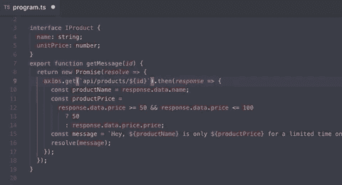](https://res.cloudinary.com/practicaldev/image/fetch/s--qW7mo2Gq--/c_limit%2Cf_auto%2Cfl_progressive%2Cq_auto%2Cw_880/https://cdn-images-1.medium.com/max/480/0%2AWB4x_k1D4wIb2Z4E) 

<figcaption>打字稿抓虫子</figcaption>

</figure>

上面截图中的编辑器是 VS Code，它有很好的 TypeScript 支持，用一个非常有用的错误消息尽可能快地突出了这个 bug。

TypeScript 在 JavaScript 之上构建了一个静态类型系统，目前非常流行。实际上， [vue 3.x 是用 typescript](https://medium.com/the-vue-point/plans-for-the-next-iteration-of-vue-js-777ffea6fabf) 写的。

TypeScript 编译器是高度可配置的，因此，无论我们是在一个全新的还是全新的项目中工作，我们都可以将 TypeScript 添加到组合中，并尽早开始捕捉错误。

### 自动化测试

林挺、代码格式化和静态类型检查并不需要在我们的项目中投入太多精力。另一方面，自动化测试确实需要相当大的努力，但是它们可以捕捉更复杂的错误，所以这种努力是值得的。

Jest 是一个很棒的单元测试工具，我们可以用它来测试 JavaScript 函数和我们的前端组件。它在测试 React 应用程序时非常受欢迎。它具有有用的模拟功能，并在测试失败时给我们提供有用的错误消息:

<figure>[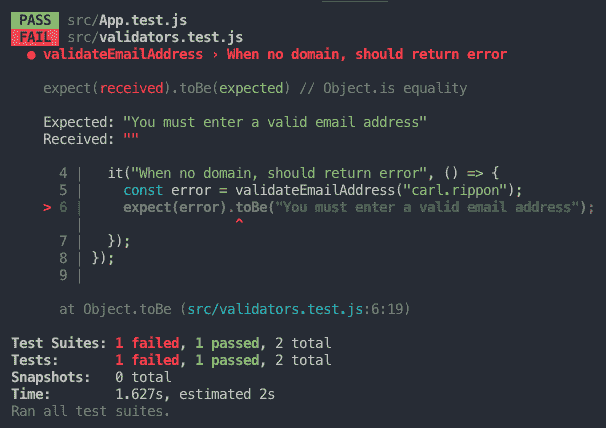](https://res.cloudinary.com/practicaldev/image/fetch/s--36-f5i1T--/c_limit%2Cf_auto%2Cfl_progressive%2Cq_auto%2Cw_880/https://cdn-images-1.medium.com/max/606/0%2ASeaq84Cv9FeBRCkb) 

<figcaption>终端中的笑话错误信息</figcaption>

</figure>

当编写单元测试时，知道哪些代码区域没有被代码覆盖是很有用的。使用 Jest，您需要做的就是添加- coverage 选项来获得一个很好的代码覆盖率报告:

<figure>[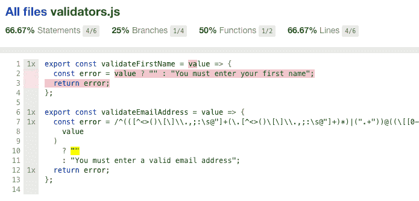](https://res.cloudinary.com/practicaldev/image/fetch/s--O6RP17rA--/c_limit%2Cf_auto%2Cfl_progressive%2Cq_auto%2Cw_880/https://cdn-images-1.medium.com/max/695/0%2AtooPZ8VBTH9WHWwy) 

<figcaption>代码覆盖报告</figcaption>

</figure>

然后，我们可以使用这些知识来帮助计划我们需要编写的未来单元测试。

单元测试给了我们信心，让我们相信应用程序中孤立的部分正在工作，并且随着应用程序的开发而继续工作。然而，他们并没有给我们很大的信心，让我们相信随着应用程序的发展，应用程序中的关键故事情节将继续正确运行。这就是端到端测试(ETE)的用武之地。Cypress 是一个伟大的 ETE 测试工具，它允许我们用 JavaScript 构建测试。当调试一个失败的测试时，Cypress 确实很出色，因为测试在浏览器内部运行，这意味着我们拥有 Chrome DevTools 的所有功能。

除了让我们相信我们的应用程序中的关键故事情节会继续工作，ETE 测试通常更容易添加到现有的代码库中，因为它们与代码是分离的。ETE 测试还可以快速覆盖我们应用程序的各个领域。ETE 测试更脆弱，因为它们依赖于应用程序的所有层——应用程序所基于的数据的一点点变化都可能导致失败测试的雪崩，而没有捕捉到真正的错误。

因此，成本更高，但是健壮的单元测试和 ETE 测试的良好结合可以帮助林挺和类型检查没有捕捉到的回归。

### 利用框架和库减少代码

另一种减少代码中 bug 的方法是减少我们代码库的大小，并利用其他人久经沙场的代码。利用像 React、Vue 或 Angular 这样的框架将节省大量代码，更重要的是节省大量 bug。这三个框架都有蓬勃发展的生态系统和强大的库来支持状态管理和漂亮的 UI 组件。

但是我们必须小心，引入大量的依赖项会膨胀我们的代码库，并留给我们一个真正具有挑战性的 bug 需要修复——性能！这让我们很好地预防了性能问题…

### 关注表现

在开发我们的应用程序时，我们可以使用 Chrome 中强大的 DevTools 来帮助密切关注性能。

首先，我们可以使用网络面板来查看 HTTP 请求。有效载荷大吗？某个特定的资源是否被过于频繁地调用？大量的 web 请求或喋喋不休的 web APIs 会影响我们应用程序的性能。DevTools 甚至让我们模拟我们的应用程序在慢速网络上运行，这可以真正突出这些类型的性能问题。

DevTools 中实际上有一个特定的面板，用于在性能面板中分析性能。我们可以记录一段时间的应用使用情况，以获得性能相关信息的时间表，帮助我们发现并确定性能瓶颈所在。很有必要对您正在使用的应用程序进行分析，以检查性能是否有所下降。

解决性能问题的成本可能很高，因为这通常涉及到重构代码。因此，定期使用上述工具来及早发现这些问题是非常值得的。

### 尽可能使用纯函数

看看下面的代码:

<figure>[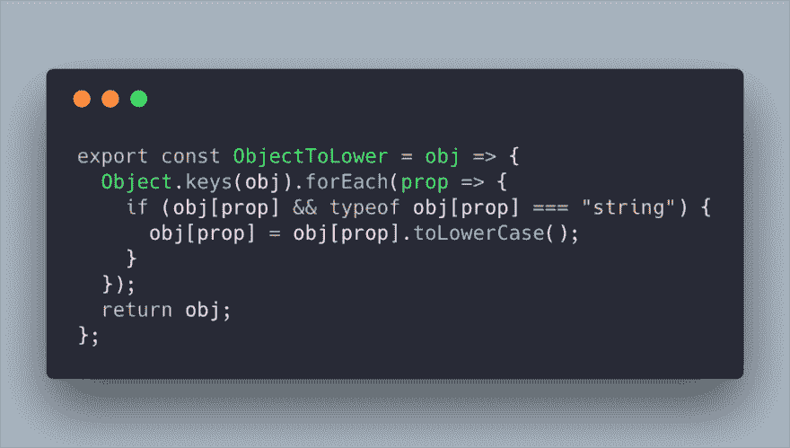](https://res.cloudinary.com/practicaldev/image/fetch/s--FCuv2xWp--/c_limit%2Cf_auto%2Cfl_progressive%2Cq_auto%2Cw_880/https://cdn-images-1.medium.com/max/1024/0%2Alw5OHhVzlz0NhlQb) 

<figcaption>不纯函数</figcaption>

</figure>

该函数接受一个对象，并返回相同的对象，字符串属性值转换为小写。你能发现代码的潜在问题吗？

嗯，根本问题是函数改变了传递给它的参数。代码的另一部分可能依赖于以原始状态传递的对象。这些都是微妙的错误，需要花费很高的成本来确定和修复。

这里显示了一个纯函数版本:

<figure>[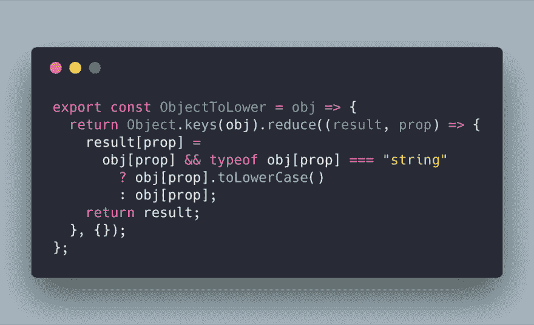](https://res.cloudinary.com/practicaldev/image/fetch/s---26DJKvg--/c_limit%2Cf_auto%2Cfl_progressive%2Cq_auto%2Cw_880/https://cdn-images-1.medium.com/max/1024/0%2AHFyMOnVyraWWqPNq) 

<figcaption>纯函数</figcaption>

</figure>

这个函数是纯粹的，因为它总是为给定的参数返回相同的值，并且不会产生任何副作用，比如改变参数。不改变参数意味着函数不会在我们代码的其他区域引起错误。

我们函数的第二个版本使用 array reduce 函数创建一个新对象，而不改变原始对象。其他有用的非变异数组函数有:

*   concat—用于添加数组项
*   过滤器—用于移除数组项目
*   映射—用于更改数组项目

### 不同浏览器中的常规检查

一个常见的需求是支持所有主流浏览器。如果我们在这个阵营中，并且正在使用一个我们以前没有用过的功能，我们可以在[caniuse.com](https://caniuse.com/)查看它的浏览器支持。没有什么比写了一小段很酷的代码，然后发现 IE 不支持它更糟糕的了！

除了确保我们使用的功能与我们需要支持的浏览器兼容，我们还可以在开发应用程序时在不同的浏览器中进行抽查。像 [BrowserStack](https://www.browserstack.com/) 这样的工具使得在不同的浏览器中检查我们的应用程序变得超级简单。

### 主动捕捉生产中的错误

我们可以在开发我们的应用程序的同时做所有这些伟大的事情，但错误仍然可能进入生产。如果我们能够在用户报告之前发现生产中发生的错误并解决它们，这不是很好吗？这就是错误报告工具发挥作用的地方。有很多很棒的工具可供选择(包括 [LogRocket](https://logrocket.com/) )。

### 总结起来

所以，我们有很多方法可以减少前端代码中的错误。有些是速赢的，如代码格式化和林挺，有些是更重要的投资，如自动化测试。

限制 bug 并尽早捕获 bug 意味着用户更快乐，有更多的时间来创建酷功能！

* * *

### Plug: [LogRocket](https://logrocket.com/signup/) ，一款适用于网络应用的 DVR

<figure>

<figcaption></figcaption>

</figure>

LogRocket 是一个前端日志工具，可以让你回放问题，就像它们发生在你自己的浏览器中一样。LogRocket 不需要猜测错误发生的原因，也不需要向用户询问截图和日志转储，而是让您重放会话以快速了解哪里出错了。它可以与任何应用程序完美配合，不管是什么框架，并且有插件可以记录来自 Redux、Vuex 和@ngrx/store 的额外上下文。

除了记录 Redux 操作和状态，LogRocket 还记录控制台日志、JavaScript 错误、堆栈跟踪、带有头+正文的网络请求/响应、浏览器元数据和自定义日志。它还使用 DOM 来记录页面上的 HTML 和 CSS，甚至为最复杂的单页面应用程序重新创建像素级完美视频。

免费试用。

* * *

帖子[如何限制前端 bug](https://blog.logrocket.com/how-to-limit-front-end-bugs-27d5648dd3ee)最先出现在[日志博客](https://blog.logrocket.com)上。