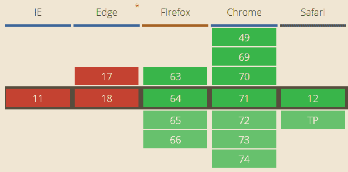
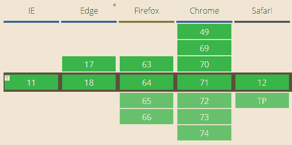

# 如何将 HTML、CSS 和 JS 代码载入 iFrame

> 原文：<https://dev.to/pulljosh/how-to-load-html-css-and-js-code-into-an-iframe-2blc>

如果你来这里只是为了答案，而不是故事，[答案在底部](#solution-blob-urls)。

如果您曾经使用过 JSFiddle、Codepen 或其他工具，这个问题对您来说会很熟悉:我们的目标是获取一些 HTML、CSS 和 JS(存储为字符串)并创建一个 iframe，在其中加载代码。

这个问题应该很容易，但事实并非如此。至少...本来不是，直到我找到了我一直期待的金奖券。

但稍后会详细介绍。让我们从所有不起作用的事情开始，因为那样更有趣。

## 尝试#1:使用 srcdoc

在做了一些研究之后，我兴奋地发现可以给 iframes 添加一个`srcdoc`属性。

如果您传入一个 HTML 字符串，iframe 将加载该 HTML 内容:

```
<iframe srcdoc="<p>This text will appear in the iframe!</p>"></iframe> 
```

Enter fullscreen mode Exit fullscreen mode

不幸的是，这种方法有两个主要问题:

### 1。浏览器对 srcdoc 的支持不是很好

[](https://res.cloudinary.com/practicaldev/image/fetch/s--2ZlTx3Y6--/c_limit%2Cf_auto%2Cfl_progressive%2Cq_auto%2Cw_880/https://thepracticaldev.s3.amazonaws.com/i/sehrt6gc4on3hzvc1dk0.PNG) 
如果我们想支持 IE 或者 Edge，我们需要一个不同的方法(或者 polyfill)。

### 2。有可能“逃离”CSS/JS

下面是我使用 srcdoc 实现的大致情况:

```
function setIframeContent(iframe, { html, css, js }) {
  const source = `
    <html>
      <head><style>${css}</style></head>
      <body> ${html} <script>${js}</script>
      </body>
    </html>
  `
  iframe.srcdoc = source
} 
```

Enter fullscreen mode Exit fullscreen mode

问题？当编写 CSS 或 JS 时，只需在代码中分别包含`</style>`或`</script>`，就有可能“逃”到 HTML 领域。

这个 bug 其实挺常见的；JSFiddle 和 Codepen 都受影响:
[https://codepen.io/PullJosh/embed/REQgxy?height=600&default-tab=js,result&embed-version=2](https://codepen.io/PullJosh/embed/REQgxy?height=600&default-tab=js,result&embed-version=2)

## 尝试#2:无服务器回旋镖

为了解决浏览器支持问题，让我们用常规的`src`属性替换`srcdoc`。为了做到这一点，我们需要传递一个真实的 URL，而不仅仅是代码。

也许我们可以设置一个页面，它接受 HTML、CSS 和 JS“GET”参数，并像以前一样输出相同类型的页面，但这次是从实际的 URL 加载的。

这是使用无服务器架构的最佳时机，因为我们只需要一个端点来做一件事。下面是我的尝试:

```
module.exports = (req, res) => {
  // Code comes from GET params in URL
  const { html = '', css = '', js = '' } = req.query

  // Generate and send HTML page
  return res.send(`
    <html>
      <head><style>${css}</style></head>
      <body> ${html} <script>${js}</script>
      </body>
    </html>
  `)
} 
```

Enter fullscreen mode Exit fullscreen mode

这几乎适用于所有浏览器，但也有其自身的问题:

1.  从 CSS/JS“逃逸”到 HTML 仍然是一个问题
2.  整个源代码通过一个 URL 传递，这个 URL[并不理想](https://stackoverflow.com/questions/417142/what-is-the-maximum-length-of-a-url-in-different-browsers)。

## 尝试#3:无服务器回旋镖(redux)

我们的第一个回旋镖解决了浏览器支持问题，但仍然有“逃逸”问题要处理。

幸运的是，由于我们传递代码的方式，这实际上是可以解决的。我们可以在客户端完成，而不是在服务器上将 CSS 和 JS 插入到页面中！这是可行的，因为客户端计算机仍然可以访问 URL GET 参数。

这里的源代码有点长，但确实有效:

```
module.exports = (req, res) => {
  return res.send(`
    <html>
      <head>
        <script type="text/javascript">
          window.addEventListener('load', function() {
            function getUrlParameter(name) {
              name = name.replace(/[\\[]/, '\\\\[').replace(/[\\]]/, '\\\\]');
              var regex = new RegExp('[\\\\?&]' + name + '=([^&#]*)');
              var results = regex.exec(location.search);
              return results === null ? '' : decodeURIComponent(results[1].replace(/\\+/g, ' '));
            };

            // Load JS from GET params (on client)
            var js = getUrlParameter('js');
            if (js) {
              var script = document.createElement('script');
              script.type = 'text/javascript';
              script.text = js;
              document.body.appendChild(script);
            }

            // Load CSS from GET params (on client)
            var css = getUrlParameter('css');
            if (css) {
              var style = document.createElement('style');
              style.type = 'text/css';
              if (style.styleSheet) {
                style.styleSheet.cssText = css;
              } else {
                style.appendChild(document.createTextNode(css));
              }
              document.head.appendChild(style);
            }

            // Remove the currently running script tag
            document.currentScript.parentNode.removeChild(document.currentScript);
          });
        </script>
      </head>
      <body> ${req.query.html || ''} </body>
    </html>
  `)
} 
```

Enter fullscreen mode Exit fullscreen mode

现在，如果一个脚本或样式包含可怕的 HTML 字符，浏览器会在将该脚本/样式插入文档时为我们处理它们。

这个解决方案是...好吧。技术上来说，这是可行的。但是我们仍然要考虑软 URL 长度限制。此外，我们现在正在处理一些服务器端的事情，感觉就像应该发生在客户端一样。

一定有更好的办法。

## 解决方案:Blob URLs

一直以来，我们都在尝试模拟从 URL 加载数据:

*   首先，我们使用 srcdoc 加载数据，而不是从 URL 加载
*   然后我们使用回飞棒从一个 URL 加载代码
*   接下来，我们更新了我们的 boomerang，试图模拟“从外部 URL 加载 CSS/JS”行为，尽管每个资源都来自一个 URL。

原来 Javascript 有一个特性可以做到这一点: **Blob URLs** 。

### 斑点

我们可以使用`Blob`构造函数来创建一个伪文件。它不是从磁盘或 URL 加载的真实文件——它只是存储在内存中。但在许多方面，它的功能就像一个真正的加载文件。

然后，我们可以使用`URL.createObjectURL(blob)`创建一个 URL，用于加载 blob 的内容。

下面是它在实践中的工作方式:

```
const getBlobURL = (code, type) => {
  const blob = new Blob([code], { type })
  return URL.createObjectURL(blob)
}

console.log(getBlobURL('<p>My webpage</p>', 'text/html'))
// blob:https://dev.to/9ca05e31-05ea-48f8-838d-cc1ad0949ec8 
```

Enter fullscreen mode Exit fullscreen mode

试着在控制台中运行上面的代码，自己看看吧！它将记录一个 URL。如果你将 URL 粘贴到一个新的标签中(包括开头的`blob:`位)，它将加载一个包含 HTML 的页面。

注意传递给`getBlobURL`的`'text/html'`？我们也可以改变这一点。生成 CSS 或 JS blob 很容易:只需分别传递`text/css`或`text/javascript`。

blob URLs 的另一个好处是它们可以保持不变，并且可以像访问普通 URL 一样被访问。这意味着我们可以*实际上*从一个单独的 URL 加载我们的 CSS 和 JS 文件，所以“转义”技巧不再是一个问题。

这里有一个实践中的基本实现:

```
const getGeneratedPageURL = ({ html, css, js }) => {
  const getBlobURL = (code, type) => {
    const blob = new Blob([code], { type })
    return URL.createObjectURL(blob)
  }

  const cssURL = getBlobURL(css, 'text/css')
  const jsURL = getBlobURL(js, 'text/javascript')

  const source = `
    <html>
      <head> ${css && `<link rel="stylesheet" type="text/css" href="${cssURL}" />`}  ${js && `<script src="${jsURL}"></script>`} </head>
      <body> ${html || ''} </body>
    </html>
  `

  return getBlobURL(source, 'text/html')
}

const url = getGeneratedPageURL({
  html: '<p>Hello, world!</p>',
  css: 'p { color: blue; }',
  js: 'console.log("hi")'
})

const iframe = document.querySelector('#iframe')
iframe.src = url 
```

Enter fullscreen mode Exit fullscreen mode

哦，浏览器对 Blob URLs 的支持比 srcdoc 好得多。；)

[](https://res.cloudinary.com/practicaldev/image/fetch/s--QgYOA-h0--/c_limit%2Cf_auto%2Cfl_progressive%2Cq_auto%2Cw_880/https://thepracticaldev.s3.amazonaws.com/i/5txz7va38ll82n66dodu.PNG)

# 道德？

我想，不要反对语言。

我知道我想做什么:从 URL 加载数据。我从来没有想过要寻找一种非黑客的方式来做到这一点！