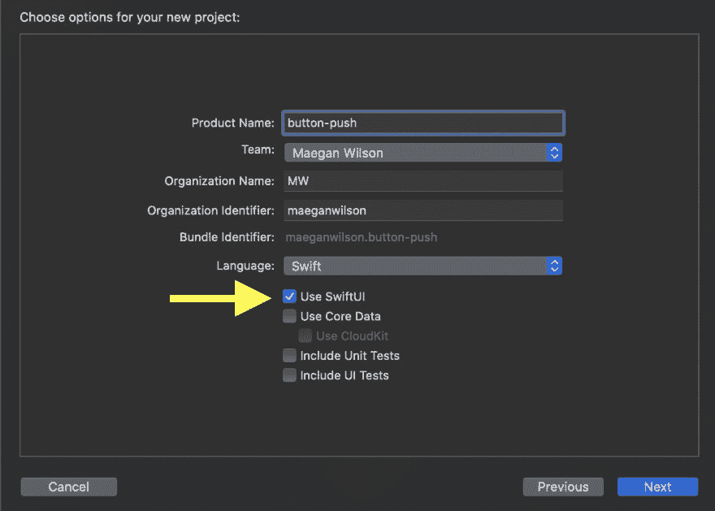
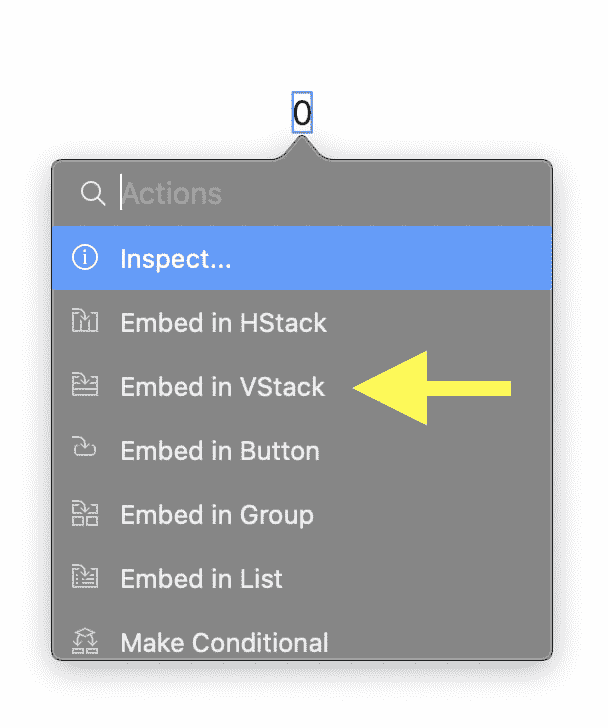
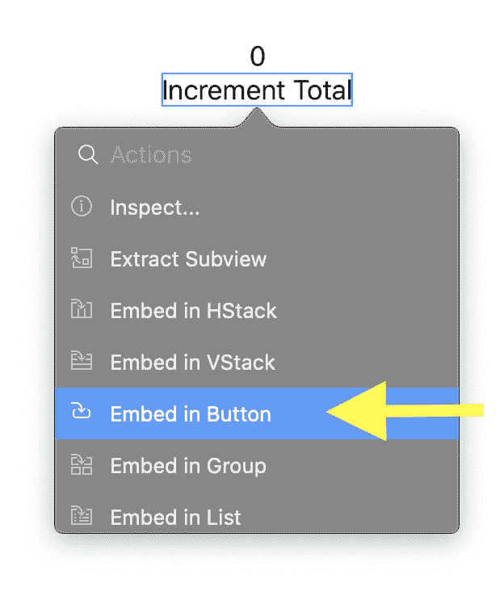

# 如何用 SwiftUI 制作按钮

> 原文：<https://dev.to/maeganwilson_/how-to-make-a-button-with-swiftui-134b>

如果你正在尝试跟进，请知道 SwiftUI 需要 XCode 11 和 macOS 10.15，所有这些现在都处于开发者测试阶段。

这篇文章将带你了解如何制作一个基本的 iOS 应用程序来计算一个按钮被点击的次数。

# 1。创建新项目

第一步是启动 XCode 并创建一个新的单页 iOS 应用程序。创建 iOS 应用程序时，确保选中`Use SwiftUI`。

[](https://res.cloudinary.com/practicaldev/image/fetch/s--wWtilp8a--/c_limit%2Cf_auto%2Cfl_progressive%2Cq_auto%2Cw_880/https://github.com/maeganjwilson/totalClicked_tut/blob/master/tutoriimg/project.png%3Fraw%3Dtrue)

# 2。创建一个变量，并让应用程序输出该变量

接下来，我们需要创建一个`@State`变量，以便它可以在点击按钮时动态变化。在 ContentView 结构中，添加`@State var totalClicked: Int = 0`，并将`Text()`中的字符串改为`"\(totalClicked)")`。

您的结构现在应该看起来像这样。

```
struct ContentView : View {

    @State var totalClicked: Int = 0

    var body: some View {
          Text("Hello World")
    }
} 
```

Enter fullscreen mode Exit fullscreen mode

# 3。在垂直堆栈中嵌入`Text()`

现在，我们需要在垂直堆栈中嵌入文本，将按钮放在`Text()`的下面。要执行该命令，在实时预览中点击`0`，并选择`Embed in VStack`。

[](https://res.cloudinary.com/practicaldev/image/fetch/s--RYBgN196--/c_limit%2Cf_auto%2Cfl_progressive%2Cq_auto%2Cw_880/https://github.com/maeganjwilson/totalClicked_tut/blob/master/tutoriimg/stackview.png%3Fraw%3Dtrue)

通过嵌入 VStack，这个结构现在看起来像这样:

```
struct ContentView : View {

    @State var totalClicked: Int = 0

    var body: some View {
          VStack { // this was added
            Text("Hello World")
          }
    }
} 
```

Enter fullscreen mode Exit fullscreen mode

# 4。添加带有动作的按钮

是时候加个按钮了。一种方法是首先添加一个`Text()`。将以下内容添加到您的结构中:

```
// more stuff above
VStack { 
    Text("\(totalClicked)")
    Text("Increment Total) // <- This is what to add
}
// more stuff below 
```

Enter fullscreen mode Exit fullscreen mode

现在，让我们使用实时预览将`Text()`嵌入到一个按钮中。按住 Command 键并点击实时预览中的增量总计，然后选择`Embed in Button`。

[](https://res.cloudinary.com/practicaldev/image/fetch/s--uQFUCSlZ--/c_limit%2Cf_auto%2Cfl_progressive%2Cq_auto%2Cw_880/https://github.com/maeganjwilson/totalClicked_tut/blob/master/tutoriimg/button.png%3Fraw%3Dtrue)

我们需要调整现在在`ContentView.swift`中的按钮代码。将按钮调整为如下所示:

```
var body: some View {
    VStack {
        Text("\(totalClicked)")
        Button(action: {self.totalClicked = self.totalClicked + 1}) {
        Text("Increment Total")
        }
    }
} 
```

Enter fullscreen mode Exit fullscreen mode

现在，如果你运行应用程序，它将工作！

# 5。(可选)给应用程序添加一些样式！

目前，按钮和文本之间没有空格，并且总的大小相当小。在 SwiftUI 中，你可以很容易地进行调整。

首先，我们通过在文本调用后添加`.font(.title)`来调整总计的字体大小。

```
Text("\(totalClicked").font(.title) 
```

Enter fullscreen mode Exit fullscreen mode

接下来，我们将在按钮和文本之间添加一些空间。为此，我们需要在文本和按钮之间添加`Spacer()`。

```
Text("\(totalClicked)").font(.title)
Spacer()
Button(action: {self.totalClicked = self.totalClicked + 1}) {
    Text("Increment Total")
} 
```

Enter fullscreen mode Exit fullscreen mode

按钮上的触摸目标有点小，所以为了让它更大，我们将添加填充。

```
Button(action: {self.totalClicked = self.totalClicked + 1}) {
    Text("Increment Total")
} .padding(.all) 
```

Enter fullscreen mode Exit fullscreen mode

`.all`是给按钮的所有边添加填充，而不仅仅是顶部、底部、左侧或右侧。

最后，让我们为整个`Vstack`添加填充，这样应用程序将填充设备的屏幕。

```
var body: some View {
    Vstack {
        Text("\(totalClicked)").font(.title)
        Spacer()
        Button(action: {self.totalClicked = self.totalClicked + 1}) {
            Text("Increment Total")
        }.padding(.all)
    }.padding(.all, 40)
} 
```

Enter fullscreen mode Exit fullscreen mode

`.padding(.all, 40)`将告诉这个`VStack`在顶部、左侧、右侧和底部与它最近的成员保持 40 点的距离。

这是完成的回购

##  [梅根威尔逊](https://github.com/maeganwilson) / [ totalClicked_tut](https://github.com/maeganwilson/totalClicked_tut)

### 在 SwiftUI 中使用按钮的教程

<article class="markdown-body entry-content container-lg" itemprop="text">

# SwiftUI 按钮教程

在 SwiftUI 中使用按钮的教程

# 阅读教程的地方

*   [开发到](https://dev.to/maeganwilson_/how-to-make-a-button-with-swiftui-134b)
*   [本次回购](https://github.com/maeganjwilson/totalClicked_tut/tree/master/tutorial)

# 你喜欢吃吗?

如果你喜欢这个教程和项目，请考虑成为这个项目和其他喜欢它的人的赞助者，方法是点击 repo 顶部的赞助者按钮，或者直接进入我的 [Patreon](https://patreon.com/maeganwilson_) 。

</article>

[View on GitHub](https://github.com/maeganwilson/totalClicked_tut)

* * *

如果你喜欢这篇文章并想要更多，请考虑订阅我的 [Patreon](https://www.patreon.com/maeganwilson_) 并查看我的其他帖子！

如果你不喜欢有更多的订阅，请点击下面的图片给我买一杯咖啡！[](https://www.buymeacoffee.com/appsbymw)