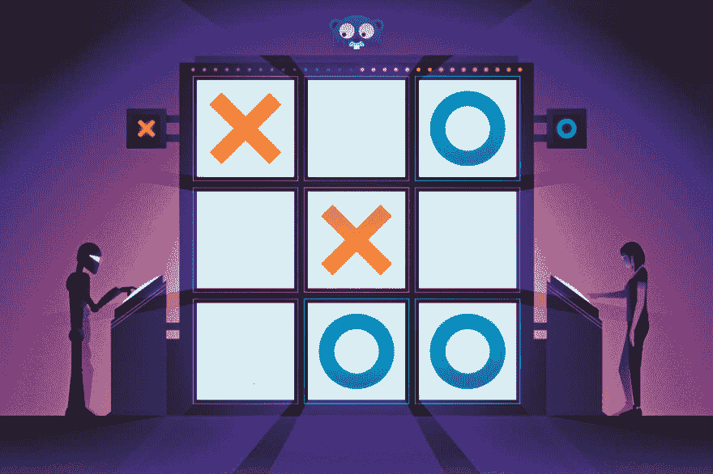
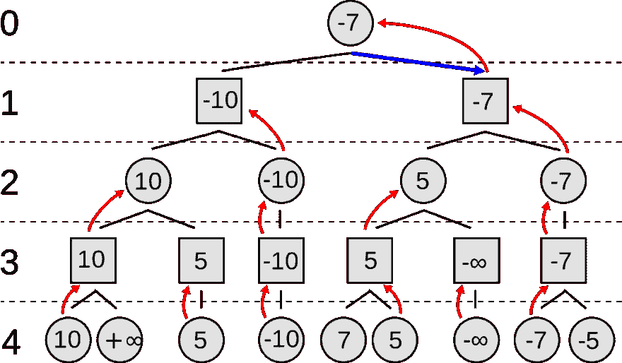
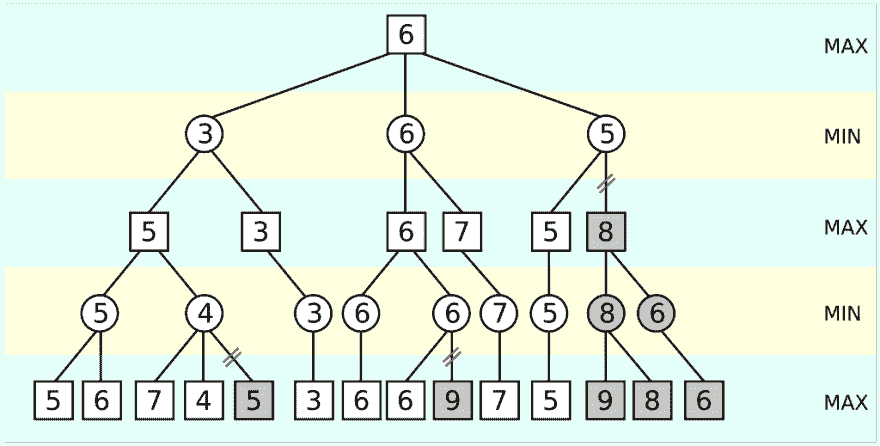
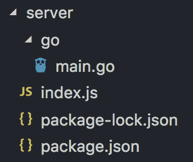
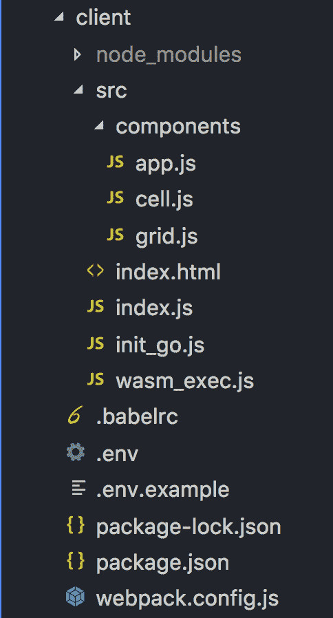
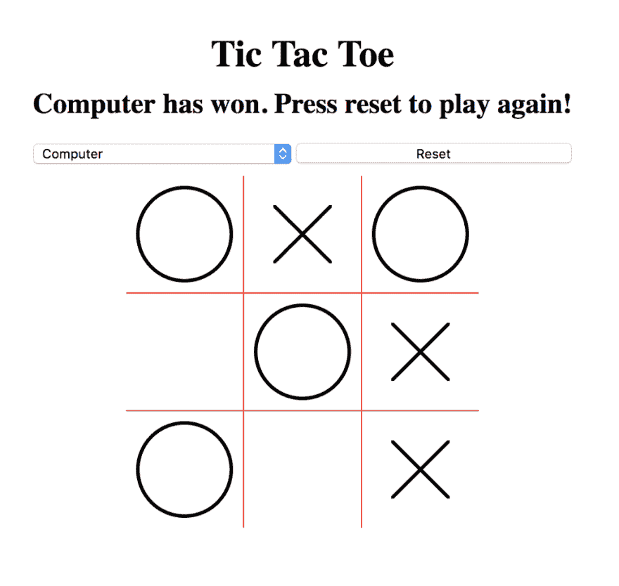

# 如何用 WebAssembly 为 Go 制作井字机器人

> 原文：<https://dev.to/bnevilleoneill/how-to-make-a-tic-tac-toe-bot-with-webassembly-for-go-2phm>

[](https://res.cloudinary.com/practicaldev/image/fetch/s--_KRnjQfD--/c_limit%2Cf_auto%2Cfl_progressive%2Cq_auto%2Cw_880/https://cdn-images-1.medium.com/max/1024/1%2AUvpSy9LWHgh8byK5K34p9w.png)

不久前，我写了一篇关于 React.js 应用程序中 Go WebAssembly 的基本设置的文章。我们将借用我们在那里所做的工作，所以请确保先阅读一下(或者下载[入门模板](https://github.com/Chrischuck/React-Go-WASM))！

如果您需要下载模板，请运行以下命令:

`git clone https://github.com/Chrischuck/React-Go-WASM.git`

另外，确保你已经下载了 Chrome 浏览器，因为我们需要它来进行开发。

上次我们使用 Go 只是简单地将内容记录到控制台。这很酷，但这一次我们将通过制作一个在井字游戏中无与伦比的机器人来使用 Go。

本教程将依次涵盖以下主题:

*   tic-tac-toe
*   极大极小算法
*   在 Go 中实现 MiniMax
*   让它在 React 中工作
*   面向 Go 的 WebAssembly 的要点/缺陷

正如你所看到的，我们将涵盖很多不同的主题，从人工智能理论，写一些围棋，和一点点的网络开发。你不需要成为这些方面的专家，所以让我们直接开始吧。

这里有一个完整的[演示](https://chris-tac-toe.netlify.com/)(仅限☹️桌面和 Chrome)及其[回购](https://github.com/Chrischuck/ai-tic-tac-toe)的链接。

作为另一个资源，链接到这篇文章的[回购](https://github.com/Chrischuck/React-Go-WASM)。

[](https://logrocket.com/signup/)

### 井字游戏基础知识

如果你不熟悉井字游戏，这是一种到处都是小学生玩的游戏。它的起源可以追溯到古埃及(远至公元前 1300 年)！游戏比较简单，大家来看看吧！

[](https://res.cloudinary.com/practicaldev/image/fetch/s--C1frZo32--/c_limit%2Cf_auto%2Cfl_progressive%2Cq_auto%2Cw_880/https://cdn-images-1.medium.com/max/1024/0%2ApWnsuxcGauVvnx8q.png) 

<figcaption>图片来自[维基](https://en.wikipedia.org/wiki/Tic-tac-toe#/media/File:Tic-tac-toe-game-1.svg)</figcaption>

你有一个 3x3 矩阵(如上所示)，一个玩家是 O，另一个是 x。玩家轮流用他们的符号填充空白位置。第一个连续获得三个符号的人获胜！经典的井字游戏包括一个 3x3 的棋盘，但是只要它是正方形的，你可以选择任何大小。对于本教程，出于简单和性能原因，我们将坚持使用 3x3(稍后将详细介绍性能原因)。

### 如何赢得所有时间— MiniMax

我们首先应该检查的是为井字游戏机器人提供动力的实际算法。来自维基百科的该算法的定义陈述如下:

> [**Minimax**](https://en.wikipedia.org/wiki/Minimax) 是在[人工智能](https://en.wikipedia.org/wiki/Artificial_intelligence)、[决策理论](https://en.wikipedia.org/wiki/Decision_theory)、[博弈论](https://en.wikipedia.org/wiki/Game_theory)、[统计学](https://en.wikipedia.org/wiki/Statistics)和[哲学](https://en.wikipedia.org/wiki/Philosophy)中使用的决策规则，用于 _mini_mizing 可能的[损失](https://en.wikipedia.org/wiki/Loss_function)的最坏情况(_max_imum loss)。

这意味着我们的算法不一定要赢，而是不要输。将这种想法应用到我们的井字游戏中，我们的机器人将选择给对手最低获胜机会的路径。

请看下图:

[](https://res.cloudinary.com/practicaldev/image/fetch/s--kknCUCCd--/c_limit%2Cf_auto%2Cfl_progressive%2Cq_auto%2Cw_880/https://cdn-images-1.medium.com/max/1024/1%2AgbgYtkd4MBF8afkm9Dc1yQ.png) 

<figcaption>[图片](https://en.wikipedia.org/wiki/File:Minimax.svg)来自维基百科</figcaption>

上面有圆圈的关卡代表对手的选择(0，2，4)，而有方块的关卡代表机器人的选择(1 和 3)。分支代表可能的选择。对于机器人的每个可能的移动，它将遍历树，直到它到达一个终止状态，即不能再移动。沿着树的每条路径代表一系列的移动。看第一层，我们有 6 对，(10，inf)，(5)，(-10)，(7，5)，(-inf)，和(-7，-5)。既然是对手的选择，我们就选择每对的最小值，所以 10，5，-10，5，-inf，和-7。然后，我们将相同的算法应用于我们的值新值，但不是取最小值，而是取最大值。

这种朴素的 MiniMax 版本工作得很好，但是我们可以用一种叫做 alpha-beta 修剪的东西来改进它。

有了 alpha-beta 剪枝，我们可以完全忽略树的一些分支，大大加快我们寻找最佳解决方案的速度。

[](https://res.cloudinary.com/practicaldev/image/fetch/s--bfKtpokG--/c_limit%2Cf_auto%2Cfl_progressive%2Cq_auto%2Cw_880/https://cdn-images-1.medium.com/max/1024/0%2Al2X89FetJrhFXSuy.png) 

<figcaption>图片来自[维基](https://en.wikipedia.org/wiki/Alpha%E2%80%93beta_pruning#/media/File:AB_pruning.svg)</figcaption>

让我们开始应用极大极小算法来看看阿尔法贝塔修剪在起作用。查看对(5，6)，最小值是 5。我们知道，我们现在必须在 5 和我们在正确的分支上得到的任何值之间选择一个最大值。现在对比(7，4)，我们的最小值是 4。4 小于 5，所以我们在比较时会选择 5 作为最大值。因此，我们不必检查第三个分支，在本例中是 5，因为它不可能在树中向上传播超过与 5 的最大比较。

### 围棋中的极小极大

从我们上次停止的地方开始(或者在下载初学者模板之后)，您的文件夹结构应该如下所示:

[](https://res.cloudinary.com/practicaldev/image/fetch/s--405XrAVn--/c_limit%2Cf_auto%2Cfl_progressive%2Cq_auto%2Cw_880/https://cdn-images-1.medium.com/max/380/1%2AXWv1ELUrVmlR04FgeSAlVA.png)

将 server/go 文件夹中的 main.go 文件编辑为以下内容:

```
package main

import "syscall/js"

func findNextComputerMove(args []js.Value) {
    grid := args[0]
    turnCount := args[1].Int()

    nextMove := GetNextMove(grid, turnCount)
    js.Global().Set("nextMove", js.TypedArrayOf(nextMove))
}

func checkGameState(args []js.Value) {
    grid := args[0]
    lastMoveArg := args[1]
    turnCount := args[2].Int()
    player := args[3].String()

    lastMove := []int8{
        int8(lastMoveArg.Index(0).Int()),
        int8(lastMoveArg.Index(1).Int()),
    }
    gameState := StateValue(grid, lastMove, player, turnCount)

    js.Global().Set("gameState", js.ValueOf(gameState))
}

func registerCallbacks() {
    js.Global().Set("findNextComputerMove", js.NewCallback(findNextComputerMove))
    js.Global().Set("checkGameState", js.NewCallback(checkGameState))
}

func main() {
    done := make(chan bool, 0)
    registerCallbacks()
    <-done
} 
```

与上次相比，我们实际上只添加了三样东西，一个发现机器人下一步行动的函数，一个检查游戏状态的函数(机器人赢，用户赢，平局或游戏未结束)，以及计算完成后的游戏状态本身。这两个函数本质上都是包装器，将我们即将编写的代码展示给 JavaScript 客户机。请记住，变量 gameState 以及函数 findNextComputerMove 和 checkGameState 将在 React 应用程序中作为全局变量公开。

请注意这两个函数的参数，args []js.Value。所以在客户端，我们可以传递尽可能多的参数，它们将在 args 数组中被索引。

查看 checkGameState 函数，可以看到我们使用索引从数组中提取了所需的参数。

现在在 server/go 文件夹中创建一个名为 tictactoe.go 的文件。我们要做的第一件事是创建一个检查游戏状态的函数:

```
package main

import "syscall/js"

func StateValue(grid js.Value, lastMove []int8, player string, turnCount int) int {
    // return 0 for more moves to be played, 1 for Computer win, 2 for hooman win, and 3 for tie!
    rowIndex := lastMove[0]
    columnIndex := lastMove[1]
    gridSize := grid.Length()

    // check columns and rows
    rowEqual := true
    columnEqual := true
    for i := 0; i < gridSize; i++ {
        if grid.Index(int(rowIndex)).Index(i).String() != player {
            rowEqual = false
        }

        if grid.Index(i).Index(int(columnIndex)).String() != player {
            columnEqual = false
        }

        if !rowEqual && !columnEqual {
            break
        }
    }

    if rowEqual || columnEqual {
        if player == "COMPUTER" {
            return 1
        }
        return 2
    }

    // check upper left to bottom right diagonal
    if rowIndex == columnIndex {
        firstDiagonalEqual := true
        for i := 0; i < gridSize; i++ {
            if grid.Index(i).Index(i).String() != player {
                firstDiagonalEqual = false
            }
        }
        if firstDiagonalEqual {
            if player == "COMPUTER" {
                return 1
            }
            return 2
        }
    }

    // check top right to bottom left diagonal
    if int(rowIndex) == gridSize-1-int(columnIndex) {
        secondDiagonalEqual := true

        for i := 0; i < gridSize; i++ {
            if grid.Index(i).Index(gridSize-1-i).String() != player {
                secondDiagonalEqual = false
            }
        }
        if secondDiagonalEqual {
            if player == "COMPUTER" {
                return 1
            }
            return 2
        }
    }

    if gridSize*gridSize == turnCount {
        return 3
    }
    return 0
} 
```

这个函数的作用是检查游戏是否是平局，机器人赢了，人类赢了，或者是否还有棋可走。需要一个 js。将游戏状态作为第一个参数的网格，最后一步棋，最后一步棋的玩家，以及到目前为止的回合数。该函数返回四种不同的状态:

*   如果还有更多棋要走，则为 0
*   1 如果机器人赢了
*   2 如果人类赢了
*   3 如果是平局

首先，该函数检查受此移动影响的行或列是否在一行中创建了三个。如果有一个获胜状态，该函数将根据谁获胜返回 1 或 2。如果没有人通过列或行获胜，则检查对角线，如果最后一步是在对角线上。同样，如果有一个赢的状态，根据谁赢了，返回 1 或 2。如果不是，该函数通过检查圈数是否等于网格大小的平方来检查是否有平局。如果有平局，则返回 3，如果没有，则返回 0。

现在我们有能力检查游戏的状态，我们可以建立我们的极大极小算法。将以下更改添加到 tictactoe.go 文件中:

```
package main

import (
    "math"
    "syscall/js"
)

type SuccessorState struct {
    Grid     js.Value
    LastMove []int8
    Rating   int
}

/*
 * StateValue function...
 */

func GetNextMove(grid js.Value, turnCount int) []int8 {
    successorStates := getSuccessorStates(grid, "COMPUTER")
    var maxState SuccessorState

    // kicking off the minimax algo, we can assume the move is from the computer
    for index, state := range successorStates {
        state.Rating = miniMax(state.Grid, state.LastMove, "COMPUTER", turnCount, math.MinInt32, math.MaxInt32)

        if index == 0 || state.Rating > maxState.Rating {
            maxState = state
        }
    }
    return maxState.LastMove
} 
```

这个 GetNextMove 函数简单地迭代所有下一个可能的状态，并在每个后续状态上运行 Minimax 算法。完成后，它返回具有最大值的状态。

现在让我们添加一些实用函数。将以下内容添加到您的文件中:

```
func intMax(x int, y int) int {
    if x > y {
        return x
    }
    return y
}

func intMin(x int, y int) int {
    if x < y {
        return x
    }
    return y
}

func getSuccessorStates(grid js.Value, player string) []SuccessorState {
    var states []SuccessorState

    // slice version of our grid so we can copy it
    baseGrid := duplicateGrid(grid)

    for i := 0; i < grid.Length(); i++ {
        for j := 0; j < grid.Length(); j++ {
            if grid.Index(i).Index(j).String() == "" {
                // copy the base grid
                newGrid := make([]interface{}, len(baseGrid))
                copy(newGrid, baseGrid)
                jsGrid := js.ValueOf(newGrid)
                // apply the next move
                jsGrid.Index(i).SetIndex(j, player)

                newState := SuccessorState{
                    Grid:     jsGrid,
                    LastMove: []int8{int8(i), int8(j)},
                }
                states = append(states, newState)
            }
        }
    }
    return states
}

func duplicateGrid(grid js.Value) []interface{} {
    // I wish there was an easier way... but as of now I don't
    // think you can create a duplicate of a js array :(
    // so we just pass the values into a slice
    // pls lmk if you have an optimal solution
    gridSize := grid.Length()

    newGrid := make([]interface{}, gridSize)

    for i := 0; i < gridSize; i++ {
        newGridRow := make([]interface{}, gridSize)
        for j := 0; j < gridSize; j++ {
            newGridRow[j] = grid.Index(i).Index(j).String()
        }
        newGrid[i] = newGridRow
    }
    return newGrid
} 
```

前两个函数 intMin 和 intMax 只返回两个数的最小值和最大值。getSuccessorStates 获取当前游戏状态，并为玩家找到所有可能的移动，应用每个移动，然后返回应用了每个可能移动的状态数组。最后一个实用函数是 duplicateGrid 函数。这个函数接受 js 类型的网格。值，并将其转换为切片。到目前为止，我不认为有更简单的方法来做这个手术，这是一个明显的痛点。但稍后会详细介绍。

现在我们有了先决条件，我们可以创建极小极大函数的核心。将以下函数添加到 tictactoe.go 文件中:

```
func miniMax(grid js.Value, lastMove []int8, player string, turnCount int, alpha int, beta int) int {
    gameState := StateValue(grid, lastMove, player, turnCount)

    if gameState == 1 {
        return 1
    } else if gameState == 2 {
        return -1
    } else if gameState == 3 {
        return 0
    }

    if player == "COMPUTER" {
        return miniMaxMin(grid, "HUMAN", turnCount, alpha, beta)
    } else {
        return miniMaxMax(grid, "COMPUTER", turnCount, alpha, beta)
    }
} 
```

这个函数非常简单。首先，它获取当前状态的值，并返回 1 表示计算机获胜，-1 表示人类获胜，0 表示平局。接下来，我们应用算法的最小/最大部分。如果轮到计算机，我们选择返回计算机最大值的回合。如果轮到人类，我们为人类选择获胜最少的回合。

让我们构建 miniMaxMin 函数。将此函数添加到您的 tictactoe.go 文件:

```
func miniMaxMin(grid js.Value, player string, turnCount int, alpha int, beta int) int {
    successorStates := getSuccessorStates(grid, player)

    minStateRating := int(math.MaxInt32 + 1)
    for _, state := range successorStates {
        minStateRating = intMin(minStateRating, miniMax(state.Grid, state.LastMove, player, turnCount+1, alpha, beta))

        if minStateRating <= alpha {
            return minStateRating
        }
        beta = intMin(beta, minStateRating)
    }
    return minStateRating
} 
```

这个函数取一个给定的状态，对于每个子状态，它找到带来最低净值的状态。然而，我们应用 alpha-beta 剪枝，所以我们不必遍历树上的每个节点。

现在我们来看看 miniMaxMax 函数。将此函数添加到您的 tictactoe.go 文件:

```
func miniMaxMax(grid js.Value, player string, turnCount int, alpha int, beta int) int {
    successorStates := getSuccessorStates(grid, player)

    maxStateRating := int(math.MinInt32 - 1)
    for _, state := range successorStates {

        maxStateRating = intMax(maxStateRating, miniMax(state.Grid, state.LastMove, player, turnCount+1, alpha, beta))

        if maxStateRating >= beta {
            return maxStateRating
        }
        alpha = intMax(alpha, maxStateRating)
    }
    return maxStateRating
} 
```

这个函数取一个给定的状态，对于每个子状态，它找到带来最高净值的状态。然而，我们再次应用 alpha-beta 剪枝，因此我们不必遍历树上的每个节点。

围棋中的极小极大算法到此为止！

是时候建立 WASM 档案了。cd 进入 server/go 目录，并在您的终端中运行以下命令:

```
GOOS=js GOARCH=wasm go build -o main.wasm 
```

这应该会在您的 server/go 目录中创建一个 main.wasm 文件。

从这里，cd 回到根目录/服务器目录并运行 npm run dev 来启动一个 express 服务器来提供您的 WASM 文件。

### 连接反应中的点

现在我们需要把我们的逻辑放到前端。

打开一个新的终端，将 cd 放入/client 目录。

运行以下命令:

```
npm install --save react react-dom && npm install --save-dev
@babel/core @babel/plugin-proposal-class-properties @babel/plugin-proposal-decorators @babel/plugin-syntax-dynamic-import @babel/polyfill @babel/preset-env @babel/preset-react add-asset-html-webpack-plugin babel-loader html-webpack-plugin webpack webpack-cli webpack-dev-server webpack-dotenv-plugin 
```

通过这样做，我们更新了依赖关系，并确保我们拥有构建 React 应用程序所需的一切。

接下来，更新我们的文件结构，如下所示:

[](https://res.cloudinary.com/practicaldev/image/fetch/s--0xQ8rFWX--/c_limit%2Cf_auto%2Cfl_progressive%2Cq_auto%2Cw_880/https://cdn-images-1.medium.com/max/484/1%2ArhkoQuwptGBbp5Euddz2lQ.png)

首先，像这样更新你的 web pack . config . js:

```
const HtmlWebpackPlugin = require('html-webpack-plugin');
const AddAssetHtmlPlugin = require('add-asset-html-webpack-plugin');
const DotenvPlugin = require('webpack-dotenv-plugin');

module.exports = {
  resolve: {
    modules: ['src', 'node_modules']
  },
  devtool: 'source-map',
  entry: {
    vendor: ['@babel/polyfill', 'react', 'react-dom'],
    client:     './src/index.js',
  },
  output: {
    path: __dirname + '/dist',
    filename: '[name].chunkhash.bundle.js',
    chunkFilename: '[name].chunkhash.bundle.js',
    publicPath: '/',
  },
  module: {
    rules: [
      {
        test: /\.js$/,
        exclude: /node_modules/,
        use: {
          loader: "babel-loader"
        }
      },
     ]
  },
  devServer: {
    historyApiFallback: true,
    disableHostCheck: true
  },
  plugins: [
    new DotenvPlugin({
      sample: './.env.example',
      path: './.env'
    }),
    new HtmlWebpackPlugin({
      title: 'GoWasm!',
      template: './src/index.html',
      filename: './index.html',
      inject: true,
      minify: {
        collapseWhitespace: true,
        collapseInlineTagWhitespace: true,
        minifyCSS: true,
        minifyURLs: true,
        minifyJS: true,
        removeComments: true,
        removeRedundantAttributes: true
      }
    }),
    // Make sure to add these in this order, so the wasm_exec.js gets injected first
    // yes, it's backwards, I know :/
    new AddAssetHtmlPlugin({ filepath: require.resolve('./src/init_go.js') }),
    new AddAssetHtmlPlugin({ filepath: require.resolve('./src/wasm_exec.js') })
  ]
}; 
```

所有改变的是我们增加了 Dotenv 插件。

现在，在你的. env.example 和。env 文件添加以下内容:

```
DEV\_SERVER\_URI=[http://localhost:3000](http://localhost:3000) 
```

现在让我们更新 App.js，粘贴以下:

```
import React from 'react'

import Grid from './grid'

export default class App extends React.Component {
  constructor(props) {
    super(props)

    this.state = {
      isLoading: true
    }
  }

  componentDidMount() {
    const { DEV_SERVER_URI } = process.env

        WebAssembly.instantiateStreaming(fetch(DEV_SERVER_URI), go.importObject).then(async (result) => {
      go.run(result.instance)
      this.setState({ isLoading: false })
    });
  }

  render() {
    return (
      <div style={{ height: '100%', display: 'flex', justifyContent: 'center', alignItems: 'center'}}>
        { 
          this.state.isLoading ? 
            <div>
              { /* https://codepen.io/aurer/pen/jEGbA for this cool loader and more! */ }
              
                <rect x="0" y="0" width="4" height="20" fill="#333">
                  <animate attributeName="opacity" attributeType="XML"
                    values="1; .2; 1" 
                    begin="0s" dur="0.6s" repeatCount="indefinite" />
                </rect>
                <rect x="7" y="0" width="4" height="20" fill="#333">
                  <animate attributeName="opacity" attributeType="XML"
                    values="1; .2; 1" 
                    begin="0.2s" dur="0.6s" repeatCount="indefinite" />
                </rect>
                <rect x="14" y="0" width="4" height="20" fill="#333">
                  <animate attributeName="opacity" attributeType="XML"
                    values="1; .2; 1" 
                    begin="0.4s" dur="0.6s" repeatCount="indefinite" />
                </rect>
              
            </div> : 
            <Grid /> 
        }
      </div>
    )
  }
} 
```

这个组件实际上并没有做很多事情，它只是初始化 web assembly，并在加载完成后显示我们的网格组件。

现在让我们创建网格的每个单元。这个组件也不复杂，只包含一点点逻辑。将此添加到 cell.js 文件中。

```
import React from 'react'

export default class Cell extends React.Component {

  renderIcon() {
    const { fill } = this.props
    if (!fill) {
      return null
    }

    if (fill === 'HUMAN') {
      return (
        // Thanks w3schools! https://www.w3schools.com/graphics/svg_line.asp
        
          <line x1="0" y1="0" x2="50" y2="50" style={{stroke:'black', strokeWidth:3}} />
          <line x1="0" y1="50" x2="50" y2="0" style={{stroke:'black', strokeWidth:3}} />
        
      )
    }

    if (fill === 'COMPUTER') {
      return (
        // Thanks again w3schools! https://www.w3schools.com/graphics/svg_circle.asp
        
          <circle cx="50" cy="50" r="40" style={{stroke:'black', strokeWidth:3, fill: 'white' }} />
        
      )
    }
  }

  clickCell = () => {
    const { cell, fillCell, fill, turn, isGameOver } = this.props
    if (fill || turn !== 'HUMAN' || isGameOver) {
      return
    }
    fillCell(cell, 'HUMAN')
  }

  render() {
    const { cell, gridSize, fill, isGameOver, } = this.props
    const [row, column] = cell

    return (
      <div 
        onClick={this.clickCell}
        style={{
          width: '100px',
          height: '100px',
          display: 'flex',
          justifyContent: 'center',
          alignItems: 'center',
          borderRight: column < gridSize - 1 ? '1px solid red' : 'none',
          cursor: !fill && !isGameOver ? 'pointer' : 'default'
        }}
      >
        {
          this.renderIcon()
        }
      </div>
    )
  }
} 
```

这个组件相当简单。它需要一些来自网格组件的支持。最重要的属性是填充属性，它表示单元格是由人还是计算机填充的。基于这个道具，如果它是自由移动，它将什么都不返回；如果它是人，它将返回一个圆圈；如果它是计算机，它将返回 X。

现在，我们来到了前端应用程序的最后一部分:网格组件。

继续将它添加到 grid.js 文件中，然后让我们分解它:

```
import React from 'react'

import Cell from './cell'

const DEFAULT_GRID_SIZE = 3
const DEFAULT_TURN = 'HUMAN' 

const initGrid = (size) => {
  const grid = []
  const gridSize = size || DEFAULT_GRID_SIZE

  for (let i = 0; i < gridSize; i++) {
    const row = []
    for (let j = 0; j < gridSize; j++) {
      row.push('')
    }
    grid.push(row)
  }
  return grid
}

export default class Grid extends React.Component {
  constructor(props) {
    super(props)

    this.state = {
      isGameOver: false,
      startTurn: DEFAULT_TURN,
      turn: DEFAULT_TURN, 
      gridSize: DEFAULT_GRID_SIZE,
      lastMove: null,
      turnCount: 1,
      message: '',
      grid: initGrid()
    }
  }

  componentDidMount() {
    const { turn } = this.state

    if (turn === 'COMPUTER') {
      this.calculateComputerMove()
    }
  }

  componentDidUpdate(prevProps, prevState, snapshot) {
    const { turn, isGameOver } = this.state

    if (!isGameOver && turn === 'COMPUTER') {
      this.calculateComputerMove()
    }
  }

  calculateComputerMove = async () => {
    const { grid, turnCount } = this.state
    await new Promise((resolve, reject) => {
      findNextComputerMove(grid, turnCount)
      // let the other threads finish
      setTimeout(resolve, 0)
    })

    this.fillCell(nextMove, 'COMPUTER')
  }

  fillCell = async (cell, player) => {
    const { grid, turnCount } = this.state
    const [row, column] = cell

    const gridCopy = [ ...grid ] // we do this so we don't mutate state itself!

    gridCopy[row][column] = player

    const turn = player === 'HUMAN' ? 'COMPUTER' : 'HUMAN'

    await new Promise((resolve, reject) => {
      checkGameState(grid, cell, turnCount, player)
      // let the other threads finish
      setTimeout(resolve, 0)
    })

    switch (gameState) {
      case 1:
        this.endGame('Computer has won. Press reset to play again!', gridCopy)
        return
      case 2:
        this.endGame('Congrats Hackerman. Press reset to play again!', gridCopy)
        return
      case 3:
        this.endGame('Nobody won. Press reset to play again!', gridCopy)
        return
    }

    this.setState({
      turn,
      grid: gridCopy,
      turnCount: turnCount + 1,
      lastMove: cell
    })
  }

  endGame = (message, grid) => {
    this.setState({
      grid,
      message,
      isGameOver: true
    })
  }

  resetGame = (turn) => {

    this.setState((prevState, _) => ({
      message: 'Restarting Game..',
      isGameOver: false,
      startTurn: turn || prevState.startTurn,
      turn: turn || prevState.startTurn || DEFAULT_TURN, 
      gridSize: DEFAULT_GRID_SIZE,
      lastMove: null,
      turnCount: 1,
      grid: initGrid()
    }), () => this.setState({ message: ''}))
  }

  render() {
    const { grid, gridSize, turn, isGameOver, message } = this.state

    return (
      <div style={{ display: 'flex', flexDirection: 'column', justifyContent: 'center'}}>
        <h1 style={{textAlign: 'center', marginBottom: '5px'}}>Tic Tac Toe</h1>
        <h2 style={{textAlign: 'center', marginTop: '5px'}}>{message ? message : (!isGameOver && turn === 'COMPUTER') ? 'Computer is thinking 🤔' : '  '}</h2>
        <div style={{ display: 'flex', marginBottom: '10px' }}>
          <select onChange={(e) => this.resetGame(e.target.value)} style={{ flex: 1, marginRight: '3px'}}>
            <option value='HUMAN'>Human</option>
            <option value='COMPUTER'>Computer</option>
          </select>
          <button style={{ flex: 1}} onClick={(e) => this.resetGame()}>Reset</button>
        </div>
        <div style={{marginLeft: 'auto', marginRight: 'auto'}}>
          {
            grid.map((row, rowIndex) => (
              <div key={`row-${rowIndex}`} style={{ display: 'flex', flexDirection: 'row', maxWidth: `${gridSize*100 + gridSize - 1}px`,borderBottom: rowIndex < gridSize - 1 ? '1px solid red' : 'none'}}>
                {
                  row.map((fill, columnIndex) => (
                    <Cell
                      key={`col-${columnIndex}`}
                      isGameOver={isGameOver}
                      turn={turn}
                      fill={fill} // This determines if this cell is empty or not!
                      cell={[rowIndex, columnIndex]}
                      gridSize={gridSize}
                      fillCell={this.fillCell}
                    />
                  ))
                }
              </div>
            ))
          }
        </div>
      </div>
    )
  }
} 
```

这个组件做两件事。首先，它跟踪游戏状态，并渲染单元格以反映游戏状态。然后，它使用我们通过 web assembly 公开的助手函数来计算计算机的移动并更新游戏状态。

计算机计算的核心在于 fillCell 函数。该函数简单地获取网格的状态表示，应用玩家或计算机的移动，并使用 web 组装模块公开的 checkGameState 函数检查游戏是否已经获胜。在计算出游戏状态之后，我们通过检查 game state 变量的值来检查游戏是否已经结束，该变量是通过 WebAssembly 全局设置的。最后，我们交换玩家的回合。

接下来，使用 componentDidUpdate，每当状态更新时，我们检查是否轮到计算机了。如果轮到计算机，我们只需使用之前在 Go 中创建的 findNextComputerMove 函数。

一旦游戏状态达到终止状态，我们就结束游戏。

### 运行 app

1.  创建两个终端窗口
2.  在其中一个中，将 cd 放入/server 文件夹并运行 npm install && npm run dev
3.  另一方面，将 cd 放入/client 文件夹并运行 npm run dev
4.  在你的 Chrome 浏览器中导航到 [`localhost:8080`](http://localhost:8080)

[](https://res.cloudinary.com/practicaldev/image/fetch/s--5RspDGRM--/c_limit%2Cf_auto%2Cfl_progressive%2Cq_auto%2Cw_880/https://cdn-images-1.medium.com/max/1024/1%2A5pYhrZRA7QhKA-r4DlDApA.png)

### Go 的 WebAssembly 问题

#### 1。初始开销

当使用 WebAssembly 时，我们需要请求获取 WASM 文件，然后在它到达浏览器时初始化它。对于中等大小的 WASM 文件，这会导致很长的初始加载时间。除此之外，Go 的 WebAssembly 变种还附带了 Go 运行时和垃圾收集器，这会增加它的 WASM 文件。

#### 2。在单独的线程上运行

这有好有坏。好的一面是它允许你在应用程序的后台进行处理。然而，这意味着当你在等待数据时，你必须变得有点狡猾。我们必须全局存储变量，以便 Go 代码可以与 React 代码共享信息。

#### 3。表现平平

在开销之后，我期望计算快如闪电。虽然我还没有测试过，但我相信用 JavaScript 编写 MiniMax 算法几乎和围棋一样快。最重要的是，在板尺寸为 4x4 之后，计算变得太大，你的浏览器很可能会崩溃。

#### 4。Go WASM JavaScript 结构的有限功能

我相信 Go 代码比我预期的要慢的部分原因是因为从 JavaScript 数据结构到 Go 数据结构的转换，反之亦然。例如，duplicateGrid 函数是为了克隆 go 中的 JS 数组而创建的。这样做是因为我无法将一个 2d 数组深入转换成一个可用的 Go 数据结构。不幸的是，duplicateGrid 函数是用 double for 循环天真地构建的，这无疑破坏了性能。对于常规的 Go 数组，你可以用 make 函数克隆一个数组，如果能在 Go 中看到这个就太好了。

### 结论

WebAssembly for Go 允许我们将低级代码带到浏览器中，理论上，允许我们编写更多计算密集型程序。虽然我喜欢将 Go 用于 WebAssembly 的想法，但我相信在它被完善并可用于生产之前还有一段路要走。然而，由于这是 Go 进入 WebAssembly 的第一步，它还有很大的成长和改进空间。

我希望你喜欢这个教程，我希望你学到了新的东西！

* * *

### Plug: [LogRocket](https://logrocket.com/signup/) ，一款适用于网络应用的 DVR

[](https://logrocket.com/signup/)

<figcaption>[https://logrocket.com/signup/](https://logrocket.com/signup/)</figcaption>

LogRocket 是一个前端日志工具，可以让你回放问题，就像它们发生在你自己的浏览器中一样。LogRocket 不需要猜测错误发生的原因，也不需要向用户询问截图和日志转储，而是让您重放会话以快速了解哪里出错了。它可以与任何应用程序完美配合，不管是什么框架，并且有插件可以记录来自 Redux、Vuex 和@ngrx/store 的额外上下文。

除了记录 Redux 操作和状态，LogRocket 还记录控制台日志、JavaScript 错误、堆栈跟踪、带有头+正文的网络请求/响应、浏览器元数据和自定义日志。它还使用 DOM 来记录页面上的 HTML 和 CSS，甚至为最复杂的单页面应用程序重新创建像素级完美视频。

[免费试用](https://logrocket.com/signup/)。

* * *

帖子[如何用 WebAssembly 为 Go 制作井字游戏机器人](https://blog.logrocket.com/how-to-make-a-tic-tac-toe-bot-with-webassembly-for-go-e01800a874c9/)最先出现在[博客](https://blog.logrocket.com)上。