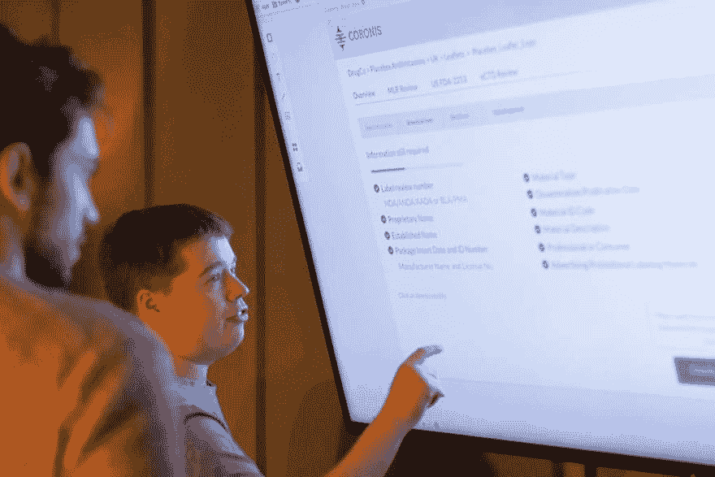
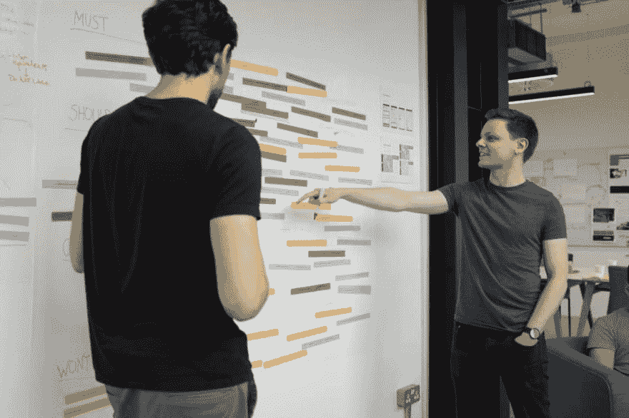
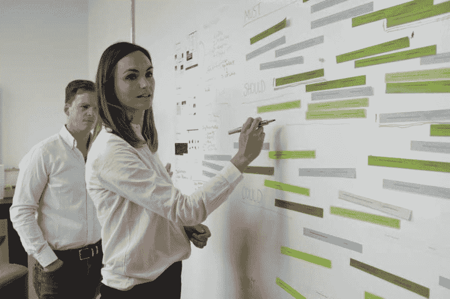

# 如何让数字化转型坚持下去

> 原文：<https://dev.to/browserlondon/how-to-make-digital-transformation-stick-1i14>

我敢说，数字化转型是我们这个时代谈论最广、被过度使用的术语之一。即便如此，许多组织仍热衷于启动转型项目，因为一旦成功完成，回报可能会非常可观。

虽然数字化转型几乎可以关注组织的任何部分，但这篇文章重点关注的是数字化系统的交叉和调整组织文化的需求最强烈的领域；在客户体验中。

毫无疑问，围绕以客户为中心的数字化转型，人们的热情和信心日益高涨。然而，我亲身经历过(也无数次从业内同行那里听说)一些组织在没有为新技术的到来做好充分准备的情况下就开始收购新技术。

事实上，一项 CEB 变革准备度调查发现，只有三分之一的变革努力取得了明显的成功，而 16%的变革努力显示出好坏参半的结果，其中一半是 T2 的明显失败。以下是需要注意的五种情况，它们可以帮助您坚持以客户为中心的数字化转型。

## 考虑大局

对于有[变革议程](https://www.browserlondon.com/blog/2017/02/15/digital-transformation-necessary/)的组织来说，在客户体验上进行变革通常是优先考虑的事情；然而，考虑这些变化对整个企业的影响是至关重要的。

举个例子，设想一个新的客户门户，允许客户管理家具定制订单的设计流程。这个门户不仅会影响客户服务台，还会影响实施变革的车间——工匠们如何跟踪客户的需求？新的门户网站会导致客户请求量增加吗？如果是这样的话，需要增加多少工匠才能满足需求？

这种整体观点往往在项目一开始就没有得到足够的重视；相反，关注点通常集中在会直接影响客户的变化上。

因此，从改善你提供的客户服务的目标开始，不仅会给你一个目标和关注点，还可能会影响业务的所有领域。

## 与客户交谈

我想不出我们在 Browser 参与的任何一个项目中，我们对现实生活中的客户进行的[研究和咨询](https://www.browserlondon.com/services/research-analysis/)没有产生我们没有预料到的结果。这可以通过多种方式实现——调查和焦点小组是一个很好的起点。至少这将有助于对你打算加入的[功能列表](https://dev.to/browserlondon/how-research-and-discovery-shape-our-ui-thinking-1ap1)进行优先排序。最成功的企业会定期咨询客户，并根据他们得到的反馈采取行动。

然而，真正的诀窍是在业务需求的背景下优先考虑这些需求；通常这些都是为了提高效率，保持竞争优势和增加利润。

## 投资技能和文化变革

人们很容易就认为数字化转型仅仅与技术有关；然而，任何组织或企业的成功都是由其员工推动的。成功的数字化变革通常会要求团队或公司采用新的工作方式，确保这些工作实践中的激进变革被接受，而不是被抵制，这可能是转型项目中最棘手的部分。

在[推出新技术](https://www.browserlondon.com/services/continuous-improvement-support/)的工作开始之前，审核企业的技能和文化至关重要，一旦对企业的技能和文化有了清晰的印象，就要开始为员工提供他们所需的支持，帮助他们获得成功转型所需的技能。

访问我们的定制家具车间示例；因此，面临与新软件交互并直接与客户交互的技术人员，需要对他们使用新工具的能力有信心，并以最有效的方式与新的利益相关者交流。当员工技能在数字化转型中被忽视时，不良情绪和不满就会显现。即使是最初步的转型计划，人才和文化也应该处于核心位置，因此需要进行预算。

## 维护人体元素

大多数企业都明白人际交往的重要性。一项针对 24，000 多名消费者和 1，000 家企业的全球研究明确证实了这一事实，83%的受访者表示他们更喜欢人工客服互动，而不是数字替代方式。因此，评估以客户体验为导向的数字化转型所带来的价值至关重要。

通过聊天机器人或自动呼叫中心提供一线支持是很好的例子——DPD 快递公司在这方面做得非常出色，让 DPD 为他们的客户提供了仅靠呼叫中心员工根本无法实现的服务水平。

尽管如此，如果客户的需求对于自动化或人工智能驱动的系统来说过于复杂，那么让客户拥有人机交互的元素仍然很重要。令人欣慰的是，多年来令人沮丧的语音识别系统和自动呼叫似乎已经成为过去，这意味着利用数字技术转变客户体验的雄心不仅在于降低成本，还在于提供更好的体验。

## 从第一天开始构建分析，并利用数据进行改进

执行良好的数字转换带来的一个明显优势是可以用来报告项目效率的更丰富的数据集。数据及其各自的分析带来了一系列与转型本身完全无关的挑战，但在变革的早期尽可能地应对这些障碍是至关重要的。

当试图理解行动和结果之间的关系时，定量分析是非常宝贵的。然而，关注最重要的数据并对这些数据附加有意义的 KPI 是很重要的。从一个成功的项目可以创建的大量数据中筛选出真正有价值的度量标准可能是一项艰巨的(甚至是专业的)任务，但是如果做得好，它也可能是一个持久的价值来源。

许多企业在这一领域举步维艰，要么是因为他们用过多的 KPI 让经理们负担过重，要么是他们仅仅要求运行报告，而不是要求针对报告描绘的画面采取行动。正确的报告是至关重要的，因为这是衡量项目成功与否的标准。

## 没有数字转换的银弹

转型时期的挑战不容回避。但是，保持内部以及与客户的沟通渠道畅通，新的系统和计划更有可能被积极采纳。

从一开始就为学习和发展分配预算，如果你有时遇到一定程度的阻力，不要感到惊讶。分析数据和 KPI 对于监控成功和了解事情失败的地方非常重要-这是建立[增量变化](https://www.browserlondon.com/services/continuous-improvement-support/)并证明事情至少朝着正确方向发展的最佳方式。

最重要的是，请记住，大多数业务和交易的核心都是人，最终，所有这些工作都是为了他们。

帖子[如何让你的数字化转型坚持](https://www.browserlondon.com/blog/2019/04/03/make-digital-transformation-stick/)首先出现在[浏览器伦敦](https://www.browserlondon.com)上。