# 如何将多个 SQL 表合并到一个 MongoDB 集合中

> 原文：<https://dev.to/kathrynvargas/how-to-merge-multiple-sql-tables-into-one-mongodb-collection-50d8>

如果您经常在 SQL 和 MongoDB 之间移动数据，您可能需要执行以下一项或两项操作:

*   将单个 SQL 表导入到单个 MongoDB 集合中，并重复该过程 10、20、100 次，以传输数据库的其余部分
*   皈依了。sql 文件转换为 JSON 或 CSV 文件以用于导入

但是这些方法只是将一个 SQL 表简化为一个 MongoDB 文档，使用默认映射通常会导致清理失败。

如果想在 JSON 文档中反映**一对一和一对多的表关系怎么办？**

或者让我们更进一步:**如果您想要创建一个新的 MongoDB 集合——使用来自多个 SQL 表和数据库的数据——并根据需要添加、排序和删除字段，该怎么办？**

以下是方法。

## 两个(或多个)SQL 数据库的故事

假设您有一个简单的 MySQL 数据库，名为 **customers** ，这是您跟踪下载了您的应用程序、订购了您的产品、注册了您的课程等的人的方式。

在某些时候，也许你会想知道他们来自哪个国家。或者，如果你想找出第二个办公室的理想位置，也许可以看看它们位于哪个**大洲**。

但结果是，你从未收集过这些信息。

[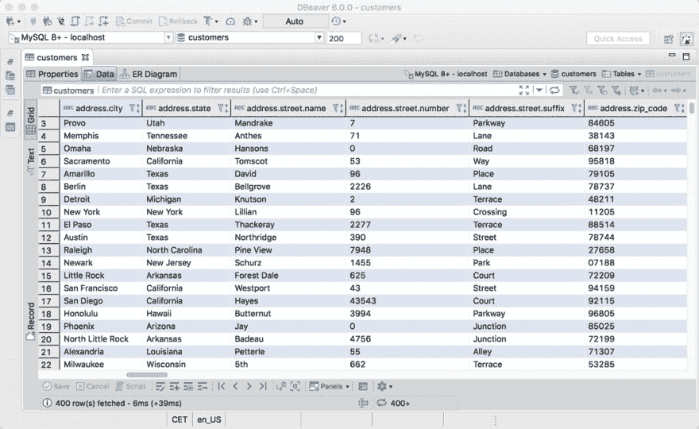](https://res.cloudinary.com/practicaldev/image/fetch/s--msnI68dO--/c_limit%2Cf_auto%2Cfl_progressive%2Cq_auto%2Cw_880/https://studio3t.com/knowledge-base/wp-content/uploads/incomplete-address-info.png)

*No country or continent information in sight.*

进入 **world** 数据库，这是另一个公开可用的 MySQL 数据库，它包含三个表，可以将我们从这种情况中解救出来:

*   国家
*   城市
*   乡村语言

然后，我们可以通过将字段`country`和`continent`添加到客户的简档来扩展客户的位置信息。

## 如何合并多个 SQL 表

使用 MongoDB GUI [Studio 3T](https://studio3t.com/) 及其 [SQL 迁移](https://studio3t.com/knowledge-base/articles/sql-to-mongodb-migration/)特性，我们可以从多个 SQL 数据集创建一个新的 MongoDB 集合。

我们想要一个包含七个字段的 MongoDB 集合(我还在括号中指出了它们的源 SQL 表):

*   id(客户)
*   名字(客户)
*   姓氏(客户)
*   电子邮件地址(客户)
*   城市(客户，世界)
*   国家(世界)
*   洲(世界)

有了这个新系列，我们可以回答两个问题:

> 1.  Which countries do most of our customers come from?
> 2.  In which continent should we open our second office?

## 1 -连接到 SQL 数据库

我们通过 Studio 3T 直接连接到 MySQL **客户**数据库。

这将是我们的源 SQL 连接。

## 2 -定义目标 MongoDB 连接

然后，我们选择想要创建新集合的目标 MongoDB 数据库，在我们的示例中是 **customer-support** 。

## 3 -添加 SQL 表

Studio 3T 称它们为“导入单元”，但是导入单元只是我们为导入任务声明根 SQL 表的地方。

根表当然可以与其他 SQL 表有关系(我们稍后会定义这些关系)。

[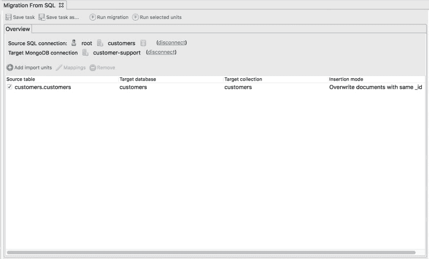](https://res.cloudinary.com/practicaldev/image/fetch/s--gALUB4aD--/c_limit%2Cf_auto%2Cfl_progressive%2Cq_auto%2Cw_880/https://studio3t.com/knowledge-base/wp-content/uploads/add-import-units-sql-migration.png)

这里我们添加了导入单元或根表`customers.customers`。

接下来，我们将定义它与其他表`world.city`和`world.country`的关系。

## 4 -将 SQL 映射到 MongoDB

**Mappings** 选项卡是所有神奇事情发生的地方。

在这里，我们可以定义一对一和一对多关系，并根据需要添加、编辑、删除字段，所有这些都在迁移作业开始之前完成。

[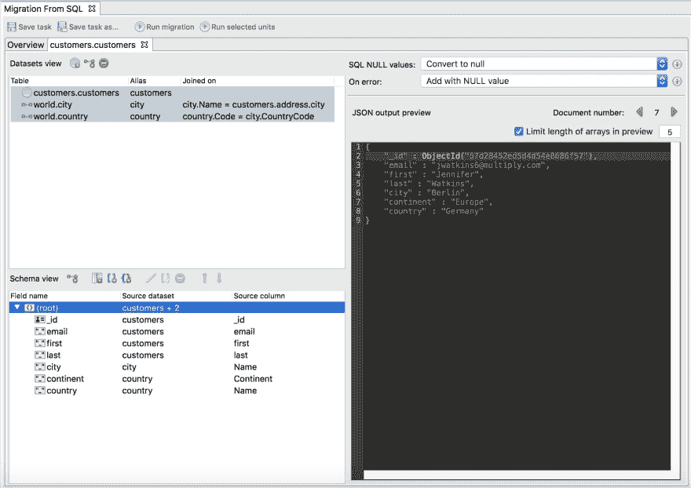](https://res.cloudinary.com/practicaldev/image/fetch/s--Bunmkjo---/c_limit%2Cf_auto%2Cfl_progressive%2Cq_auto%2Cw_880/https://studio3t.com/knowledge-base/wp-content/uploads/sql-to-mongodb-migration-studio-3t.png)

该选项卡同时显示三个视图:数据集视图、模式视图和 JSON 预览。

我们来分解一下。

左上角是**数据集视图**，它显示了任何给定导入的数据集。

[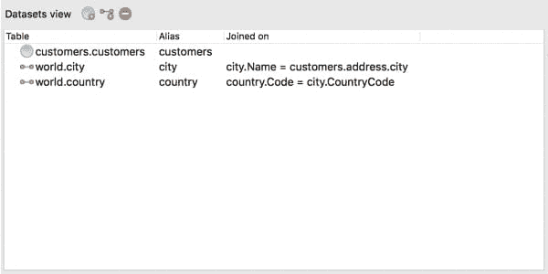](https://res.cloudinary.com/practicaldev/image/fetch/s--b4cTTr4P--/c_limit%2Cf_auto%2Cfl_progressive%2Cq_auto%2Cw_880/https://studio3t.com/knowledge-base/wp-content/uploads/datasets-view-600x300.png)

在这里，我们可以看到根表是`customers.customers`，它与`world.city`和`world.country`数据集有一对一的关系。(我们将很快讨论如何建立一对一的关系。)

左下角是**模式视图**，在这里我们可以查看导入中涉及的所有字段。在这里，我们可以在创建 MongoDB 集合之前对其进行清理。

[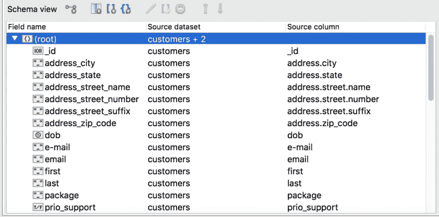](https://res.cloudinary.com/practicaldev/image/fetch/s--Niy1T5X7--/c_limit%2Cf_auto%2Cfl_progressive%2Cq_auto%2Cw_880/https://studio3t.com/knowledge-base/wp-content/uploads/schema-view-sql-to-mongodb.png)

右侧的 **JSON 预览**，是确认我们是否在正确轨道上的便捷方式。

[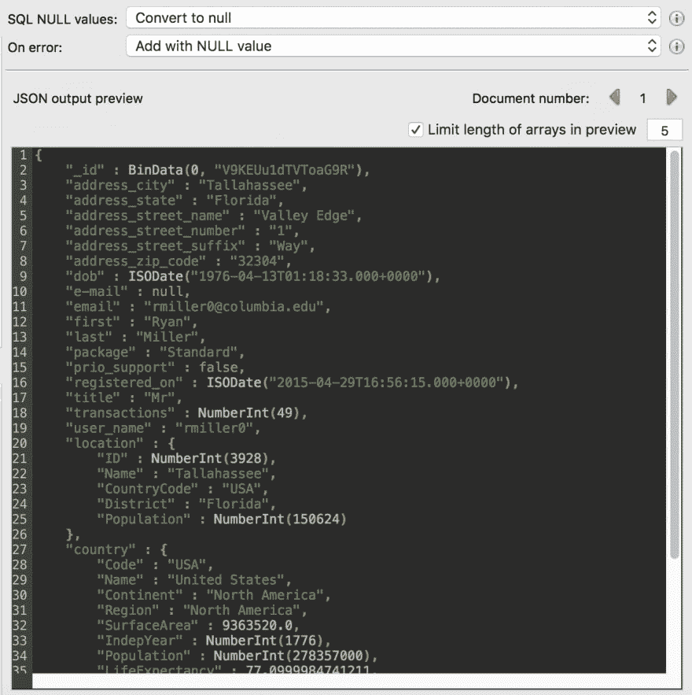](https://res.cloudinary.com/practicaldev/image/fetch/s--Eocw-utz--/c_limit%2Cf_auto%2Cfl_progressive%2Cq_auto%2Cw_880/https://studio3t.com/knowledge-base/wp-content/uploads/json-preview-sql-to-mongodb-migration.png)

它向我们展示了最终 JSON 文档的预览，因此我们知道我们正在数据集和模式视图中进行正确的更改。

## 5 -定义一对一的关系

让我们快速回顾一下我们的目标，即创建一个包含七个字段的 MongoDB 集合:

*   id(客户)
*   名字(客户)
*   姓氏(客户)
*   电子邮件地址(客户)
*   **城市(客户，世界)**
*   国家(世界)
*   洲(世界)

如你所见，上面加粗的是**城市**，客户和我们可以匹配的世界数据库之间的公共字段。

在**客户**数据库中，这个字段叫做`address.city`；在世界数据库中，它被称为`Name`。

请注意，使用 city 作为惟一 ID 并不是在所有情况下都有效(例如，德克萨斯州有一个巴黎，马里兰州有一个柏林，等等)，但仍然有效地说明了该功能。

要创建一对一的关系，让我们转到 Schema 视图，右键单击根数据库，并选择**添加一对一的关系**。

[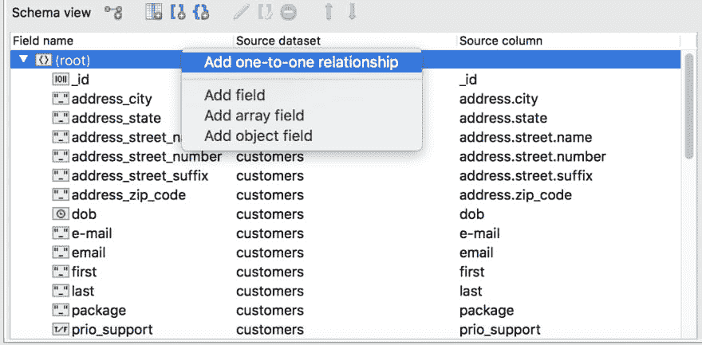](https://res.cloudinary.com/practicaldev/image/fetch/s--OZWcFPV9--/c_limit%2Cf_auto%2Cfl_progressive%2Cq_auto%2Cw_880/https://studio3t.com/knowledge-base/wp-content/uploads/add-one-to-one-relationship.png)

首先，我们选择是手动指定关系还是从外键获取关系。这里，我们选择了手动方法。

我们将`customers`定义为父数据集，将`world.city`定义为子表，子表的字段`address.city`和`Name`具有一对一的关系。

[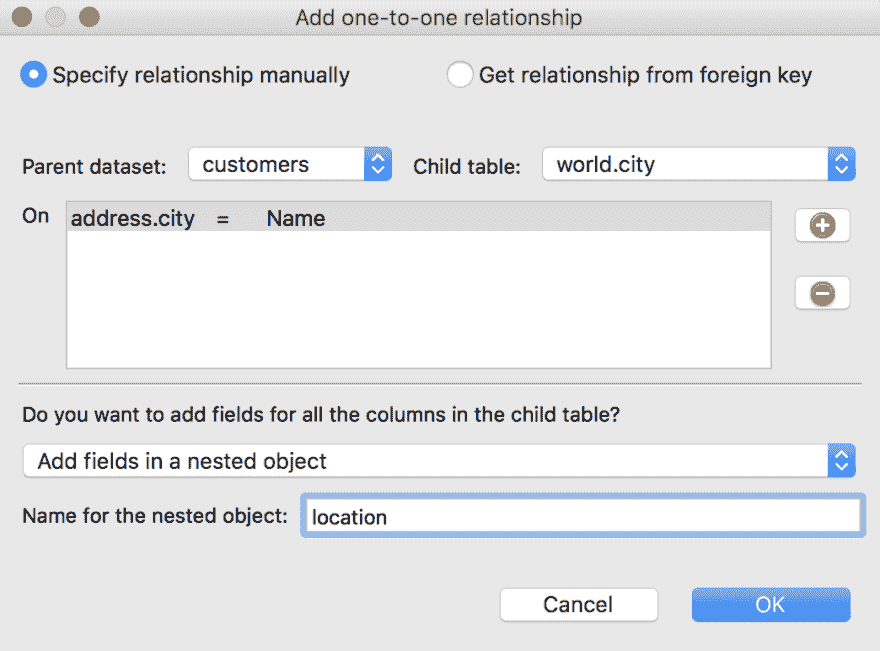](https://res.cloudinary.com/practicaldev/image/fetch/s--LWp_84Ia--/c_limit%2Cf_auto%2Cfl_progressive%2Cq_auto%2Cw_880/https://studio3t.com/knowledge-base/wp-content/uploads/one-to-one-relationship-city.png)

然后，我们想要创建一个名为`location`的新嵌套对象。单击确定。

万岁！我们可以立即在 JSON 预览中看到一个新的嵌套字段—`location`—被添加到我们的文档中。

[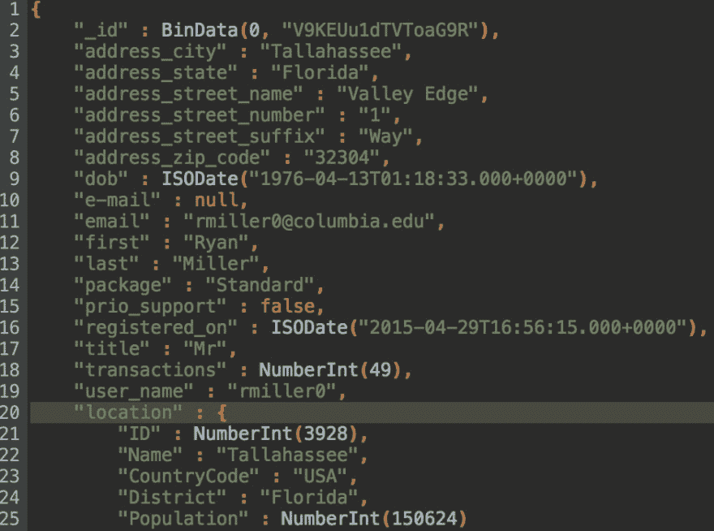](https://res.cloudinary.com/practicaldev/image/fetch/s--lR1HkHoJ--/c_limit%2Cf_auto%2Cfl_progressive%2Cq_auto%2Cw_880/https://studio3t.com/knowledge-base/wp-content/uploads/adding-location-as-nested-object.png)

到目前为止，我们已经将国家信息添加到了我们的客户资料中。

接下来，让我们通过添加另一个一对一的关系来添加他们的大陆信息，这次是在`world.country`和`world.city`之间(它已经与我们的根表`customers.customers`有了一个关系)。

让我们返回到 Schema 视图，右键单击 root，然后选择 Add one-to-one relationship。

这一次，Studio 3T 自动检测`world.city`和`world.country`数据集之间的共享外键(CountryCode = Code)，因为它们来自同一个数据库(world)。

[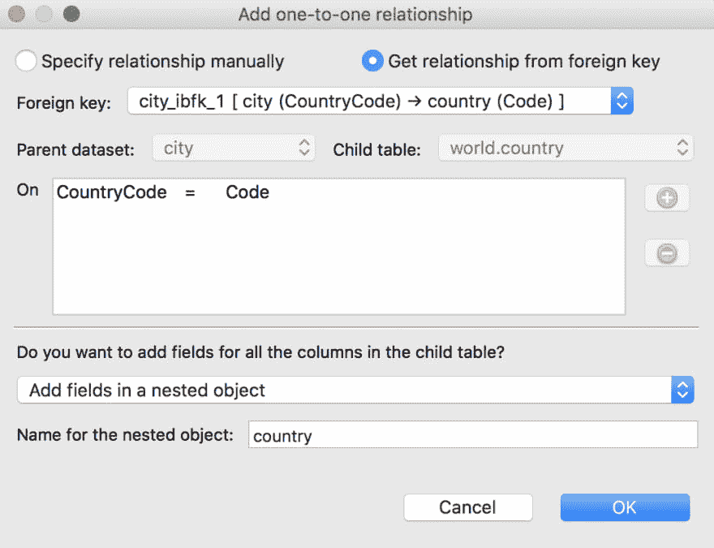](https://res.cloudinary.com/practicaldev/image/fetch/s--zogE47Sr--/c_limit%2Cf_auto%2Cfl_progressive%2Cq_auto%2Cw_880/https://studio3t.com/knowledge-base/wp-content/uploads/one-to-one-relationship-from-foreign-keys.png)

请注意，如果自动检测到的映射不正确，您总是可以手动指定关系。

让我们再次在另一个嵌套对象中添加字段，将其命名为 country，然后单击 OK。

这就是我们的 JSON 预览版。

[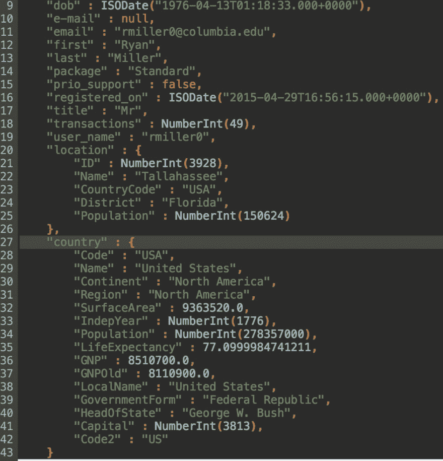](https://res.cloudinary.com/practicaldev/image/fetch/s--TcHV6V2u--/c_limit%2Cf_auto%2Cfl_progressive%2Cq_auto%2Cw_880/https://studio3t.com/knowledge-base/wp-content/uploads/country-nested-object.png)

经过两次一对一的关系，我们现在已经成功地将国家和大洲数据点添加到我们的客户档案中。

我们所需要的只是一点点的清理。

## 6 -清理 MongoDB 集合

还记得我们在新的 MongoDB 集合中只想要七个字段吗？

好消息是，Studio 3T 允许我们在从 SQL 到 MongoDB 的导入开始之前方便地删除、重命名、重新排序字段，甚至更改字段类型。

### 删除字段

只需选择不必要的字段，右键单击，然后选择“删除选定的字段”。

[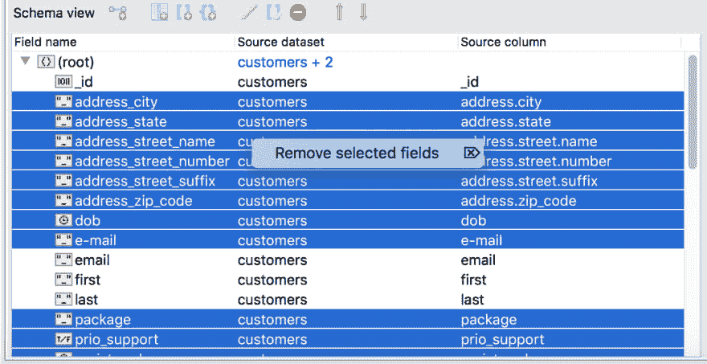](https://res.cloudinary.com/practicaldev/image/fetch/s--9snSg0k9--/c_limit%2Cf_auto%2Cfl_progressive%2Cq_auto%2Cw_880/https://studio3t.com/knowledge-base/wp-content/uploads/remove-fields-from-sql-import-to-mongodb.png)

JSON 预览版很方便地立即反映了这些变化。

[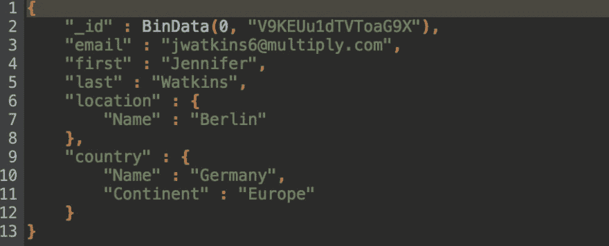](https://res.cloudinary.com/practicaldev/image/fetch/s--WZz3lvmE--/c_limit%2Cf_auto%2Cfl_progressive%2Cq_auto%2Cw_880/https://studio3t.com/knowledge-base/wp-content/uploads/mongodb-schema-cleanup-json-preview.png)

现在我们已经把它缩减到了我们想要的七个字段，让我们给它们起一个正确的名字。

### 重命名字段

要重命名字段，只需双击单元格并键入新名称。

[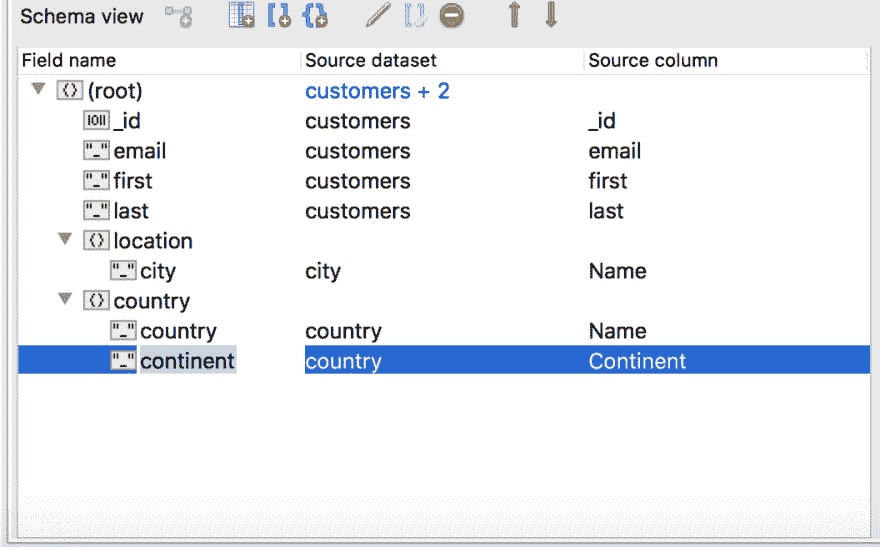](https://res.cloudinary.com/practicaldev/image/fetch/s--7NgA0G29--/c_limit%2Cf_auto%2Cfl_progressive%2Cq_auto%2Cw_880/https://studio3t.com/knowledge-base/wp-content/uploads/rename-fields-schema-view.png)

### 重新排序字段

现在，让我们将字段`city`、`country`和`continent`从它们的嵌套对象中移到父级。

我们只需将字段(一次一个)拖动到所需的位置即可。

您还可以通过单击工具栏中的上下箭头来移动非嵌套对象中的字段。

### 处理重复字段

Studio 3T 标记重复字段的实例，这实际上是字段`country`的情况:

[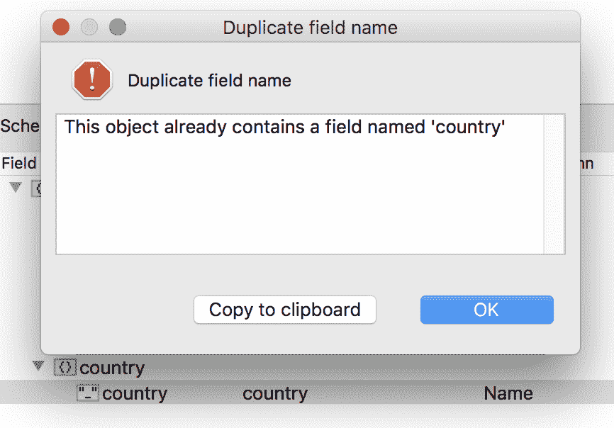](https://res.cloudinary.com/practicaldev/image/fetch/s--oGhm6iHc--/c_limit%2Cf_auto%2Cfl_progressive%2Cq_auto%2Cw_880/https://studio3t.com/knowledge-base/wp-content/uploads/error-message-duplicate-field.png)

好消息是重命名字段很容易。我们需要做的就是重命名嵌套对象(在本例中，重命名为`country-info`)并将`country`拖动到父级。

最后，我们只剩下我们想要的七个字段和两个可以轻松删除的嵌套对象字段。

[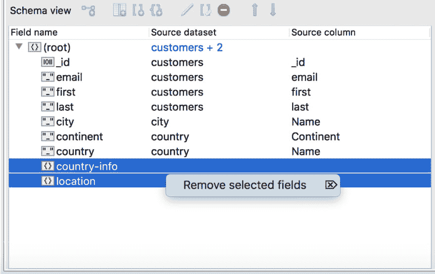](https://res.cloudinary.com/practicaldev/image/fetch/s--bt2dcgWO--/c_limit%2Cf_auto%2Cfl_progressive%2Cq_auto%2Cw_880/https://studio3t.com/knowledge-base/wp-content/uploads/delete-fields-schema-view.png)

JSON 预览看起来不错——除了`_id`字段看起来有点滑稽。

似乎 Studio 3T 自动将其检测为字段类型二进制而不是字符串。

### 改变字段类型

Studio 3T 也允许我们在模式视图中直接更改字段类型。

右键单击字段，选择编辑/重命名，然后从列表中选择正确的字段类型。

[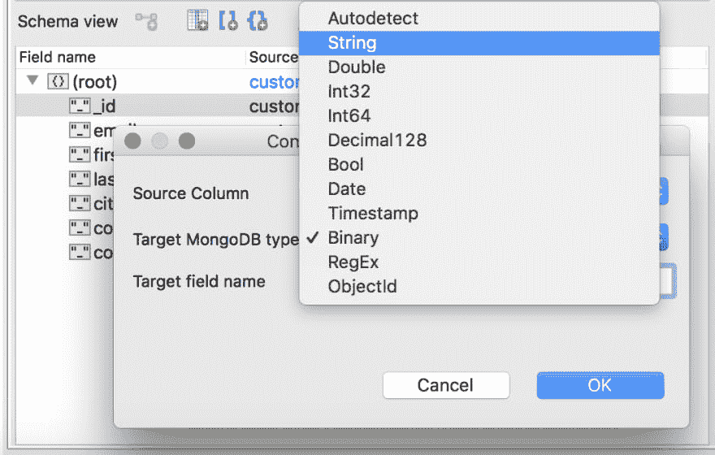](https://res.cloudinary.com/practicaldev/image/fetch/s--bm5Ejhws--/c_limit%2Cf_auto%2Cfl_progressive%2Cq_auto%2Cw_880/https://studio3t.com/knowledge-base/wp-content/uploads/change-field-types-schema-view.png)

JSON 预览版看起来很完美——现在是时候运行 SQL 到 MongoDB 的迁移了。

[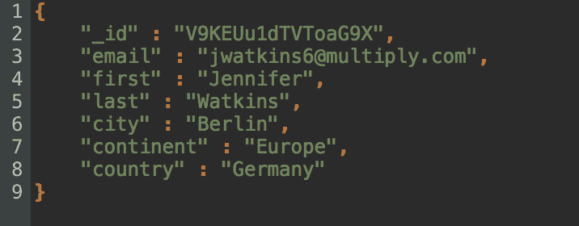](https://res.cloudinary.com/practicaldev/image/fetch/s--ZYscjH1t--/c_limit%2Cf_auto%2Cfl_progressive%2Cq_auto%2Cw_880/https://studio3t.com/knowledge-base/wp-content/uploads/clean-final-json-preview.png)

## 7 -运行 SQL 到 MongoDB 的迁移

SQL 迁移为我们提供了两个迁移选项:运行迁移或运行选定的单元。

**Run migration** 完全按照它所说的去做——它运行迁移并为每个导入单元输出一个 MongoDB 集合。如果您要从列表中手动选择多个导入单元，请选择**运行选定的单元**。

点击工具栏中的**运行迁移**:

确认您想要将数据导入到一个集合中，然后单击确定。

您可以始终在左下角的操作窗口中跟踪迁移任务的进度。

[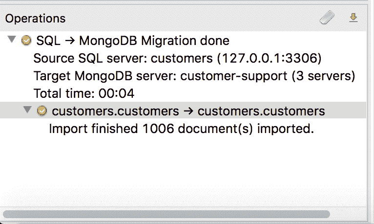](https://res.cloudinary.com/practicaldev/image/fetch/s--JMBf7fLv--/c_limit%2Cf_auto%2Cfl_progressive%2Cq_auto%2Cw_880/https://studio3t.com/knowledge-base/wp-content/uploads/operations-window.png)

## 8 -双击 MongoDB 集合

我们做到了！

为了更好地衡量，让我们仔细检查一下我们新的 MongoDB 集合是否确实在**客户支持**数据库中。

转到 Studio 3T 中的连接树，定位我们的目标 MongoDB 连接。

[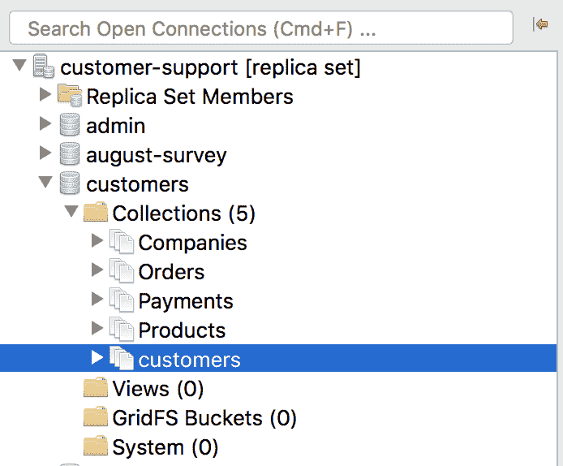](https://res.cloudinary.com/practicaldev/image/fetch/s---mh2IeH6--/c_limit%2Cf_auto%2Cfl_progressive%2Cq_auto%2Cw_880/https://studio3t.com/knowledge-base/wp-content/uploads/connection-tree-1.png)

使用[表格视图](https://studio3t.com/knowledge-base/articles/table-view/)、[树形视图](https://studio3t.com/knowledge-base/articles/tree-view/)或 [JSON 视图](https://studio3t.com/knowledge-base/articles/json-view/)，仔细检查每件事情看起来都是正确的(确实如此！)

[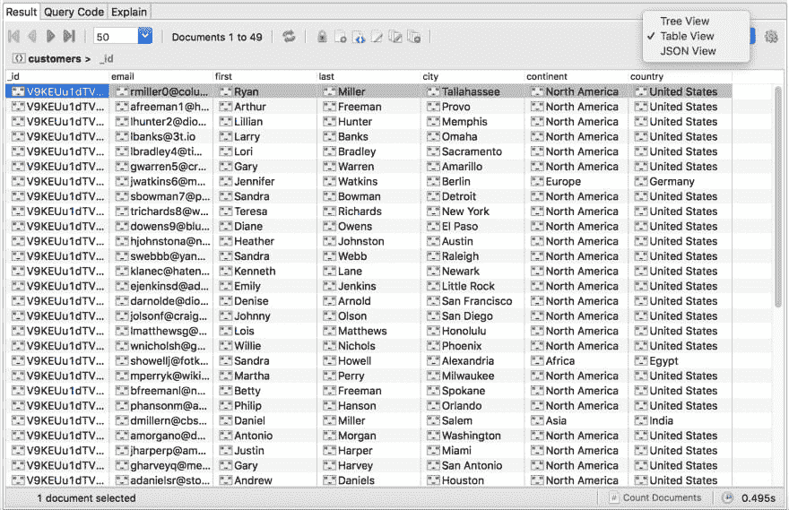](https://res.cloudinary.com/practicaldev/image/fetch/s--zPD774gR--/c_limit%2Cf_auto%2Cfl_progressive%2Cq_auto%2Cw_880/https://studio3t.com/knowledge-base/wp-content/uploads/double-check-mongodb-collection-table-view.png)

## 结果

那么，我们的客户大多来自哪里？

使用[Schema Explorer](https://studio3t.com/knowledge-base/articles/schema-explorer/)——一个独立但同样方便的特性——我们一眼就能看出我们的客户大多来自美国。

[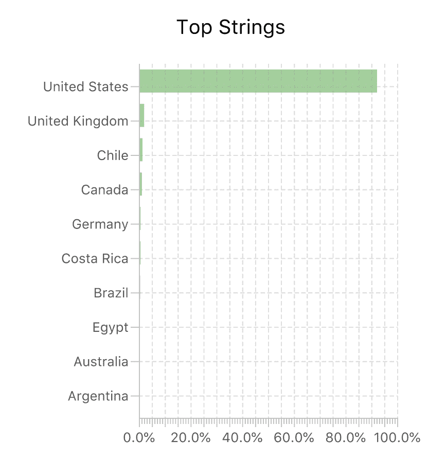](https://res.cloudinary.com/practicaldev/image/fetch/s--7LW3dgvq--/c_limit%2Cf_auto%2Cfl_progressive%2Cq_auto%2Cw_880/https://studio3t.com/knowledge-base/wp-content/uploads/top-country.png)

看起来它终究会成为一个北美办事处。

[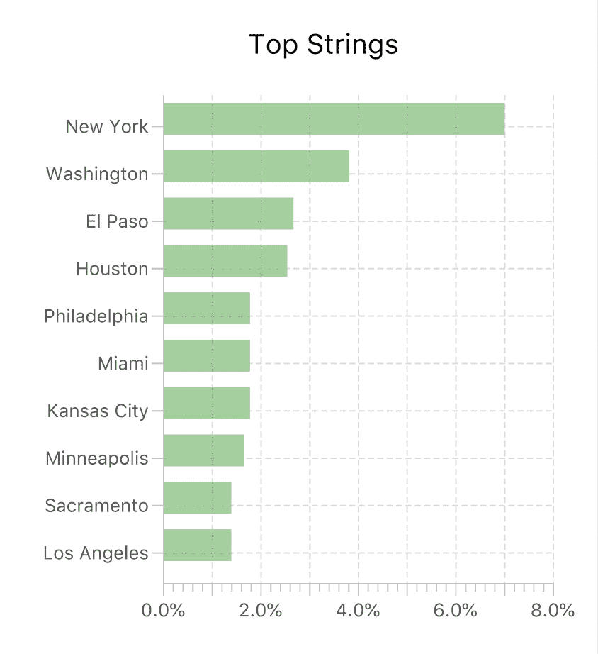](https://res.cloudinary.com/practicaldev/image/fetch/s--_Rbf9A0S--/c_limit%2Cf_auto%2Cfl_progressive%2Cq_auto%2Cw_880/https://studio3t.com/knowledge-base/wp-content/uploads/top-city.png)

当然还有东海岸。