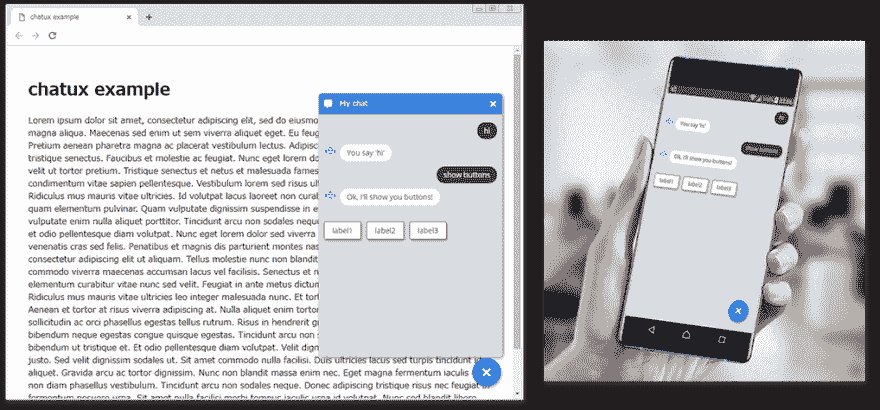
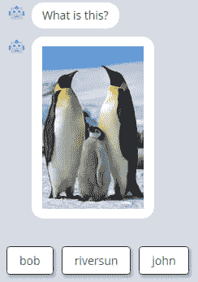

# 如何快速创建适用于智能手机和 PC 的聊天机器人 UI

> 原文：<https://dev.to/riversun/how-to-quickly-create-chat-bot-ui-for-both-smartphones-and-pcs-n77>

# 概述

这是用 JavaScript 创建聊天机器人 UI 的简要指南。

*   **响应**:自动检测**智能手机和 PC 浏览器**，呈现正确的聊天 UI。
*   **微创**:不要堵塞现有的内容，如果你在 html 中只放一个脚本标签，它也能工作

[](https://riversun.github.io/chatux/)

[【这里有一个演示】](https://riversun.github.io/chatux/)

[](https://res.cloudinary.com/practicaldev/image/fetch/s--Y2zlCVWO--/c_limit%2Cf_auto%2Cfl_progressive%2Cq_auto%2Cw_880/https://riversun.github.io/chatux/chatux_qr.png)

这个演示是简单的回声聊天。但是有几个命令可用。

*   如果你写“显示按钮”，你可以在聊天界面上看到动作按钮。
*   或者你写“显示图像”，你可以在聊天中看到图像。

示例项目可在此回购。
[https://github.com/riversun/chatux-example](https://github.com/riversun/chatux-example)

# 目标

*   会写 Java 脚本的人(即使是初学者)
*   有 node.js 环境的人(可以用 npm 或者 yarn)
*   对聊天机器人感兴趣的人

# 你能做什么

创建一个聊天机器人用户界面，支持 PC 浏览器和智能手机，如下所示

**在智能手机**的情况下，聊天 UI 显示在适合屏幕的聊天 UI 上。

**在 PC 浏览器**的情况下，聊天 UI 显示在浮动窗口上。我将在主要部分解释使用什么技术来实现这一点。

# 安装和最小化代码

### 使用 npm

**安装**

```
npm install chatux --save 
```

Enter fullscreen mode Exit fullscreen mode

**代号**

```
import {ChatUx} from 'chatux';

const chatux = new ChatUx();

chatux.init({
    api: {
        endpoint: 'http://localhost:8080/chat',//chat server
        method: 'GET',//HTTP METHOD when requesting chat server
        dataType: 'json'//json or jsonp is available
    }
});

chatux.start(); 
```

Enter fullscreen mode Exit fullscreen mode

### 与脚本标签一起使用

```
<script src="https://riversun.github.io/chatux/chatux.min.js"></script> 
```

Enter fullscreen mode Exit fullscreen mode

**代号**

```
const chatux = new ChatUx();

chatux.init({
    api: {
        endpoint: 'http://localhost:8080/chat',//chat server
        method: 'GET',//HTTP METHOD when requesting chat server
        dataType: 'json'//json or jsonp is available
    }
});

chatux.start(); 
```

Enter fullscreen mode Exit fullscreen mode

# 工作原理

**chatux** 的系统很简单。

我们来看一下 **chatux** 的执行顺序。

假设你在[有一个 **chatux** 的聊天服务器 http://localhost:8080/chat](http://localhost:8080/chat)
这样指定服务器端点。

```
chatux.init({
    api: {
        endpoint: 'http://localhost:8080/chat',
        method: 'GET',
        dataType: 'json'
    }
}); 
```

Enter fullscreen mode Exit fullscreen mode

以下是顺序。

[](https://res.cloudinary.com/practicaldev/image/fetch/s--bjue6cS4--/c_limit%2Cf_auto%2Cfl_progressive%2Cq_auto%2Cw_880/https://user-images.githubusercontent.com/11747460/54331314-d3735f80-465c-11e9-9a22-5a975809f770.png)

*   1. **chatux** 将用户输入的文本发送到聊天服务器。
    T3】获取 [http://localhost:8080/chat？text=hello](http://localhost:8080/chat?text=hello)

*   2.服务器处理用户输入的文本，并以 JSON 的形式返回一个响应。

```
{  "output":  [  {  "type":  "text",  "value":  "You say 'hello'"  }  ]  } 
```

Enter fullscreen mode Exit fullscreen mode

*   3.根据响应， **chatux** 在聊天屏幕上显示结果。

所以，如果你创建了可以进行这种互动的聊天服务器，你就可以很容易地创建聊天机器人等。

接下来，我们来看看如何渲染。

# 聊天服务器

让我们创建一个简单的聊天服务器。

*   初始化 npm 项目并安装 express

```
npm init
npm install express 
```

Enter fullscreen mode Exit fullscreen mode

*   编写一个返回 json 的简单服务器。

```
const express = require('express');
const app = express();
const port = 8080;

// enabling CORS
app.use(function (req, res, next) {
    res.header('Access-Control-Allow-Origin', '*');
    res.header('Access-Control-Allow-Headers', 'Origin, Content-Type, Accept');
    next();
});
app.get('/chat', function (req, res) {
    const userInputText = req.query.text;

    const response = {
        output: []
    };

    const msg = response.output;
    msg.push({
        type: 'text',
        value: `You say ${userInputText}`
    });
    res.json(response);
});

app.listen(port, () => {
    console.log('chat server started on port:' + port);
}); 
```

Enter fullscreen mode Exit fullscreen mode

*   启动服务器

```
npm start 
```

Enter fullscreen mode Exit fullscreen mode

*   访问目录

[http://localhost:8081/chat？text=hello](http://localhost:8081/chat?text=hello)

您将获得 JSON for chatux，如下所示。

```
{"output":[{"type":"text","value":"You say hello"}]} 
```

Enter fullscreen mode Exit fullscreen mode

*   从浏览器上的 **ChatUX** 访问

```
chatux.init({
    api: {
        endpoint: 'http://localhost:8080/chat',
        method: 'GET',
        dataType: 'json'
    }
});
chatux.start(true);//true:automatically open chat 
```

Enter fullscreen mode Exit fullscreen mode

[](https://res.cloudinary.com/practicaldev/image/fetch/s--uW8VgBRj--/c_limit%2Cf_auto%2Cfl_progressive%2Cq_auto%2Cw_880/https://user-images.githubusercontent.com/11747460/54860945-e379f600-4d64-11e9-9f23-1636343f3607.png)

* * *

# 如何渲染聊天界面

由于 chatux 可以呈现聊天 UI 的各种变体，所以我在下面介绍它们。我想分别展示聊天服务器的原始 JSON 和代码示例。

## 显示文字

**服务器代码**

```
app.get('/chat', function (req, res) {
    const response = {output: []};
    const msg = response.output;
    msg.push({
        type: 'text',
        value: 'Hello world'
    });
    res.json(response);
}); 
```

Enter fullscreen mode Exit fullscreen mode

**JSON**T2】

```
{  "output":  [  {  "type":  "text",  "value":  "Hello world!"  }  ]  } 
```

Enter fullscreen mode Exit fullscreen mode

**结果**

[](https://res.cloudinary.com/practicaldev/image/fetch/s--3OHUSGMW--/c_limit%2Cf_auto%2Cfl_progressive%2Cq_auto%2Cw_880/https://user-images.githubusercontent.com/11747460/54342102-f44cac80-467e-11e9-89c9-05b01ca64e78.png)

* * *

## 显示图像

**服务器代码**

```
app.get('/chat', function (req, res) {
    const response = {output: []};
    const msg = response.output;
    msg.push({
        type: 'image',
        value: 'https://avatars1.githubusercontent.com/u/11747460'
    });
    res.json(response);
}); 
```

Enter fullscreen mode Exit fullscreen mode

**JSON**T2】

```
{  "output":  [  {  "type":  "image",  "value":  "https://avatars1.githubusercontent.com/u/11747460"  }  ]  } 
```

Enter fullscreen mode Exit fullscreen mode

**结果**

[](https://res.cloudinary.com/practicaldev/image/fetch/s--Fy7M2kOi--/c_limit%2Cf_auto%2Cfl_progressive%2Cq_auto%2Cw_880/https://user-images.githubusercontent.com/11747460/54341630-9ff4fd00-467d-11e9-9355-6236785841fb.png)

* * *

## 显示动作按钮

**服务器代码**

```
app.get('/chat', function (req, res) {
    const response = {output: []};
    const msg = response.output;
    const opts = [];
    opts.push({label: 'label1', value: 'value1'});
    opts.push({label: 'label2', value: 'value2'});
    opts.push({label: 'label3', value: 'value3'});
    msg.push({type: "option", options: opts});
    res.json(response);
}); 
```

Enter fullscreen mode Exit fullscreen mode

**JSON**T2】

```
{  "output":  [  {  "type":  "option",  "options":  [  {  "label":  "label1",  "value":  "value1"  },  {  "label":  "label2",  "value":  "value2"  },  {  "label":  "label3",  "value":  "value3"  }  ]  }  ]  } 
```

Enter fullscreen mode Exit fullscreen mode

**结果**

[](https://res.cloudinary.com/practicaldev/image/fetch/s--VpE-xRdr--/c_limit%2Cf_auto%2Cfl_progressive%2Cq_auto%2Cw_880/https://user-images.githubusercontent.com/11747460/54356961-389c7480-46a0-11e9-9d47-2b0b5500f3e7.png)

* * *

## 显示 html

**服务器代码**

```
app.get('/chat', function (req, res) {
    const response = {output: []};
    const msg = response.output;
    msg.push({
        type: 'html',
        value: 'Click <a href="https://github.com/riversun" target="_blank" >here</a> to open a page.',
        delayMs: 500
    });
    res.json(response);
}); 
```

Enter fullscreen mode Exit fullscreen mode

**JSON**T2】

```
{  "output":  [  {  "type":  "html",  "value":  "Click <a href=\"https://github.com/riversun\" target=\"_blank\" >here</a> to open a page.",  "delayMs":  500  }  ]  } 
```

Enter fullscreen mode Exit fullscreen mode

**结果**

[](https://res.cloudinary.com/practicaldev/image/fetch/s--bN8_NPVz--/c_limit%2Cf_auto%2Cfl_progressive%2Cq_auto%2Cw_880/https://user-images.githubusercontent.com/11747460/54356215-684a7d00-469e-11e9-82b6-c9d99f6d6610.png)

* * *

## 显示 youtube

**服务器代码**

```
app.get('/chat', function (req, res) {
    const response = {output: []};
    const msg = response.output;
    const videoId = 'TP4lxliMHXY'; //youtube video id
    msg.push({
        type: 'youtube',
        value: videoId,
        delayMs: 500 // wait(milliseconds)
    });
    res.json(response);
}); 
```

Enter fullscreen mode Exit fullscreen mode

**JSON**T2】

```
{  "output":  [  {  "type":  "youtube",  "value":  "TP4lxliMHXY",  "delayMs":  500  }  ]  } 
```

Enter fullscreen mode Exit fullscreen mode

**结果**

[](https://res.cloudinary.com/practicaldev/image/fetch/s--u6nHhRJh--/c_limit%2Cf_auto%2Cfl_progressive%2Cq_auto%2Cw_880/https://user-images.githubusercontent.com/11747460/54350146-0e42bb00-4690-11e9-9ced-192e47bea481.png)

* * *

## 显示多个元素

**服务器代码**

```
app.get('/chat', function (req, res) {
    const response = {output: []};
    const msg = response.output;
    msg.push({
        type: 'text',
        value: 'What is this?',
        delayMs: 500
    });
    msg.push({
        type: 'image',
        value: 'https://upload.wikimedia.org/wikipedia/commons/a/a3/Aptenodytes_forsteri_-Snow_Hill_Island%2C_Antarctica_-adults_and_juvenile-8.jpg'
    });
    const opts = [];
    opts.push({label: 'bob', value: 'value1'});
    opts.push({label: 'riversun', value: 'value2'});
    opts.push({label: 'john', value: 'value3'});
    msg.push({type: 'option', options: opts});
    res.json(response);
}); 
```

Enter fullscreen mode Exit fullscreen mode

**JSON**T2】

```
{  "output":  [  {  "type":  "text",  "value":  "What is this?",  "delayMs":  500  },  {  "type":  "image",  "value":  "https://upload.wikimedia.org/wikipedia/commons/a/a3/Aptenodytes_forsteri_-Snow_Hill_Island%2C_Antarctica_-adults_and_juvenile-8.jpg"  },  {  "type":  "option",  "options":  [  {  "label":  "bob",  "value":  "value1"  },  {  "label":  "riversun",  "value":  "value2"  },  {  "label":  "john",  "value":  "value3"  }  ]  }  ]  } 
```

Enter fullscreen mode Exit fullscreen mode

**结果**

[](https://res.cloudinary.com/practicaldev/image/fetch/s--zYxZBUU6--/c_limit%2Cf_auto%2Cfl_progressive%2Cq_auto%2Cw_880/https://user-images.githubusercontent.com/11747460/54357551-b0b76a00-46a1-11e9-8f75-cdfd97a42e0d.png)

* * *

# 初始化参数

以下示例显示了所有的 **ChatUX** 初始化参数。
你可以随意定制 ChatUX 的行为。

```
 const chatux = new ChatUx();

    //init parameters
    const opt = {
        renderMode: 'auto',//'auto' or 'pc' or 'mobile'
        buttonOffWhenOpenFrame: false,//true:Turn off wakeup button when the chat window is opened.only for pc mode.
        bot: {
            wakeupText: null,//user input which is automatically send to server on startup
            botPhoto: null,//URL of bot photo image
            humanPhoto: null,//URL of human photo image
            widget: {
                sendLabel: 'SEND',//label for SEND button
                placeHolder: 'Say something'//default caption for input box
            }
        },
        api: {
            endpoint: 'http://localhost:8081/chat',//endpoint of chat server
            method: 'GET',//'GET' or 'POST'
            dataType: 'json',//'json' or 'jsonp'
            errorResponse: {
                output: [
                    //Message displayed when a network error occurs when accessing the chat server
                    {type: 'text', value: 'Sorry, an error occurred'}
                ]
            }
        },
        window: {
            title: 'My chat',//window title

            //infoUrl
            // If this value is set, an 'info' icon will appear at the left of the window's
            // title bar, and  clicking this icon will jump to this URL
            infoUrl: 'https://github.com/riversun/chatux',
            size: {
                width: 350,//window width in px
                height: 500,//window height in px
                minWidth: 300,//window minimum-width in px
                minHeight: 300,//window minimum-height in px
                titleHeight: 50//title bar height in px
            },
            appearance: {
                //border - border style of the window
                border: {
                    shadow: '2px 2px 10px  rgba(0, 0, 0, 0.5)',
                    width: 0,
                    radius: 6
                },
                //titleBar - title style of the window
                titleBar: {
                    fontSize: 14,
                    color: 'white',
                    background: '#4784d4',
                    leftMargin: 40,
                    height: 40,
                    buttonWidth: 36,
                    buttonHeight: 16,
                    buttonColor: 'white',
                    buttons: [
                        //Icon named 'hideButton' to close chat window
                        {
                            fa: 'fas fa-times',//specify font awesome icon
                            name: 'hideButton',
                            visible: true
                        }
                    ],
                    buttonsOnLeft: [
                        //Icon named 'info' to jump to 'infourl' when clicked
                        {
                            fa: 'fas fa-comment-alt',//specify font awesome icon
                            name: 'info',
                            visible: true
                        }
                    ],
                },
            }
        },
        //wakeupButton style
        wakeupButton: {
            right: 20,//right position in pixel
            bottom: 20,//bottom position in pixel
            size: 60,//wakeup button size
            fontSize: 25//wakeup button font size for fontawesome icon
        },
        //Define a callback method to be called when an event occurs
        methods: {
            onChatWindowCreate: (win) => {
                //Called only once when a chat window is created
                console.log('#onChatWindowCreate');
            },
            onChatWindowPause: (win) => {
                //Called when the chat window is closed
                console.log('#onChatWindowPause');
            },
            onChatWindowResume: (win) => {
                //Called when the chat window is back to open
                console.log('#onChatWindowResume');
            },
            onUserInput: (userInputText) => {
                //Called back when the user enters text.
                //In other words, this method can intercept text input.
                // If it returns true, it is treated as consumed and no user-input-text is sent to the server.
                console.log('#onUserInput userInputText=' + userInputText);
                if (userInputText === 'end') {
                    const consumed = true;
                    chatux.dispose();
                    return consumed;
                }
            },
            //For local test, get the user input text but stop accessing the chat server.
            // onServerProcess: (userInputText) => {
            //     const response = {"output": [{"type": "text", "value": 'You said "' + userInputText + '"'}]};
            //     return response;
            // },
            onServerResponse: (response) => {
                //A callback that occurs when there is a response from the chat server.
                // You can handle server responses before reflecting them in the chat UI.
                console.log('#onServerResponse response=' + JSON.stringify(response));
                return response;
            }
        }
    };

    //initialize
    chatux.init(opt);

    chatux.start(true);//true:open chat UI automatically 
```

Enter fullscreen mode Exit fullscreen mode

# 总结

*   我介绍了如何用 [ChatUX](https://github.com/riversun/chatux) 制作一个同时支持智能手机和 PC 浏览器的聊天 UI。

*   如果你想更多的自定义，见自述文件在[https://github.com/riversun/chatux](https://github.com/riversun/chatux)和源代码可能会有所帮助。