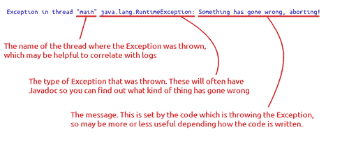

# 如何阅读和理解 Java 堆栈跟踪

> 原文：<https://dev.to/twilio/how-to-read-and-understand-a-java-stacktrace-3796>

当一个正在运行的 Java 应用程序出错时，通常您看到的第一个迹象是打印到屏幕上的行，如下所示:

```
Exception in thread "main" java.lang.RuntimeException: Something has gone wrong, aborting!
  at com.myproject.module.MyProject.badMethod(MyProject.java:22)
  at com.myproject.module.MyProject.oneMoreMethod(MyProject.java:18)
  at com.myproject.module.MyProject.anotherMethod(MyProject.java:14)
  at com.myproject.module.MyProject.someMethod(MyProject.java:10)
  at com.myproject.module.MyProject.main(MyProject.java:6) 
```

这是一个**堆栈轨道**，在这篇文章中，我将解释它们是什么，它们是如何制作的，以及如何阅读和理解它们。如果你觉得这很痛苦，那就继续读下去...

## 解剖一个堆栈道

通常，当代码中没有正确处理[异常](https://www.baeldung.com/java-exceptions)时，会显示 Stacktrace。这可能是[内置异常类型](https://docs.oracle.com/en/java/javase/11/docs/api/java.base/java/lang/Exception.html)之一，或者是由程序或库创建的[自定义异常](https://www.baeldung.com/java-new-custom-exception)。

Stacktrace 包含了**异常的类型**和一个**消息**，以及一个**列表，列出了抛出异常时正在进行的所有方法调用**。

让我们分析一下堆栈跟踪。第一行告诉我们异常的细节:

[](https://res.cloudinary.com/practicaldev/image/fetch/s--PPqv9Kjb--/c_limit%2Cf_auto%2Cfl_progressive%2Cq_auto%2Cw_880/https://s3.amazonaws.com/com.twilio.prod.twilio-doimg/9oHmXuXT7nRpdSueZHD8I3sK2yLPdkPLBv6Kj8kjzfkELh.width-500.png)

这是一个好的开始。第 2 行显示了发生这种情况时正在运行的代码:

[](https://res.cloudinary.com/practicaldev/image/fetch/s--_WpwlV_c--/c_limit%2Cf_auto%2Cfl_progressive%2Cq_auto%2Cw_880/https://s3.amazonaws.com/com.twilio.prod.twilio-doimg/Hrwf15FHX0DEpuBEw73N5Xy_7icjNt1TLXRaNiu_D82aHY.width-500.png)

这帮助我们缩小了问题的范围，但是代码的哪一部分叫做`badMethod`？答案在下一行，可以用完全相同的方式阅读。我们是怎么到达那里的？看下一行。以此类推，直到最后一行，也就是应用程序的`main`方法。从下到上阅读 Stacktrace，你可以从代码的开始追踪到异常的确切路径。

## 哪里出了问题？

[](https://res.cloudinary.com/practicaldev/image/fetch/s--KXLUUujg--/c_limit%2Cf_auto%2Cfl_progressive%2Cq_auto%2Cw_880/https://s3.amazonaws.com/com.twilio.prod.twilio-doimg/A9ZDocG2PU43VT16UFxIBCXS5sGAf7lIYDH4UqDIqZLU-G.width-500.jpg)

导致异常的事情通常是显式的`throw`语句。使用文件名和行号，您可以检查到底是什么代码抛出了异常。大概会是这样:

```
 throw new RuntimeException("Something has gone wrong, aborting!"); 
```

这是寻找潜在问题的一个很好的起点:围绕这个问题有 if 语句吗？这段代码是做什么的？那个方法用的数据是从哪里来的？

代码也有可能在没有显式`throw`语句的情况下抛出异常，例如您可以得到:

*   在调用`obj.someMethod()`的代码中，如果`obj`为`null`，则出现 NullPointerException
*   算术异常如果整数运算中出现被零除的情况，即`1/0`——奇怪的是，如果这是浮点运算，也没有异常，`1.0/0.0`返回`infinity` *就可以了！*
*   NullPointerException 如果一个`null`整数被取消装箱为一个`int`，代码如下:`Integer a=null; a++;`
*   在 [Java 语言规范](https://docs.oracle.com/javase/specs/jls/se11/html/jls-15.html#jls-15.6)中还有一些其他的例子，所以重要的是要意识到异常*可以在没有被显式抛出的情况下*出现。

## 处理库抛出的异常

Java 的一大优势是有大量可用的库。任何流行的库都会经过很好的测试，所以一般来说，当面临库的异常时，最好先检查错误是否是由我们的代码如何使用它引起的。

例如，如果我们使用来自 [Apache Commons Lang](https://commons.apache.org/proper/commons-lang/) 的 [Fraction](https://commons.apache.org/proper/commons-lang/javadocs/api-3.4/org/apache/commons/lang3/math/Fraction.html) 类，并像这样传递一些输入:

```
 Fraction.getFraction(numberOfFoos, numberOfBars); 
```

如果`numberOfBars`是零，那么 Stacktrace 将是这样的:

```
Exception in thread "main" java.lang.ArithmeticException: The denominator must not be zero
  at org.apache.commons.lang3.math.Fraction.getFraction(Fraction.java:143)   
  at com.project.module.MyProject.anotherMethod(MyProject.java:17)
  at com.project.module.MyProject.someMethod(MyProject.java:13)
  at com.project.module.MyProject.main(MyProject.java:9) 
```

许多好的库都提供了 [Javadoc](https://en.wikipedia.org/wiki/Javadoc#Structure_of_a_Javadoc_comment) ,其中包含了可能会抛出什么类型的异常以及为什么会抛出的信息。在这种情况下，`Fraction.getFraction`记录了如果一个分数的分母为零，那么[将抛出一个算术异常。从信息中也可以清楚地看出这一点，但在更复杂或模糊的情况下，文档可以提供很大的帮助。](https://commons.apache.org/proper/commons-lang/javadocs/api-3.4/org/apache/commons/lang3/math/Fraction.html#getFraction(int,%20int))

要读取这个 Stacktrace，从异常的类型- `ArithmeticException`和消息`The denominator must not be zero`开始。这提供了一个出错的概念，但是要发现是什么代码导致了异常，请跳过堆栈跟踪，在包`com.myproject`中寻找一些东西(在这里的第三行)，然后扫描到行尾，看看代码在哪里(`MyProject.java:17`)。那一行将包含一些调用`Fraction.getFraction`的代码。这是考察的起点:传递给`getFraction`的是什么？它从哪里来的？

在有许多库的大型项目中，堆栈跟踪可能长达数百行，所以如果你看到一个大的堆栈跟踪，练习浏览`at ... at ... at ...`列表寻找你自己的代码——这是一个需要开发的有用技能。

## 最佳实践:捕捉并重新抛出异常

假设我们正在做一个处理虚构的`FooBars`的大项目，我们的代码将被其他人使用。我们可能决定捕获来自`Fraction`的算术异常，并将其作为特定于项目的东西重新抛出，就像这样:

```
 try {
    ....
    Fraction.getFraction(x,y);
    ....
  } catch ( ArithmeticException e ){ 
    throw new MyProjectFooBarException("The number of FooBars cannot be zero", e);
  } 
```

抓住`ArithmeticException`并再次抛出它有几个好处:

*   我们的用户不必关心`ArithmeticException`——这给了我们改变如何使用 commons-lang 的灵活性。
*   可以添加更多的上下文，例如声明是*工具栏*的数量导致了这个问题。
*   它还可以使 Stacktraces 更容易阅读，我们将在下面看到。

没有必要捕捉并重新抛出每一个异常，但是在代码层出现跳转的地方，比如调用一个库，这通常是有意义的。

注意，`MyProjectFooBarException`的构造函数有两个参数:一个消息和导致它的异常。Java 中的每个异常都有一个`cause`字段，当像这样做一个*捕捉并重新抛出*时，你应该*总是*设置它来帮助人们调试错误。Stacktrace 现在可能看起来像这样:

```
Exception in thread "main" com.myproject.module.MyProjectFooBarException: The number of FooBars cannot be zero
  at com.myproject.module.MyProject.anotherMethod(MyProject.java:19)
  at com.myproject.module.MyProject.someMethod(MyProject.java:12)
  at com.myproject.module.MyProject.main(MyProject.java:8)
Caused by: java.lang.ArithmeticException: The denominator must not be zero
  at org.apache.commons.lang3.math.Fraction.getFraction(Fraction.java:143)
  at com.myproject.module.MyProject.anotherMethod(MyProject.java:17)
  ... 2 more 
```

最近抛出的异常在第一行，抛出的位置仍然在第二行。然而，这种类型的 Stacktrace 会导致混乱，因为与我们之前看到的 stack trace 相比， *catch-and-rethrow* 改变了方法调用的顺序。main 方法不再在底部，而*第一个*抛出异常的代码不再在顶部。当您有多个阶段的捕捉和再抛出时，它会变得更大，但模式是相同的:

从头到尾检查这些部分，寻找你的代码，然后从下到上阅读相关部分。

## 库 vs 框架

Java 中库和框架的区别在于:

*   您的代码*调用库中的*方法
*   你的代码*被框架中的*方法调用

一种常见的框架是 web 应用服务器，比如 SparkJava 或 T2 Spring Boot T3。在我们的代码中使用 SparkJava 和 [Commons-Lang](https://commons.apache.org/proper/commons-lang/) ，我们可能会看到这样的堆栈跟踪:

```
com.framework.FrameworkException: Error in web request
    at com.framework.ApplicationStarter.lambda$start$0(ApplicationStarter.java:15)
    at spark.RouteImpl$1.handle(RouteImpl.java:72)
    at spark.http.matching.Routes.execute(Routes.java:61)
    at spark.http.matching.MatcherFilter.doFilter(MatcherFilter.java:134)
    at spark.embeddedserver.jetty.JettyHandler.doHandle(JettyHandler.java:50)
    at org.eclipse.jetty.server.session.SessionHandler.doScope(SessionHandler.java:1568)
    at org.eclipse.jetty.server.handler.ScopedHandler.handle(ScopedHandler.java:144)
    at org.eclipse.jetty.server.handler.HandlerWrapper.handle(HandlerWrapper.java:132)
    at org.eclipse.jetty.server.Server.handle(Server.java:503)
    at org.eclipse.jetty.server.HttpChannel.handle(HttpChannel.java:364)
    at org.eclipse.jetty.server.HttpConnection.onFillable(HttpConnection.java:260)
    at org.eclipse.jetty.io.AbstractConnection$ReadCallback.succeeded(AbstractConnection.java:305)
    at org.eclipse.jetty.io.FillInterest.fillable(FillInterest.java:103)
    at org.eclipse.jetty.io.ChannelEndPoint$2.run(ChannelEndPoint.java:118)
    at org.eclipse.jetty.util.thread.QueuedThreadPool.runJob(QueuedThreadPool.java:765)
    at org.eclipse.jetty.util.thread.QueuedThreadPool$2.run(QueuedThreadPool.java:683)
    at java.base/java.lang.Thread.run(Thread.java:834)
Caused by: com.project.module.MyProjectFooBarException: The number of FooBars cannot be zero
    at com.project.module.MyProject.anotherMethod(MyProject.java:20)
    at com.project.module.MyProject.someMethod(MyProject.java:12)
    at com.framework.ApplicationStarter.lambda$start$0(ApplicationStarter.java:13)
    ... 16 more
Caused by: java.lang.ArithmeticException: The denominator must not be zero
    at org.apache.commons.lang3.math.Fraction.getFraction(Fraction.java:143)
    at com.project.module.MyProject.anotherMethod(MyProject.java:18)
    ... 18 more 
```

好了，现在已经很长了。像以前一样，我们应该首先怀疑我们自己的代码，但是越来越难找到在哪里。顶部是框架的异常，底部是库的异常，中间是我们自己的代码。唷！

一个复杂的框架和库可以创建十几个甚至更多的`Caused by:`部分，所以一个好的策略是跳过那些寻找你自己的代码的部分:`Caused by: com.myproject...`然后详细阅读那个部分来隔离问题。

## 总结

学习如何理解 Stacktraces 并快速阅读它们会让你专注于问题，并使调试变得不那么痛苦。这是一项随着练习而提高的技能，所以下次你看到一个大的堆栈跟踪时，不要被吓倒——如果你知道如何提取它，那里有许多有用的信息。

[](https://res.cloudinary.com/practicaldev/image/fetch/s--ctVqNGwG--/c_limit%2Cf_auto%2Cfl_progressive%2Cq_auto%2Cw_880/https://s3.amazonaws.com/com.twilio.prod.twilio-docs/original_images/EoZw5ArTbpyelA35Ks8FjjsrJCRq3tIDTNNjszf3qXJoCWIW63b0ePJMSNAXFlwfafRE2kFyKkL4Gy)

如果你有任何关于处理 Java 堆栈跟踪的技巧或诀窍，我很乐意听到，所以请联系我，让我们分享我们所知道的。

[mgilliard@twilio.com](mailto:mgilliard@twilio.com)
[@马克西姆吉利德](https://twitter.com/maximumgilliard)