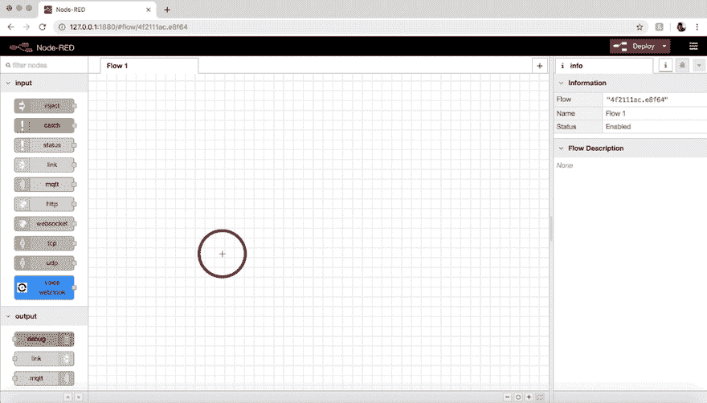
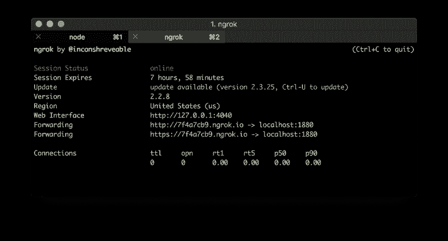
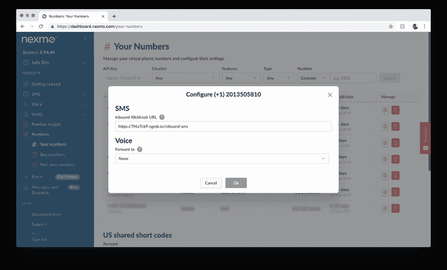
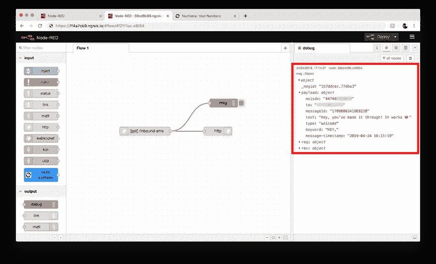

# 如何用 Node-RED 接收短信

> 原文：<https://dev.to/vonagedev/how-to-receive-sms-messages-with-node-red-55ll>

*这是“Nexmo 和 Node-RED 入门”系列教程的第二篇文章。*

在[上一篇文章](https://dev.to/nexmo/how-to-send-sms-messages-with-node-red-2l2o)中，您设置了您的 Nexmo 帐户和 Node-RED 编辑器，学习了如何发送 SMS 消息，以及如何处理交货收据。现在是时候学习如何通过使用 Node-RED 实现 webhook 端点来接收 SMS 消息了。

## 先决条件

开始之前，您需要一些东西:

*   安装在您机器上的 [Node.js](https://nodejs.org/en/) 和 [Node-RED](https://nodered.org/docs/getting-started/installation)
*   Nexmo 帐户— [如果您还没有，请免费创建一个](https://dashboard.nexmo.com/sign-up)
*   可选:[ngrok](https://ngrok.com/download)—了解[亚伦的博客文章](https://www.nexmo.com/blog/2017/07/04/local-development-nexmo-ngrok-tunnel-dr/)

对于本教程，你还需要一个 [Nexmo 号码](https://dashboard.nexmo.com/your-numbers)——你可以在> [购买号码](https://dashboard.nexmo.com/buy-numbers)下购买一个。

[](https://res.cloudinary.com/practicaldev/image/fetch/s--WZszTx09--/c_limit%2Cf_auto%2Cfl_progressive%2Cq_66%2Cw_880/https://www.nexmo.com/wp-content/uploads/2019/04/buy-number-nexmo-dashboard.gif)

## 定义一个 Webhook 端点

为了使用 Nexmo 接收 SMS 消息，您需要将 webhook 端点与您从 Nexmo 租赁的虚拟号码相关联。该号码的入站消息将被发送到您的 webhook 端点。

首先，在 Node-RED 编辑器中设置这个 webhook 端点。将一个`http`输入节点连接到一个`http response`节点，以及一个`debug`节点，这样您就可以在调试区域查看您的入站消息。

在`http`输入节点中，选择`GET`作为`Method`，在`URL`字段中填入类似`/inbound-sms`的内容。

`http response`节点应该有`200`设置为`Status code`，不过不用担心，这是默认值。

[](https://res.cloudinary.com/practicaldev/image/fetch/s--pyviQU25--/c_limit%2Cf_auto%2Cfl_progressive%2Cq_66%2Cw_880/https://www.nexmo.com/wp-content/uploads/2019/04/inbound-sms-flow-get.gif)

## 将您的本地服务器暴露在互联网上

接下来，您必须将您的本地服务器暴露在互联网上，以便 Nexmo 可以访问它。如果你在一个公共的网络服务器上运行 Node-RED，而不是在你的本地机器上，你可以跳过这个阶段。另外，一种方便的方法是使用隧道服务，如 [ngrok](https://ngrok.com) 。

[下载](https://ngrok.com/download)并安装 **ngrok** ，然后在终端运行它，在端口`1880`上启动隧道。

```
$ ./ngrok http 1880 
```

[](https://res.cloudinary.com/practicaldev/image/fetch/s--T5eOweH1--/c_limit%2Cf_auto%2Cfl_progressive%2Cq_auto%2Cw_880/https://www.nexmo.com/wp-content/uploads/2019/04/ngrok-send-sms-nodered.png)

## 用 Nexmo 设置端点

最后一步是让 Nexmo SMS API 知道应该将入站消息转发到哪里。

通过进入[您的号码](https://dashboard.nexmo.com/your-numbers)，然后点击您想要配置的号码旁边的设置图标，将 webhook 端点与您的虚拟号码相关联。

接下来，用`YOUR_NGROK_URL/inbound-sms`和`Save changes`填充*入站 Webhook URL* 字段。

[](https://res.cloudinary.com/practicaldev/image/fetch/s--nBdmT_Cq--/c_limit%2Cf_auto%2Cfl_progressive%2Cq_auto%2Cw_880/https://www.nexmo.com/wp-content/uploads/2019/04/inbound-sms-webhook-for-number-1.png)

现在，如果您向您的 Nexmo 号码发送一条文本消息，您应该看到消息对象出现在 debug 侧边栏中。

[](https://res.cloudinary.com/practicaldev/image/fetch/s--DGB9-qoG--/c_limit%2Cf_auto%2Cfl_progressive%2Cq_auto%2Cw_880/https://www.nexmo.com/wp-content/uploads/2019/04/received-sms-in-debug-1.png)

消息有效负载将包含几个应该注意的关键值:

| 键 | 描述 |
| --- | --- |
| **T2`msisdn`** | 移动台国际用户目录号码(MSISDN)是用于在国际上识别移动电话号码的号码。在这种情况下，这将是 E.164 格式的发送者号码。例如 447401234567。 |
| **T2`to`** | 以 E.164 格式接收短信的 Nexmo 号码。 |
| **T2`text`** | 收到的短信内容。 |
| **T2`type`** | 收到的消息体的类型( **`text`** 键)。可能的值有`text`、`unicode`和`binary`。 |
| **T2`keyword`** | 邮件正文中的第一个单词。这通常用于短代码。 |
| **T2`message-timestamp`** | Nexmo 开始将此送达回执推送到您的 webhook 端点的时间。 |

在[NEX mo API Reference for Inbound SMS](https://developer.nexmo.com/api/sms#inbound-sms)中找到关于这些参数的更多信息。

此时，我们只在调试区域记录入站消息，但是可能性是无限的。将它们存储在数据库中，转发、翻译、发布——或者为什么不设置一个自动回复器呢？

## 资源

*   [如何用 Node-RED 发送短信](https://dev.to/nexmo/how-to-send-sms-messages-with-node-red-2l2o)
*   [宣布 Nexmo Node-RED 包](https://www.nexmo.com/blog/2019/02/21/nexmo-node-red-package-dr/)
*   [入站短信的 API 引用](https://developer.nexmo.com/api/sms#inbound-sms)
*   了解更多关于 Nexmo [SMS API](https://developer.nexmo.com/api/sms) 的信息
*   仔细看看[节点——红色](https://nodered.org/docs/)