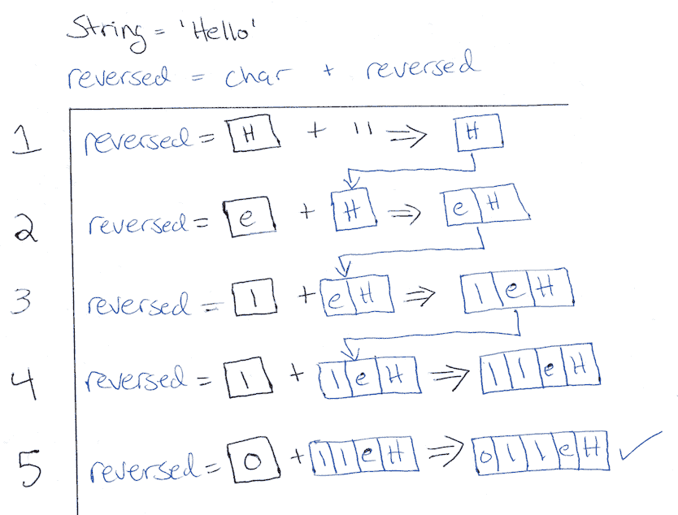

# 如何在 JavaScript 中反转字符串

> 原文：<https://dev.to/anthonyharvey/how-to-reverse-a-string-in-javascript-2j40>

在 JavaScript 中反转一个字符串可能看起来是一个简单的任务，但这涉及到几个步骤，并且在技术面试的背景下，它提供了展示您的 JavaScript 知识和权衡/边缘案例的机会。在开始编写代码之前，确保理解问题和任何约束是一个很好的做法。

有些约束可能会提前给你，比如:“编写一个算法，使用像`.reverse()`或`.charAt()`这样的内置函数，在没有的情况下，在**位置反转一个字符串。在开始尝试解决问题之前，先问清楚问题总是一个好主意。在这种情况下，我们需要反转一个字符串。我们可以问的一些问题包括:**

1.  要传递的字符串有什么条件吗？
2.  字符串包含常规字符还是特殊字符？

让我们从最少的约束开始，然后逐步增加:

> 给定一个字符串输入，返回一个字符串，其字符顺序与输入字符串的顺序相反。

面对这一挑战，我们可以使用的功能没有任何限制。我们还可以询问我们的澄清问题，如果字符串输入将包含任何特殊字符，或者如果有任何条件。对于这个挑战，让我们假设答案是输入将只包含常规 ASCII 字符。

既然我们已经提出了澄清性的问题，你可以用新的信息重述问题，为自己争取更多的时间来思考，并习惯大声说出你的思考过程。你可以这样说:

> 给定一个只有 ASCII 字符的字符串输入**，我想创建一个函数，返回一个**新字符串**，其字符与输入字符串的顺序相反。我想返回一个新的字符串，因为我想避免改变原来的字符串输入**

既然你已经根据对你的澄清性问题的回答重述了你所理解的问题，这可能是写一些简单例子的好时机。

```
reverse('hello') === 'olleh'
reverse('world!') === '!dlrow'
reverse('JavaScript') === 'tpircSavaJ' 
```

Enter fullscreen mode Exit fullscreen mode

既然我们理解了问题、输入和预期输出，我们就可以把它分解成步骤了。

1.  将字符串转换为数组，其中每个字符作为一个元素
2.  反转数组中元素的顺序
3.  将反转的数组转换回字符串
4.  返回反转的字符串

```
function reverse(string) {
  let answer = string.split('') // step 1
  answer.reverse()  // step 2
  answer = answer.join('')  // step 3
  return answer  //step 4
} 
```

Enter fullscreen mode Exit fullscreen mode

接下来，我们可以用上面创建的例子来测试这个函数，再次大声说出我们的思考过程，比如说:

> 给定一个字符串`hello`作为输入，该函数将:
> 
> 1.  首先分割每个字符上的字符串，将其转换为一个以每个字符为元素的数组，并将该数组赋给变量`answer`
> 2.  反转`answer`数组中元素的顺序
> 3.  将反转的`answer`数组中的元素连接成一个字符串，并将其重新分配给`answer`变量
> 4.  返回`answer`变量，它现在是输入的反向字符串

现在函数工作了，我们可以重构它，让它更干爽。

```
function reverse(string) {
  return string.split('').reverse().join('')
} 
```

Enter fullscreen mode Exit fullscreen mode

我们还可以在数组文字符号中使用[扩展语法](https://developer.mozilla.org/en-US/docs/Web/JavaScript/Reference/Operators/Spread_syntax),作为`.split()`函数的替代。

```
function reverse(string) {
  return [...string].reverse().join('')
} 
```

Enter fullscreen mode Exit fullscreen mode

现在让我们假设我们面临同样的问题，但是有更多的限制

> 给定一个字符串输入，返回一个字符串，其字符顺序与输入字符串的顺序相反，而不使用内置函数，如`.reverse()`、`.charAt()`，spread 语法；并且不使用数组。

为了简洁起见，让我们假设上面的澄清问题有相同的答案。对于第一个问题，我们可以使用相同的方法，但是在给定新约束的情况下，步骤不同。

1.  创建一个变量作为返回值，并将其设置为空字符串，将其命名为`reversed`
2.  遍历输入字符串中的字符
3.  在每次循环迭代中，将字符添加到`reversed`字符串的**开头的**
4.  返回`reversed`

我们想要将每个字符添加到`reversed`字符串的开头的原因是，如果我们将它们添加到字符串的末尾，我们将只是按原样重建输入字符串，并且我们希望返回值是一个反转的字符串。

```
function reverse(string) {
  let reversed = ''  // step 1
  for(let char of string) {  // step 2
    reversed = char + reversed;  // step 3
  }
  return reversed;  // step 4
} 
```

Enter fullscreen mode Exit fullscreen mode

在步骤 3 中，我们只是在每次迭代中将字符与反转的字符串连接起来，(小心地将其添加到开头)，并将连接的字符串重新分配给反转的变量。换句话说，从字符开始，将反转的字符串添加(连接)到它的末尾；然后将该组合字符串重新分配给`reversed`变量。

如果我们放入`reversed = reversed + char<`，这将与我们想要的相反，将只是重建输入字符串(`reverse('hello') === 'hello'`)。

<figure>

[](https://res.cloudinary.com/practicaldev/image/fetch/s--1Vg1CB-8--/c_limit%2Cf_auto%2Cfl_progressive%2Cq_auto%2Cw_880/https://anthonygharvey.com/assets/img/reverse_string_concatenation.png)

<figcaption>Reversing a string using a for..of loop and concatenation</figcaption>

</figure>

此外，步骤 2 使用 ES2015 中引入的`for...of`语句。该语法更易于阅读，并且它创建了一个循环来迭代可迭代对象。如果面试官让你不用 ES2015，你可以一直用传统的`for`循环；但是如果你没有这种限制，我认为使用`for...of`循环更好，因为语法更简单，它们减少了引入无意错误的机会(比如使用逗号而不是分号来分隔初始表达式、条件和增量表达式)。

对于我们的最后一个挑战，假设我们遇到了同样的问题，但是输入字符串可能不仅仅包含 ASCII 字符。

> 给定 Unicode 字符的字符串输入，返回一个字符串，其中的字符与输入字符串的顺序相反。

在这个挑战中，输入字符串将超过 7 位 ASCII 字符，并包含 8 位 Unicode 字符(参见此[视频](https://www.youtube.com/watch?v=5aJKKgSEUnY)了解 ASCII 和 Unicode 之间的差异)。

如果我们使用初始函数来反转一个包含 Unicode 字符的字符串，我们会得到奇怪和意外的结果。让我们在字符串中包含一个表情符号，为什么不呢？！

```
function reverse(string) {
  return string.split('').reverse().join('')
}

reverse('JS is fun! 😄')
// => �� !nuf si SJ 
```

Enter fullscreen mode Exit fullscreen mode

我们可以通过使用`Array.from()`方法从一个类数组或可迭代对象(在我们的例子中是一个字符串)创建一个新数组来解决这个问题。

```
function reverse(string) {
  return Array.from(str).reverse().join("")
}

reverse('JS is fun! 😄')
// => 😄 !nuf si SJ 
```

Enter fullscreen mode Exit fullscreen mode

## 结论

现在，您已经了解了 JavaScript 中实现反向字符串算法的不同方法，请看:

*   [用视频+练习讲解的 10 种常用数据结构](https://medium.freecodecamp.org/10-common-data-structures-explained-with-videos-exercises-aaff6c06fb2b)
*   [BaseCS 视频系列](https://dev.to/t/basecs)
*   [CodeNewbie 上的 BaseCS 播客](https://www.codenewbie.org/basecs)

更多阅读，请查看 [Coderbyte](https://coderbyte.com/challenges?a=true) 的算法教程和 [Toptal](https://www.toptal.com/developers/sorting-algorithms) 的排序算法动画。

我希望这有所帮助！如果你有任何问题或意见，请告诉我。你可以在 [LinkedIn](https://www.linkedin.com/in/anthonygharvey) 、 [GitHub](https://github.com/anthonygharvey) 、 [Twitter](https://twitter.com/anthonyharvey) 和我的[网站](https://anthonygharvey.com)上关注我。

*本文原载于[anthonygharvey.com](https://anthonygharvey.com/algorithms/how_to_reverse_a_string_in_javascript)2018 年 7 月 28 日*