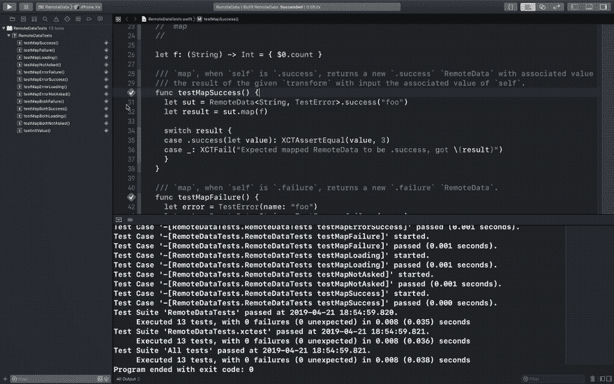
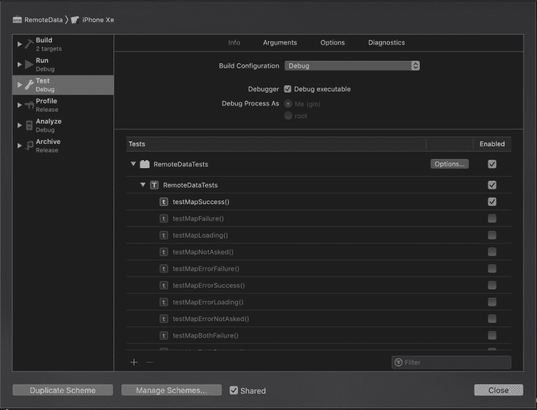

# 如何在 Xcode 中运行单个测试

> 原文：<https://dev.to/mokagio/how-to-run-a-single-test-in-xcode-5h72>

当构建软件时，你应该尝试**优化你的反馈回路**的速度。
你越快了解你的代码是否有效以及如何有效，你就能越好地为你的用户提供价值。

当谈到测试和 TDD 时，快速反馈循环意味着在不超过几秒钟内运行的测试套件**。
如果我盯着一个进度条超过几秒钟，我的思维就会开始分散。在那一点上，我将不得不花费大量的精神能量，不去做其他的事情，不去扰乱我的注意力。**

然而，拥有一个在几秒钟内运行的测试套件是很难的，尤其是当我们的代码库增长的时候。当在一个长时间运行的测试套件的代码库中工作时，一种加速反馈循环的技术是**只运行测试的子集**。

通过只运行与您正在更改的代码相关的测试，您可以显著地加快套件的执行时间，增加我们反馈循环的速度。

Xcode 提供了几种不同的方式来运行测试的子集。让我们来看看。

## 出自阴沟

您可以运行一个单独的测试类或者一个单独的测试方法，方法是点击相应的测试菱形。

[](https://res.cloudinary.com/practicaldev/image/fetch/s--E_2uniNy--/c_limit%2Cf_auto%2Cfl_progressive%2Cq_66%2Cw_880/https://s3.amazonaws.com/mokacoding/2019-04-23-single-test-from-gutter.gif)

## 用键盘快捷键

点击`^ ⌥ ⌘ U`运行光标*上下文*的测试。

如果你在一个测试方法中，就像下面的例子，上下文将是那个方法。
如果你的光标在一个测试类中，但在一个方法之外，上下文将是那个测试调用；它的所有测试都会运行。

[](https://res.cloudinary.com/practicaldev/image/fetch/s--dTi9B5kG--/c_limit%2Cf_auto%2Cfl_progressive%2Cq_66%2Cw_880/https://s3.amazonaws.com/mokacoding/2019-04-23-single-test-from-keyboard.gif)

我[喜欢键盘快捷键](https://xcodetips.com)，这是[我最喜欢的测试快捷键](https://www.mokacoding.com/blog/xcode-testing-shortcuts/)。我每天都用很多很多次。

## 从方案中

运行测试子集的另一种方法是在方案配置中选择它们。

[](https://res.cloudinary.com/practicaldev/image/fetch/s--YXB_eTaO--/c_limit%2Cf_auto%2Cfl_progressive%2Cq_auto%2Cw_880/https://s3.amazonaws.com/mokacoding/2019-04-23-scheme.png)

我只能想到少数情况下你可能想使用这种方法。例如，您可能有一个长期运行的集成套件，这会减慢您的持续集成流程。
您可以创建一个新的方案，其中只包含套件中的核心测试，并在每次存储库签入时只在 CI 上运行这些测试，同时将长期运行的套件作为您每天晚上都要运行的东西。

我对这种方法持谨慎态度。
这些配置隐藏在方案设置中；忘记他们太容易了。您可能会禁用一些测试，并意外地签入对方案的更改，然后突然发现自己错过了单元测试套件的一个重要部分。

## 来自终端

如果您从终端运行您的测试，您可以使用`-only-testing` `xcodebuild`标志来运行测试的子集。

```
xcodebuild test \
  -scheme YourScheme \
  -project YourProject.xcodeproj \
  -destination 'platform=iOS Simulator,name=iPhone Xs' \
  -only-testing YourTests/YourClassTests/testSomething 
```

Enter fullscreen mode Exit fullscreen mode

您可以添加任意多的`-only-testing`。

该选项支持不同粒度的标识符:`TestTarget[/TestClass[/TestMethod]]`。
这意味着在上面的例子中，您可以通过使用`-only-testing YourTests/YourClassTests`来运行`YourClassTests`中的所有测试。

值得注意的是，您也可以使用`-skip-testing`选项来运行除子集之外的所有测试。

## 奖励:快速集中测试

如果你正在使用测试框架 [Quick](https://github.com/Quick/Quick) 来享受定义测试的更具描述性的方式，你可能会注意到 Xcode 没有在槽中添加菱形。

您仍然可以通过 [*聚焦*](https://github.com/Quick/Quick/blob/0b4ed6c706dd0cce923b5019a605a9bcc6b1b600/Documentation/en-us/QuickExamplesAndGroups.md#temporarily-running-a-subset-of-focused-examples) 它们来运行测试的子集。
这可以通过在一个例子或组的前面加上一个`f`来实现:`fit`、`fcontext`、`fdescribe`。

```
fit("is loud") {
  // ...only this focused example will be run.
}

it("has a high frequency") {
  // ...this example is not focused, and will not be run.
} 
```

Enter fullscreen mode Exit fullscreen mode

## 一句告诫的话

运行一个测试或者测试的子集将会使你的反馈循环更快，但是也会降低你的改变没有破坏代码库的任何部分的信心。

我的建议是，只在开发的中间阶段为您正在处理的代码运行测试子集。一旦你完成了变更、修复或特性的实现，运行整个测试套件。养成在提交前运行测试的习惯，如果测试没有通过，就不要提交。

* * *

如何看待这些在 Xcode 中运行单个测试的方法？你还知道其他的吗？

我很乐意收到你的来信，在 Twitter [@mokagio](https://twitter.com/mokagio) 上联系或者在下面留言。

这是我的博客[mokacoding.com](https://www.mokacoding.com/blog/running-one-test-in-xcode/)T3 的一篇交叉文章。

## 相关岗位

[](/mokagio) [## 如何在 Swift 中进行 TDD，分步指南

### 吉奥罗提 2 月 13 日 1914 分钟阅读

#tdd #swift #testing](/mokagio/how-to-tdd-in-swift-a-step-by-step-guide-8jg)[](/mokagio) [## 如何测试视图控制器导航

### 吉奥罗提 4 月 17 日 1915 分钟阅读

#swift #testing #ios](/mokagio/how-to-test-view-controllers-navigation-3hhh)[](/mokagio) [## 代码覆盖率是一个不完整的指标

### 吉奥·罗提 2 月 20 日 194 分钟阅读

#testing #refactoring](/mokagio/code-coverage-is-a-broken-metric-3aac)