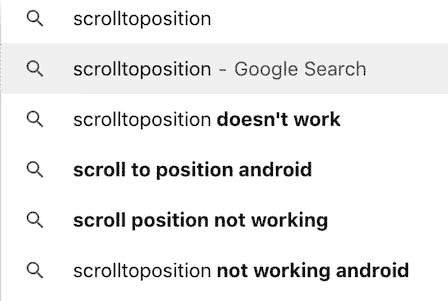

# 如何将 RecyclerView 滚动到某个位置？

> 原文：<https://dev.to/aldok/how-to-scroll-recyclerview-to-a-certain-position-5ck4>

这个问题看起来很简单，事实上 Android SDK 已经提供了几个 API 来滚动特定位置的项目。

```
fun iJustWantToScroll() {
    recyclerView.scrollToPosition()
    recyclerView.smoothScrollToPosition()
    recyclerView.layoutManager?.scrollToPosition()
    (recyclerView.layoutManager as LinearLayoutManager).scrollToPositionWithOffset()    
} 
```

Enter fullscreen mode Exit fullscreen mode

它应该像预期的那样工作，对吗？毕竟，将项目滚动到某个位置是一种相当常见的用法。然而，为什么这个问题仍然流行？

[](https://res.cloudinary.com/practicaldev/image/fetch/s--WKyXPMbW--/c_limit%2Cf_auto%2Cfl_progressive%2Cq_auto%2Cw_880/https://github.com/aldoKelvianto/blog/raw/master/assets/scrolltoposition.png)

我也是这种病毒的受害者。我花了很多年才意识到我问了一个错误的问题，在我回答这个问题之前，让我给你们展示一下我以前做过的事情。

```
fun iJustWantToScroll() {
    recyclerView.postDelayed(Runnable {
        // or use other API
        recyclerView.smoothScrollToPosition(0)

        // give a delay of one second
    }, 1_000)
} 
```

Enter fullscreen mode Exit fullscreen mode

这有点不太好，但总是有效的(在我的场景中)。尽量减少延迟，一般 500 毫秒就够了。

* * *

关于`scrollToPosition`的正确问题不是*如何*，而是*何时*。

# 何时将 RecyclerView 滚动到某个位置？

我发现为什么`scrollToPosition`和其他 API 不能工作的问题是因为数据集还没有准备好。当 recyclerView 收到数据集时，我们应该调用`scrollToPosition`。为此，我们可以使用`AdapterDataObserver`。

[d . Android 上的 AdapterDataObserver](https://developer.android.com/reference/android/support/v7/widget/RecyclerView.Adapter#registerAdapterDataObserver(android.support.v7.widget.RecyclerView.AdapterDataObserver))

`AdapterDataObserver`有五个公共方法。

[](https://res.cloudinary.com/practicaldev/image/fetch/s--ev26eCp8--/c_limit%2Cf_auto%2Cfl_progressive%2Cq_auto%2Cw_880/https://github.com/aldoKelvianto/blog/raw/master/assets/public-methods.png)

顾名思义，当一个项目被添加到 recycle view 时，`onItemRangeInserted`被调用，当一个项目被从 recycle view 中移除时，`onItemRemoved`被调用。

`onChanged`有一个例外。只有在适配器上调用`notify`时，才会调用`onChanged`，而**不会在每次**在 RecyclerView 上发生变化时调用。

我通常在数据集成功插入 RecyclerView 时调用`scrollToPosition`，例如:

```
adapter.registerAdapterDataObserver( object : RecyclerView.AdapterDataObserver() {
    override fun onItemRangeInserted(
        positionStart: Int,
        itemCount: Int
    ) {
        recyclerView.scrollToPosition(0)
    }

    override fun onItemRangeRemoved(
        positionStart: Int,
        itemCount: Int
    ) {
        recyclerView.smoothScrollToPosition(itemCount)
    }
} 
```

Enter fullscreen mode Exit fullscreen mode

这样，我们不需要等待几毫秒来滚动一个视图。当有新的数据集时，我们可以触发`scrollToPosition`或`smoothScrollToPosition`并确保 RecyclerView 是滚动的。