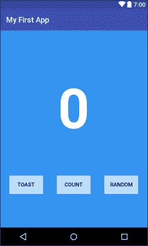
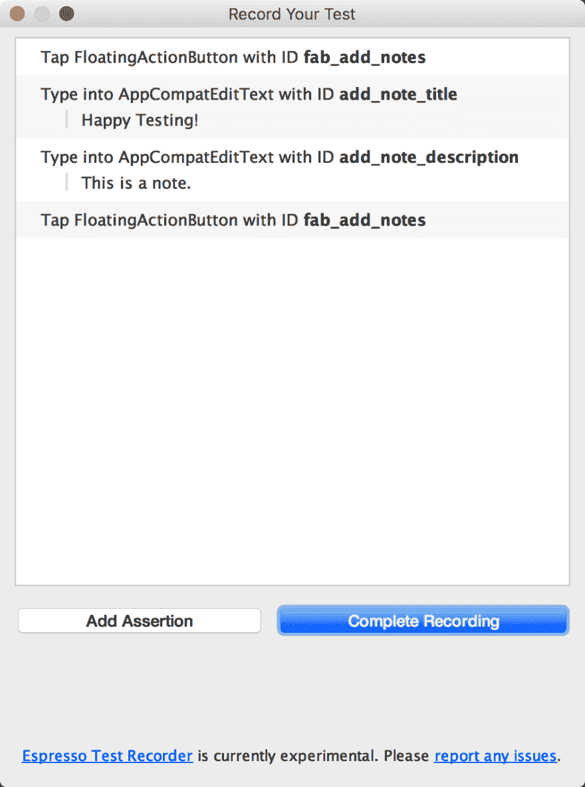
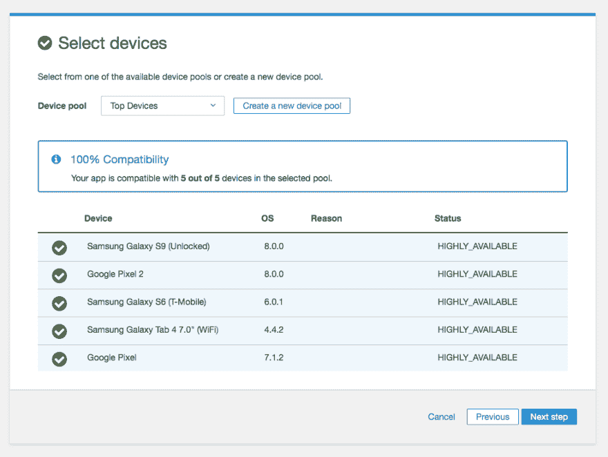
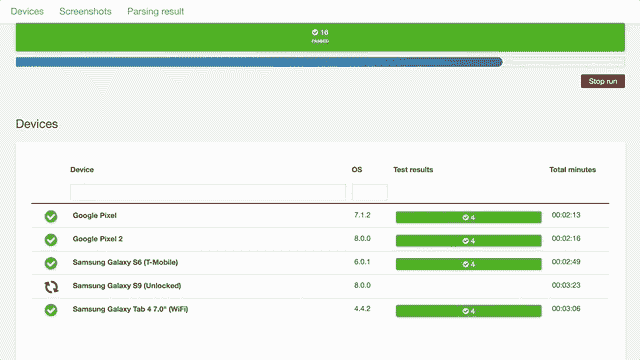

# 如何用零代码为 Android 设置端到端测试

> 原文：<https://dev.to/theworstdev/how-to-set-up-end-to-end-tests-for-android-with-zero-code-1ka>

您知道吗，您可以在真实的移动设备上大规模测试您的 Android 应用程序，而无需编写任何自动化测试代码。Espresso Test Recorder 是一个 UI 测试工具，让您无需编写任何测试代码就可以为您的应用程序创建测试。AWS Device Farm 是一项应用测试服务，可以让你在云端的数百台真正的 Android 设备上测试你的应用。

本教程结束时，您将学会如何:

1.  使用 Espresso 测试记录器为您的 Android 应用程序创建 UI 测试
2.  生成包含您的[浓缩咖啡测试](https://developer.android.com/training/testing/espresso/)的 APK
3.  将您的应用和测试上传到[设备群](https://aws.amazon.com/device-farm/)，并在数百台真实设备上大规模执行。

首先，你需要一个你想测试的 Android 应用程序。对于本教程，我使用这里的指令[在 *Kotlin* 开发了一个示例 Android 应用。如果您使用这些说明来构建应用程序，您应该会看到这样的结果:](https://codelabs.developers.google.com/codelabs/build-your-first-android-app-kotlin/index.html#0)

## 记录你的 UI 测试

Espresso 测试由两个主要组件组成:UI 交互和视图元素上的断言。UI 交互包括点击和键入操作，用户可以使用这些操作与您的应用程序进行交互。断言验证屏幕上可视元素的存在或内容。

Espresso 测试记录器将生成一个包含您所有测试的 APK。当您在真实设备上测试时，您需要将此测试 APK 与您想要测试的应用程序的 APK 一起上传到设备上。如果您希望在模拟器上运行测试，您可以简单地右键单击生成的测试文件，并选择 Run Tests。

> 如果你有自己的项目，在 Android Studio 中打开它。如果你按照教程，那么你可以跳过这一步。

要记录您的测试，从 Android Studio 菜单中选择`Run > Record Espresso Tests`。

接下来，选择您希望运行测试的设备，然后按下`OK`。Android studio 将构建您的应用程序，并将其加载到选定的设备上，并显示一个对话框来记录您的测试。

一旦构建了应用程序，并显示了“记录您的测试”对话框，请继续与应用程序进行交互。

Espresso 测试记录器将自动记录您的互动作为`type`和`touch`事件。当您稍后运行测试时，Espresso 测试将按照事件记录的相同顺序执行事件。

一旦你记录了一些交互，点击`Complete Recording`按钮。

> 我们不会在这里讨论添加断言，但是如果你也想添加一些断言，你可以跟随[这篇教程](https://developer.android.com/studio/test/espresso-test-recorder#add-assertions-to-verify-ui-elements)然后再回来。

## 将您的应用和测试 apk 上传到设备群

如果您尚未将 Espresso 依赖项添加到您的应用程序中，当您尝试保存测试时，会出现一个*缺少 Espresso 依赖项*对话框。单击`Yes`自动将依赖项添加到您的`build.gradle`文件中。

为了将您的测试上传到 Device Farm，您需要为应用程序和您的测试构建 apk。

确保为您的测试创建一个新的配置，否则将不会生成 APK。关于如何设置正确配置的说明，[请点击此处](https://youtu.be/O11nhUm8MKo?t=1444)。

一旦构建完成，您就有了 apk，在 AWS 控制台中导航到[设备群](https://us-west-2.console.aws.amazon.com/devicefarm/home)。在设备场控制台中，单击“创建新项目”按钮。

配置新项目后，选择“创建新运行”。在这里，您将看到一个向导，允许您配置您的测试并选择您的测试设备。

首先，你需要上传你的应用程序 APK。接下来，在 configuration 选项卡上，选择 **`Instrumentation`** 作为测试类型，并上传您的测试 APK，然后单击`Next step`。

## 选择您的设备

Device Farm 支持数百种设备配置，让您可以针对您需要的设备类型运行应用程序。要指定您想要在哪些设备上运行测试，您可以使用 AWS 的预配置池，如“Top Devices”，或者您可以创建一个新的设备池。随便选一个。

选择设备池后，点击`Next step`。

对于设备状态，请使用默认值，除非您的应用程序依赖于设备上可用的特定数据或应用程序。再次点击`Next step`。

## 运行测试

在运行测试之前，确保检查所有设置，并为测试设置最大超时，然后单击`Run`。这将启动测试并创建运行，您可以通过单击可用运行列表中的新运行来实时查看运行。

这就是全部了！现在，您可以在无需编写任何代码的情况下，为您的 Android 应用程序添加自动化测试。将它与 Device Farm 配对，您就可以部署您的应用程序，因为它们可以在您支持的所有设备类型上工作！