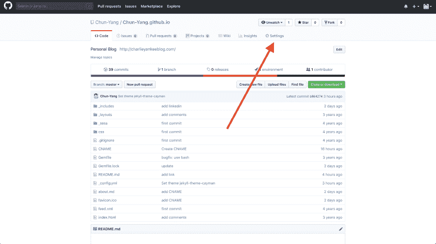
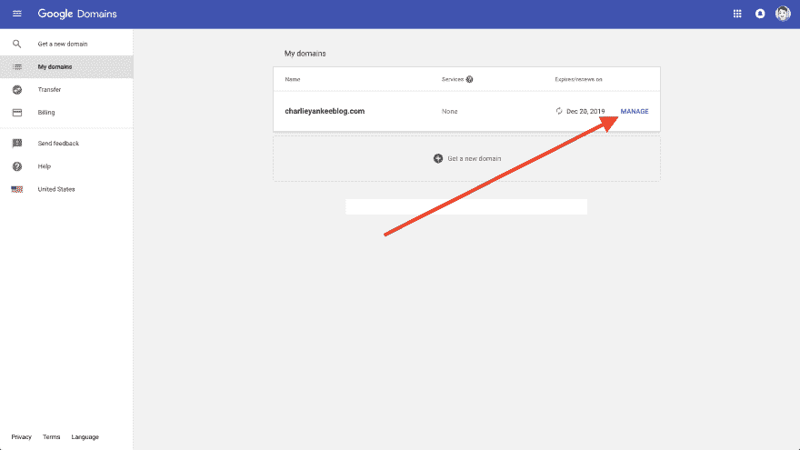
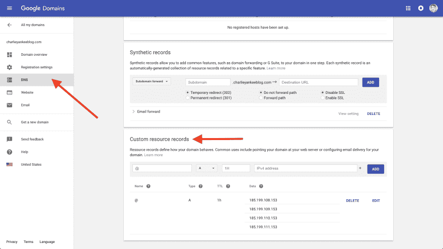

# 如何为 github 页面设置 google 域名

> 原文：<https://dev.to/trentyang/how-to-setup-google-domain-for-github-pages-1p58>

[](https://res.cloudinary.com/practicaldev/image/fetch/s--adAiuVWA--/c_limit%2Cf_auto%2Cfl_progressive%2Cq_auto%2Cw_880/https://trentyang.com/assets/image/google-domains-and-github-pages/google-domains-and-github-pages-cover.png)

## [T1】简介](#intro)

Github pages 很容易设置，但是要用 google domains 附加一个自定义域，可能会遇到问题。以下是你如何通过 4 个步骤做到这一点。

## 先决条件

*   你有一个 [github 页面](https://pages.github.com/)库，例如【https://github.com/Chun-Yang/Chun-Yang.github.io】T2
*   您在[谷歌域名](https://www.domains.google)上购买了一个域名，例如 trentyang.com

## 第 1/4 步:让 gitHub 页面知道你的自定义域

*   进入你的 github 库设置页面
    [](https://res.cloudinary.com/practicaldev/image/fetch/s---9SraskT--/c_limit%2Cf_auto%2Cfl_progressive%2Cq_auto%2Cw_880/https://trentyang.com/assets/image/google-domains-and-github-pages/github-settings.png)

*   在设置> GitHub 页面>自定义域名
    [](https://res.cloudinary.com/practicaldev/image/fetch/s--EjYAgqbZ--/c_limit%2Cf_auto%2Cfl_progressive%2Cq_auto%2Cw_880/https://trentyang.com/assets/image/google-domains-and-github-pages/github-github-pages.png) 中添加您的自定义域名

## 第 2/4 步:让你的自定义域名(trentyang.com)指向你的 github 页面

*   在你的谷歌域名上进入[注册](https://domains.google.com/m/registrar/)页面，选择你的域名
    [](https://res.cloudinary.com/practicaldev/image/fetch/s--Xi_AeLNe--/c_limit%2Cf_auto%2Cfl_progressive%2Cq_auto%2Cw_880/https://trentyang.com/assets/image/google-domains-and-github-pages/google-domain-list.png)

*   转到 DNS >自定义资源记录
    [](https://res.cloudinary.com/practicaldev/image/fetch/s--pJuRxde6--/c_limit%2Cf_auto%2Cfl_progressive%2Cq_auto%2Cw_880/https://trentyang.com/assets/image/google-domains-and-github-pages/google-domain-custom-resource.png)

*   添加如下截图所示的记录。请注意，您需要使用“+”按钮来添加更多的 URL。
    [](https://res.cloudinary.com/practicaldev/image/fetch/s--cm64QDgt--/c_limit%2Cf_auto%2Cfl_progressive%2Cq_auto%2Cw_880/https://trentyang.com/assets/image/google-domains-and-github-pages/google-domains-a-record.png) 
    以下是截图中的 IP 列表:

    *   185.199.111.153
    *   185.199.110.153
    *   185.199.109.153
    *   185.199.108.153

如果这些已经过时了，你也可以在 github 上找到最新的。

*   要确认您的 DNS 记录设置正确，请使用 dig 命令查找您的域

```
 $ dig trentyang.com +noall +answer
 trentyang.com.  3600  IN  A  185.199.111.153
  trentyang.com.  3600  IN  A  185.199.110.153
  trentyang.com.  3600  IN  A  185.199.109.153
  trentyang.com.  3600  IN  A  185.199.108.153 
```

*   一旦以上操作成功，您的自定义域应该可以正常工作了。去你的领域看看吧！

## 第 3/4 步:让你的 www 子域(【www.trentyang.com】)指向你的 github 页面

*   添加以下 CNAME 记录
    [](https://res.cloudinary.com/practicaldev/image/fetch/s--YujF-C2O--/c_limit%2Cf_auto%2Cfl_progressive%2Cq_auto%2Cw_880/https://trentyang.com/assets/image/google-domains-and-github-pages/cname-record.png)

*   您可以使用下面的 dig 命令来确认您的设置是正确的

```
 $ dig www.trentyang.com +nostats +nocomments +nocmd
 www.trentyang.com.      IN      A
  www.trentyang.com. 1263 IN      CNAME   chun-yang.github.io. 
```

## 第 4/4 步:(可选但强烈推荐)为您的 github 页面启用 HTTPS

*   转到您的 github 存储库设置页面，在设置> GitHub 页面>自定义域下删除您的自定义域并保存。
*   然后再添加回去，再次保存。
*   现在，您应该能够选中“强制 HTTPS”复选框，并保护您的网站！

如果你喜欢阅读，这里有我的博客[https://trent yang . com/how-to-setup-Google-domain-for-github-pages/](https://trentyang.com/how-to-setup-google-domain-for-github-pages/)