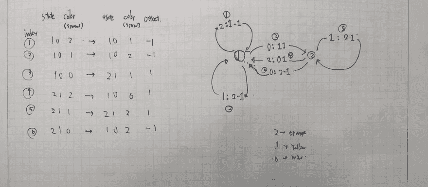

# 如何在 postgreSQL 上实现最简单的图灵机

> 原文：<https://dev.to/yuyabu/how-to-simplest-turing-machine-works-on-postgresql-4k8f>

# 版本

postgres:10.6

```
postgres=# SELECT version();
 PostgreSQL 10.6 (Ubuntu 10.6-0ubuntu0.18.04.1) on x86_64-pc-linux-gnu, compiled by gcc (Ubuntu 7.3.0-16ubuntu3) 7.3.0, 64-bit 
```

# 前言

我发现了一个有趣的关于 SQL 是图灵完成的帖子。

[http://blog . Coelho . net/database/2013/08/17/turing-SQL-1 . html](http://blog.coelho.net/database/2013/08/17/turing-sql-1.html)

这个网站试图在 SQL 上模拟图灵机。

这是表定义。

```
CREATE TABLE State(    -- TM states
  sid INTEGER PRIMARY KEY,    -- 0 is always the initial state
  isFinal BOOLEAN NOT NULL,
  sname TEXT UNIQUE NOT NULL -- just for show
);

CREATE TABLE Symbol( -- TM symbols
  cid INTEGER PRIMARY KEY,  -- 0 is always the blank symbol
  cname TEXT UNIQUE NOT NULL
);

CREATE TABLE Transition( -- TM transition function
  sid INTEGER NOT NULL REFERENCES State,     -- initial state
  symbol INTEGER NOT NULL REFERENCES Symbol, -- & symbol
  UNIQUE(sid, symbol),
  new_state INTEGER NOT NULL REFERENCES State,
  new_symbol INTEGER NOT NULL REFERENCES Symbol,
  move INTEGER NOT NULL CHECK(move=-1 OR move=1)
);

CREATE TABLE Tape( -- TM initial tape contents
  tid INTEGER PRIMARY KEY,
  symbol INTEGER REFERENCES Symbol
); 
```

这是执行查询。

```
WITH RECURSIVE running(rid, sid, tape, pos) AS (
  -- first store initial tape contents
  SELECT 0, 0, ARRAY(SELECT symbol FROM Tape ORDER BY tid), 1
  UNION
  -- then proceed to compute iterations
  SELECT p.rid+1, t.new_state,
         -- build updated tape as an array
         p.tape[1:p.pos-1] ||                      -- prefix
           t.new_symbol ||                         -- updated cell
           p.tape[p.pos+1:array_length(p.tape,1)], -- suffix
         -- move cursor position
         p.pos+t.move
  FROM running AS p
  -- get state details, to know whether to stop
  JOIN State AS s ON (p.sid=s.sid)
  -- get corresponding state transition
  JOIN Transition AS t ON (t.sid=p.sid AND
                           -- coalesce defaults to blank
                           t.symbol=COALESCE(p.tape[p.pos],0))
  WHERE -- stop on a final state
        NOT s.isFinal
)
-- just store the computed table
INSERT INTO Run
  SELECT * FROM running; 
```

但是它不能只处理该站点中的查询。

```
ERROR:  insert or update on table "run" violates foreign key constraint "run_sid_fkey"
DETAIL:  Key (sid)=(0) is not present in table "state". 
```

因为这篇文章只有表定义(create 语句)而没有机器数据(insert 语句)

所以我需要图灵机的数据。

> 注意:我后来发现 CTS(循环标签系统)数据写在这里。
> [https://wiki . PostgreSQL . org/wiki/Turing _ Machine _(with _ recursive)](https://wiki.postgresql.org/wiki/Turing_Machine_(with_recursive))

# (2，3)图灵机

这一次，我选择了最简单的图灵机，叫做“Wolfram 的 2 态 3 符号图灵机”

[https://www . wolfram science . com/prices/tm23/technical details . html](https://www.wolframscience.com/prizes/tm23/technicaldetails.html)

这个图灵机有 2 个状态({1，2})和 3 个符号({2，1，0})。

```
{state, color} -> {next_state, next_color, offset(header position)}

{1, 2} -> {1, 1, -1},
{1, 1} -> {1, 2, -1},
{1, 0} -> {2, 1, 1 },
{2, 2} -> {1, 0, 1 },
{2, 1} -> {2, 2, 1 },
{2, 0} -> {1, 2, -1} 
```

我在纸上检查，并做 DB 记录。

[](https://res.cloudinary.com/practicaldev/image/fetch/s--rrtl319I--/c_limit%2Cf_auto%2Cfl_progressive%2Cq_auto%2Cw_880/https://thepracticaldev.s3.amazonaws.com/i/le17719ubwywslrlct1s.jpg)

```
INSERT INTO State VALUES(0,FALSE,1),(1,FALSE,2); 
INSERT INTO Symbol VALUES(0,'0'),(1,'1'),(2,'2');
INSERT INTO Transition VALUES
(0,2,0,1,-1),
(0,1,0,2,-1),
(0,0,1,1, 1),
(1,2,0,0, 1),
(1,1,1,2, 1),
(1,0,0,2,-1)

INSERT INTO Tape VALUES(0,0); 
```

(2，3)图灵机没有停止状态。

> 注意，这个图灵机没有停止状态。

执行查询假设存在暂停状态，我需要更改执行查询。

```
WITH RECURSIVE running(rid, sid, tape, pos) AS (
  -- first store initial tape contents
  SELECT 0, 0, ARRAY(SELECT symbol FROM Tape ORDER BY tid), 1
  UNION
  -- then proceed to compute iterations
  SELECT p.rid+1, t.new_state,
         -- build updated tape as an array
         p.tape[1:p.pos-1] ||                      -- prefix
           t.new_symbol ||                         -- updated cell
           p.tape[p.pos+1:array_length(p.tape,1)], -- suffix
         -- move cursor position
         p.pos+t.move
  FROM running AS p
  -- get state details, to know whether to stop
  JOIN State AS s ON (p.sid=s.sid)
  -- get corresponding state transition
  JOIN Transition AS t ON (t.sid=p.sid AND
                           -- coalesce defaults to blank
                           t.symbol=COALESCE(p.tape[p.pos],0))
  WHERE -- stop on a final state
        --NOT s.isFinal -- There is no halt state.
        NOT p.rid = 100 -- By changing this number 
                        -- you can set the number of generations of cellular automata on tape.
)
-- just store the computed table
INSERT INTO Run
  SELECT * FROM running; 
```

# 结果

执行结果在这里。

| 使摆脱 | （同 suddenionosphericdisturbance）电离层的突然骚扰 | 磁带 | 刷卡机 |
| --- | --- | --- | --- |
| Zero | Zero | {0} | one |
| one | one | {1} | Two |
| Two | Zero | {1,2} | one |
| three | Zero | {2,2} | Zero |
| four | one | {1,2,2} | one |
| five | one | {2,2,2} | Two |
| six | Zero | {2,0,2} | three |
| seven | Zero | {2,0,1} | Two |
| eight | one | {2,1,1} | three |
| nine | one | {2,1,2} | four |
| Ten | Zero | {2,1,2,2} | three |
| ... | ... | ... | ... |
| eighty-nine | Zero | {2,2,1,1,2,2,2,1,2,2,1,2} | Two |
| Ninety | Zero | {2,1,1,1,2,2,2,1,2,2,1,2} | one |
| Ninety-one | Zero | {1,1,1,1,2,2,2,1,2,2,1,2} | Zero |
| Ninety-two | one | {1,1,1,1,1,2,2,2,1,2,2,1,2} | one |
| Ninety-three | one | {2,1,1,1,1,2,2,2,1,2,2,1,2} | Two |
| Ninety-four | one | {2,2,1,1,1,2,2,2,1,2,2,1,2} | three |
| Ninety-five | one | {2,2,2,1,1,2,2,2,1,2,2,1,2} | four |
| Ninety-six | one | {2,2,2,2,1,2,2,2,1,2,2,1,2} | five |
| Ninety-seven | one | {2,2,2,2,2,2,2,2,1,2,2,1,2} | six |
| Ninety-eight | Zero | {2,2,2,2,2,0,2,2,1,2,2,1,2} | seven |
| Ninety-nine | Zero | {2,2,2,2,2,0,1,2,1,2,2,1,2} | six |
| One hundred | one | {2,2,2,2,2,1,1,2,1,2,2,1,2} | seven |

完整版在我的 github 库上是“result.txt”

[https://github . com/yuya bu/2 state-3 color-turing-machine-on-SQL](https://github.com/yuyabu/2state-3color-turing-machine-on-sql)

我根据这条规则将“磁带”列转换为图像。

```
2 -> orange
1 -> yellowfins
0 -> white 
```

毕竟，我制作了这个细胞自动机图像。

[](https://res.cloudinary.com/practicaldev/image/fetch/s--iUWD4Ddq--/c_limit%2Cf_auto%2Cfl_progressive%2Cq_auto%2Cw_880/https://thepracticaldev.s3.amazonaws.com/i/pl5xlghhdqu6nrbh2gqt.png)

虽然补白细胞的方法不同，错位了，但是和 wolfram 的 page 的图像几乎是一样的。

# 下次

我会尝试制定第 60 条规则。规则 60 的转移函数在 NKS 的书上。

```
{{1, 2} -> {2, 2, 1}, {1, 1} -> {1, 1, 1}, {1, 0} -> {3, 1, -1}, {2, 2} -> {2,1, 1}, {2, 1} -> {1, 2, 1}, {3, 2} -> {3, 2, -1}, {3, 1} -> {3, 1, -1}, {3, 0} -> {1, 0, 1}} 
```

[https://www.wolframscience.com/nks/notes-11-12 规则 60-图灵机/](https://www.wolframscience.com/nks/notes-11-12--rule-60-turing-machines/)

本文翻译自我的博文(原文为日语)。
[http://yuyubu . hate nablog . com/entry/2019/01/15/SQL % E4 % B8 % 8A % E3 % 81% A72 % E7 % 8A % B6 % E6 % 85% 8 B3 % E8 % A8 % 98% E5 % 8F % B7 % E3 % 83% 81% E3 % 83% A5 % E3 % 83% BC % E3 % 83% AA % E3 % 83% B3 % E3 % 82% B0 %](http://yuyubu.hatenablog.com/entry/2019/01/15/SQL%E4%B8%8A%E3%81%A72%E7%8A%B6%E6%85%8B3%E8%A8%98%E5%8F%B7%E3%83%81%E3%83%A5%E3%83%BC%E3%83%AA%E3%83%B3%E3%82%B0%E3%83%9E%E3%82%B7%E3%83%B3%E3%82%92%E3%82%A8%E3%83%9F%E3%83%A5%E3%83%AC%E3%83%BC%E3%82%B7)