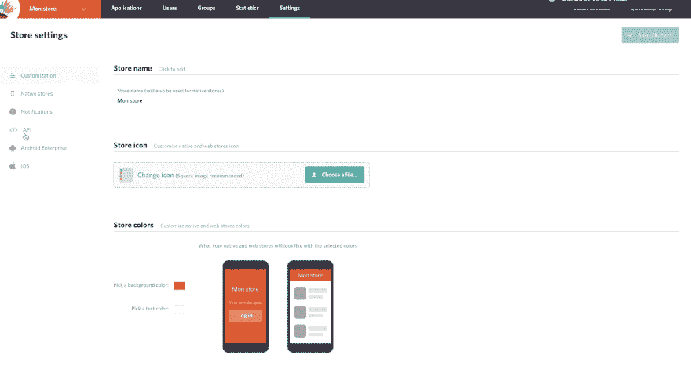

# 如何用 EmberJS 制作的新站点慢慢替换你的站点

> 原文：<https://dev.to/appaloosastore/how-to-slowly-replace-your-site-with-a-new-one-made-with-emberjs-3m66>

你可能知道(如果不知道，请阅读我们的文章😉)在 Appaloosa，我们最近向客户发布了我们的新前端(阅读[我们有了一个新的 EmberJS 前端](https://medium.com/@appaloosastore/we-have-a-new-emberjs-front-end-c7246e76cdbd))。

两年多前，我们开始了这个新前端的工作，这是我们旧的大规模前端(许多功能/页面)的完全重新设计。在还有工作要做的时候，新管理员没有覆盖我们旧管理员的全球范围。但是我们决定向我们的客户发布，因为这是一个具有更好的 UX 的好界面，并且更容易更新/维护。

对于(还)不可用的部分，我们将用户重定向到我们的旧/传统管理员。

这个新的前端是用 EmberJS 构建的，今天我们决定向你展示我们如何管理从新管理员到旧管理员的过渡。我们决定分享我们的解决方案，因为我们认为这是一个很好的解决方案，可以帮助那些需要添加相同行为的人。

但是首先让我们来看看它在现实中的样子。

 *看起来很棒吧？*

### 为什么是重定向模态？

在处理重定向之前，让我们创建一个好的模型。模态非常重要，因为它告诉用户正在发生什么。没有模态，用户就会迷失。想象一下，你在一个看起来不错的界面上，突然出现在另一个有着完全不同的老式设计的网站上😱。

**如何进行重定向**

让我们从一些 HTML 开始