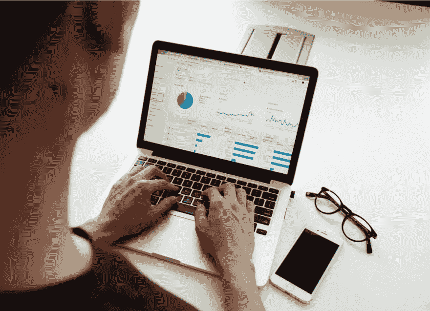
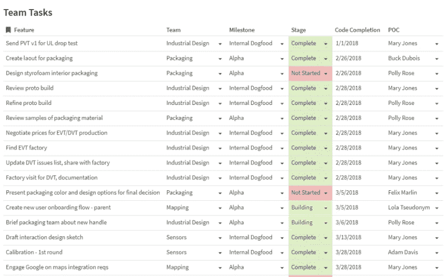
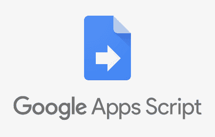

# 如何使用 Google Apps 脚本在 Coda 文档(和 Google Sheets)之间同步数据

> 原文：<https://dev.to/coda/how-to-sync-data-between-coda-docs-and-google-sheets-using-google-apps-script-2adc>

*原发于我的 [Coda 个人资料](https://coda.io/@atc/how-to-sync-data-between-coda-docs-and-google-sheets-using-googl) (coda.io/@atc)。*

***2020 年 5 月更新**:发布了两个脚本来同步从 Coda 到 Google Sheets 或者从 Google Sheets 到 Coda。详见[本帖](https://coda.io/@atc/how-to-sync-data-from-coda-to-google-sheets-and-vice-versa-with-google-apps-script-tutorial)。*

***2020 年 2 月更新**:如果你在 Google Apps 脚本中使用 [V8 运行时](https://developers.google.com/apps-script/guides/v8-runtime)，从脚本的[第 40 行](https://gist.github.com/albertc44/c3d5ebc2a9ec00a28e561ea8e64fc0c5#file-coda_one_way_sync_v2-js-L40)和[第 88 行](https://gist.github.com/albertc44/c3d5ebc2a9ec00a28e561ea8e64fc0c5#file-coda_one_way_sync_v2-js-L88)中删除单词 each。*

您有一个包含一些敏感数据的主电子表格，但想与客户、员工或供应商共享其中的一些数据。很明显，您不能共享整个电子表格，因为这样对方就可以看到您的敏感数据。我在各种工作流中一次又一次地看到这种情况，有一些解决方案可以解决这个问题…但它们并不完美。那你是做什么的？

如果有专门为你的行业而存在的软件，那么你很幸运。专业软件可能内置了数据同步功能，允许您查看对您来说重要的数据，但您可以与您的客户或患者共享该数据的过滤视图。对方很有可能要在你使用的软件上设置一个登录，或者下载一个 app 来查看他们的数据。

然后是我们其余的人。

我们生活在 Excel 电子表格和 Google 工作表中，需要简单的方法在文件间共享数据。在这篇文章中，我将讨论:

*   如何使用 [Google Apps 脚本](https://developers.google.com/apps-script/) (GAS)将 Coda 文档中一个表的数据共享到另一个 Coda 文档中
*   如何从一个 Google Sheet 到另一个 Google Sheet 共享数据(也使用 GAS)
*   使用公式从一个 Google 工作表到另一个 Google 工作表共享数据的非 GAS 方式

* * *

*如果你想直接跳到解决方案，这里有用于同步 Coda 表格* *的* [*脚本，以及用于同步 Google Sheets 列表的脚本。或者只看下面的视频。*](https://gist.github.com/albertc44/c3d5ebc2a9ec00a28e561ea8e64fc0c5)

[https://www.youtube.com/embed/PL_uSeKmYkc](https://www.youtube.com/embed/PL_uSeKmYkc)

### 先关，什么是尾？

Coda 是一个实时协作文档(类似于 Google 文档),在一个工具中包含了电子表格和数据库的强大功能。有了 Coda，你可以构建应用程序(无需代码)来解决与[项目管理](https://coda.io/templates/project-management)和为你的朋友组织[权力的游戏死亡池](https://coda.io/t/Game-of-Thrones-Death-Pool_thh_XTvB5YN)相关的工作流程。如果你更喜欢视觉学习，可以看看下面的视频:

[https://www.youtube.com/embed/M2tNj1CYp_A](https://www.youtube.com/embed/M2tNj1CYp_A)

Coda 的核心是数据表。Coda 中的表格看起来像电子表格中的网格，但是它们有名称，并且更像数据库。以下是团队任务表，其中包含管理项目任务所需的典型列:

<figure> 

<figcaption>项目任务表尾</figcaption>

</figure>

### 过滤与你相关的数据

如果你是项目经理，这个列表可能会变得很长，所以大多数项目经理会做的是[创建一个任务视图](https://help.coda.io/getting-started/using-coda/creating-a-view),只过滤具有“未开始”阶段的任务，或者“工业设计”团队会创建一个任务视图，只过滤给他们的团队。

Coda 社区中的许多用户希望将上面主任务列表中的数据同步到一个单独的 Coda 文档中。为什么？创建一个更清晰的任务视图，不包括“源”文档的其他部分。我见过的一些项目管理之外的常见工作流:

*   一家**数字机构**在文档中管理他们客户的数据，但是希望有选择地与他们的客户共享他们文档中的数据
*   一名教师在一个 Coda 文档中跟踪学生的出勤和成绩，但只想与学生家长共享某个学生的数据
*   一家**小型企业**在一个文档中管理他们的业务数据，并向供应商下采购订单，并且只想与一个供应商共享他们文档中的特定数据

### 输入 Google Apps 脚本

您可以使用 Google Apps 脚本集成您在 Google 中使用的所有各种应用程序(例如 Gmail、Google Sheets、Google Docs)。Coda 有一个可以在 Google apps 脚本中使用的库，这意味着您可以将 Coda 中的数据与其他 Google Apps 集成在一起(反之亦然)。

我发现使用 GAS 最容易使用 [Coda API](https://coda.io/developers/apis/v1beta1#section/Introduction) ,但是也可以使用 Python 或 Unix shell。我喜欢使用 GAS 来同步 Coda 文档中的表格，因为你可以很容易地设置一个[时间驱动触发器](https://developers.google.com/apps-script/guides/triggers/installable)，这样你的脚本每分钟、每小时、每天都可以运行。然而，如果你正在使用 Google Sheets，你可以使用[简单触发器](https://developers.google.com/apps-script/guides/triggers/)，当你的 Google Sheets 有变化时，它会触发你的脚本。

### 设置您的 Google Apps 脚本

如果你按照[入门指南:Coda API](https://coda.io/t/Getting-Started-Guide-Coda-API_toujpmwflfy) 进行操作，你将基本上实现单向同步，这样来自你的主 Coda 文档(从现在开始我称之为*源*的数据将单向同步到你创建的另一个 Coda 文档(T4 目标文档)。参见下面的完整脚本: