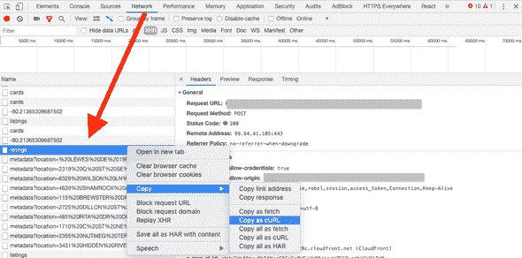
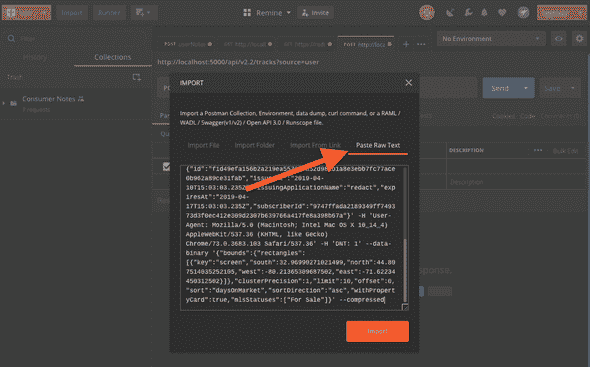

# 如何使用 cURL & Postman 测试你的 API

> 原文：<https://dev.to/stephencweiss/how-to-test-your-api-using-curl-postman-382c>

前几天，我发现自己对应用程序的一个网络请求做了一些更改。

通过导航到一个特定的页面，我知道我会触发呼叫，所以这就是我正在做的。在某个时候，我需要一些帮助，其中一个更高级的工程师说我可以把`cURL`复制到 Postman 中。

我不知道那是什么意思，所以我做了些调查。以下是使用 Postman 进行 API 测试的原因和方法。

# 为什么要用邮递员

将流程转移到 Postman，我有几个好处。对我来说最大的两个是:

1.  我加快了我的测试周期——因为我不必加载整个页面，而是可以专注于我的一个调用，每个测试都可以更快地完成
2.  检查响应更加容易——我不必每次都在开发工具的网络选项卡中导航来找到我感兴趣的调用，而是可以使用更适合这个过程的 Postman 的 UI

# 如何使用邮差

1.  导航到您知道会触发网络呼叫的网页
2.  打开开发工具(Chrome 的 Mac 键盘快捷键是`⌘` + `⌥` + `i`)
3.  转到网络选项卡
4.  找到您想要复制的请求，并右键单击它。`cURL`见>副本 [副本](///static/4637479418d69b7048a9e51840d7a7c0/66e9d/network-tab.png)
5.  开门邮递员
6.  使用 Postman 的导入功能，将复制的请求粘贴到原始文本部分，文件>导入>原始文本。(键盘快捷键是`⌘` + `o` )  注意，通过复制`cURL`，您还将引入您所有的头——包括任何可能需要的授权。 