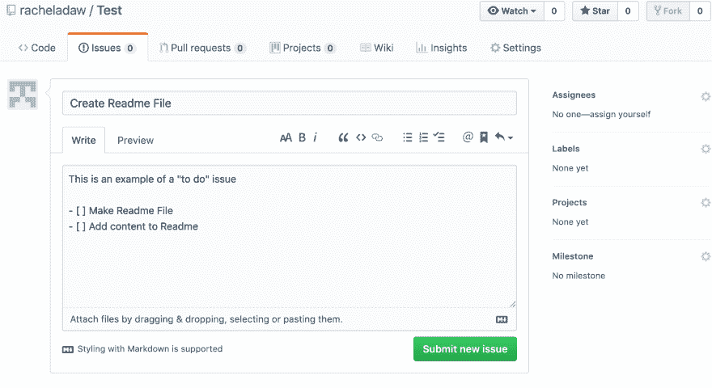
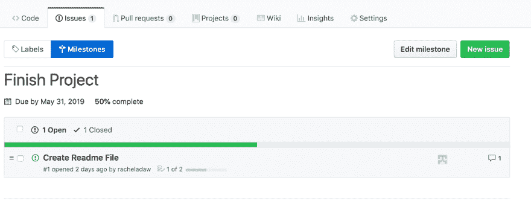

# 如何将 Github 问题用于项目

> 原文：<https://dev.to/racheladaw/how-to-use-github-issues-for-projects-452g>

# 什么是 Github 问题

最近，我的班级收到了一个讨论主题，解释了如何创建 Github 问题。虽然创建问题的过程相当简单，但我想知道这个工具有什么用处。事实证明，问题特性对于组织项目和跟踪进度非常有用。这个特性可以用作待办事项列表、跟踪 bug 的方法等等。我将深入探讨您的团队在您的下一个项目中使用该特性的几种方式。

## 将问题作为待办事项

使用此功能的一种方式是作为一种组织工具来分解您的项目需要完成的任务，无论是实现一项功能，还是修复应用程序中的一个 bug。此外，每个问题可以分配给某人，这将有助于您的团队更有效地工作。还可以给问题分配标签来帮助组织它们。一些常用的标签是 bug(用于报告项目中的一个 bug)和 enhancement(人们通常用它来表示一个新特性)。

Issues 支持 markdown，因此使用复选框或项目符号将特定任务分成更小的部分会很有用。当一个子任务完成时，它可以从列表中删除。当在您的问题中使用复选框时,“问题”选项卡的主页将显示一个指示器，指示该问题中有多少复选框被选中。

## 评论一个问题

为某个特定的问题写评论来和你的同伴讨论想法也是有用的。你的同事可以用几个不同的表情符号或通过回复来对评论做出反应。如果团队成员有一个他们希望得到反馈的想法，或者如果团队希望对几个不同的想法进行投票，这将非常有用。如果你在评论中提到一个带有@符号的 GitHub 用户，他们会收到一个通知。我认为当与团队成员合作并确保每个人的声音都被听到时，这个特性会非常有用。

## 里程碑

用户还可以在“问题”选项卡中创建里程碑，为某个功能设置截止日期并跟踪进度。可以将特定问题分配给一个里程碑，当它们结束时，里程碑指示器将会更新，显示您离最后期限还有多远。

## 关闭问题

当你对某个问题的代码或修复完成时，这个问题应该用一个注释来解释它为什么被关闭，以防其他开发人员以后引用它。如果您正在进行的“拉”请求或“提交”应该关闭一个问题，您可以在描述中写下“关闭”和问题编号。例如，“这关闭了#1。”当请求与您的默认分支合并时，问题将自动关闭。

**有用提示:**

如果你按“？”在 Github 上的任何地方，都会弹出一个快捷方式列表，有很多对问题有用的快捷方式。

关于问题，有几点需要注意:

据我所知，问题不能被删除。此外，问题关闭后，如果它被错误关闭，可以重新打开。

## 结论

在进一步研究这个主题后，我很高兴能在我的下一个项目中使用它。我认为 GitHub 的这个特性对于组织思路和确保你的团队的项目走上正轨非常有用。

引用:

*   我发现这段视频非常有助于解释 Issues 的基本用途
*   [封面图片](https://ssir.org/articles/entry/cutting_through_the_complexity_a_roadmap_for_effective_collaboration)