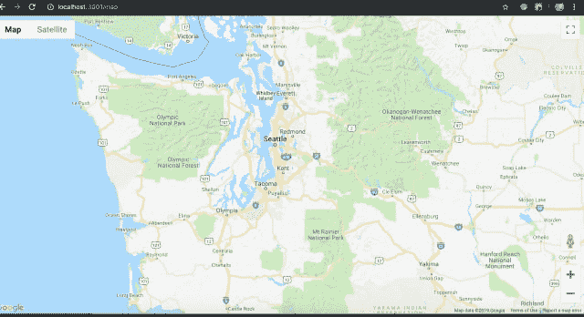
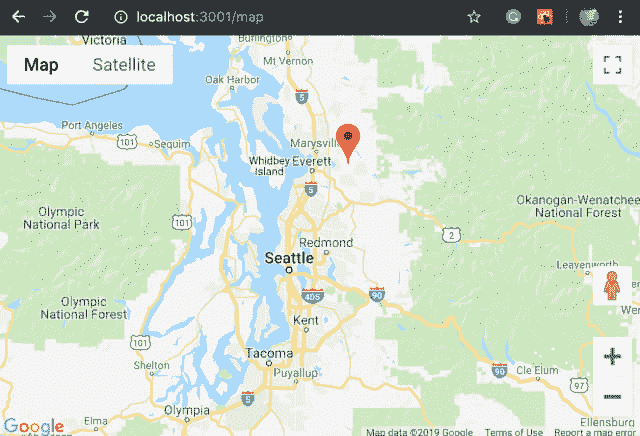
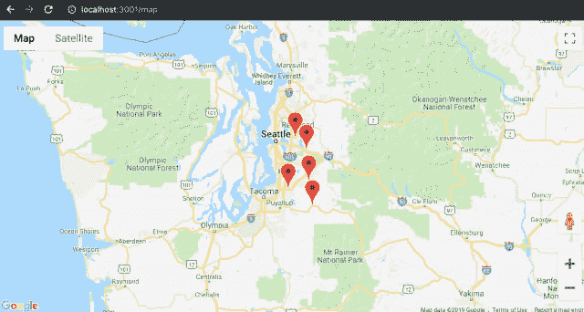

# React Google Maps 如何通过 React.js 使用 Google Maps API

> 原文：<https://dev.to/jessicabetts/how-to-use-google-maps-api-and-react-js-26c2>

[](https://i.giphy.com/media/3ohjV1r9VfQt0JLKzS/giphy.gif)

当我试图在一个个人 react.js 项目中实现 google maps API 时，我遇到了几个我觉得非常复杂和令人困惑的例子。这里有一个简单明了的例子来说明我是如何在应用程序中使用谷歌地图的。

## 首先，事情第一！

转到[谷歌地图 API](https://developers.google.com/maps/documentation/) 页面，注册并获得一个令牌使用！您必须输入信用卡号码才能接收令牌。然而，谷歌声称，除非你亲自升级服务，否则他们不会向你的账户收费。**自行处理**。

一旦你有了 API 密匙，你就可以开始构建你的应用了！

### 创建您的 react 应用程序

```
npm init react-app my-app 
```

Enter fullscreen mode Exit fullscreen mode

### 安装依赖项

```
npm install --save google-maps-react 
```

Enter fullscreen mode Exit fullscreen mode

这就是我们如何把谷歌地图作为一个组件！检查您的 package.json 文件，确保它已安装！

一旦你的初始设置完成，你就可以开始编码了！

## 1。导入谷歌-地图-反应！

```
import { Map, GoogleApiWrapper } from 'google-maps-react'; 
```

Enter fullscreen mode Exit fullscreen mode

## 2。将地图组件添加到您的渲染函数中！

```
render() {
    return (
        <Map
          google={this.props.google}
          zoom={8}
          style={mapStyles}
          initialCenter={{ lat: 47.444, lng: -122.176}}
        />
    );
  } 
```

Enter fullscreen mode Exit fullscreen mode

## 3。编辑您的导出默认语句

```
export default GoogleApiWrapper({
  apiKey: 'TOKEN HERE'
})(MapContainer); 
```

Enter fullscreen mode Exit fullscreen mode

请确保在此处插入您的 API 密钥！

## 4。添加样式

如果你愿意，你可以改变一些样式属性。在我的课之外，我把它作为一个常量变量。

```
const mapStyles = {
  width: '100%',
  height: '100%',
}; 
```

Enter fullscreen mode Exit fullscreen mode

## 5。启动您的服务器！

[](https://res.cloudinary.com/practicaldev/image/fetch/s--1fy4rNQR--/c_limit%2Cf_auto%2Cfl_progressive%2Cq_auto%2Cw_880/https://i.ibb.co/47ZsVrd/Screen-Shot-2019-04-24-at-10-14-55-PM.png)

太好了！你做到了！但是老实说，一张没有任何标记的地图有什么意义呢！所以还是补充一些吧！

## 6。记下来！

```
import { Map, GoogleApiWrapper, Marker } from 'google-maps-react'; 
```

Enter fullscreen mode Exit fullscreen mode

更新您的地图组件以包括标记组件！

```
render() {
    return (
        <Map
          google={this.props.google}
          zoom={8}
          style={mapStyles}
          initialCenter={{ lat: 47.444, lng: -122.176}}
        >
          <Marker position={{ lat: 48.00, lng: -122.00}} />
        </Map>
    );
  } 
```

Enter fullscreen mode Exit fullscreen mode

那你就有这个了！

[](https://res.cloudinary.com/practicaldev/image/fetch/s--1nt6RlXf--/c_limit%2Cf_auto%2Cfl_progressive%2Cq_auto%2Cw_880/https://i.ibb.co/RDWCvDg/Screen-Shot-2019-04-24-at-10-30-40-PM.png)

## 再加更！

除了添加一个标记之外，您还可以通过编程方式遍历状态来显示地点。在我的例子中，我展示了该地区的一些旧货店。您还可以向它们添加事件，如 onClick！

```
export class MapContainer extends Component {
  constructor(props) {
    super(props);

    this.state = {
      stores: [{lat: 47.49855629475769, lng: -122.14184416996333},
              {latitude: 47.359423, longitude: -122.021071},
              {latitude: 47.2052192687988, longitude: -121.988426208496},
              {latitude: 47.6307081, longitude: -122.1434325},
              {latitude: 47.3084488, longitude: -122.2140121},
              {latitude: 47.5524695, longitude: -122.0425407}]
    }
  }

  displayMarkers = () => {
    return this.state.stores.map((store, index) => {
      return <Marker key={index} id={index} position={{
       lat: store.latitude,
       lng: store.longitude
     }}
     onClick={() => console.log("You clicked me!")} />
    })
  }

  render() {
    return (
        <Map
          google={this.props.google}
          zoom={8}
          style={mapStyles}
          initialCenter={{ lat: 47.444, lng: -122.176}}
        >
          {this.displayMarkers()}
        </Map>
    );
  }
} 
```

Enter fullscreen mode Exit fullscreen mode

这就是所有的人！

[](https://res.cloudinary.com/practicaldev/image/fetch/s--L3hrSLTD--/c_limit%2Cf_auto%2Cfl_progressive%2Cq_auto%2Cw_880/https://i.ibb.co/BZL3qtb/Screen-Shot-2019-04-24-at-11-00-26-PM.png)

我希望这篇教程有助于构建你自己的应用程序！