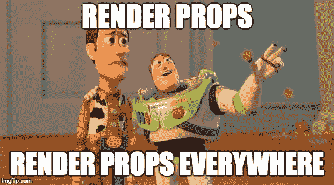
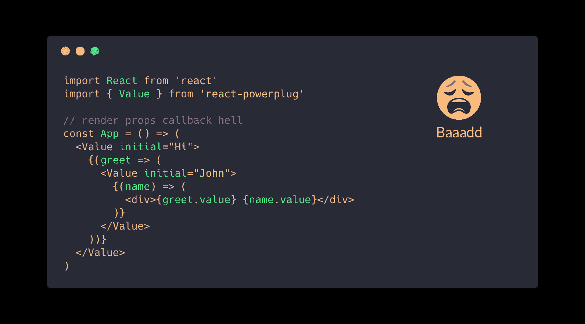

# 使用 React 上下文 API 没有嵌套渲染适当的疲劳。

> 原文：<https://dev.to/blnkspace/how-to-use-react-context-api-without-nested-render-prop-fatigue-14bm>

## 编辑:有了 React 钩子，你可以毫不费力地使用 useContext 来做这件事，这篇文章现在已经没有什么价值了，库也是如此。我发现自己根本不需要这个。

## 一点上下文(lol)

Redux 一直是我的家，将是我很多用例的家。这使得总是不得不独自管理大规模项目的开发人员的生活变得轻松。但是这里有无数的用例，你不需要 Redux 的魔力或功能。有时候你只需要中央状态，而不需要道具演练。去年，我参加了一些需要带回家的小项目的工作面试，我意识到当你不需要 Redux/MobX 等时，Context API 是多么强大。唯一的问题是，Redux 让我可以将所有东西放在一个地方，并优雅地从中选择我需要的东西。对于消费者，我陷入了渲染道具在渲染道具里面的情况...你明白了。如果你对函数式编程感兴趣，你脑海中的第一个想法是如果我能写这些就好了。让我们看一些有轻微问题的代码来理解这一点。

```
import React, { Fragment } from "react";
import { render } from "react-dom";
import { __, map, prop } from "ramda";

import Drawer from 'drawer-component-from-wherever';
import List from 'list-component-from-wherever';
import Title from 'title-component-from-wherever';

/*
    Note: the following is not the "right" way to initialise context values, you're
    supposed to use a Provider and pass a value prop to it. If the Consumer finds
    no matching parent Provider, only then it uses the arguments passed to
    createContext as the initial value. This is a hypothetical example,
    hence the shortcuts.
*/

const PoseContext = React.createContext('closed'); // is the drawer open or closed?
const CartContext = React.createContext([{
  ids: idsFromSomewhere,
  cartMap: objectFromSomewhereElse,
}]);

const App = () => (
  <PoseContext.Consumer>
    {pose => (
      <Drawer pose={pose}>
        Your Cart
        <CartContext.Consumer>
          {({ ids, cartMap }) => <List data={map(prop(__, cartMap), ids)} /> }
        </CartContext.Consumer>
      </Drawer>
    )}
  </PoseContext.Consumer> );

render(<App />, document.getElementById('appRoot')); 
```

嗯，现在看起来不太难看了。但是想象一下，如果不使用 ramda 并卸载到另一个组件，我们在 CartContext 的消费者中有这样的东西:

```
<CartContext.Consumer>
  {({ ids, cartMap }) => (
    <Fragment>
      {ids.map((id) => {
        const product = cartMap[id];
        return (
          <CartItem onClick={clickHandler} key={id}>
            <Link route={`/products/${product.slug}/p/${product.id}`}>
              <a>{product.name}</a>
            </Link>
          </CartItem>
        );
      })}
    </Fragment>
  )}
</CartContext.Consumer>; 
```

现在想象一下，但是使用另一个名为 CouponConsumer 的消费者来注入应用程序的优惠券相关状态。即使罪魁祸首是两个月前的我，我也会害怕看到 Cart.js。玩笑开够了，现在让我们忠于这篇文章的标题，并提出一个解决方案来制作整洁的代码。

## 采用 react-采用(好吧对不起没了)

### 化险为夷的微型图书馆。

## /[反应——采纳](https://github.com/pedronauck/react-adopt)

### 😎像专业人员一样编写渲染道具组件

<article class="markdown-body entry-content container-lg" itemprop="text">

<g-emoji class="g-emoji" alias="sunglasses" fallback-src="https://github.githubassets.cimg/icons/emoji/unicode/1f60e.png">😎</g-emoji> ***反应采用-*** 像专业人员一样撰写渲染道具组件

[](https://raw.githubusercontent.com/pedronauck/react-adopt/master/)[](https://travis-ci.org/pedronauck/react-adopt)[](https://www.codacy.com/app/pedronauck/react-adopt?utm_source=github.com&utm_medium=referral&utm_content=pedronauck/react-adopt&utm_campaign=Badge_Grade)

[](https://camo.githubusercontent.com/d8cf2e176f8f28a6474d00425ae188b2e904f81b/68747470733a2f2f692e696d67666c69702e636f6d2f3237657575322e6a7067)

## <g-emoji class="g-emoji" alias="scroll" fallback-src="https://github.githubassets.cimg/icons/emoji/unicode/1f4dc.png">📜</g-emoji>目录

*   [为什么](https://raw.githubusercontent.com/pedronauck/react-adopt/master/#--why)
*   [解决方案](https://raw.githubusercontent.com/pedronauck/react-adopt/master/#--solution)
*   [演示](https://raw.githubusercontent.com/pedronauck/react-adopt/master/#--demos)
*   [用途](https://raw.githubusercontent.com/pedronauck/react-adopt/master/#--usage-demo)
    *   [使用新的上下文 api](https://raw.githubusercontent.com/pedronauck/react-adopt/master/#working-with-new-context-api)
    *   [自定义渲染和从合成中检索道具](https://raw.githubusercontent.com/pedronauck/react-adopt/master/#custom-render-and-retrieving-props-from-composed)
    *   [来自映射器的映射属性](https://raw.githubusercontent.com/pedronauck/react-adopt/master/#mapping-props-from-mapper)
    *   [使用映射器上的组件](https://raw.githubusercontent.com/pedronauck/react-adopt/master/#using-components-on-mapper)
    *   [以多个参数开头](https://raw.githubusercontent.com/pedronauck/react-adopt/master/#leading-with-multiple-params)
    *   [支持打字稿](https://raw.githubusercontent.com/pedronauck/react-adopt/master/#typescript-support)
    *   [在线排版](https://raw.githubusercontent.com/pedronauck/react-adopt/master/#inline-composition)

## <g-emoji class="g-emoji" alias="monocle_face" fallback-src="https://github.githubassets.cimg/icons/emoji/unicode/1f9d0.png">🧐</g-emoji> 为什么

[渲染道具](https://reactjs.org/docs/render-props.html)是 React 生态系统的新炒作，这是事实。所以，当你需要一起使用多个渲染道具组件时，这可能会很无聊，生成一个叫做*【渲染道具回调地狱】*的东西，就像这样:

[](https://camo.githubusercontent.com/f4f4167721e1d5c75d26e98cfbf9b974d9fd5cb0/68747470733a2f2f692e696d6775722e636f6d2f716d6b33426b352e706e67)

## <g-emoji class="g-emoji" alias="bulb" fallback-src="https://github.githubassets.cimg/icons/emoji/unicode/1f4a1.png">💡</g-emoji>溶液

*   **小**。缩小了 0.7kb！
*   **极其简单**。只是一个方法！

React Adopt 是一个简单方法，它组合了多个渲染属性组件，合并了来自映射器的每个属性结果。

## <g-emoji class="g-emoji" alias="pager" fallback-src="https://github.githubassets.cimg/icons/emoji/unicode/1f4df.png">📟</g-emoji>演示

*   [基本示例](https://codesandbox.io/s/vq1wl37m0y?hidenavigation=1)
*   [使用 React Apollo 的 Todo 应用示例](https://codesandbox.io/s/3x7n8wyp15?hidenavigation=1)
*   [新上下文 API 示例](https://codesandbox.io/s/qv3m6yk2n4?hidenavigation=1)

## <g-emoji class="g-emoji" alias="computer" fallback-src="https://github.githubassets.cimg/icons/emoji/unicode/1f4bb.png">💻</g-emoji>用法

作为项目依赖项安装:

```
$ yarn add react-adopt
```

现在你可以使用…

</article>

[View on GitHub](https://github.com/pedronauck/react-adopt)

```
import { adopt } from 'react-adopt';

const CombinedContext = adopt({
  pose: <PoseContext.Consumer />,
  cart: <CartContext.Consumer />,
});

const App = () => (
  <CombinedContext>
    {({ pose, cart: { ids, cartMap } }) => (
      <Drawer pose={pose}>
        Your Cart
        <List data={map(prop(__, cartMap), ids)} />
      </Drawer>
    )}
  </CombinedContext> ); 
```

很整洁，不是吗？我们能够将两个渲染道具组件组合成一个组件，并且我们可以用三个或四个组件做同样的事情。虽然 Context Consumers 是一个很好的演示，但是我们可以将这个巧妙的技巧用于所有的渲染组件，使我们的代码更容易理解和组织。

我正努力养成每周写作的习惯，如果你想知道更多我在前端旅程中学到的小技巧，请跟随我。