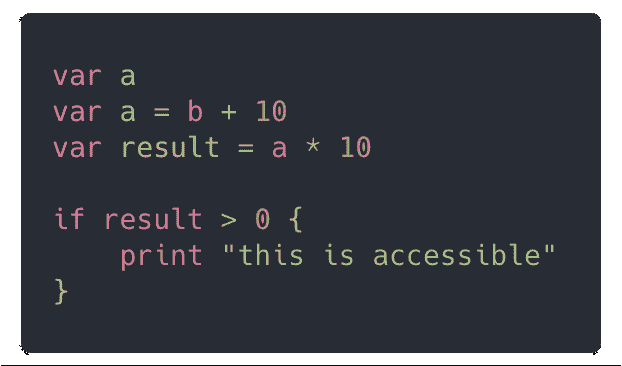

# 如何编写可访问的代码？

> 原文：<https://dev.to/carloslfu/how-to-write-accessible-code-31hg>

1.  以逻辑方式对代码块进行分组:

    *   将变量放在它们被使用的地方。
2.  使用短名称:

    *   将变量命名为“a”或“b”也可以。
    *   但是…我失去了上下文，对吗？…不要！如果你遵守规则 1，没有问题，你将减少代码的冗余和认知负荷。
3.  使用不言自明的名称:

    *   没有“mVal”、“tRows”等…
4.  有意使用新台词:

    *   就像你把一个文本分成段落一样，让你的代码中的新行传达一些信息。

如果你想扩展这个信息，我推荐这个视频，它基于围棋，但也适用于其他语言->
⚡️⚡️⚡️

[https://www.youtube.com/embed/cVaDY0ChvOQ](https://www.youtube.com/embed/cVaDY0ChvOQ)

你想知道更多关于这个话题和其他有趣的技术话题吗？

在推特上关注我:[https://twitter.com/carloslfu](https://twitter.com/carloslfu)

谢谢！和快乐学习。