# 我们如何使用 React 构建通用的“页眉和页脚”

> 原文：<https://dev.to/dzungnguyen179/how-we-built-the-header--footer-21gp>

# 概述

2016 年， [Chợ Tốt](https://www.chotot.com/) 为了业务拓展，使用 React & Redux 重建前端 web 应用。同样，我们还决定逐步将当前服务迁移到微服务架构，以扩大规模。为了提高我们的 web 应用程序的速度，我们将我们的业务分成小块，每一块都是一个应用程序。虽然这样做降低了业务的复杂性，但我们面临着一些挑战:

*   一致性:许多网络应用意味着需要做更多的工作来保持产品特性的一致性。
*   可重用性:许多网络应用意味着我们需要一种方法来组织和共享公共组件。

在我们的网站上，有一个特别的功能就是“页眉和页脚”。通常，“页眉和页脚”用于 Chợ Tốt 的所有产品，它包含潜在用户在购买或查询前经常访问的重要页面的链接。

本主题讨论了我们如何构建“页眉和页脚”的三个要点:

*   体系结构
*   半铸钢ˌ钢性铸铁(Cast Semi-Steel)
*   构建流程

在深入研究细节之前，让我们先来看看开发这个组件时要牢记的原则。

# 原则

**可用性**

我们牢记组件接口的“简单和高效”。它们还帮助开发人员轻松集成。

“简单可能比复杂更难:你必须努力让你的想法变得简单”——史蒂夫·乔布斯。

让我们看看两个组件代码的示例，如下所示:

[](https://res.cloudinary.com/practicaldev/image/fetch/s--50laslZI--/c_limit%2Cf_auto%2Cfl_progressive%2Cq_auto%2Cw_880/https://cdn-images-1.medium.com/max/800/1%2ALTsFGDAnw4FWFVgLefOvOQ.jpeg)

很容易看出，如果我们想使用左侧的组件，我们必须仔细阅读文档，了解每个道具的含义，如果没有文档怎么办？。开发人员经常深入研究代码，看看它是如何工作的，并做出假设。

另一方面，在右边，他们只需要关心 3 个道具，属性的名字是声明性的。因此，即使开发人员没有阅读文档，他们仍然理解它。

库就像是开发者的产品。如果它有一个好的 UX(多么容易使用)，其他开发者会很乐意使用它。

**可扩展性&可测试性**
随着业务的扩展，有大量的特性集成到“app-wrapper”中。我们遵循“单一责任原则”来设计代码库，使其易于扩展和测试。

**少依赖图书馆。**
使用许多库来开发是不必要的。我们使用的库越多，JS 文件就越大。它无意中降低了网页的加载速度。因为 Chợ Tốt 产品回复在 React & Redux 上，我们决定只保留那些库来开发“app-wrapper”。

# 一、建筑

[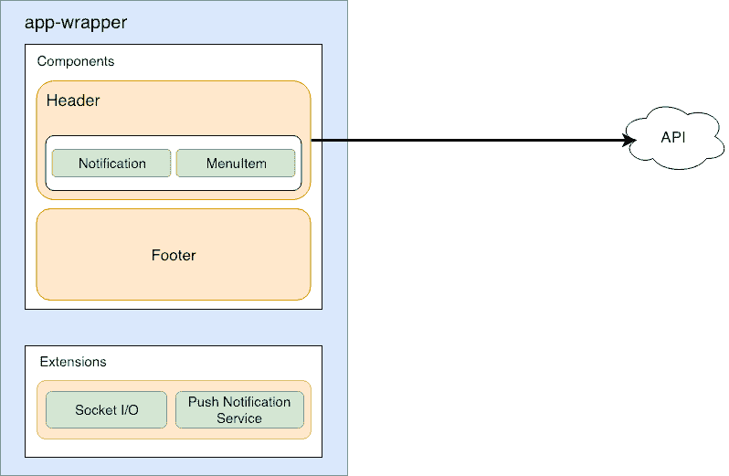](https://res.cloudinary.com/practicaldev/image/fetch/s--HmYD3Cs---/c_limit%2Cf_auto%2Cfl_progressive%2Cq_auto%2Cw_880/https://cdn-images-1.medium.com/max/800/1%2AVUbTm3nuTTeF6Ptjrma6Pw.png)

app-wrapper 分为两个区域

*   成分
*   延长

## 1.1。什么是组件区？

组件区域包含需要呈现页眉和页脚的 web 组件，例如:

[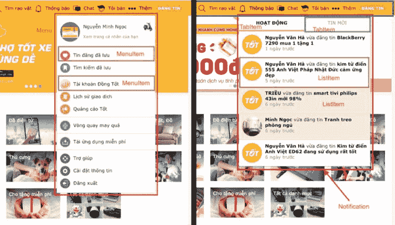](https://res.cloudinary.com/practicaldev/image/fetch/s--Xo6Pj005--/c_limit%2Cf_auto%2Cfl_progressive%2Cq_auto%2Cw_880/https://cdn-images-1.medium.com/max/800/1%2A1WmIeGbKrdkAnuhn7hDT5w.jpeg)

### 1.1a .问题

微服务架构有利于减少正在构建的特定功能的复杂性和不必要的代码。然而，由于每隔 1-2 个月就会不断发布许多新功能，并且每个新功能都有自己的“入口点”,因此当我们发布新功能时，我们需要将“入口点”添加到“应用包装器”中，并发布新版本。然后我们去每个项目升级“app-wrapper ”,以便有一个到这个特性的入口点链接。

此外，我们有许多 web 应用程序，我们必须确保它们都有最新版本的 app-wrapper。如果我们错过了一个会怎么样？这可能会影响用户体验。

### 1.1b .溶液

由于这些原因，我们决定开发一个 API 来管理入口点,“app-wrapper”请求从服务器获取一个菜单项列表并呈现。

[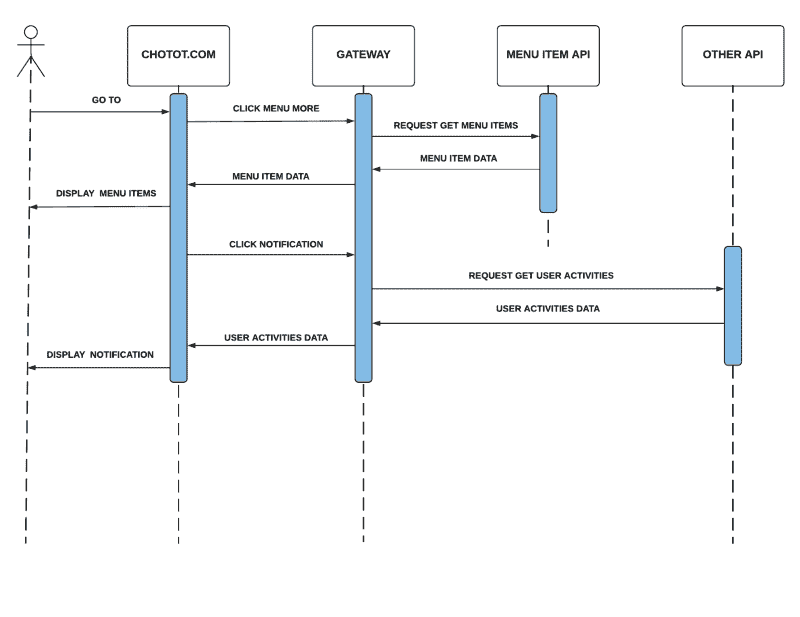](https://res.cloudinary.com/practicaldev/image/fetch/s--i2ycj3zS--/c_limit%2Cf_auto%2Cfl_progressive%2Cq_auto%2Cw_880/https://cdn-images-1.medium.com/max/800/1%2A53pphwKU8u8l67GYLyjvmA.png)

通过这样做，当我们有一个新的入口点时，我们只更新 API 端点的入口点，并且只更新一次。

## 1.2。什么是延伸区？

“app-wrapper”具有一些社交功能，如**“接收聊天通知”、“显示通知”**。这些功能需要大量逻辑和大型库，如 Socket I/O。如果我们将所有代码放在“应用包装器”中，我们将处理以下内容:

*   代码库将会非常庞大。
*   它伤害了“单一责任原则”。因为“应用包装器”负责显示页眉和页脚。它不需要管其他的事。
*   它不必要地变得更加复杂。

### 1.2a .溶液

我们开发了一个叫做“扩展”的区域，允许异步加载第三方服务。

[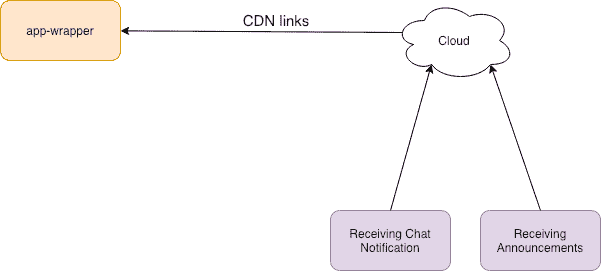](https://res.cloudinary.com/practicaldev/image/fetch/s--FaddMF-U--/c_limit%2Cf_auto%2Cfl_progressive%2Cq_auto%2Cw_880/https://cdn-images-1.medium.com/max/800/1%2A5oWaI9WxTiDIxHkXoLk8bQ.png)

*例如:*
*我们得到了服务“接收聊天通知”&“接收公告”的 CDN 链接(每个服务是一个特定的项目，输出是一个 CDN 链接)。然后，我们只需要注册到“扩展”区域的链接，让扩展做剩下的事情。*

通过这样做，我们获得了一些好处:

*   将第三方服务的所有逻辑委托给 CDN 链接有助于分离逻辑。
*   减小主 JS 文件的大小。
*   简化代码库，有助于其他工程师轻松改进。

# 二世。半铸钢ˌ钢性铸铁(Cast Semi-Steel)

“app-wrapper”包含样式本身。选择一种管理 CSS 的方法是最困难的问题之一。有两种方法:

**CSS-in-JS**
JS 将 CSS 导出到一个 JS 模块。这意味着我们可以将 CSS 直接导入 JS 代码。

[](https://res.cloudinary.com/practicaldev/image/fetch/s--qhe9R1H9--/c_limit%2Cf_auto%2Cfl_progressive%2Cq_auto%2Cw_880/https://cdn-images-1.medium.com/max/800/1%2AZUc3qz2HMYOjiyKafq2mWQ.png)

**CSS 文件**

这是最原始的方法。所有 CSS 都捆绑到 CSS 文件(style.css)中。

[](https://res.cloudinary.com/practicaldev/image/fetch/s--fwq7SAXl--/c_limit%2Cf_auto%2Cfl_progressive%2Cq_auto%2Cw_880/https://cdn-images-1.medium.com/max/800/1%2AY0Cb4386nPbRNY_grcN4jA.png)

## 2.1。方法

因为 Chợ Tốt 的所有产品都使用 JS 来开发，而“应用包装器”是一个库，它只需要为开发者提供较少的配置来集成到主应用中。出于这个原因，我们决定选择“CSS-in-JS”方法来管理“app-wrapper”的样式。

有一些库帮助应用“CSS-in-JS”方法，例如“样式组件”、“JSS”……然而，我们有不同的团队，每个团队都有自己的风格。有的用“CSS-in-JS”，有的用“CSS 文件”开发 web apps。所以问题是“有没有什么方法可以适用于所有情况？”。我们提出了一个解决方案，不使用 CSS-in-JS 框架，而是选择 ES6 的“[模板字符串](https://developer.mozilla.org/en-US/docs/Web/JavaScript/Reference/Template_literals)”特性来开发 CSS。

[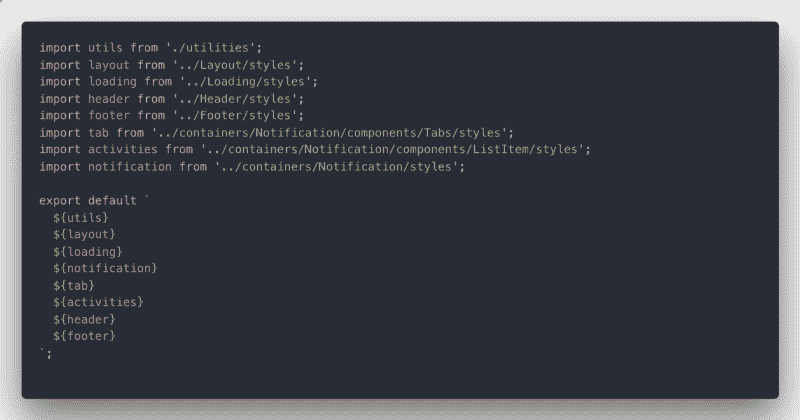](https://res.cloudinary.com/practicaldev/image/fetch/s--TyK_6F8t--/c_limit%2Cf_auto%2Cfl_progressive%2Cq_auto%2Cw_880/https://cdn-images-1.medium.com/max/800/1%2ALlc4V2XeNc5AjqwGw6TZCQ.png)

使用这种方法后。一切都很好。然而，我们在生产环境中遇到了两个大问题。

## 2.2。问题

*   CSS 没有缩小。
*   CSS 不包含旧浏览器的前缀。

[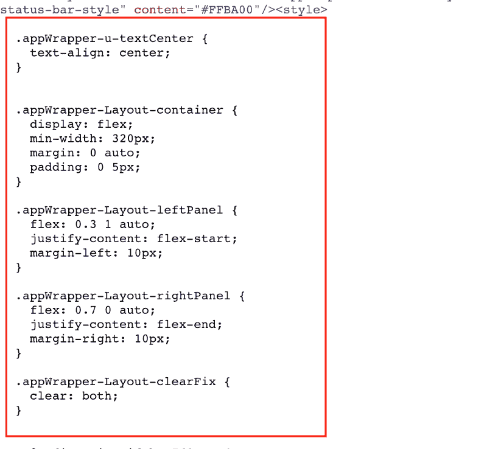](https://res.cloudinary.com/practicaldev/image/fetch/s--1p4p3wg3--/c_limit%2Cf_auto%2Cfl_progressive%2Cq_auto%2Cw_880/https://cdn-images-1.medium.com/max/800/1%2At_GpRa50Mkef_ZE0zfpSKw.png)

## 2.3。解决办法

在运行 build 命令将 ES6 编译成 ES5 之后，我们运行另一个脚本来添加前缀并缩小 CSS。

我们选择了 [Gulp](https://gulpjs.com/) 来定制构建过程，通过添加两个任务的后构建阶段:

*   使变小
*   自动修复

例如:
[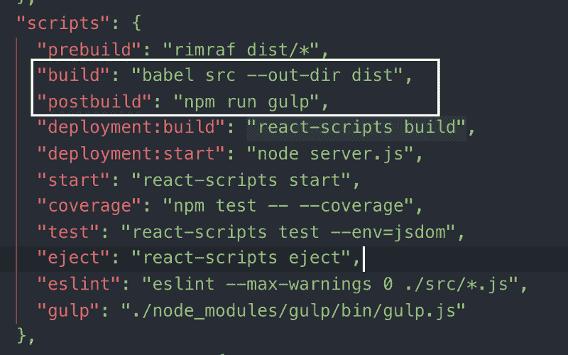](https://res.cloudinary.com/practicaldev/image/fetch/s--YUCroqsN--/c_limit%2Cf_auto%2Cfl_progressive%2Cq_auto%2Cw_880/https://cdn-images-1.medium.com/max/800/1%2A4tHxkCFEuC4A7lfUJrVsIg.png)

这意味着在我们成功运行构建命令之后

```
npm run build 
```

Enter fullscreen mode Exit fullscreen mode

自动执行后期生成命令。下面是应用这种方法的结果。

[](https://res.cloudinary.com/practicaldev/image/fetch/s---qgUOJq3--/c_limit%2Cf_auto%2Cfl_progressive%2Cq_auto%2Cw_880/https://cdn-images-1.medium.com/max/800/1%2AcSgmGi2dfka1GWt3OP8-sg.png)

# 三世。构建流程

构建过程是我们通过使用 [Babel CLI](https://babeljs.io/docs/en/babel-cli) 将 JS 代码从 ES6 转换到 ES5 的方式。

[](https://res.cloudinary.com/practicaldev/image/fetch/s--LlhpMQQ6--/c_limit%2Cf_auto%2Cfl_progressive%2Cq_auto%2Cw_880/https://cdn-images-1.medium.com/max/800/1%2A-YZ5xxq8lzP-Yb9GMMEZTw.png)

构建过程有两个阶段。

*   阶段 1(构建):它使用 babel CLI 将 ES6 代码编译成 ES5 代码。
*   阶段 2(后期构建):它运行 gulp 任务来缩小和添加前缀到来自阶段 1 的构建目录的 CSS 字符串。

在我们完成构建过程后，我们对包进行版本控制并发布到私有 npm 注册表。所有的项目只需要安装一个新版本的软件包和享受。

# 用法

我们刚刚描述了“我们如何建立页眉和页脚”的细节。现在让我们快速看一下 app-wrapper 组件的用法。

[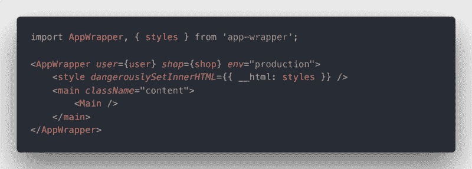](https://res.cloudinary.com/practicaldev/image/fetch/s--eFIR14Rr--/c_limit%2Cf_auto%2Cfl_progressive%2Cq_auto%2Cw_880/https://cdn-images-1.medium.com/max/800/1%2A2JZ2Vn8N7fFFet0jU8O-EQ.png)

使用 next.js

[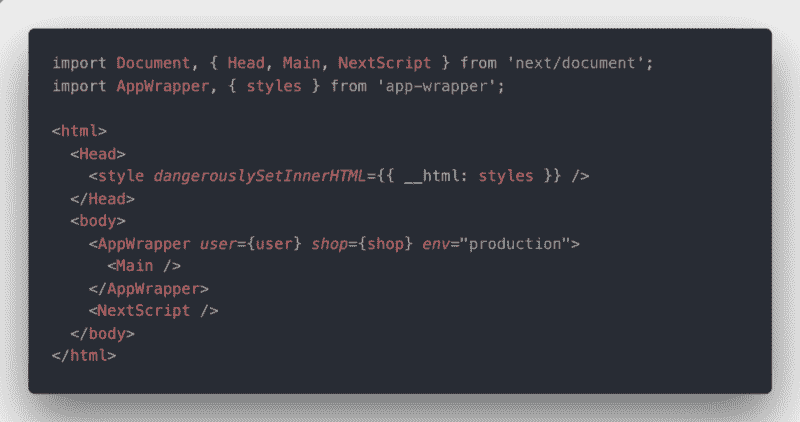](https://res.cloudinary.com/practicaldev/image/fetch/s--B1Tp-NJJ--/c_limit%2Cf_auto%2Cfl_progressive%2Cq_auto%2Cw_880/https://cdn-images-1.medium.com/max/800/1%2AJNM2ABOo_ijL-hEbimPyPw.png)

**手机演示**

[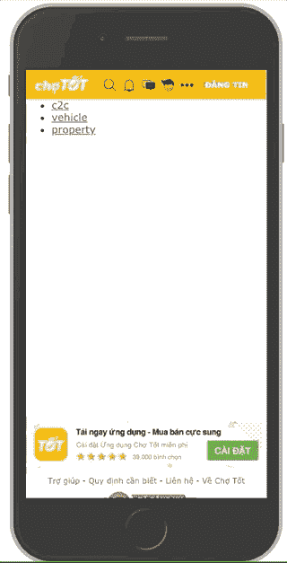](https://res.cloudinary.com/practicaldev/image/fetch/s--eczkq6U8--/c_limit%2Cf_auto%2Cfl_progressive%2Cq_66%2Cw_880/https://cdn-images-1.medium.com/max/800/1%2A8-2AtJ9DlqcOWS8spaBEhg.gif)

**桌面演示**

[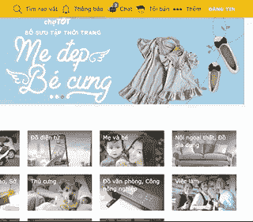](https://res.cloudinary.com/practicaldev/image/fetch/s--C0Mp0Bvm--/c_limit%2Cf_auto%2Cfl_progressive%2Cq_66%2Cw_880/https://cdn-images-1.medium.com/max/800/1%2AFiCyg4tz6K3gjenLHnY02Q.gif)

# 结论

目前，所有 Chợ Tốt's 产品都使用 app-wrapper 组件。

*   [https://www.chotot.com/](https://www.chotot.com/)
*   [https://xe.chotot.com/](https://xe.chotot.com/)
*   [https://nha.chotot.com/](https://nha.chotot.com/)

还有更多…

我们解决了帖子开头提到的两个问题:**“一致性&可重用性】**。

除此之外，我们可以将“app-wrapper”带到下一个层次，成为一个公共库。

*   应用上下文 API，允许根据业务轻松更改主题，如颜色、图标、徽标等。
*   集成 CI/CD 用于测试、部署等
*   考虑集成强类型系统，如[流程类型](https://flow.org/)、[类型脚本](https://www.typescriptlang.org/)