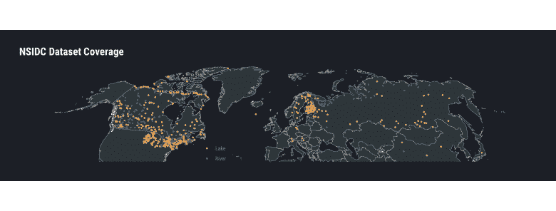
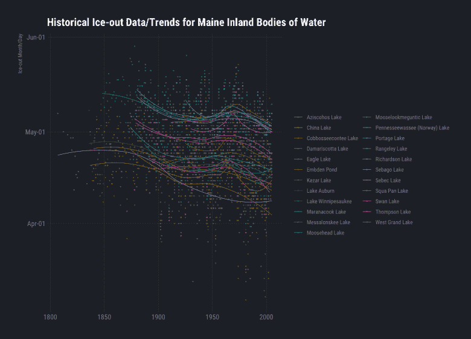
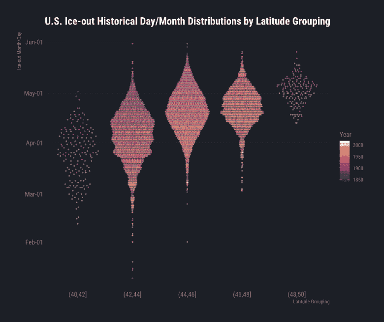
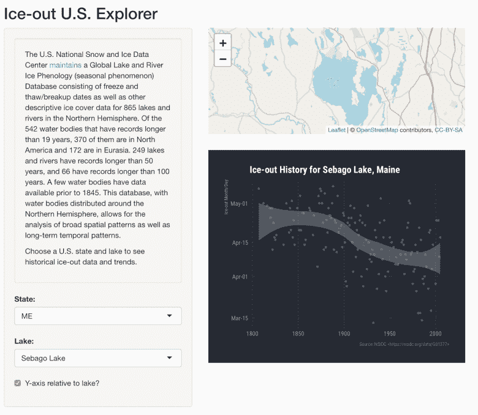

# hrbr CRAN 上的主题 0 . 6 . 0+其他开发中的套装新闻

> 原文：<https://dev.to/hrbrmstr/hrbrthemes-060-on-cran--other-in-development-package-news-3ahg>

[`hrbrthemes`](https://git.sr.ht/~hrbrmstr/hrbrthemes) 包的 0.6.0 版本应该很快就能打到你身边的克兰镜了。除了一些一般的文档和代码清理，这个版本还包括人们在过去几个月的博客帖子和推文中看到的黑暗主题。它之所以被称为`theme_ft_rc()`，是因为它是向《金融时报》的 [@ft_data](http://twitter.com/ft_data) 团队开发的美妙的新图表主题致敬(你可以从他们的作品[这里](https://twitter.com/ftdata?lang=en)看到例子)。

虽然没有什么可以阻止人们使用 GitHub 版本，但 CRAN 版本使它变得更加普及。对于一些人来说，字体仍然有一些间歇性的问题，我会在下一个版本中解决这些问题。

既然你已经看到了这些图表的很多例子，我就不仅仅用这个主题做一个免费的例子了。然而，我*将*基于一个被称为 [`iceout`](https://github.com/hrbrmstr/iceout) 的新数据包制作一些图表。这个`iceout`包最初是由海洋科学[毕格罗实验室](https://www.bigelow.org/)的本·塔珀构思的。我关注着其他更重要的储存库，我没有意识到(但应该知道)研究人员会跟踪内陆水体何时冻结和解冻。包装名称源自用于解冻测量的术语(“融冰”或“融冰”)。

在沉迷于这些数据并使软件包达到当前状态之前，最初的代码库是根据美国地质勘探局的新英格兰湖冰数据数据集开发的，该数据集只关注新英格兰，并且只持续到 2005 年。一些挖掘发现

*   缅因州农业和林业部自 2003 年以来一直保持着网上记录；而且，
*   明尼苏达州自然资源部维护着一个可追溯到 19 世纪的综合数据库。

*但是*我发现了美国国家雪&冰数据中心的[全球湖泊和河流冰物候](http://nsidc.org/data/lake_river_ice/)数据集，它:

…包含 865 个湖泊和河流的冻结和破裂日期以及其他冰盖描述数据。在有超过 19 年记录的 542 个水体中，370 个在北美，172 个在欧亚大陆；249 个记录超过 50 年；超过 100 年的有 66 个。少数有 1845 年之前的数据。这些数据来自分布在北半球的水体，允许分析广泛的空间模式以及长期的时间模式。

因此，我将原始包转换为一个数据包，其中包含所有四个数据集，外加一些用于提取“实时”数据的交互函数和一组用于重新生成数据库的“构建器”。让我们快速浏览一下 NSIDC 的数据和全球覆盖区域:

```
library(iceout) # github/hrbrmstr/iceout
library(hrbrthemes) 
library(ggplot2)
library(dplyr)

data("nsidc_iceout")

glimpse(nsidc_iceout)
## Observations: 35,918
## Variables: 37
## $ lakecode <chr> "ARAI1", "ARAI1", "ARAI1", "ARAI1", "ARAI1", "ARAI1", "ARAI1…
## $ lakename <chr> "Lake Suwa", "Lake Suwa", "Lake Suwa", "Lake Suwa", "Lake Su…
## $ lakeorriver <chr> "L", "L", "L", "L", "L", "L", "L", "L", "L", "L", "L", "L", …
## $ season <chr> "1443-44", "1444-45", "1445-46", "1446-47", "1447-48", "1448…
## $ iceon_year <dbl> 1443, 1444, 1445, 1446, 1447, 1448, 1449, 1450, 1451, 1452, …
## $ iceon_month <dbl> 12, 11, 12, 12, 11, 12, 12, 12, 12, 11, 12, 12, 12, 12, 12, …
## $ iceon_day <dbl> 8, 23, 1, 2, 30, 8, 13, 8, 23, 28, 3, 5, 1, 5, 6, 20, 10, 15…
## $ iceoff_year <dbl> NA, NA, NA, NA, NA, NA, NA, NA, NA, NA, NA, NA, NA, NA, NA, …
## $ iceoff_month <dbl> NA, NA, NA, NA, NA, NA, NA, NA, NA, NA, NA, NA, NA, NA, NA, …
## $ iceoff_day <dbl> NA, NA, NA, NA, NA, NA, NA, NA, NA, NA, NA, NA, NA, NA, NA, …
## $ duration <dbl> NA, NA, NA, NA, NA, NA, NA, NA, NA, NA, NA, NA, NA, NA, NA, …
## $ latitude <dbl> 36.15, 36.15, 36.15, 36.15, 36.15, 36.15, 36.15, 36.15, 36.1…
## $ longitude <dbl> 138.08, 138.08, 138.08, 138.08, 138.08, 138.08, 138.08, 138.…
## $ country <chr> "Japan", "Japan", "Japan", "Japan", "Japan", "Japan", "Japan…
## $ froze <lgl> TRUE, TRUE, TRUE, TRUE, TRUE, TRUE, TRUE, TRUE, TRUE, TRUE, …
## $ obs_comments <chr> "calendar correction for ice_on: -30 days of original data; …
## $ area_drained <dbl> 531, 531, 531, 531, 531, 531, 531, 531, 531, 531, 531, 531, …
## $ bow_comments <chr> NA, NA, NA, NA, NA, NA, NA, NA, NA, NA, NA, NA, NA, NA, NA, …
## $ conductivity_us <dbl> NA, NA, NA, NA, NA, NA, NA, NA, NA, NA, NA, NA, NA, NA, NA, …
## $ elevation <dbl> 759, 759, 759, 759, 759, 759, 759, 759, 759, 759, 759, 759, …
## $ filename <chr> "ARAI", "ARAI", "ARAI", "ARAI", "ARAI", "ARAI", "ARAI", "ARA…
## $ initials <chr> "ARAI", "ARAI", "ARAI", "ARAI", "ARAI", "ARAI", "ARAI", "ARA…
## $ inlet_streams <chr> "-", "-", "-", "-", "-", "-", "-", "-", "-", "-", "-", "-", …
## $ landuse_code <chr> "UAFO", "UAFO", "UAFO", "UAFO", "UAFO", "UAFO", "UAFO", "UAF…
## $ largest_city_population <dbl> 52000, 52000, 52000, 52000, 52000, 52000, 52000, 52000, 5200…
## $ max_depth <dbl> 7.6, 7.6, 7.6, 7.6, 7.6, 7.6, 7.6, 7.6, 7.6, 7.6, 7.6, 7.6, …
## $ mean_depth <dbl> 4.7, 4.7, 4.7, 4.7, 4.7, 4.7, 4.7, 4.7, 4.7, 4.7, 4.7, 4.7, …
## $ median_depth <dbl> NA, NA, NA, NA, NA, NA, NA, NA, NA, NA, NA, NA, NA, NA, NA, …
## $ power_plant_discharge <lgl> NA, NA, NA, NA, NA, NA, NA, NA, NA, NA, NA, NA, NA, NA, NA, …
## $ secchi_depth <dbl> NA, NA, NA, NA, NA, NA, NA, NA, NA, NA, NA, NA, NA, NA, NA, …
## $ shoreline <dbl> 18, 18, 18, 18, 18, 18, 18, 18, 18, 18, 18, 18, 18, 18, 18, …
## $ surface_area <dbl> 12.9, 12.9, 12.9, 12.9, 12.9, 12.9, 12.9, 12.9, 12.9, 12.9, …
## $ state <chr> "Nagano Prefecture", "Nagano Prefecture", "Nagano Prefecture…
## $ iceon_date <date> 1443-12-08, 1444-11-23, 1445-12-01, 1446-12-02, 1447-11-30,…
## $ iceon_doy <dbl> 342, 328, 335, 336, 334, 343, 347, 342, 357, 333, 337, 339, …
## $ iceout_date <date> NA, NA, NA, NA, NA, NA, NA, NA, NA, NA, NA, NA, NA, NA, NA,…
## $ iceout_doy <dbl> NA, NA, NA, NA, NA, NA, NA, NA, NA, NA, NA, NA, NA, NA, NA, …

maps::map("world", ".", exact = FALSE, plot = FALSE, fill = TRUE) %>%
  fortify() -> wrld

ggplot() + 
  ggalt::geom_cartogram(
    data = wrld, map = wrld, aes(long, lat, map_id=region), 
    fill="#3B454A", color = "white", size = 0.125
  ) +
  geom_point(
    data = distinct(nsidc_iceout, lakeorriver, longitude, latitude),
    aes(longitude, latitude, fill = lakeorriver), 
    size = 1.5, color = "#2b2b2b", stroke = 0.125, shape = 21
  ) +
  scale_fill_manual(
    name = NULL, values = c("L"="#fdbf6f", "R"="#1f78b4"), labels=c("L" = "Lake", "R" = "River")
  ) +
  ggalt::coord_proj("+proj=wintri", ylim = range(nsidc_iceout$latitude, na.rm = TRUE)) +
  labs(title = "NSIDC Dataset Coverage") +
  theme_ft_rc(grid="") +
  theme(legend.position = c(0.375, 0.1)) +
  theme(axis.text = element_blank(), axis.title = element_blank()) 
```

Enter fullscreen mode Exit fullscreen mode

[](https://rud.is/b/2019/01/21/hrbrthemes-0-6-0-on-cran-other-in-development-package-news/nc-idc-coverage/)

W00t！大量的数据(尽管不是所有的额外特征都包含在所有的读数/区域中)！

我认为冰雪消融的数据让我着迷的原因是，它可以被用作另一个指标，表明我们确实正处于气候变化之中。让我们来看看缅因州内陆水体的历史结冰信息:

```
filter(nsidc_iceout, country == "United States", state == "ME") %>% 
  mutate(iceout_date = as.Date(format(iceout_date, "2020-%m-%d"))) %>% # we want the Y axis formatted as month-day so we choose a leap year to ensure we get leap dates (if any)
  ggplot(aes(iceoff_year, iceout_date)) +
  geom_point(aes(color = lakename), size = 0.5, alpha=1/4) +
  geom_smooth(aes(color = lakename), se=FALSE, method = "loess", size=0.25) +
  scale_y_date(date_labels = "%b-%d") +
  labs(
    x = NULL, y = "Ice-out Month/Day", color = NULL,
    title = "Historical Ice-out Data/Trends for Maine Inland Bodies of Water"
  ) +
  theme_ft_rc(grid="XY") 
```

Enter fullscreen mode Exit fullscreen mode

[](https://rud.is/b/2019/01/21/hrbrthemes-0-6-0-on-cran-other-in-development-package-news/me-inland/)

您可以按照该代码模式查看其他状态。按纬度分组查看冰封日期分布也很有趣:

```
filter(nsidc_iceout, !is.na(latitude) & !is.na(longitude) & !is.na(iceout_date)) %>% 
  filter(country == "United States") %>% 
  mutate(iceout_date = as.Date(format(iceout_date, "2020-%m-%d"))) %>% 
  mutate(lat_grp = cut(latitude, scales::pretty_breaks(5)(latitude), ordered_result = TRUE)) %>% 
  arrange(desc(iceoff_year)) %>% 
  ggplot() +
  ggbeeswarm::geom_quasirandom(
    aes(lat_grp, iceout_date, fill = iceoff_year), groupOnX = TRUE, 
    shape = 21, size =1, color = "white", stroke = 0.125, alpha=1/2
  ) +
  scale_y_date(date_labels = "%b-%d") +
  viridis::scale_fill_viridis(name = "Year", option = "magma") +
  labs(
    x = "Latitude Grouping", y = "Ice-out Month/Day",
    title = "U.S. Ice-out Historical Day/Month Distributions by Latitude Grouping"
  ) +
  theme_ft_rc(grid="Y") 
```

Enter fullscreen mode Exit fullscreen mode

[](https://rud.is/b/2019/01/21/hrbrthemes-0-6-0-on-cran-other-in-development-package-news/lat-grp/)

如果你想关注单个的湖泊，有一个闪亮的应用程序可以做到这一点(反正美国也有一个)。

加载包后，只需在 R 控制台输入`explore_us()`,您将会看到如下内容:

[](https://rud.is/b/2019/01/21/hrbrthemes-0-6-0-on-cran-other-in-development-package-news/explore-us-shiny-02/)

传单视图将缩放至每个选定的新湖，图表也将更新。

### 其他包新闻

[`sergeant`](https://git.sr.ht/~hrbrmstr/sergeant) 包正在 0.8.0 分支中达到一个稳定点(主要是由于大卫·塞弗斯基不知疲倦地帮助寻找 bugs)，应该很快就会到达 CRAN。如果你想解决问题，就把你的问题或公关放进去。

我已经*最终*更新了 [`pdfboxjars`](https://git.sr.ht/~hrbrmstr/pdfboxjars) 中的 Java 库依赖，所以 [`pdfbox`](https://git.sr.ht/~hrbrmstr/pdfbox) 不会再让 GitHub 告诉你或者我它是不安全的。

有一个名为 [`reapr`](https://git.sr.ht/~hrbrmstr/reapr) 的新包，瞄准了`curl` + `httr` + `rvest`的某个路口。从根本上说，它在抓取数据时提供了一些编码器提升。自述文件中有一些例子，但这里是你对这个博客的索引页面的初步了解:

```
reapr::reap_url("http://rud.is/b")
## Title: rud.is | "In God we trust. All others must bring data"
## Original URL: http://rud.is/b
## Final URL: https://rud.is/b/
## Crawl-Date: 2019-01-17 19:51:09
## Status: 200
## Content-Type: text/html; charset=UTF-8
## Size: 50 kB
## IP Address: 104.236.112.222
## Tags: body[1], center[1], form[1], h2[1], head[1], hgroup[1], html[1],
## label[1], noscript[1], section[1], title[1],
## aside[2], nav[2], ul[2], style[5], img[6],
## input[6], article[8], time[8], footer[9], h1[9],
## header[9], p[10], li[19], meta[20], div[31],
## script[40], span[49], link[53], a[94]
## # Comments: 17
## Total Request Time: 2.093s 
```

Enter fullscreen mode Exit fullscreen mode

`reap_url()`功能:

*   使用`httr::GET()`建立 web 连接并检索内容，这使它的行为更像一个实际的(不支持 javascript 的)浏览器。您可以将任何`httr::GET()`可以处理的事情传递给`...`(例如`httr::user_agent()`)，以便对交互进行尽可能多的粒度控制。
*   返回更丰富的数据集。获得`httr::response`对象后，执行许多任务，包括:
    *   URL 爬网的时间戳
    *   提取请求的 URL 和最终 URL(在重定向的情况下)
    *   提取目标服务器的 IP 地址
    *   提取明文和解析的(`xml_document` ) HTML
    *   提取明文网页``(如果有)
    *   在文档中生成一个动态列表标签，可以直接提供给 HTML/XML 搜索/检索功能(可以加快节点发现)
    *   提取 HTML 文档中所有注释的文本
    *   在返回的对象中包含完整的`httr::response`对象
    *   提取完成请求所用的时间

我仍然在与 API 搏斗，所以一定要提出问题和建议(无论你在哪里进行社交编码都是最舒服的)。

说到 IP 地址(上面的第 3 点)，我终于有时间研究了一下 [`gdns`](https://getdnsapi.net/) C 库(一个现代 DNS API 库)，创建了 [`clandnstine`](https://git.sr.ht/~hrbrmstr/clandnstine) 包。包名 jeu de mots 是由于这样一个事实，即目的是让它单独支持 TLS 请求上的 [DNS，因为常规 DNS 是明文，使 ISP 能够监视/注入，并且通常充满危险。支持所有形式的 DNS 查找。问题是，您必须将它指向支持 TLS 的 DNS 解析器。软件包默认为 quad 9(9.9.9.9 ),因为比起谷歌或 Cloudflare，我更信任它们(顺便说一句，这并不是说我比他们三个更信任二手车销售员)。在接下来的几周里，请密切关注](https://en.wikipedia.org/wiki/DNS_over_TLS) [$WORK blog](https://blog.rapid7.com/) ，因为我将有一些关于 TLS 端点上的数百个 DNS 的分析和数据，你可以使用这些数据，这要感谢我的同事 Jon Hart 和 Shan Skidar 开发的一项新研究。

还有一个玩具包 [`forecequotes`](https://git.sr.ht/~hrbrmstr/forcequotes) 比什么都“玩得开心`cli` & `crayon`包”。但如果你喜欢星球大战，随机引用 API，并希望在你的工作中集成更丰富的命令行界面输出，那么绝对可以一睹为快。

最后，我已经有一段时间没用 R 的 direct C 接口了(因为 Rcpp 很容易上瘾，也很方便)，想让那些技能保持新鲜感，所以我给一个老的(互联网年代的) [IP 地址 trie C 库](https://github.com/zmap/iptree)做了一个[包装器](https://git.sr.ht/~hrbrmstr/iptrie)。底层库比我们在`iptools`中使用的要慢得多，但它能工作，比它的`iptoos`对应物做得多一点，并且涵盖了数据编组、外部指针处理和属性/类设置，所以它可能是使用 RC bridge 的一个不错的参考包。

### 鳍

如果你知道更多/更好的 ice-out 数据，请在 Bigelow Labs 的`iceout` repo 中提出问题，我会将它整合。而且，如果你做了自己的冰雪探险，一定要写博客，告诉《R 周刊》,并在评论中留言。

以下是按社交编码平台分组的所有提及的包的链接(因此，您可以在任何您觉得最舒适的地方进行互动/协作):

**sr.ht**

*   [hrbr 主题](https://git.sr.ht/~hrbrmstr/hrbrthemes)
*   [中士](https://git.sr.ht/~hrbrmstr/sergeant)
*   [pdf box jar](https://git.sr.ht/~hrbrmstr/pdfboxjars)
*   [pdfbox](https://git.sr.ht/~hrbrmstr/pdfbox)
*   [收割者](https://git.sr.ht/~hrbrmstr/reapr)
*   强制定额
*   [iptrie](https://git.sr.ht/~hrbrmstr/iptrie)

**GitLab**

*   [hrbr 主题](https://gitlab.com/hrbrmstr/hrbrthemes)
*   [中士](https://gitlab.com/hrbrmstr/sergeant)
*   [pdf box jar](https://gitlab.com/hrbrmstr/pdfboxjars)
*   [pdfbox](https://gitlab.com/hrbrmstr/pdfbox)
*   [收割者](https://gitlab.com/hrbrmstr/reapr)
*   强制定额
*   [iptrie](https://gitlab.com/hrbrmstr/iptrie)

**GitHub**

*   [hrbr 主题](https://github.com/hrbrmstr/hrbrthemes)
*   [中士](https://github.com/hrbrmstr/sergeant)
*   [pdf box jar](https://github.com/hrbrmstr/pdfboxjars)
*   [pdfbox](https://github.com/hrbrmstr/pdfbox)
*   [收割者](https://github.com/hrbrmstr/reapr)
*   强制定额
*   [iptrie](https://github.com/hrbrmstr/iptrie)