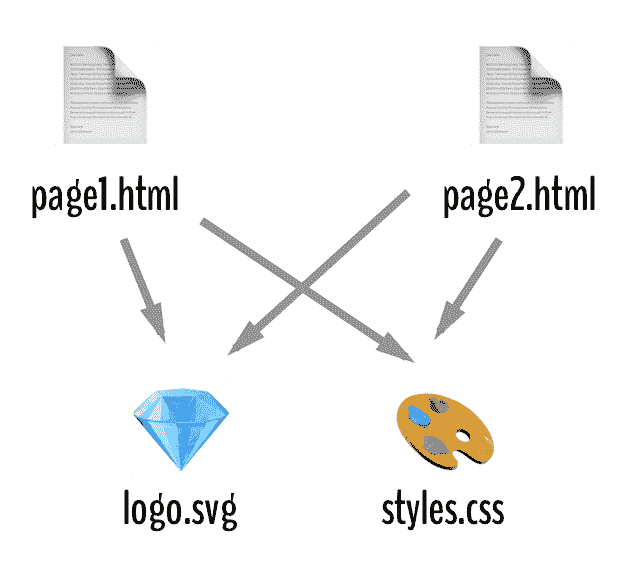
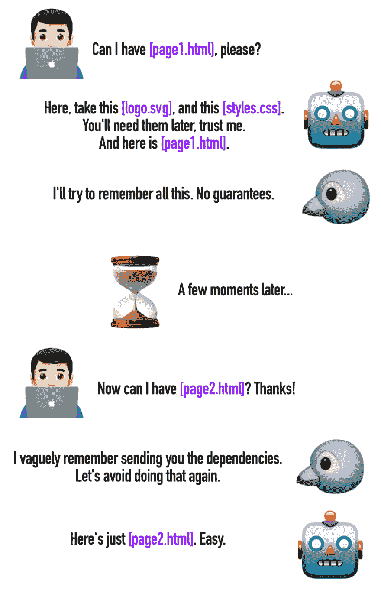

# HTTP/2 服务器推送日记

> 原文：<https://dev.to/commonshost/http2-server-push-diary-17dd>

TL；DR [Commons 主机](https://commons.host)现在实现了一个 **HTTP/2 服务器推送日记**来解决**过度推送问题**。

服务器推送日志是一个**布谷鸟过滤器**,它跟踪服务器之前在每个连接上推送的任何资产。服务器会根据日志检查推送同一资源的后续尝试，并跳过这些尝试，以避免冗余数据传输。

下面是一个示例网站，其中两个页面共享相同的图像和样式表依赖关系。

用户(👨🏻‍💻)先访问一页，再访问另一页。服务器(🤖)使用布谷鸟滤波器(🐦)作为服务器推送日记，防止过度推送。

## 布谷过滤器

日记使用了布谷鸟过滤器(Cuckoo Filter ):一种空间效率极高的高性能数据结构，可以跟踪数千个单独推送的资源，比如一个完整的`node_modules`文件夹或一组数据库记录。

日记是一种概率数据结构。存储的数据无法以原始形式检索。相反，日记可以回答以前是否存储了相同的数据。当重复操作(例如网络传输)的成本远远超过过滤器的成本(即少量 RAM 和 CPU)时，这是一个方便的测试。

服务器可以调整假阴性的概率。最佳值是一个推测的问题，所以我想看看人们决定在多大程度上推动这个特性。目前，日记的大小设置为大约 1000 个条目，每个记录大约 12 位。这允许数百个推送的资源具有很少的假阴性。

如果这个概念听起来很熟悉，你可能听说过[布鲁姆滤镜](https://en.wikipedia.org/wiki/Bloom_filter)。布谷鸟过滤器提高了效率，最重要的是允许删除项目。当缓存项过期并变得陈旧时，这在 web 上下文中很有用。2014 年[布谷鸟滤波器研究论文](http://www.cs.cmu.edu/~binfan/papers/conext14_cuckoofilter.pdf)的高性能实现已经存在，并且已经由 [Matteo Collina](https://twitter.com/matteocollina) 作为 [cuckoofilter-native](https://www.npmjs.com/package/cuckoofilter-native) 移植到 Node.js。

## 缓存摘要呢？

据我所知，缓存摘要 HTTP/2 扩展规范似乎被搁置了。

Commons 主机总是支持使用`Cache-Digest`头或 cookie 的缓存摘要。浏览器可以向服务器发送代表其缓存的 Bloom 或 Cuckoo 过滤器。服务器以此为日记，避免过度推送。遗憾的是，浏览器开发者还没有实现原生支持。使用服务人员和[缓存 API](https://developer.mozilla.org/en-US/docs/Web/API/Cache) 的实验性实现在技术上是可行的，但是伴随着一系列开发人员的考虑，到目前为止还没有被证明是流行的。

希望日记可以自动启用，并且不需要开发人员付出任何努力，可以帮助证明服务器推送和缓存摘要的价值。我相信它们是优雅的想法，有可解决的问题。我们可能还会看到他们的成功。