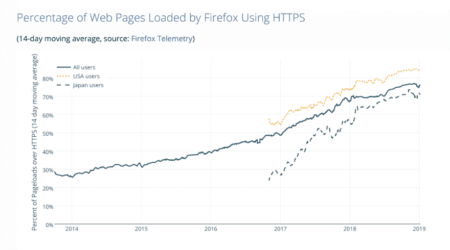
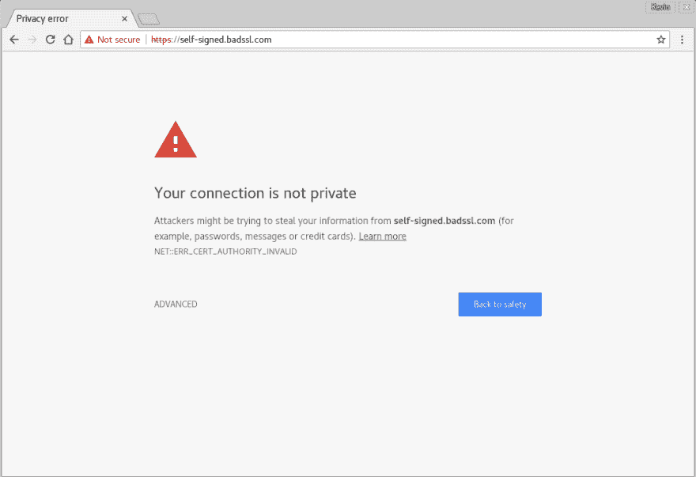
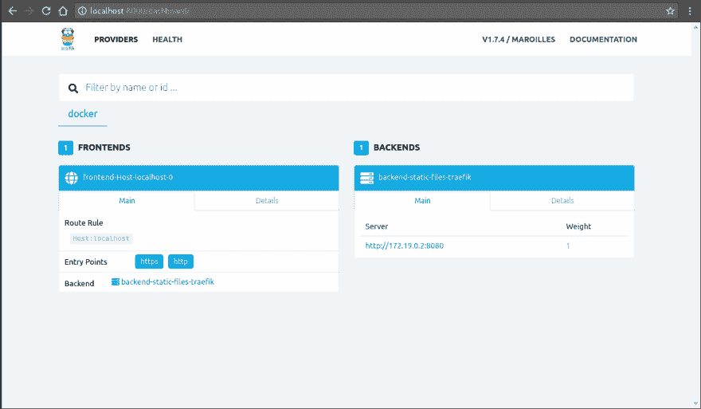
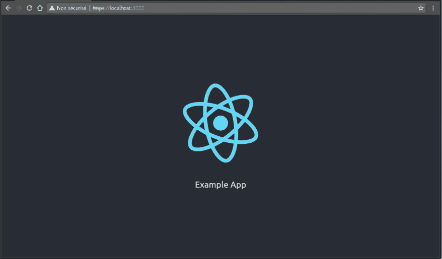

# 发展中的 HTTPS:实用指南

> 原文：<https://dev.to/kmaschta/https-in-development-a-practical-guide-175m>

根据 Firefox Telemetry 的数据， [76%的网页加载了 HTTPS](https://letsencrypt.org/stats/#percent-pageloads) ，而且这个数字还在增长。

迟早，软件工程师不得不与 HTTPS 打交道，而且越快越好。请继续阅读，了解为什么以及如何在您的开发环境中使用 HTTPS 服务 JavaScript 应用程序。

[](https://letsencrypt.org/stats/#percent-pageloads)

## 为什么要在开发环境上使用 HTTPS？

首先，你应该通过 HTTPS 为一个网站提供服务吗？除非你真的知道自己在做什么，[默认答案是**是的**T3。它在很多层面上改进了你的网站:安全性、性能、搜索引擎优化等等。](https://doesmysiteneedhttps.com)

如何设置 HTTPS 经常在第一次发布时被提及，并带来了许多其他问题。流量是应该端到端加密，还是加密到反向代理就够了？证书应该如何生成？应该存放在哪里？那么 [<abbr title="HTTP Strict Transport Security">HSTS</abbr>](https://developer.mozilla.org/fr/docs/S%C3%A9curit%C3%A9/HTTP_Strict_Transport_Security) 呢？

开发团队应该能够尽早回答这些问题。如果你做不到这一点，你可能会像堆栈溢出一样浪费很多时间。

此外，拥有一个尽可能接近生产环境的开发环境可以减少 bug 进入生产环境的风险，也可以减少调试这些 bug 的时间。端到端测试也是如此。

此外，还有一些功能只在 HTTPS 服务的页面上起作用，比如[服务人员](https://developer.mozilla.org/fr/docs/Web/API/Service_Worker_API)。

但是 HTTPS 很慢！许多人认为加密很复杂，在某种程度上必须很慢才能有效。但是随着现代硬件和协议的发展，[这不再是真的了](https://istlsfastyet.com/)。

## 如何为开发环境生成有效证书？

对于生产系统，很容易获得一个 <abbr title="Transport Layer Security">TLS</abbr> 证书:从[生成一个，或者从付费提供商那里购买一个。](https://letsencrypt.org/)

对于开发环境来说，这看起来更棘手，但也没那么难。

### Mkcert:最简单的 CLI

[菲利波·瓦尔索达](https://blog.filippo.io/hi/)最近发布了 [`mkcert`](https://github.com/FiloSottile/mkcert) ，一个生成本地可信开发证书的简单 cli。你只需要运行一行命令:

```
mkcert -install
mkcert example.com 
```

完全支持的证书将在您运行命令的地方可用，即在`./example.com-key.pem`。

### 用 OpenSSL 手动安装

应该可以满足您的所有需求，除非您必须与您的同事共享同一个证书，或者通过本地 env 之外的其他系统。在这种情况下，您可以通过`openssl`生成自己的证书。

```
openssl req -x509 -nodes -days 365 -newkey rsa:2048 -keyout server.key -out server.crt 
```

证书(`server.crt`)及其密钥(`server.key`)有效，但*自签名*。任何[认证机构](https://en.wikipedia.org/wiki/Certificate_authority)都不知道该证书。但是所有的浏览器都要求知名的认证机构来验证证书，以便接受加密的连接。对于自签名证书，他们不能验证它，所以他们显示一个恼人的警告:

[](https://res.cloudinary.com/practicaldev/image/fetch/s--KEYQFe1F--/c_limit%2Cf_auto%2Cfl_progressive%2Cq_auto%2Cw_880/https://thepracticaldev.s3.amazonaws.com/i/w8rfscx7fp3ipg78r0xg.png)

您可以接受这种不便，并在每次出现警告时手动忽略它。但是它非常麻烦，并且可能会阻碍 CI 环境中的 e2e 测试。一个更好的解决方案是创建您自己的本地**认证机构**，将这个自定义机构添加到您的浏览器中，并从中生成一个证书。

这就是`mkcert`在引擎盖下为你做的，但如果你想自己做，我写了一个要点可能会帮助你:[KMA schta/205 a67e 42421 e 779 edd 3530 a0efe 5945](https://gist.github.com/Kmaschta/205a67e42421e779edd3530a0efe5945)。

## 来自反向代理或第三方应用的 HTTPS

通常，最终用户不会直接联系应用服务器。相反，用户请求由负载平衡器或反向代理处理，它跨后端分发请求、存储缓存、防止不需要的请求，等等。看到这些代理扮演解密请求和加密响应的角色并不罕见。

在开发环境中，我们也可以使用反向代理！

### 加密通过 Traefik 和 Docker 构成

Traefik 是一个反向代理，为开发者带来了很多优势。除此之外，它的配置很简单，并且带有一个 GUI。此外，在 docker hub 上还有一张官方 docker 图片[。](https://hub.docker.com/_/traefik)

因此，让我们在一个假设的应用程序的`docker-compose.yml`中使用它，这个应用程序只提供静态文件:

```
version: '3.4'

services:
    reverse-proxy:
        image: traefik # The official Traefik docker image
        command: --docker --api # Enables the web UI and tells Traefik to listen to docker
        ports:
            - '3000:443'  # Proxy entrypoint
            - '8000:8080' # Dashboard
        volumes:
            - /var/run/docker.sock:/var/run/docker.sock # So that Traefik can listen to the Docker events
            - ./certs/server.crt:/sslcerts/server.crt
            - ./certs/server.key:/sslcerts/server.key
            - ./traefik.toml:/traefik.toml # Traefik configuration file (see below)
        labels:
            - 'traefik.enable=false'
        depends_on:
            - static-files
    static-files:
        image: halverneus/static-file-server
        volumes:
            - ./static:/web
        labels:
            - 'traefik.enable=true'
            - 'traefik.frontend.rule=Host:localhost'
            - 'traefik.port=8080'
            - 'traefik.protocol=http'
        ports:
            - 8080:8080 
```

在这个例子中，我们的静态文件服务器监听端口 8080，并以 HTTP 提供文件服务。这个配置告诉 Traefik 处理对`https://localhost`的 HTTPS 请求，并把每个请求代理给`http://localhost:8080`，以便为静态文件提供服务。

我们还必须添加一个`traefik.toml`来配置 Traefik 入口点:

```
debug = false

logLevel = "ERROR"
defaultEntryPoints = ["https","http"]

[entryPoints]
  [entryPoints.http]
  address = ":80"
    [entryPoints.http.redirect]
    entryPoint = "https"
  [entryPoints.https]
  address = ":443"
  [entryPoints.https.tls]
      [[entryPoints.https.tls.certificates]]
      certFile = "/sslcerts/server.crt"
      keyFile = "/sslcerts/server.key" 
```

这里，我们有两个入口点:`http`和`https`，分别监听端口 80 和 443。第一个重定向到 HTTPS，第二个配置为通过指定的 TLS 证书加密请求。

[](https://res.cloudinary.com/practicaldev/image/fetch/s--L4E6klv4--/c_limit%2Cf_auto%2Cfl_progressive%2Cq_auto%2Cw_880/https://thepracticaldev.s3.amazonaws.com/i/y8dboqxgihi10t5bw8gm.png)

### 加密通过 Nginx 从 Docker 合成

显然，我们可以用流行的 Nginx 反向代理做同样的事情。由于 Nginx 本身也可以直接服务静态文件，所以设置更简单。同样，第一步是`docker-compose.yml` :

```
version: '3'

services:
    web:
        image: nginx:alpine
        volumes:
            - ./static:/var/www
            - ./default.conf:/etc/nginx/conf.d/default.conf
            - ../../certs/server.crt:/etc/nginx/conf.d/server.crt
            - ../../certs/server.key:/etc/nginx/conf.d/server.key
        ports:
            - "3000:443" 
```

以及`default.conf` :
时的 nginx 配置

```
server {
    listen 80 default_server;
    listen [::]:80 default_server;
    return 301 https://$server_name$request_uri;
}

server {
    listen 443 ssl;

    server_name ~.;

    ssl_certificate /etc/nginx/conf.d/server.crt;
    ssl_certificate_key /etc/nginx/conf.d/server.key;

    location / {
        root /var/www;
    }

    ## If the static server was another docker service,
    ## It is possible to forward requests to its port:
    # location / {
    #     proxy_set_header Host $host;
    #     proxy_set_header X-Real-IP $remote_addr;
    #     proxy_pass http://web:3000/;
    # }
} 
```

## 直接从应用程序中为 HTTPS 服务

有时，安全需求要求端到端的加密，或者在开发环境中拥有反向代理似乎是多余的。大多数时候，从您的日常开发环境中直接为 HTTPS 服务是可能的。

让我们以一个常见的堆栈为例:一个 React 应用程序，带有一个使用 [express](http://expressjs.com/) 的 REST API。

### 使用 Create React App 或 Webpack 开发服务器

一般的 React 应用都是由`create-react-app`引导的。这个令人敬畏的工具带有许多内置功能，可以开箱即用地处理 HTTPS。为此，您只需在启动应用程序时指定一个`HTTPS=true`环境变量:

```
HTTPS=true npm run start
# or
HTTPS=true yarn start 
```

此命令将使用自动生成的证书从`https://localhost:3000`而不是`http://localhost:3000`为您的应用程序提供服务。但是是自签名证书，开发者体验差。

如果您想要使用您自己的 HTTPS 证书(由您的浏览器信任的机构签署)，`create-react-app`不允许您在不弹出应用程序(`npm run eject`)的情况下配置它。

**编辑:**一位名叫[的开发人员发现了一个巧妙的变通方法](https://dev.to/zwerge/comment/8bkj)来动态替换默认的 HTTPS 证书:

```
 "scripts":  {  "prestart":  "(cat ../../certs/server.crt ../../certs/server.key > ./node_modules/webpack-dev-server/ssl/server.pem) || :",  "start":  "react-scripts start",  }, 
```

幸运的是，如果你拒绝 CRA，或者如果你的项目捆绑了 webpack，那么在为 HTTPS 服务时，`webpack-dev-server`和`create-react-app`一样简单！可以在 Webpack 配置中配置两行自定义 HTTPS 证书:

```
const fs = require('fs');
const path = require('path');

module.exports = {
    mode: 'production',
    // ...
    devServer: {
        https: {
            key: fs.readFileSync(path.resolve(__dirname, '../../certs/server.key')),
            cert: fs.readFileSync(path.resolve(__dirname, '../../certs/server.crt')),
        },
        port: 3000,
    },
}; 
```

下次运行`webpack-dev-server`时，它将处理对`https://localhost:3000`的 HTTPS 请求。

[](https://res.cloudinary.com/practicaldev/image/fetch/s--isMeVjXh--/c_limit%2Cf_auto%2Cfl_progressive%2Cq_auto%2Cw_880/https://thepracticaldev.s3.amazonaws.com/i/bj5p96icraj81lnl7qre.png)

### 用 Express 和 SPDY 加密 HTTP/2

现在，我们有了通过 HTTPS 提供的应用程序的前端部分，我们必须对我们的后端做同样的事情。

为此，让我们使用 [express](https://www.npmjs.com/package/express) 和 [spdy](https://www.npmjs.com/package/spdy) 。难怪这两个库的名字都与速度有关，因为它们的设置速度很快！

```
const fs = require('fs');
const path = require('path');
const express = require('express');
const spdy = require('spdy');

const CERTS_ROOT = '../../certs/';

const app = express();

app.use(express.static('static'));

const config = {
    cert: fs.readFileSync(path.resolve(CERTS_ROOT, 'server.crt')),
    key: fs.readFileSync(path.resolve(CERTS_ROOT, 'server.key')),
};

spdy.createServer(config, app).listen(3000, (err) => {
    if (err) {
        console.error('An error occured', error);
        return;
    }

    console.log('Server listening on https://localhost:3000.')
}); 
```

不要求 HTTP/2 来服务 HTTPS，[可以以名称](https://stackoverflow.com/a/11745114/3868326)的 HTTP 开头来服务加密内容，但是当我们在服务 HTTPS 时，我们可以升级 HTTP 协议。如果你想了解更多关于 HTTP/2 的优势，你可以阅读[这个快速常见问题](https://http2.github.io/faq/)。

## 结论

现代工具允许构建对最终用户来说更安全、更快速的应用程序，并且现在易于引导。我希望我说服了你从你的项目开始就使用这些库和技术，当它们安装起来还很便宜的时候。

我在这篇博文中使用的所有例子都是在下面的 repo 上收集的: [marmelab/https-on-dev](https://github.com/marmelab/https-on-dev) 。请随意使用并添加您自己的 HTTPS 开发经验！