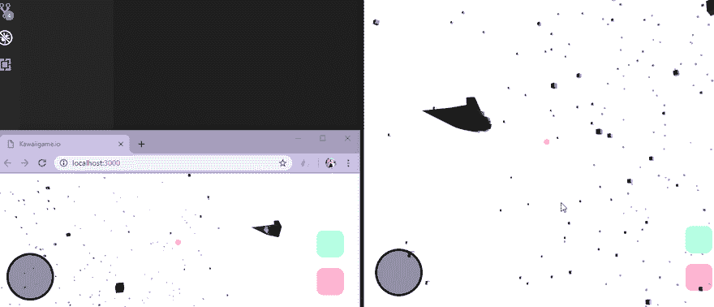

# 我实现了 3D 碰撞检测

> 原文：<https://dev.to/webdva/i-achieved-3d-collision-detection-2jel>

我能够轻松快速地实现这个功能，部分原因是我在整个多人游戏过程中获得的经验和技术。我不会详细描述我是如何在三维空间中实现碰撞的，所以这不会是一个非常有技术含量的条目。

3D 碰撞检测子系统使用轴对齐的边界框(AABB)。不考虑旋转。

在上面的截图中发生的是，当一个投射球体与玩家化身碰撞时，服务器报告发生了碰撞。

下面是另一个在某种程度上证明命中检测准确性的例子:

但是有一些问题必须考虑:

*   hitbox 与其指定的父游戏对象共享相同的位置和移动平移，但它根本不旋转。
*   点击盒的大小和尺寸是不变的。因此，由于点击框不旋转，但其父游戏对象旋转，点击框的不变大小和维度会导致碰撞准确性的问题。
*   hitbox 是一个盒子，而投射物目前是球体，另一个精度问题。
*   3D 模型创建以及因此在游戏服务器上准确地确定点击框的适当大小是有问题的。

尽管如此，这一新的系统要素目前作为一项资产发挥作用，将用于实现基本效果。