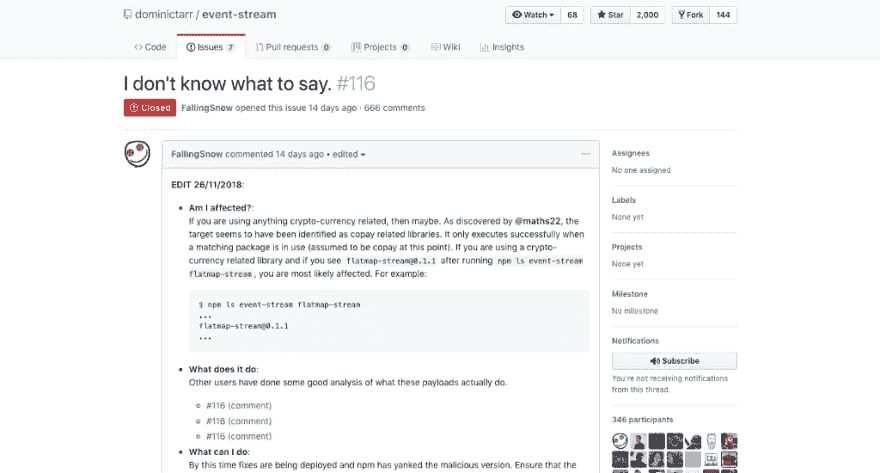

# 我不知道该说什么…

> 原文：<https://dev.to/joshghent/i-dont-know-what-to-say-5bf7>

<figure> 

<figcaption>为事件流的决口而提出的问题。这是一场我不推荐阅读的灰色火焰战争</figcaption>

</figure>

我来这里有点晚了，但在工作中与其他人进行了几次交谈后，我想记录一下我对最近围绕[事件流 npm 包](https://blog.npmjs.org/post/180565383195/details-about-the-event-stream-incident)的安全问题的想法，该包被许多流行的包使用，如 nodemon。

围绕这一争议的是许多关于更仔细地审查包的问题，以及节点开发者倾向于只拥有一个他们可以自己实现的基本功能的包(看你的左键盘)。

虽然所有这些问题都是合理的，值得讨论，但这不是我想在这篇博文中谈论的。

我想谈谈回馈开源。

最值得注意的是围绕为什么原作者把所有权交给“某个随机”的所有讨论。人们质疑作者怎么“敢”交出所有权。其他人甚至认为这是包装作者和犯罪者之间的阴谋。

我的同事找到我，说他们无法相信有人会这么做，把权限交给另一个人是多么“愚蠢”。

但是这样做“愚蠢”吗？没有。

这是完全免费的开源软件。数百个软件包依赖它，仅它就有超过 7600 万次下载。然而，尽管如此依赖于它，它却没有经济支持，而且是一项爱的工作——就像许多开源项目一样。

当你是一个项目的维护者时，特别是如果它很受欢迎，可能会有很多问题，但没有足够的时间来解决它们。人们经常简单地抱怨他们经常用于企业软件的免费工具不起作用。我自己已经移交了一个项目的所有权，并给了他们完全的写权限。我仍然时不时地看一下公关，但实际上，这是他们的包装。当有人[发布了一个问题](https://github.com/OTRChat/NodeChat/issues/31)关于他们想如何为一个班级项目工作时，我最初被联系了，我很高兴！有人真的想把时间花在我最初创作的项目上。我从来没有想过他们会做任何恶意的事情，即使我做了，也是以最礼貌的方式——这不是我的问题。

不要看着这个恶意的包，想着要么放弃 node js，要么拒绝整个开源概念，**对你使用的包表示欣赏。**也许你可以让你的公司通过贡献开发时间或财政资源来回馈。企业中的所有其他资产都是有偿的——那么你的代码基础的底层部分为什么不应该是有偿的呢？就像这样黑白分明——如果 npm 图书馆消失了，许多公司将陷入严重的麻烦，然而只有一小部分图书馆得到支持。

令人欣慰的是，节点生态系统并不孤立于这个问题。就在去年，equifax [指责 Apache struts](https://www.theregister.co.uk/2017/10/02/equifax_ceo_richard_smith_congressional_testimony/) 破坏了他们的整个客户群。Apache 已经修复了这个问题，但是他们没有更新他们的服务器——然而这个项目仍然受到指责。根据我的研究，我找不到他们捐赠或赞助阿帕奇基金会的记录——然而他们去年在 T2 的净收入是 5 . 87 亿美元。

信息是这样的，去检查你在你的项目中经常使用的一些包，看看他们的问题是否需要帮助。如果您没有开发时间，请查看如何通过“ [npx thanks](https://github.com/feross/thanks) ”向软件包捐款。如果你不能做这些事情，给他们留下一颗星，[甚至有一个 npm 包来做这个](https://www.npmjs.com/package/appreciate)。只是不要抱怨你赚钱的软件中的某个问题，这些软件原本是免费的。

* * *