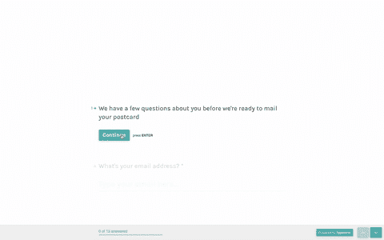
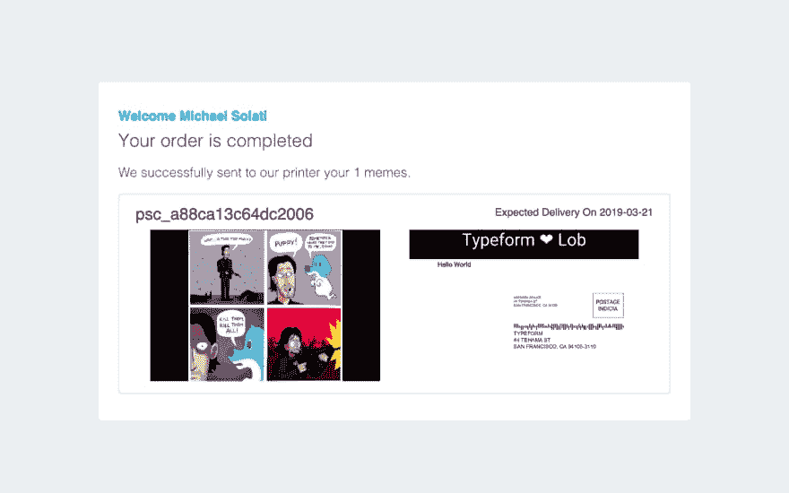

# 我做了一个自动化的 MaaS 业务，你也可以！

> 原文：<https://dev.to/michaelsolati/i-made-an-automated-maas-business-and-so-can-you-1e>

在过去的两年里，我一直在和我的朋友和前同事开玩笑，说要围绕一个简单的想法来创业:MaaS！在过去的 6 个月里，我一直告诉与会者，我真的非常非常认真地在做一个 MaaS 产品，希望它能迫使我坚持到底。来了很久，终于完成了，而且有效！

哦 MaaS 代表什么？这意味着模因是一种服务！你真的知道你生活在 21 世纪，得到一个迷因就像买杂货一样容易。

我的项目叫做 Memeogram，你现在就可以使用它。你所需要做的就是挑选一个朋友，决定你想给他们发送多少个迷因，并选择你希望这些迷因有多“潮湿”。大约 2 周后，他们将通过邮件收到迷因。

是的，我说通过**邮件**。实际上是明信片:你不会想到迷因会以这种方式来到你面前。

下面是[迷因图](https://memeogram.com)的工作原理:发件人填写一份[类型的表格](https://www.typeform.com)，在那里我们收集通过邮件发送迷因所需的所有信息。当发送者点击提交时， [Typeform webhook](https://www.typeform.com/help/webhooks/) 将提交发送给 [Firebase Cloud 函数](https://firebase.google.com/products/functions)。云功能解析订单，为作业找到最佳的迷因，并向 [Lob](https://lob.com/) 发送打印和邮寄订单的请求，同时通过用 [Mailgun](https://www.mailgun.com/) 发送的电子邮件保持发送者的最新状态。

我知道，太花哨了！

* * *

## 分 4 步创建您自己的 MaaS 项目

### 第一步。创建 Typeform 表单

如果你想构建一个类似于 [Memeogram](https://memeogram.com) 的应用程序，首先创建一个[类型的表单](https://www.typeform.com)，如下所示:

[](https://res.cloudinary.com/practicaldev/image/fetch/s--AEo5F5yH--/c_limit%2Cf_auto%2Cfl_progressive%2Cq_66%2Cw_880/https://thepracticaldev.s3.amazonaws.com/i/lmu9olwevkxxcihp60v7.gif)

要发送一张带有 [Lob](https://lob.com/) 的明信片，你需要收集一些信息；主要是发件人和收件人的姓名，以及他们的邮寄地址，细分为以下字段:

*   街道地址
*   城市
*   状态
*   邮政区码

附加信息，如发件人的电子邮件地址或要在明信片上包含的信息将是一个不错的选择，但这并不要求使用 Lob。

* * *

### 第二步。使用 Firebase 处理 Webhook

创建表单后，下一步是处理提交。这个 [Firebase Cloud 函数](https://firebase.google.com/products/functions)允许您处理提交，并将作为 Typeform 在表单提交时发送 POST 请求的端点。

```
import * as express from 'express';
import * as admin from 'firebase-admin';

// Our endpoint for handling the Typeform Webhook.
export const webhook = async (request: express.Request, response: express.Response) => {
  const submission = request.body;

  // This is our initial postcard, we will fill it out as we continue...
  const postcard = {
    sender: {},
    recipient: {}
  };

  // Here we parse out details from the form submission. By using an answers `ref` we map the response to in our postcard object.
  submission.form_response.answers.forEach((answer: any) => {
    const ref = answer['field']['ref'];
    switch (ref) {
      case 'sender-name':
        order['sender']['name'] = answer.text;
      case 'sender-email':
        order['sender']['email'] = answer.email;
      case 'recipient-name':
        order['recipient']['name'] = answer.text;
        break;
      default:
        break;
    }
  });

  // We will now save the postcard into a collection for our reference
  return admin.firestore().collection('orders').add(postcard)
    // We also will create a status document to keep a sender up to date on their order
    .then((ref) => admin.firestore().collection('status').doc(ref.id).set({
      lastUpdated: new Date(),
      message: 'Order to be sent to Lob',
      email: order.sender.email,
    }))
    .then(() => response.status(200).send({ success: true }));
} 
```

Enter fullscreen mode Exit fullscreen mode

这里发生了两件重要的事情:您将明信片存储在所有`orders`的集合中(这将触发对 Lob 的提交)，并且您将明信片订单的状态存储在`status`集合中(这将用于触发给发送者的 [Mailgun](https://www.mailgun.com/) 状态电子邮件)。

* * *

### 第三步。用 Lob 发送明信片

Firebase 允许您在 Firestore 集合被写入时[触发功能。当一张新的明信片被保存到 Firestore 收藏时，你可以触发](https://firebase.google.com/docs/functions/firestore-events) [Lob](https://lob.com/) 来打印一张明信片。

```
import * as admin from 'firebase-admin';
import * as functions from 'firebase-functions';
import { readFileSync } from 'fs';
import { join } from 'path';

const Lob = require('lob')('<YOUR-LOB-API-KEY-HERE>');

// The front and the back of postcards being sent can be stored/created as HTML files, with variables swapped in by Lob
const POSTCARD_FRONT: string = readFileSync(join(__dirname, 'templates', 'front.html'), 'utf8');
const POSTCARD_BACK: string = readFileSync(join(__dirname, 'templates', 'back.html'), 'utf8');

// This function will be triggered whenever a new document is created in the `order` collection. So when the above `webhook` function resolves, this function is automatically triggered.
export const ordersOnCreate = functions.firestore.document('orders/{id}').onCreate((snapshot, context) => {
  const id = context.params.id;
  const postcard = snapshot.data();

  // Let's send the order to Lob for printing!
  return Lob.postcards.create({
    description: `Typeform 💌 Lob - ${id}`,
    to: {
      name: postcard.recipient.name,
      address_line1: postcard.recipient.address,
      address_line2: '',
      address_city: postcard.recipient.city,
      address_state: postcard.recipient.state,
      address_zip: postcard.recipient.zip
    },
    from: {
      name: postcard.sender.name,
      address_line1: postcard.sender.address,
      address_line2: '',
      address_city: postcard.sender.city,
      address_state: postcard.sender.state,
      address_zip: postcard.sender.zip
    },
    front: POSTCARD_FRONT,
    back: POSTCARD_BACK,
    merge_variables: {
      // This is a variable that will be swapped into out postcard HTML templates
      message: postcard.message
    }
  }, (error: any, success: any) => {
    if (error) {
      // If we are unable to send the order to Lob we will update our status with an error
      admin.firestore().collection('status').doc(id).update({
        error: true,
        message: 'Your order could not be sent to Lob',
        lastUpdated: new Date()
      });
    } else {
      // If successful we will update the order status accordingly
      admin.firestore().collection('status').doc(id).update({
        error: false,
        message: 'Your order has been successfully sent to Lob',
        completed: true,
        lastUpdated: new Date(),
        sent: success
      });
    }
  });
}); 
```

Enter fullscreen mode Exit fullscreen mode

* * *

### 第四步。用邮件枪通知发件人

您可能已经注意到，前两节中的代码写入了`status`集合。这是因为您希望让发件人了解他们订单的最新状态。就像创建订单时触发的云函数一样，当创建或更新状态时，您将触发该函数来发送 [Mailgun](https://www.mailgun.com/) 状态电子邮件。

```
import * as functions from 'firebase-functions';
import * as Mailgun from 'mailgun-js';

const mailgun = Mailgun({
  apiKey: '<YOUR-MAILGUN-API-KEY-HERE>',
  domain: '<YOUR-MAILGUN-DOMAIN-HERE>'
});

// This function will be triggered whenever a status is created
export const statusOnCreate = functions.firestore.document('status/{statusId}').onCreate((snapshot, context) => {
  // First we parse out the ID of the status document (it should match the order's ID)
  const id = context.params.statusId;
  // Then we parse out the status document
  const status = snapshot.data();
  // We then send the status and id to our `sendEmail` function that will handle sending the email
  return sendEmail(status, id);
});

// This function will be triggered whenever a status is changed (updated)
export const statusOnUpdate = functions.firestore.document('status/{statusId}').onUpdate((change, context) => {
  // Here we just ensure it's an update and not a delete
  if (!change.after) { return Promise.resolve(); }
  const id = context.params.statusId;
  const status = change.after.data();
  return sendEmail(status, id);
});

// All we do here is send the email via Mailgun
function sendEmail(status: any, id: string): Promise<any> {
  return mailgun.messages().send({
    from: 'support@typeform.com',
    to: status.email,
    subject: `Typeform 💌 Lob - Order ${id} Update`,
    text: `${status.message} \n View order at https://typeform-lob.firebaseapp.com/order?id=${id}`
  });
} 
```

Enter fullscreen mode Exit fullscreen mode

* * *

## 最终产品

在 Firebase 上部署项目后，您可以填写表单并观察流程的运行，直到您收到一封确认电子邮件，您可以用它来跟踪订单。

[](https://res.cloudinary.com/practicaldev/image/fetch/s--7Uxh8ZzC--/c_limit%2Cf_auto%2Cfl_progressive%2Cq_auto%2Cw_880/https://thepracticaldev.s3.amazonaws.com/i/tfjhnz2lbjlco9tph6pq.png)

你自己试试！本指南将引导您完成设置和部署我上面描述的应用程序的整个过程:

```
git clone https://github.com/MichaelSolati/typeform-lob.git
cd typeform-lob
npm i
npm run start 
```

Enter fullscreen mode Exit fullscreen mode

或者你可以在这里尝试一下演示应用[的部署版本。](https://lob.typeformdev.com)

虽然迷因可能很有趣，但可能存在的其他实际用例是，如果您想要自动向购买您产品的客户发送感谢卡。或者是一个通过邮件联系当地国会议员的平台。

* * *

要了解我正在做的一切，请在 [Twitter](https://twitter.com/MichaelSolati) 上关注我。如果你在想，*“给我看看代码！”你可以在 [GitHub](https://github.com/MichaelSolati) 上找到我。*