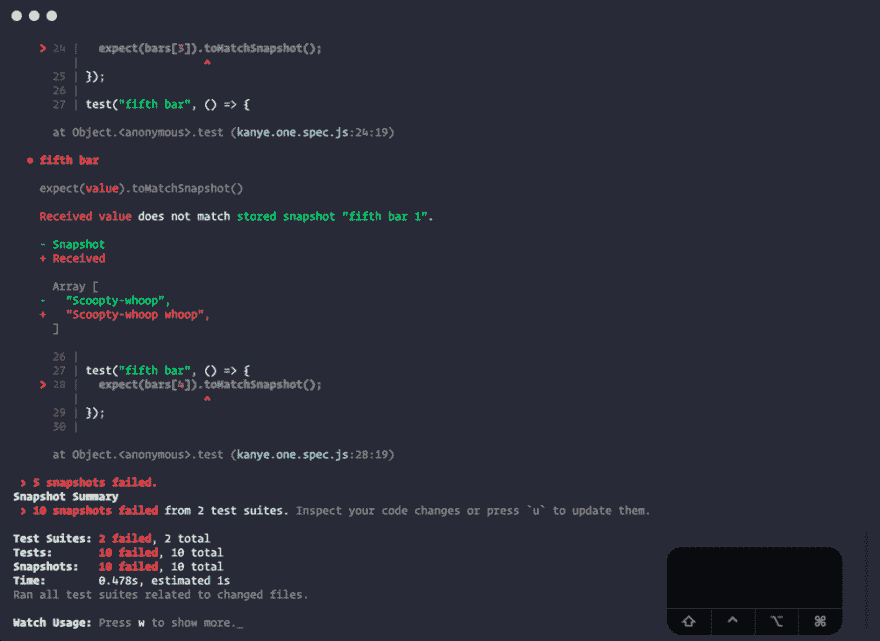
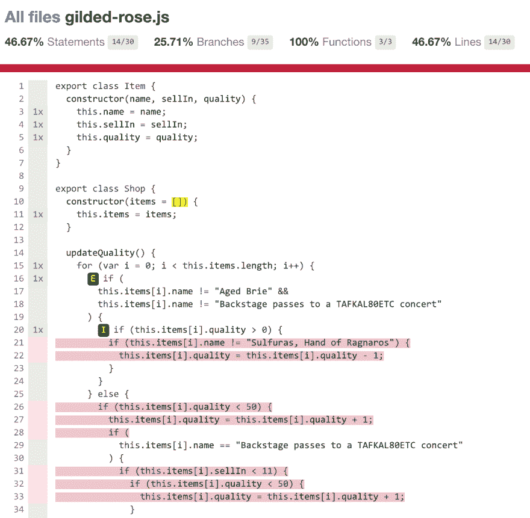
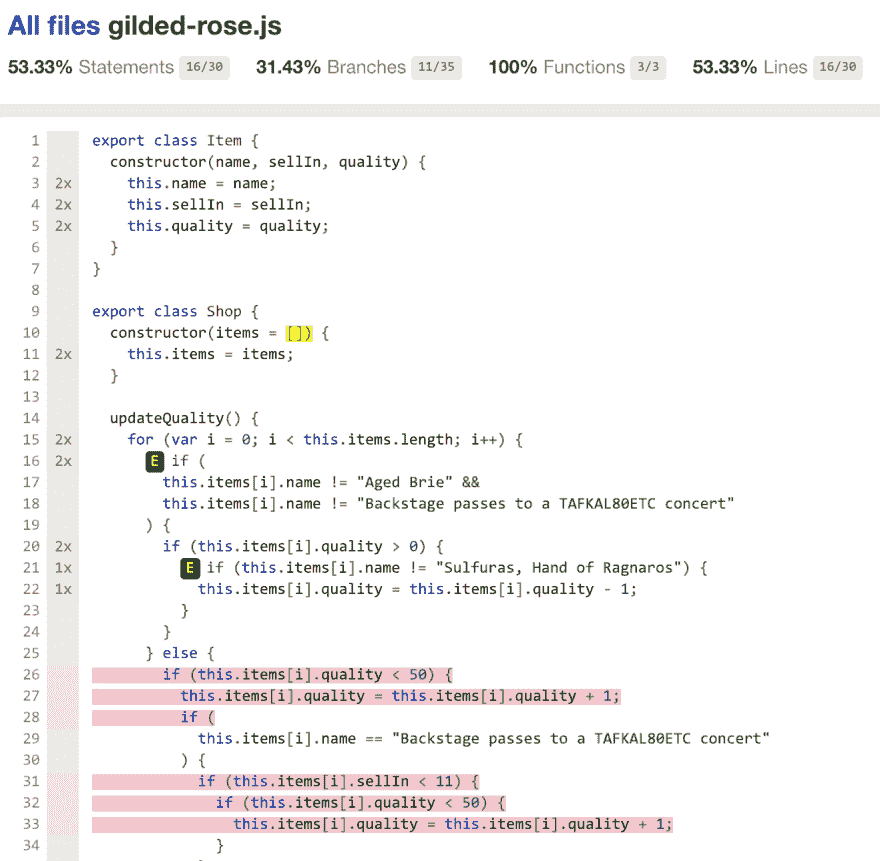
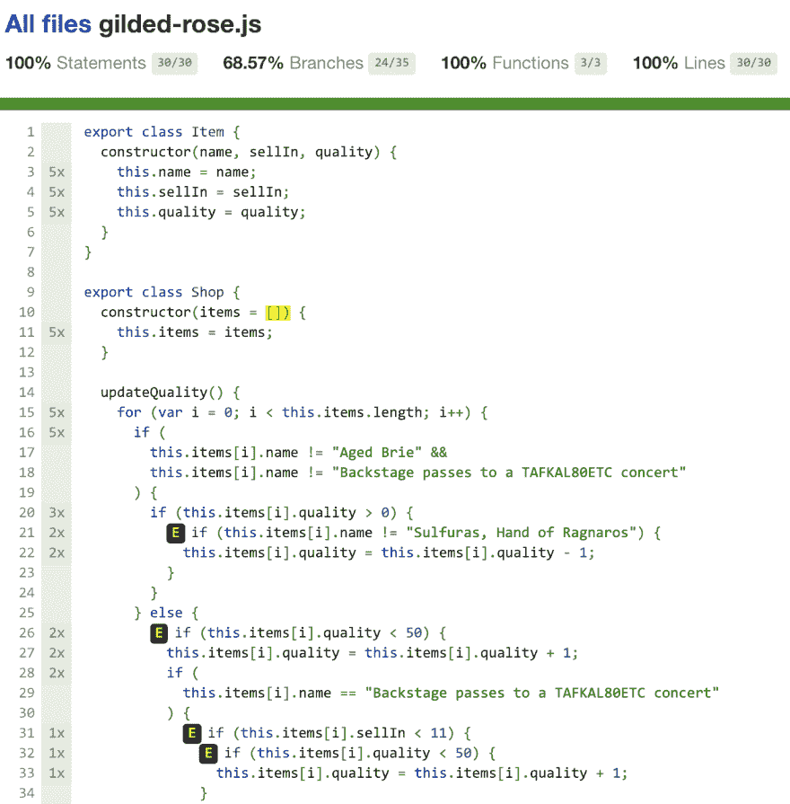
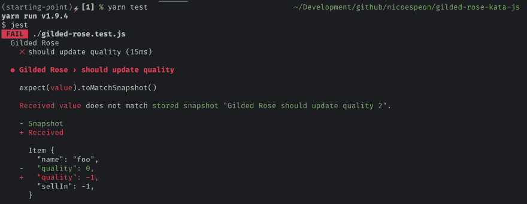
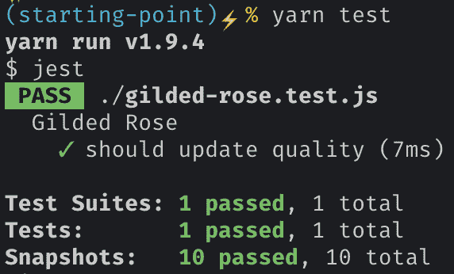
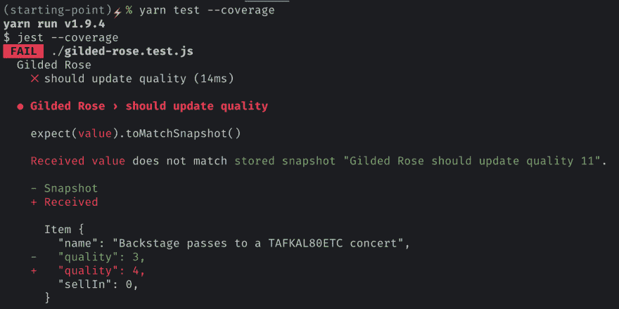

# “我需要更改此代码，但它没有测试”

> 原文：<https://dev.to/nicoespeon/i-need-to-change-this-code-but-it-has-no-test-5ff1>

> *这篇文章最初是为我的个人博客写的[。](https://www.nicoespeon.com/en/2019/01/approval-testing-on-legacy-code/)*
> *我在这里为开发者社区重新发布它。*

事情是这样的:你需要修改代码来让这个令人敬畏的新特性工作，但是这个代码没有被自动化测试覆盖。完事后你怎么知道你没有打碎任何东西？

这是我经常面临的典型情况。

在这种情况下，我看到了不同的方法:

1.  🤞十指交叉，做好改变，希望不会有什么事发生。手动测试你知道的不同用例。毕竟，你只是增加了一个功能。你或多或少知道代码库。什么会出错？

2.  🤔**花时间去理解**，在改变代码之前测试和重构代码。[“易其变，则易其变”](https://twitter.com/kentbeck/status/250733358307500032)。当然，这需要一些时间。你实际上没有估计那项任务要花那么多时间。那是意想不到的复杂。但是，最终，您将使代码库处于更好的状态，并且您将能够走得更快。

3.  📸**拍摄现有代码行为的快照**。把它当成一个黑匣子，捕捉足够多的行为，让你在触摸它时感到自信。

我清楚地认为第一种方法是搬起石头砸自己的脚——除非你知道你不需要维护那个代码。见鬼，看起来你已经在维护这个代码了，否则，你一开始就不会有这个问题了！如果你想在不破坏一切的情况下保持快速移动，有一个更好、更专业的方法。

第二种方法将是理想的。有效地使用遗留代码需要首先将现有代码放入测试工具中。然后，你可以重构。但是，编写好的测试需要技巧。你应该练习这些技巧，它们会帮助你处理这些常见的场景。现在，我听到你:客户端演示是下周，你需要船舶之前，很酷的功能。你需要一个务实的方法来解决这个问题。你要有意识地走这条捷径，这样你就可以交付，然后你就可以偿还技术债务。现在，你还坚持第一种方法吗？

没有。方法#3 更加…实用。无论如何，在接触代码之前，你必须对它进行测试。但是，谁说你需要完全理解当前的代码才能这样做呢？你想要的是知道当你接触代码时是否破坏了现有的行为。这可以通过**认证测试**来完成。

主要思想是:

*   在所有可能的变化中，获取现有代码行为的快照
*   使用测试覆盖来发现没有被变化覆盖的代码部分
*   使用突变来确保检测到任何不正常的行为

这样做你不需要理解现有的代码。这是好消息。

但是有一个先决条件:你需要对你的代码行为进行快照，这意味着你**应该能够对你的代码**的输出进行字符串化，包括副作用。如果你的代码库在设计时没有考虑到测试，你可能需要依靠 [Michael Feather 的书](https://www.oreilly.com/library/view/working-effectively-with/0131177052/)来帮助你开始。

现在，让我们看看如何用 JavaScript 实现这一点。

## JavaScript 中的批准测试

如今，我个人对 JavaScript 测试的看法是 [Jest](https://jestjs.io/) 。

设置简单，几乎不需要任何配置。它有一个很棒的测试跑步者，有一个强大的观看模式。最后，这就是你要找的，它可以拍快照。

[](https://res.cloudinary.com/practicaldev/image/fetch/s--Ob4eO4BQ--/c_limit%2Cf_auto%2Cfl_progressive%2Cq_66%2Cw_880/https://thepracticaldev.s3.amazonaws.com/i/g69bb9fbwyqlf7zjgxm9.gif)

<figure>

<figcaption>Jest runner in action——该死的太酷了！

<figcaption></figcaption>

</figcaption>

</figure>

快照是强大的。但是它们是一种先测试后测试的技术。我通常推荐实践[测试驱动开发](https://en.wikipedia.org/wiki/Test_driven_development)，所以你几乎不需要快照。实际上，**快照很少有有效的用例**。在重构代码之前对现有代码进行测试就是其中之一。

现在，我需要一个例子。我将用[镀金玫瑰形](http://iamnotmyself.com/2011/02/13/refactor-this-the-gilded-rose-kata/)来说明这一点。这是一个练习重构技术的练习，在这里真的很方便。我做了一个 [JS 入门](https://github.com/nicoespeon/kata-gilded-rose-js)的形，你可以用。

所以你有两个类:`Shop`和`Item`。`Item`很简单:

```
export class Item {
  constructor(name, sellIn, quality) {
    this.name = name
    this.sellIn = sellIn
    this.quality = quality
  }
} 
```

然后你有`Shop`，它接受一个`items`的列表，还有一个方法`updateQuality()`，它将更新每个条目的`quality`和`sellIn`属性。有一堆逻辑目前应该是可行的。虽然它并不漂亮，所以我不会把它放在这里，而是给你一个[到野兽](https://github.com/nicoespeon/kata-gilded-rose-js/blob/954274fb04741e9c2992f9b31482daca366e0055/gilded-rose.js#L14-L69)的链接。

你的目标:改变`updateQuality()`，使其也能处理`"Conjured"`物品(它们的质量下降速度是普通物品的两倍)。

没有测试。一个好主意是先重构这段代码——让修改变得容易，记得吗？

让我向您展示如何在这样的场景中应用批准测试技术。

### 1。生成可以快照的输出

第一步是从`updateQuality()`生成快照。它不返回一个字符串，但是它改变了`items`。因此，我的第一步是写一个函数，返回一些捕捉变化的东西，这样 Jest 就可以对它进行快照:

```
// I put that code in my test file, since it's test-related.

function doUpdateQuality(name, sellIn, quality) {
  const gildedRose = new Shop([new Item(name, sellIn, quality)])
  const items = gildedRose.updateQuality()
  return items[0]
} 
```

我本来可以返回`items`，但是我在这里把事情简化了一点:我只测试了一个有一件商品的商店。这是因为我已经知道，无论项目的数量是多少，行为都是相同的。这可能不是你的案子。你应该适应你的情况，这是棘手的部分。

现在我有了一个可以从测试中调用的`doUpdateQuality(name, sellIn, quality)`。它将实例化商店，调用我正在测试的方法，并将更新的项目返回给我。

我的下一步是编写第一个测试，从输出中获取快照:

```
it('should update quality', () => {
  expect(doUpdateQuality('foo', 0, 0)).toMatchSnapshot()
})

function doUpdateQuality(name, sellIn, quality) {
  // …
} 
```

如果你不熟悉 Jest 快照测试，我建议你花几分钟时间看看他们的文档。我会等的😉

### 2。使用测试覆盖找到所有输入组合

此时，给定一组参数，我生成了第一个快照。Jest 会告诉我这种情况下是否会出现任何倒退。我现在可以去重构`updateQuality()`了吗？没有。因为我没有用这个快照覆盖所有代码。这一点，我能知道多亏了测试覆盖率！

为了生成测试覆盖率，我使用`--coverage`选项运行 Jest。

我发现`html`报告在这种情况下是最好的。为此，我需要配置 Jest 选项。这可以在配置文件中完成，或者在`package.json` :
中快速完成

```
{
  "name": "gilded-rose-kata",
  // …
  "scripts": {
    "test": "jest"
  },
  "jest": {
    "coverageReporters": [
      "html"
      // I could add "text" or "text-summary" to see output in the console
    ]
  }
} 
```

然后，我运行`yarn test --coverage`(或`npm run test -- --coverage`)，生成一个`coverage/`文件夹。

我打开`coverage/index.html`文件:

[](https://res.cloudinary.com/practicaldev/image/fetch/s--tWbmQJhg--/c_limit%2Cf_auto%2Cfl_progressive%2Cq_auto%2Cw_880/https://thepracticaldev.s3.amazonaws.com/i/w77lz5709cdqqaqucpxb.png)

所有的红线，我不测试。

> 测试覆盖率只能告诉你哪些代码没有被测试，没有别的。

让我们找出另一种可以覆盖更多线条的组合…一个具有正面质量的项目应该做:

```
it('should update quality', () => {
  expect(doUpdateQuality('foo', 0, 0)).toMatchSnapshot()
  expect(doUpdateQuality('foo', 0, 1)).toMatchSnapshot()
}) 
```

我又做了一次测试。生成新的快照。

覆盖报告已更新:

[](https://res.cloudinary.com/practicaldev/image/fetch/s--t89E0H9B--/c_limit%2Cf_auto%2Cfl_progressive%2Cq_auto%2Cw_880/https://thepracticaldev.s3.amazonaws.com/i/w55e5ru2zq90mpsyen71.png)

耶，红线少了！

所以你明白了:在这个阶段，我需要找到覆盖所有代码的所有可能的组合。不再有红线。

让我们快进一点。这里是我得到的:

```
it('should update quality', () => {
  expect(doUpdateQuality('foo', 0, 0)).toMatchSnapshot()
  expect(doUpdateQuality('foo', 0, 1)).toMatchSnapshot()
  expect(doUpdateQuality('foo', 0, 2)).toMatchSnapshot()
  expect(doUpdateQuality('Aged Brie', 0, 1)).toMatchSnapshot()
  expect(
    doUpdateQuality('Backstage passes to a TAFKAL80ETC concert', 0, 1)
  ).toMatchSnapshot()
}) 
```

[](https://res.cloudinary.com/practicaldev/image/fetch/s--dujS0LbY--/c_limit%2Cf_auto%2Cfl_progressive%2Cq_auto%2Cw_880/https://thepracticaldev.s3.amazonaws.com/i/f2kyrfwggc8echtco8gl.png)

不再有红线，但我还有这些`E`符号。这些符号意味着我涵盖了`if`案例，但我遗漏了`else`条款——这就是为什么只有 68.57%的分支机构被涵盖。我也需要覆盖它们:

```
it('should update quality', () => {
  expect(doUpdateQuality('foo', 0, 0)).toMatchSnapshot()
  expect(doUpdateQuality('foo', 0, 1)).toMatchSnapshot()
  expect(doUpdateQuality('foo', 0, 2)).toMatchSnapshot()
  expect(doUpdateQuality('Aged Brie', 0, 1)).toMatchSnapshot()
  expect(doUpdateQuality('Aged Brie', 0, 50)).toMatchSnapshot()
  expect(doUpdateQuality('Sulfuras, Hand of Ragnaros', 0, 1)).toMatchSnapshot()
  expect(doUpdateQuality('Sulfuras, Hand of Ragnaros', -1, 1)).toMatchSnapshot()
  expect(
    doUpdateQuality('Backstage passes to a TAFKAL80ETC concert', 0, 1)
  ).toMatchSnapshot()
  expect(
    doUpdateQuality('Backstage passes to a TAFKAL80ETC concert', 11, 1)
  ).toMatchSnapshot()
  expect(
    doUpdateQuality('Backstage passes to a TAFKAL80ETC concert', 0, 49)
  ).toMatchSnapshot()
}) 
```

到目前为止，一切顺利。我在调查每一条线和每一个分支。我现在可以去重构`updateQuality()`了吗？

嗯…还没有。还记得我说过测试覆盖率只能告诉你“哪些代码没有被测试”吗？这意味着它不会告诉你被覆盖的代码是否被正确测试。

这就是为什么设置一个测试覆盖目标来确保测试质量是行不通的。测试覆盖率告诉你没有被测试的部分——不测试这些部分可能没问题。除此之外，它什么也没说。

对我来说，好的测试覆盖率是好的测试策略(TDD)的副作用。这不是目标。

### 3。使用突变来验证快照

为了确保被覆盖的代码得到真正的测试，我将在代码中引入一些小的变化。

这里的目标是看到测试失败。如果我修改了现有的代码并且测试失败了，我会放心地重构这段代码！当测试失败时，我恢复突变并转移到另一行。

应该引入哪些突变？同样，这取决于您测试的内容——抱歉。通常，改变你在快照中捕捉到的副作用。在我的情况下，这意味着我不必更改`if` s，而只需更新`item`。他们有 8 个人。

让我们从第一个任务开始，第 22 行:

```
if (this.items[i].name != 'Sulfuras, Hand of Ragnaros') {
  this.items[i].quality = this.items[i].quality - 1
} 
```

我介绍一点突变，只是为了核对:

```
if (this.items[i].name != 'Sulfuras, Hand of Ragnaros') {
  this.items[i].quality = this.items[i].quality - 2
} 
```

我再次运行我的测试:

[](https://res.cloudinary.com/practicaldev/image/fetch/s--kDHysOnT--/c_limit%2Cf_auto%2Cfl_progressive%2Cq_auto%2Cw_880/https://thepracticaldev.s3.amazonaws.com/i/xdmf8ixa3vnhh1kcxvdy.png)

太好了！我知道我的测试会捕捉到任何回归。我可以恢复我的突变。

让我们继续其他的。我引入一个类似的突变行 33:

```
if (this.items[i].quality < 50) {
  this.items[i].quality = this.items[i].quality + 2
} 
```

再次运行测试并…

[](https://res.cloudinary.com/practicaldev/image/fetch/s--jlwaTIqU--/c_limit%2Cf_auto%2Cfl_progressive%2Cq_auto%2Cw_880/https://thepracticaldev.s3.amazonaws.com/i/lo2retxppzrin3qjn7sf.png)

这可不好。

在继续之前，我先还原代码中的突变。**别让突变活太久。**

然后，在那一点上，我需要考虑一下代码——是的，我撒谎了，但是你不需要理解所有的代码。怎么会这样？我怀疑进一步的更新会使我在下面的逻辑中采取另一条路，导致我的给定组合出现类似的结果。看着我想修改的代码行，我发现这一行很有趣:

```
if (this.items[i].name != 'Sulfuras, Hand of Ragnaros') {
  this.items[i].sellIn = this.items[i].sellIn - 1
}
if (this.items[i].sellIn < 0) {
  // …
} 
```

这意味着如果`sellIn`是`0`，那么它不会执行剩余的代码。我尝试添加另一个组合:

```
it('should update quality', () => {
  expect(doUpdateQuality('foo', 0, 0)).toMatchSnapshot()
  expect(doUpdateQuality('foo', 0, 1)).toMatchSnapshot()
  expect(doUpdateQuality('foo', 0, 2)).toMatchSnapshot()
  expect(doUpdateQuality('Aged Brie', 0, 1)).toMatchSnapshot()
  expect(doUpdateQuality('Aged Brie', 0, 50)).toMatchSnapshot()
  expect(doUpdateQuality('Sulfuras, Hand of Ragnaros', 0, 1)).toMatchSnapshot()
  expect(doUpdateQuality('Sulfuras, Hand of Ragnaros', -1, 1)).toMatchSnapshot()
  expect(
    doUpdateQuality('Backstage passes to a TAFKAL80ETC concert', 0, 1)
  ).toMatchSnapshot()
  expect(
    doUpdateQuality('Backstage passes to a TAFKAL80ETC concert', 11, 1)
  ).toMatchSnapshot()
  expect(
    doUpdateQuality('Backstage passes to a TAFKAL80ETC concert', 0, 49)
  ).toMatchSnapshot()
  expect(
    doUpdateQuality('Backstage passes to a TAFKAL80ETC concert', 1, 0)
  ).toMatchSnapshot()
}) 
```

我生成新的快照，然后重试变异:

[](https://res.cloudinary.com/practicaldev/image/fetch/s--2zj_Rkpx--/c_limit%2Cf_auto%2Cfl_progressive%2Cq_auto%2Cw_880/https://thepracticaldev.s3.amazonaws.com/i/zvywu3jmqr1zgzk7kqwj.png)

[](https://res.cloudinary.com/practicaldev/image/fetch/s--STwte9kF--/c_limit%2Cf_auto%2Cfl_progressive%2Cq_66%2Cw_880/https://thepracticaldev.s3.amazonaws.com/i/o7gqu5060it5fowoh65q.gif)

成功了！

我回复我的突变，继续下一个任务。我这样做，直到我知道所有的测试都被测试覆盖。

希望我没有发现其他误报。下面是最终的测试列表:

```
it('should update quality', () => {
  expect(doUpdateQuality('foo', 0, 0)).toMatchSnapshot()
  expect(doUpdateQuality('foo', 0, 1)).toMatchSnapshot()
  expect(doUpdateQuality('foo', 0, 2)).toMatchSnapshot()
  expect(doUpdateQuality('Aged Brie', 0, 1)).toMatchSnapshot()
  expect(doUpdateQuality('Aged Brie', 0, 50)).toMatchSnapshot()
  expect(doUpdateQuality('Sulfuras, Hand of Ragnaros', 0, 1)).toMatchSnapshot()
  expect(doUpdateQuality('Sulfuras, Hand of Ragnaros', -1, 1)).toMatchSnapshot()
  expect(
    doUpdateQuality('Backstage passes to a TAFKAL80ETC concert', 0, 1)
  ).toMatchSnapshot()
  expect(
    doUpdateQuality('Backstage passes to a TAFKAL80ETC concert', 11, 1)
  ).toMatchSnapshot()
  expect(
    doUpdateQuality('Backstage passes to a TAFKAL80ETC concert', 0, 49)
  ).toMatchSnapshot()
  expect(
    doUpdateQuality('Backstage passes to a TAFKAL80ETC concert', 1, 0)
  ).toMatchSnapshot()
}) 
```

我现在可以去重构`updateQuality()`了吗？

是啊！所有代码现在都被快照覆盖了。一个错误的举动，我会自动知道。我现在可以重构代码而不会引入错误。然后我会添加特性🤘

### 4。这些测试是技术债务

如果你应用这个方法，记住这一点:你接受了技术债务。您用编写良好的测试与现有行为的快照进行了交换，以更快地获得测试工具，从而可以进行重构。

快照是强大的，但是它们不能帮助你理解代码应该做什么。一旦代码被重构，你应该偿还债务:在你干净的代码上写适当的、全面的测试来代替你的快照。如果您这样做了，这部分代码将来会更容易维护，并且您会更快地添加新功能。

## 介绍 jest-扩展-快照

看着产生的测试代码，我认为在一个`it`中有很多样板代码！

所以我用一个定制的笑话匹配器来重构它:`toVerifyAllCombinations()`。

有了它，前面的代码可以写成这样:

```
it('should update quality', () => {
  expect(doUpdateQuality).toVerifyAllCombinations(
    [
      'foo',
      'Aged Brie',
      'Backstage passes to a TAFKAL80ETC concert',
      'Sulfuras, Hand of Ragnaros',
    ],
    [-1, 0, 1, 11],
    [0, 1, 2, 49, 50]
  )
}) 
```

它将生成以下参数的所有可能组合，对每个参数调用`doUpdateQuality()`,并对所有结果进行快照。

我喜欢它，因为它更好地表达了意图:“对于所有这些场景，应该保留当前行为”。

我把它提取到一个库中，这样你也可以使用它: [jest-extended-snapshot](https://github.com/nicoespeon/jest-extended-snapshot#readme) 👹

##  [尼科斯皮昂](https://github.com/nicoespeon) / [玩笑扩展快照](https://github.com/nicoespeon/jest-extended-snapshot)

### 用于快照测试的附加 Jest 匹配器。

<article class="markdown-body entry-content" itemprop="text">

# <g-emoji class="g-emoji" alias="japanese_ogre" fallback-src="https://github.githubassets.cimg/icons/emoji/unicode/1f479.png">👹</g-emoji>jest-扩展-快照

用于快照测试的附加 Jest 匹配器。

**<g-emoji class="g-emoji" alias="memo" fallback-src="https://github.githubassets.cimg/icons/emoji/unicode/1f4dd.png">📝</g-emoji>阅读[博文](https://understandlegacycode.com/blog/3-steps-to-add-tests-on-existing-code-when-you-have-short-deadlines/)。**

*需要笑话版> = 23。*

* * *

[](https://www.npmjs.com/package/jest-extended-snapshot)[](https://travis-ci.org/nicoespeon/jest-extended-snapshot)[](https://github.com/nicoespeon/jest-extended-snapshot/blob/master/CHANGELOG.md)

## 为什么？

如果您发现自己处于这样一个场景中，您希望在代码编写之后添加测试，那么您可能希望使用 Jest 快照。

一个典型的场景是使用遗留代码:它没有测试，但是您需要更改/修复它。您应该首先设置一个测试工具，以确保不会出现回归。Jest 快照使这项工作更容易。

这个库增加了在这种情况下工作的方便的匹配器。

### 通过 Jest 快照进行认可测试

考虑前面的例子:您不知道一段代码具体做什么，但是您不想破坏现有的行为。在这种情况下使用的一种方法叫做“认可测试”。

它可以让你快速地测试覆盖率，而不需要理解代码。

> 单元测试断言可以是…

</article>

[View on GitHub](https://github.com/nicoespeon/jest-extended-snapshot)

## 灵感

多亏了艾米莉·巴赫，我发现了认可测试。她制作了一个非常棒的 20 分钟的截屏视频，用 Java 语言演示了这个例子:

[https://www.youtube.com/embed/zyM2Ep28ED8](https://www.youtube.com/embed/zyM2Ep28ED8)

你可以在[http://approvaltests.com/](http://approvaltests.com/)上阅读更多关于认证测试的信息。

他们在 JS 中有一个这样的库，用摩卡:[https://github.com/approvals/Approvals.NodeJS](https://github.com/approvals/Approvals.NodeJS)