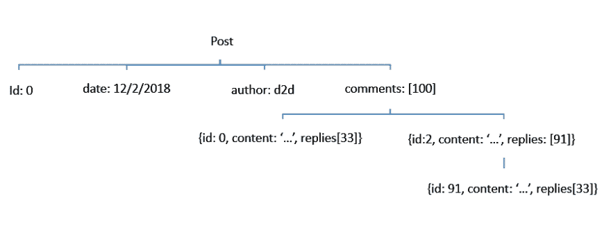

# 不变性使得跟踪变更变得便宜

> 原文：<https://dev.to/dance2die/immutability-makes-tracking-changes-cheap-4g19>

*照片由[游里·罗默](https://unsplash.com/photos/Xne1N4yZuOY?utm_source=unsplash&utm_medium=referral&utm_content=creditCopyText)在[Unsplash](https://unsplash.com/search/photos/boulder?utm_source=unsplash&utm_medium=referral&utm_content=creditCopyText)T5 拍摄*

***给自己的笔记***
(意思，有点草率&是给自己的笔记但还是想分享)

上周的周末阅读主题是[关于优化性能的文档](https://reactjs.org/docs/optimizing-performance.html)。

在阅读关于不变性的文章时，一个啊哈的时刻。

假设您有一个组件，`Post`必须像这样呈现一个评论线程。

<figure> 

<figcaption>*Reddit 帖子:* [*有什么笑话这么蠢这么好笑？*](https://www.reddit.com/r/AskReddit/comments/a26y06/whats_a_joke_thats_so_stupid_its_funny/)</figcaption>

</figure>

状态树如下图所示。

<figure> 

<figcaption>岗位状态树</figcaption>

</figure>

当 JavaScript 比较两个值时，状态树中显示的原语类型(数字、字符串、布尔等)比较，如`id`、`date`、`author`，是廉价的。

当你必须比较对象类型状态时，通过引用 进行比较 ***。***

因此，如果有人修改了`comments`数组中的一项，您必须遍历注释中的每一项，以找出是否有任何更改。

这是一个`O(n)`操作过程，所以很慢🦄。

但是如果你已经返回了一个新的`comments`数组(使用 Object.assign 或者 object spread，{…})那么 reference 已经改变了，因此你知道有些事情已经改变了。

现在它是一个`O(1)`操作，速度极快🏎。

## [到](#til)

如果您的状态是不可变的，那么 React 可以协调哪个状态更新成本低。

如果你需要更多的控制，你仍然可以覆盖 [shouldComponentUpdate](https://reactjs.org/docs/react-component.html#shouldcomponentupdate) 。

## 资源

*   [优化性能](https://reactjs.org/docs/optimizing-performance.html)–官方 React 文档
*   [【周末阅读】React 关于优化性能的文档](https://www.reddit.com/r/reactjs/comments/a1y5ej/weekend_reads_react_docs_on_optimizing_performance/)
*   [不可变的用户界面](https://vimeo.com/album/3953264/video/166790294)–渲染 2018 中的李·拜伦
    *   还没看完呢
    *   刚从[丹的推文](https://twitter.com/dan_abramov/status/735530699231531008)里找到的。

*帖子[的不变性使得跟踪变更变得很便宜](https://www.slightedgecoder.com/2018/12/02/immutability-makes-tracking-changes-cheap/)最先出现在 [Sung 的技术博客](https://www.slightedgecoder.com)上。*