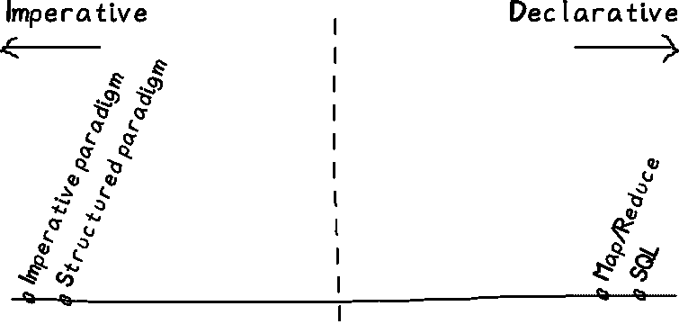
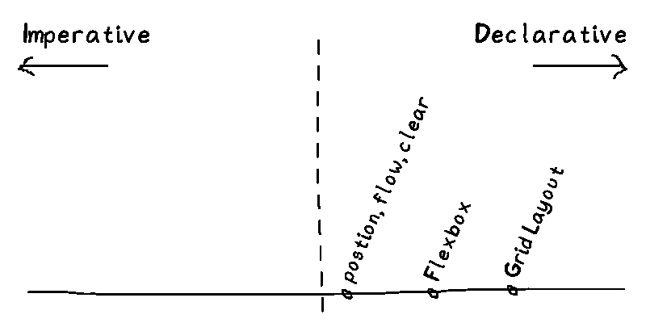

# 命令式 vs 陈述式

> 原文：<https://dev.to/stereobooster/imperative-vs-declarative-1f09>

命令式 -你一步一步地指示一台机器做什么。例如:汇编语言。
例如:SQL。

命令式 vs 陈述式是[分类思维](https://dev.to/stereobooster/categorical-thinking-22kp)局限性的一个例子。有一系列的价值观，但我们被困在两个类别。

让我们来看一些例子。

### 列表操作

列出操作(迭代、过滤等),从最迫切的到最明确的方法:

1.  命令式编程，包括`goto`(或现代汇编的`jump`)。例如组装。
2.  [结构化编程](http://cs.lmu.edu/~ray/notes/paradigms/)，包括`for`循环和对数组元素的索引访问。比如帕斯卡。
3.  Map/Reduce 概念，包括 Map 和 Reduce 操作，但是抽象出列表本身是如何组织的。例如 map/reduce in Scheme。
4.  关系数据库，它抽象出存储的所有实现细节。例如 SQL。

### CSS 位置模型

CSS 将模型从最命令式方法定位到最声明式方法:

1.  `position`、`float`、`padding`、`margin`。你需要改变这些属性来实现你想要的布局。例如，参见[如何将 div 定位在中心](https://css-tricks.com/centering-css-complete-guide/)。
2.  Flexbox。[很多黑客消失了](https://philipwalton.github.io/solved-by-flexbox/)，但是你仍然不能精确地描述布局，它仍然是一些近似值
3.  [CSS 网格布局](https://css-tricks.com/snippets/css/complete-guide-grid/)。你可以描述一下布局。

此外，需要注意的是，CSS 中有太多的“旋钮”来操纵布局。请参见来自 deconstructconf 的视频，了解如何更好地解决这一任务。

*由法比奥·罗斯在 Unsplash 上拍摄的照片*