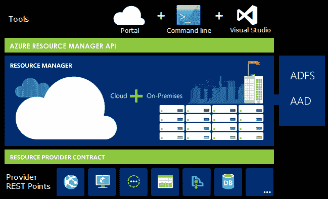
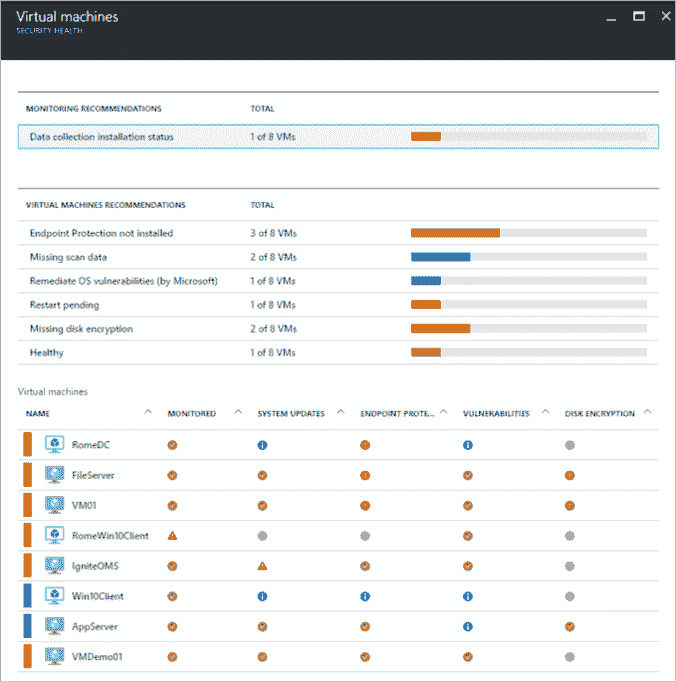

# 实施主机安全性

> 原文：<https://dev.to/cheahengsoon/implement-host-security-5d0>

**配置端点安全**

*   直接与用户交互的计算机系统被认为是端点系统
*   端点系统通常容易受到安全攻击
*   Azure Security Center 提供了强化网络、保护服务和巩固安全状态所需的工具
*   第一步:防范恶意软件
    *   安装反恶意软件解决方案并将其与安全中心集成
*   第二步:监控反恶意软件的状态
    *   安全中心监控反恶意软件保护的状态，并在端点保护问题刀片下报告此情况

**使用模板或虚拟机级策略配置虚拟机安全性**

*   Azure 资源管理器是 Azure 订阅的部署和管理服务
*   它提供了一致的管理层，使您能够创建、更新和删除 Azure 订阅中的资源
*   当您通过门户、PowerShell、Azure CLI、REST APIs 或客户端 SDK 采取行动时，Azure 资源管理器 API 会处理您的请求

**在 Azure 上强化虚拟机**

*   Azure 安全中心通过提高 Azure 资源安全的可见性和控制力，帮助您预防、检测和响应威胁
*   当您使用安全中心来保护您的虚拟机时，可以使用以下功能:
    *   具有推荐配置规则的操作系统(OS)安全设置
    *   缺少系统安全性和关键更新
    *   端点保护建议
    *   磁盘加密验证
    *   漏洞评估和补救
    *   威胁检测
*   安全策略为指定的订阅或资源组中的资源定义了一组推荐的控件
*   要在 Azure 上强化虚拟机，您可以:
    *   设置安全策略来管理虚拟机的漏洞
    *   启用数据收集，以便安全中心可以收集必要的信息
    *   使用安全中心分析 Azure 资源的安全状态
    *   使用安全中心监控、分析和启用安全策略来识别潜在漏洞

**在 Azure 中配置系统更新**

*   更新管理服务使您能够评估整个环境中的更新状态，并管理 Windows 和 Linux 服务器修补
*   您的 Azure 订阅包括免费的更新管理
*   由更新管理管理的计算机使用以下配置来执行评估和更新部署:
    *   用于 Windows 或 Linux 的 Microsoft Monitoring Agent (MMA)
    *   适用于 Linux 的 Windows PowerShell 中的所需状态配置(DSC)
    *   Azure 自动化中的混合 Runbook Worker
    *   用于 Windows 计算机的 Microsoft Update 或 Windows Server Update Services(WSUS)

**实施平台更新**

*   我们建议您在任何情况下都使用 Azure Automation 中的更新管理解决方案来管理 Windows 和 Linux 计算机的操作系统更新
*   你可以直接从你的 Azure Automation 帐户启用虚拟机的更新管理

**加固连接到 Azure**
Windows 10、Windows Server 2016 和 Windows Server 2019 的设备包括以下关键安全功能:

*   Windows Defender 凭据保护
    *   使用基于虚拟化的安全性来隔离机密，以便只有特权系统软件才能访问它们
*   Windows Defender 设备保护
*   Windows Defender 应用程序控件
    *   通过限制用户可以运行的应用程序以及在系统核心或内核中运行的代码，帮助减轻间谍软件、广告软件、rootkits、病毒和键盘记录程序的攻击