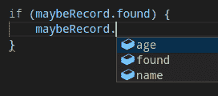

# 使用 TypeScript 类型保护实现 Maybe 模式

> 原文：<https://dev.to/jwulf/implementing-a-maybe-pattern-using-a-typescript-type-guard-4ebl>

你坐在餐馆里，点了一杯啤酒。服务员消失在厨房里，几分钟后空手回来。“对不起，T1，”他说。*我拿不到你的啤酒。*

现在，这是一个价值 600 万美元的问题:餐厅没有你点的啤酒了(商业逻辑)，还是餐厅的厨房着火了(基础设施故障)？

您如何在 API 中对这两种不同的故障状态进行建模？(餐馆的比喻归功于科里·纳恩)。

最近，我在用 TypeScript 开发一个数据库库。它提供了对存储过程的强类型抽象，允许应用程序以声明方式与数据模型进行交互，而不会泄露实现细节。

通过这种方式，我们可以实现缓存，甚至在不对应用程序逻辑或单元测试进行任何更改的情况下切换出数据库——这很容易编写，因为我们可以模拟数据层接口。

这种方法的灵感来自今年我和马克·西曼在悉尼 NDC 大学参加的一个研讨会。在该研讨会中，我们研究了如何使用幺半群来模拟多个返回状态。

## 成功与失败:不是二元状态

检索记录的数据库调用可能成功，也可能失败。由于致命的异常，它可能无法检索任何内容，比如数据库丢失。然而，如果数据库调用成功，我们需要表示两种状态:或者“这是记录”，或者“没有找到记录”。所以我们有三种状态需要表示:致命异常、有数据的成功和没有数据的成功。

这些可以被认为是失败模式(基础设施失败)、成功模式和混合成功/失败模式(基础设施成功/应用程序数据失败)。

科里·纳恩(Kory Nunn)这样描述各州的细微差别:我去餐馆点了一杯啤酒。服务员去了厨房，然后回来说:“对不起，我不能给你拿啤酒。”

这里的问题是:你为什么不能给我一杯啤酒？啤酒喝完了吗(没有找到记录)？还是厨房着火了(数据库消失)？

这是两种可能的故障模式之间的崩溃。

Kory 已经开发了 [Righto](https://github.com/KoryNunn/righto) 库，用于延迟评估异步操作并对这两种故障状态进行建模。

然而，对于这个库，我们采用了不同的方法，从 Maybe monad 中获取灵感。

## 厨房肯定着火了！

首先，我们将数据库故障建模为异常。如果厨房着火了，我们扔。这将中断应用程序逻辑流，处理这种情况是调用者的责任。如果厨房着火了，停止行动。

然而，如果厨房没有着火，我们需要模拟两种状态:我们得到一条记录(“这是您的啤酒！”)，或者没有找到匹配的记录(“对不起，我们没有福斯特啤酒了。实际上，我们在澳大利亚没有库存。”).

一个简单的方法是测试数据库调用的返回，看它是否为空。然而，这不能被静态地检查，因为它依赖于运行时返回值。我们也不能强迫开发人员处理这种情况(有一个警告，我将解决)。

## 厨房没有着火——这可能是你的啤酒，也可能不是…

所以我们将返回值实现为 maybe record——也许您得到了一条记录，也许没有。

我们可以使用 TypeScript 的类型保护来强制处理这两种情况。有些类型脚本可能是 Monad 实现，比如 TS-Monad。然而，这给开发人员带来了冗长的语法负担，使代码晦涩难懂。

举个例子，这里有一些惯用的 JavaScript，开发人员在尝试使用某个值之前会对其进行测试:

```
if (age) {
    var busPass = getBusPass(age); // might be null or undefined
    if (busPass) {
        canRideForFree = busPass.isValidForRoute('Weston');
    }
} 
```

这是我之前的警告:如果使用严格的空值检查并将 getBussPass()的返回签名定义为 BussPass？或者 BussPass | undefined，那么你会得到一个 busPass 可能未定义的错误。您可以对此使用类型保护，但您的意图并不明确。

对于 TS 单子，您可以这样写:

```
var canRideForFree = user.getAge() 
    .bind(age => getBusPass(age))   
    .caseOf({
        just: busPass => busPass.isValidForRoute('Weston'),
        nothing: () => false
    }); 
```

它很明确，但是冗长——而且不是惯用的 JavaScript 或 TypeScript。不理想。

## 使用 TypeScript 类型保护来键入“Maybe”

我们使用 TypeScript 的文字类型和类型保护来构建一个可能模式。它不是 monad——它是不可组合的——但它确实为我们提供了零安全性，并迫使应用程序开发人员考虑围绕两种成功状态的逻辑。

我们将方法的签名定义为 MaybeRecord，其中:

```
type MaybeRecord = Record | RecordNotFound 
```

然后我们这样定义这两种类型:

```
class RecordNotFound {
    found: false = false;
}

class Record {
    found: true = true;
    name: string;
    age: number;
    constructor(name: string, age: number) {
        this.name = name;
        this.age = age;
    }
} 
```

在方法实现中，我们返回`new RecordNotFound()`或`new Record(res.name, res.age)`。

然后在消费代码中，返回值只有找到的交集属性。所以如果我们做一个小的测试实现:

```
function returnMaybeRecord(exists: boolean): MaybeRecord {
    if (exists) {
        return new Record('Joe Bloggs', 42);
    } else {
        return new RecordNotFound();
    }
} 
```

当我们这样做时，我们可以看到 VSCode 中发生了什么:

```
const maybeExists = Math.random() > 0.5;
const maybeRecord = returnMaybeRecord(maybeExists); 
```

[](https://res.cloudinary.com/practicaldev/image/fetch/s--CIi6jLjU--/c_limit%2Cf_auto%2Cfl_progressive%2Cq_auto%2Cw_880/https://thepracticaldev.s3.amazonaws.com/i/7ul13gmrrcwxucfc2x7g.png)

唯一可靠地存在于返回值上的属性是`found`。如果我们现在写一个类型守卫:

```
if (maybeRecord.found) {

} 
```

现在，在类型保护中我们有一个`Record`:

[](https://res.cloudinary.com/practicaldev/image/fetch/s--dhHHdu3q--/c_limit%2Cf_auto%2Cfl_progressive%2Cq_auto%2Cw_880/https://thepracticaldev.s3.amazonaws.com/i/2be5ulkxjrbbz8415bqp.png)

这在应用程序中强制要求在使用之前必须明确检查`maybeRecord`。