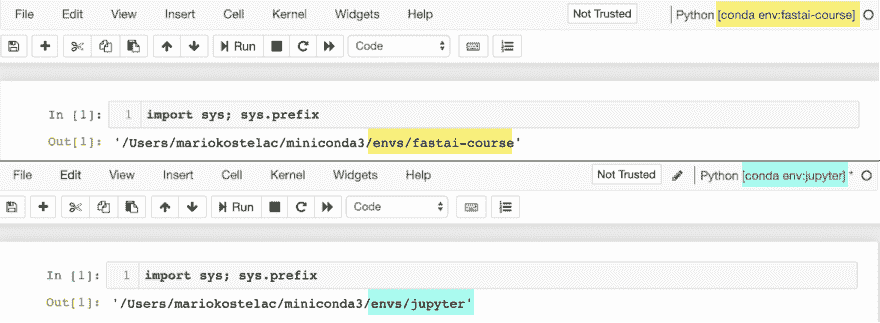

# 在 Jupyter 笔记本中导入包

> 原文：<https://dev.to/mariokostelac/importing-packages-in-jupyter-notebooks-2a65>

*看到“ImportError:没有名为 tensorflow 的模块”却知道自己安装了？有时候可以从控制台导入包，但不能从 Jupyter 笔记本导入？！pip 安装 tensorflow 有时就是不工作？*

不是关于你的。这并不是说 python 古怪。它实际上是关于你的机器**运行多个 python 安装(环境)。**让我们对那里发生的事情和导致你的包在安装后丢失的原因有一个基本的了解。一旦你理解了这一点，你在安装和导入你需要的包时就不会有什么问题了。

## 你正在运行 python 的多个环境。那很好！

[](https://res.cloudinary.com/practicaldev/image/fetch/s--_HX7G9oV--/c_limit%2Cf_auto%2Cfl_progressive%2Cq_auto%2Cw_880/https://biasandvariance.cimg/importing-packages-in-jupyter/thisisfine.jpg) 不精成这样！这其实很好，不是你的错。因为不是所有的 python2 工具都移植到 python3，所以有可能你的操作系统运行两个版本而你什么都不用碰。

例如，我同时安装了 python 2 和 python 3。当我在控制台中调用 python 时，python 2.7.10 被调用；当我调用 python3 时，python 3.7.1 被调用。还有更好的。我有多个 python 3.6.3 的环境(是的，都是同一个版本)，它们根据我当前正在进行的项目动态加载(感谢 conda)。我每天都在创建和破坏 python 环境。

那么我如何知道当前运行的是什么环境呢？轻松点。通过在交互控制台中运行`import sys; sys.prefix`。这揭示了您当前所处的 python 环境。

[](https://res.cloudinary.com/practicaldev/image/fetch/s--81U5nRJa--/c_limit%2Cf_auto%2Cfl_progressive%2Cq_auto%2Cw_880/https://biasandvariance.cimg/importing-packages-in-jupyter/importsys.png)

### 不同的 python 环境意味着不同的包集合

除非你修改了`$PYTHONPATH`变量(如果你没听说过也没关系)，否则这些环境中的每一个都将使用一套完全独立的包。这就是为什么你不能导入这个包，而且你知道你已经安装了它。你安装的环境不对！

但是你运行的是 Jupyter 而不是控制台，这一切是如何组合在一起的？我们刚刚到达那里。

## 您使用的 Jupyter 内核与您的控制台使用的 python 环境不同。

Jupyter 运行 python 的方式与你的主机不同。它有一个内核的概念(如果你不熟悉这个概念，可以把它想象成用 Jupyter 注册的 python 环境)。运行笔记本的内核可能使用不同的 python 环境，并且肯定没有像您的控制台那样设置所有的环境变量。那也很好。我们知道如何找出哪个环境正在运行我们的代码，所以我们可以在 Jupyter notebook 中做完全相同的事情。

[](https://res.cloudinary.com/practicaldev/image/fetch/s--71oDgRFL--/c_limit%2Cf_auto%2Cfl_progressive%2Cq_auto%2Cw_880/https://biasandvariance.cimg/importing-packages-in-jupyter/twoenvs.png)

啊哈！！！你知道 Jupyter 用的是什么环境。现在你只需要:

*   确保您的控制台(暂时)使用与 Jupyter 笔记本相同的 python 环境。
*   用`conda install`或`pip install`安装包(如果你不知道有什么区别，赶紧去[本指南](https://dev.to/how-not-to-break-your-python-environment-again/))。

酷，酷，酷。但是你不知道如何让你的主机使用相同的环境？很好，我们会在你的笔记本上做，但不会像上次那样。

## 你正在直接从 Jupyter 笔记本安装软件包，但是你做错了。

浏览 StackOverflow 上关于类似问题的文章让我意识到，人们在建议一些大多数时候行不通的东西。如果您通过运行
来安装软件包

```
!conda install tensorflow
# or if you want to use pip
!pip install tensorflow 
```

你正在使用非常脆弱的命令(如果在笔记本上运行),这就是你安装的软件包无法导入的原因。这次天气不好。但是我们会解决的🙏。如果你对其不起作用的底层细节感兴趣，请阅读 Jake Vanderplas 的这篇博文。

## 相反，使用这些命令:

```
import sys
!conda install --yes --prefix {sys.prefix} tensorflow
# or if you want to use pip
!{sys.executable} -m pip install tensorflow 
```

你不会再有该死的导入错误的问题了。

理解这些概念有助于我和我的队友理解发生了什么以及为什么我们会得到这些错误。如果你认为我犯了一个错误，我错过了什么，或者你只是想说谢谢，请在🗣.评论中这样做