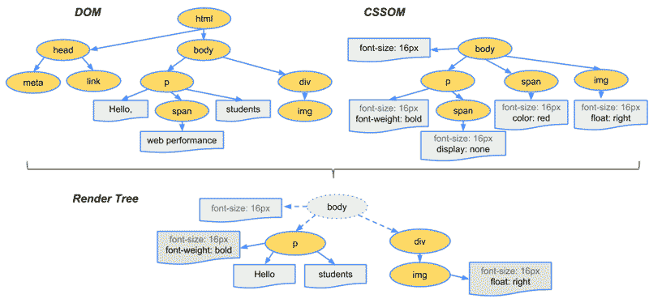

# 提高 HTML 和 CSS 性能

> 原文：<https://dev.to/yashints/improve-html-and-css-performance-4o08>

最近，我有机会在悉尼 NDC 做了一个关于网络性能的演讲，得到了很好的反馈。

这启发了我就我在那次演讲中涉及的每个主题写了一系列的帖子，谁知道呢，也许有一天这些帖子中的每一个都会成为一次单独的演讲😃。

链接到所有其他部分:

[第 2 部分使用预加载/预取来增加加载时间](https://yashints.dev//blog/2018/10/06/web-perf-2)

[第三部分 JavaScript 技巧和窍门](https://yashints.dev//blog/2018/10/12/web-perf-3)

[第四部分图像优化](https://yashints.dev/blog/2018/11/12/web-perf-4)

[第五部分网络字体优化](https://yashints.dev/blog/2018/11/23/web-perf-5)

所以我们开始了，第一部分是关于 HTML 和 CSS 的技巧和窍门，以提高性能。

但是在我们开始之前，你需要知道浏览器是如何呈现你的页面的。这涉及到 [HTML](https://en.wikipedia.org/wiki/HTML) 、 [CSS](https://en.wikipedia.org/wiki/Cascading_Style_Sheets) 和 [JavaScript](https://en.wikipedia.org/wiki/JavaScript) 以及每个浏览器向最终用户展示你的网页所采取的步骤。

## 关键渲染路径

[关键渲染路径](https://css-tricks.com/understanding-critical-rendering-path/)由五个步骤组成，这五个步骤最容易看到:

好了，现在你已经在一张图中看到了，让我更详细地解释每一步。

### 建立 DOM 和 CSSOM

因为大多数页面都是由 HTML、CSS 和 JavaScript 组成的。Web 浏览器需要知道向用户显示什么以及如何显示，他们通过解析通过网络发送的 HTML 页面并构建文档对象模型(DOM)来做到这一点。他们查看 HTML 标签(`

`、`

`、`<h1></h1>`)，并将它们转换成令牌。然后，这些令牌被并行转换为节点。

通过按顺序处理每个标记的开始和结束标记，浏览器然后建立它们的层次结构(父和子)。

这比看起来要简单得多，在上图中，想象 DOM 是一个包含所有节点(分支)和子节点(叶子)的位树。这个树包含了构建 HTML 的所有节点依赖关系:

*图片来自 [W3C 网站](https://www.w3schools.com/js/pic_htmltree.gif)T3】*

DOM 代表整个标记，由浏览器逐步构建。从 HTML5 开始，浏览器支持流 HTML，而不是等待整个页面一次性发送到浏览器。这很好，因为它有助于在字节到达的同时进行渲染。

构建 DOM 后，浏览器查看页面中引用的任何样式来构建 CSS 对象模型(CSSOM)。CSSOM 描述了需要应用于文档的样式规则。这与 DOM 的构建方式非常相似，但是，在这个过程中，每个子元素都继承了应用于其父元素的样式——因此命名为级联样式表。

样式的部分处理是不可能的，所以浏览器需要等待所有的样式规则被发送过来，然后才能开始推断哪个规则被应用到哪个节点。这就是为什么 CSS 是一个渲染阻塞元素的原因。

DOM 和 CSSOM 的混合被称为渲染树。这个树包括所有的节点和它们的依赖项，以及应用于这些节点的所有 CSS 规则。

### 渲染树

构建完所有节点后，浏览器需要知道在页面上显示哪些节点。渲染树就是页面上**可见**内容的精确表示。

浏览器从根开始，然后从 DOM 和 CSSOM 中复制所有可见的**节点。采取的步骤大致如下:**

*   从根节点开始，遍历每个可见的节点
    *   有些节点是不可见的，如元标签、链接等。
    *   一些节点使用 CSS 隐藏，如`display: none`
*   为每个节点找到匹配的 CSS 规则并应用它
*   发出包含内容和样式的可见节点

*图片来自[谷歌开发者](https://developers.google.com/web/fundamentals/performance/critical-rendering-paimg/render-tree-construction.png)T3】*

### 布局

现在我们已经有了所有的节点和它们的样式，是时候决定把它们放在屏幕上的什么地方了。这正是布局步骤。首先需要的是浏览器窗口的大小。这是所有后续计算的基础，因为布局依赖于它来了解每个元素的位置和尺寸。

这一步的输出是[盒子模型](https://www.w3schools.com/css/css_boxmodel.asp)，它捕获它的精确位置和大小，加上它们的边距、填充、边框等等。

每次改变尺寸或在移动设备上切换横向和纵向时，都会重复这一步。

### 作画

这一步是在屏幕上绘制像素的最后一步，这可能需要一些时间，因为浏览器有相当多的工作要做。这个时间取决于窗口大小、每个节点应用多少样式、设备上使用的硬件等等。

当这一步完成时，页面最终在视窗中可见。

## 那又怎样

好了，关键渲染路径已经足够了，让我们看看如何通过调整 HTML 和 CSS 来提高 web 性能。

### 将 HTML 流至客户端

当发送 HTML 到客户端时，试着经常刷新缓冲区，而不是在结束时才刷新一次。这意味着大块的 HTML 将到达，浏览器可以在它们到达时解析它们，而不是在末尾。这将有助于提高性能。

例如，当到达`HEAD`标签时，浏览器可以发送对资产的其他请求，而其余的 HTML 正在到达。

### 大小要紧

缩小和压缩真的很重要，因为它可以减少有效负载的大小，减少 HTTP 响应时间，从而导致更好的加载时间。

这些技术和正确的缓存策略可以极大地帮助提高 web 性能。

### 尽早发送 CSS 并保持其最小化

正如你所看到的，CSS 是一个渲染阻塞元素，所以它应该尽早发送给客户端。还要考虑在第一次页面加载时需要多少 CSS，从主文件中提取未使用的 CSS，并在需要时单独加载它们。

您还可以使用预加载/预缓存来提高性能。这些是谷歌在 2016 年推出的 [PRPL 模式的一部分。](https://developers.google.com/web/fundamentals/performance/prpl-pattern/)

另一种开发人员不常使用的技术是在正文和内容中使用链接标签。这真的很有用，因为你可以在一个`style tag`中向客户端发送最小量的 CSS，然后在需要的时候加载剩余的 CSS 来改善渲染时间。

## 总结

简而言之，保持你的资源最少，并快速和最佳地发送它们。尝试减少未使用的 CSS 规则，并使用缩小和压缩来加快传输速度。

希望你喜欢阅读这篇文章，并期待着该系列的其余部分😉。

### 资源

*   网络性能对谷歌开发者至关重要
*   了解关键渲染路径 [CSS 技巧](https://css-tricks.com/understanding-critical-rendering-path/)