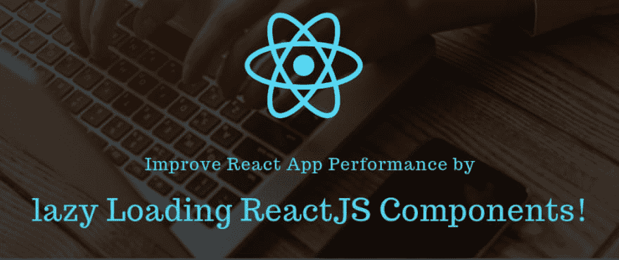
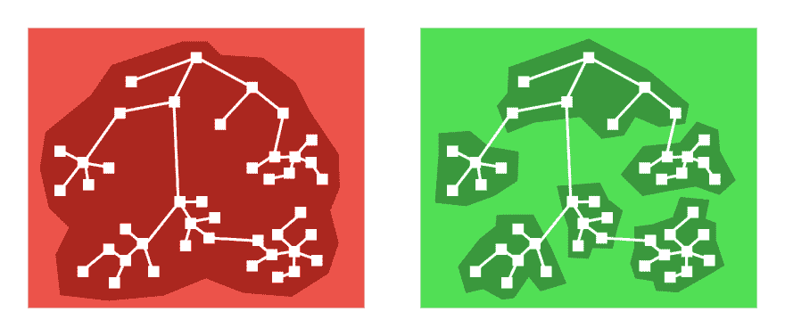
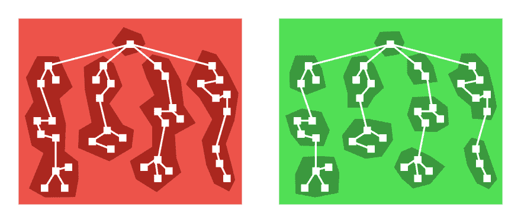

# 通过延迟加载 ReactJS 组件提高 React App 性能！

> 原文：<https://dev.to/botreetech/improve-react-app-performance-by-lazy-loading-reactjs-components-1imd>

我们正在开发 React 应用程序(使用 [Create React 应用程序](https://facebook.github.io/create-react-app/docs/getting-started)构建),并将其与 Webpack 捆绑在一起。最初，应用程序的规模较小，只有不到 30 个组件，一切进展顺利。但是工作一年多，组件增加到 100 多个。突然事情开始变慢了！捆绑包的大小大大增加，应用程序开始变慢。所以我们这里需要帮助，[反应可加载](https://github.com/jamiebuilds/react-loadable)。

## 什么是 React 可加载？

React Loadable 是一个小库，它使得 ReactJS 中以组件为中心的代码拆分变得非常容易。

**loadabled**是一个高阶组件(在 React 术语中，高阶组件是一个创建另一个组件的函数)，它允许您在将任何模块渲染到您的应用程序之前动态加载它。

## 什么是代码拆分？

代码分割是将大型 webpack 捆绑包分割成多个较小的应用捆绑包(块)的过程。

考虑 web 应用程序的以下结构。

应用

*   成分

    *   子组件 A1
    *   子组件 A2
    *   子组件 A3
*   成分

    *   子成分 B1
    *   子组件 B2
*   成分

    *   子组件 C1
    *   子组件 C2

Webpack 会将所有组件一起加载到一个 **main.js** 文件中。我们希望组件以更小的包(块)装载。我们来看下面的对比。

图片的左边部分(红色的)-这是一个大的网络包包。所有的 react 组件都作为一个大的包进行加载。

图像的右边部分(绿色部分)-是基于组件的分割。所有的组件都是按需以较小的块独立加载的！

**a .无反应可加载**

一个大型 main.js 文件一个大型包中的整个应用程序

**b .带反应浮动**

分块加载组件！因此异步加载组件减少了加载时间。

## 基于路由的拆分与基于组件的拆分

**1。基于路由的拆分(红色一号)**

根据路径，您可以延迟加载组件。这对于组件较少的小应用程序来说可能很有效。但是考虑一个场景，其中您在一个路由上实现了不同的选项卡(考虑 3 个选项卡)。当用户在 tab 1 时，我们为什么要加载 tab 3 的内容，tab 3 的计算逻辑很重。用户可能永远不会转到标签 3。

或者考虑 tab 1 中有 5 个组件。但是我们可以延迟组件 3 到 5 的加载，因为与用户将首先查看的组件 1 和 2 相比，它们的优先级较低。

这个场景引导我们进行基于组件的拆分。

**2。基于组件的拆分(绿色一个)**

基于组件的拆分允许组件被异步加载。

React Loadable 还能够加载延迟的组件(例如 500 毫秒后加载组件)。这通过延迟应用程序加载和减少页面加载时间，为 React 应用程序提供了强大的功能。

除非真正需要，否则组件不会被加载到 DOM 中！此外，与 React 应用程序的集成非常简单！

### Read 亦- [顶级库配合高级 React JS 应用使用！](https://www.botreetechnologies.com/blog/top-libraries-to-use-with-advanced-react-js-applications)

### 在动作中反应可加载

考虑您的组件的以下示例！