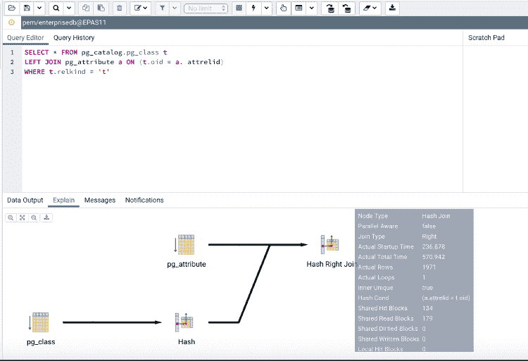
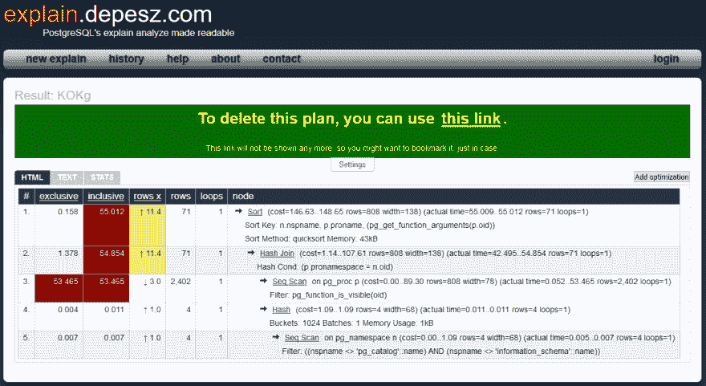
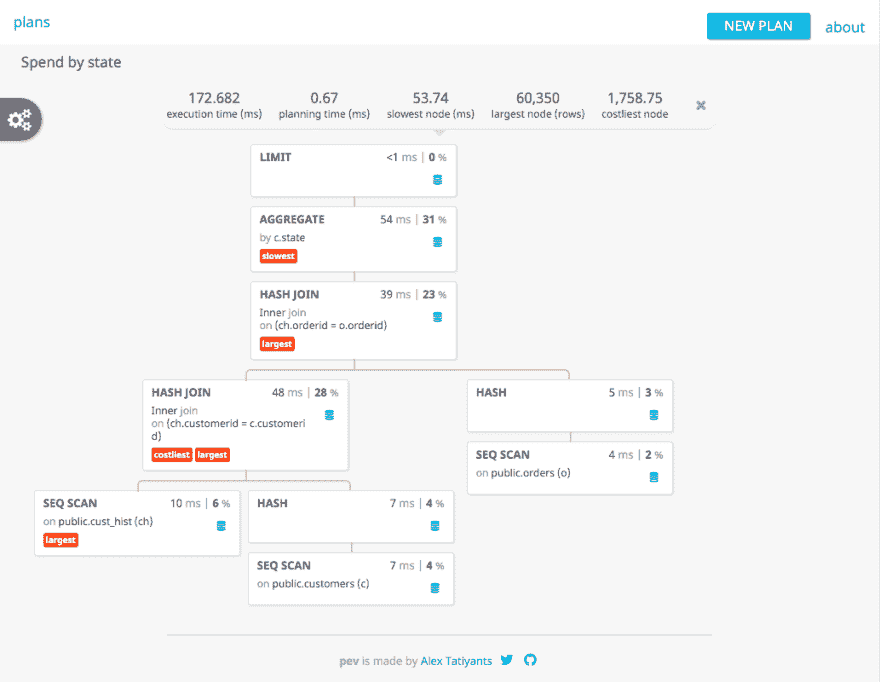

# 改进 PostgreSQL 查询

> 原文：<https://dev.to/elmuerte/improving-postgresql-queries-4pc1>

不久前[我评论说我的大胜利](https://dev.to/elmuerte/comment/9mad)是将一个需要一个多小时才能执行的查询改进到了 30 秒。事实上，对于客户机来说，这个查询从将近 2 小时缩短到大约 2 分钟，其中包括传输数百万行。在过去的几个月里，我优化了很多其他的查询。

本文将主要讨论报告或商业智能(BI)查询。这些查询通常很大/很复杂，涉及大量数据，通常需要*长*的时间来执行。我说的“长 T2”是指几十秒，如果不是几分钟或几小时的话。

我将在本文中解释的一些内容也适用于更标准的应用程序查询，比如搜索查询。但是我不能确定。这让我想到了最重要的一步。

# 解释查询计划

任何严肃的 DBMS 都有一个选项来获取关于 DBMS 将如何执行查询的信息。这就是*查询计划*。每次您更改任何内容时，都应该请求一个查询计划来查看它是如何受到影响的。更改包括对 PostgreSQL 服务器设置的更改，以及服务器的升级。很有可能优化后的查询性能会更差。

在 PostgreSQL 中，可以使用 [EXPLAIN](https://www.postgresql.org/docs/current/sql-explain.html) 命令检索查询计划。你只需在你的查询前面加上这个，它就会产生一大堆输出。

`EXPLAIN`命令有多种选项。我一般用`EXPLAIN (VERBOSE)`来获取最重要的信息。当您还包括`ANALYZE`选项时，PostgreSQL 也将执行查询并返回实际的执行信息，而不仅仅是计划。然而，如果您的查询需要半个小时才能执行，这并没有什么帮助。使用`ANALYZE`，您可能还想包含`BUFFERS`选项来获取关于共享缓冲区使用情况的信息。

您可能需要的另一个选项是`FORMAT`选项。选择哪种格式取决于您用于可视化/分析查询计划的工具。默认的输出是非常易读的。但是当查询非常复杂时，跟踪嵌套就变得很困难。

```
EXPLAIN SELECT sum(i) FROM foo WHERE i < 10;

                             QUERY PLAN
---------------------------------------------------------------------
 Aggregate  (cost=23.93..23.93 rows=1 width=4)
   ->  Index Scan using fi on foo  (cost=0.00..23.92 rows=6 width=4)
         Index Cond: (i < 10)
(3 rows) 
```

输出格式包括`JSON`、`XML`、`YAML`，默认为`TEXT`。

## 查询计划可视化

有相当多的工具可以使查询计划变得更容易使用。

注意:尽管这些可视化非常有用，但本文将包含纯文本输出，因为大多数细节隐藏在交互式使用的背后。

### pgAdmin

PostgreSQL [pgAdmin](https://www.pgadmin.org/) 的标准管理工具内置了可视化功能。简单地使用解释操作执行查询。你会得到一个可视化的表示。

[](https://res.cloudinary.com/practicaldev/image/fetch/s--4iJsIisF--/c_limit%2Cf_auto%2Cfl_progressive%2Cq_auto%2Cw_880/https://thepracticaldev.s3.amazonaws.com/i/bgx82c2qubf4m76br3ju.png)

根据该步骤的成本，不同查询部分之间的线条会变粗。(注意:设置分析选项以包括成本。)所以会很容易找到最大的成本来自哪里。但是请注意，线条的粗细与查询的总开销无关。因此，成本为 1，000，000 的零件与成本为 10，000 的零件具有相同的厚度。

将鼠标悬停在各个节点上会显示一些额外的详细信息。

### depesz '解释工具

[Depesz](https://explain.depesz.com/) 有一个在线工具，你可以将`TEXT`的输出粘贴到 explain 中，并以一种更容易浏览的 HTML 表格的形式呈现出来。

它将突出显示查询中最昂贵的部分。一旦开始优化查询，就可以不断添加新的查询计划来进行比较。

[](https://res.cloudinary.com/practicaldev/image/fetch/s--v4bj8OuF--/c_limit%2Cf_auto%2Cfl_progressive%2Cq_auto%2Cw_880/https://thepracticaldev.s3.amazonaws.com/i/gveji1vmdl8vgjnej9j8.png)

### Postgres 解释可视化工具(pev)

Pev 是另一个可视化查询计划的在线工具。这一个使用 JSON 输出格式，并且更喜欢使用`ANALYZE`选项。

它产生了一个非常漂亮的输出，并给出了查询的哪些部分最有问题的提示。

[](https://res.cloudinary.com/practicaldev/image/fetch/s--Lkz-XjAC--/c_limit%2Cf_auto%2Cfl_progressive%2Cq_auto%2Cw_880/https://thepracticaldev.s3.amazonaws.com/i/dkclcdsy6pt18p32fz8x.png)

当您有非常复杂的查询时，可视化可能会变得更加难以导航。

请务必阅读[博客文章](http://tatiyants.com/postgres-query-plan-visualization/)以获得关于该工具的更多解释。

## 我喜欢有计划的时候

一旦有了查询计划，就应该检查它以寻找可能的改进点。

您的第一个关注点应该是成本最高的最低级别节点。这是你可能收获最多的地方。计划中的每个条目都包含一个成本范围:`cost=0.00..23.92`。第一个值可以认为是乐观成本，第二个值可以认为是悲观成本，或者最小和最大成本。这些数字没有合理的单位，只是把它们当作低数字就好，高数就不好。优化查询时，获取初始成本，然后尝试降低这两个值。

通常，开销最大的部分是大型表的顺序表扫描(查询计划中的`Seq Scan`)。目标是努力摆脱这些。但是请注意，PostgreSQL 很乐意选择对小表执行顺序表扫描，而不是使用索引。这些操作的成本通常很低，所以不要简单地试图摆脱所有的顺序表扫描。

如前所述，每次进行更改时，都必须生成一个新的查询计划。成本可能会转移到计划中的不同部分，实际上不会产生任何影响。或者新计划可能会表现得更糟。

在[文档](https://www.postgresql.org/docs/current/using-explain.html)中可以找到关于输出的更详细的解释。

# 规则优化

> 规则 1:不要
> 
> 规则 2:现在不要
> 
> 迈克尔·杰克逊

在优化查询之前，先尝试一下。然后用不同的参数试一下。它甚至可能还不需要优化。只有在性能不能接受的时候，才努力改进，直到可以接受。

一定要用不同的范围测试查询，看看它是如何伸缩的。我一般用 *N* 、 *10N* 、 *100N* 测试。其中 *N* 是预期标称范围， *10N* 是最坏情况。我总是包括一个 *100N* 这是你不期望的范围，但会比你期望的更快发生。它只是为了获得查询的伸缩感。

[](https://res.cloudinary.com/practicaldev/image/fetch/s--lgEmQ7hY--/c_limit%2Cf_auto%2Cfl_progressive%2Cq_auto%2Cw_880/https://thepracticaldev.s3.amazonaws.com/i/j53n9tcfq7gdz8imb9aj.jpg)

# 兴趣的设置

PostgreSQL 有许多[设置](https://www.postgresql.org/docs/current/runtime-config.html)，您可以随意使用，这会带来很大的不同。尤其是[资源消耗](https://www.postgresql.org/docs/current/runtime-config-resource.html)和[查询规划设置](https://www.postgresql.org/docs/current/runtime-config-query.html)比较有意思。

开箱即用的 PostgreSQL 配置非常具有防御性，就好像它运行在只有 1gb RAM 的机器上一样。

我将在这里强调一些有趣的设置，这些设置不会太危险。但是请不要仅仅依赖这篇文章。请务必阅读官方文档，并确保在使用设置之前理解它。

## 资源消耗

### 共享缓冲区

您首先要调整的设置之一是`shared_buffers`。这是不同 PostgreSQL 连接可以用来共享数据的内存量。从 dist 中读取的索引等数据。建议将其设置为系统 RAM 的 25%到 40%。一位 PostgreSQL 专家告诉我，在 9.x 系列中，将 8gb 以上的内存分配给共享缓冲区通常不会产生明显的影响。

与其他各种数据库系统不同，PostgreSQL 在很大程度上依赖于操作系统的功能，比如内存中的磁盘缓存。因此，如果您有一个 64GiB 内存的服务器，并且共享缓冲区设置为“仅”8gb，那么许多索引可能不在 PostgreSQL 的共享缓存中，但是它们在磁盘缓存中，因此可以快速访问。

### 临时缓冲区

`temp_buffers`设置控制在刷新到磁盘之前有多少内存可用于临时表。此设置可以在运行时更改，但只能在会话开始时更改。

### 工作记忆

另一个有趣的设定是`work_mem`。它会影响在将数据刷新到磁盘之前，有多少内存可用于哈希表的排序和处理。增加它对有很多子结果的排序和连接的复杂查询有很多积极的影响。对于类似 BI 的查询，增加大小是非常值得的。

工作内存分配是针对每个操作的，在单个会话中可能是多个操作。(尤其是在较新的 PostgreSQL 版本中，查询可以并发执行)。这意味着您应该小心不要让它太大，否则您可能会遇到内存不足的问题。

这是一个也可以在当前会话运行时更改的设置。

## 查询规划设置

这些设置会影响查询计划。弄乱这些设置很容易破坏服务器的性能。所以在大多数情况下，你需要非常小心。

### 有效缓存大小

`effective_cache_size`告诉 PostgreSQL 有多少数据可以缓存在系统内存中。这包括由 PostgreSQL 管理的缓存，也包括由操作系统保存的缓存(如磁盘缓存)。

该设置对内存分配没有影响。它只是给查询规划器一个指示，告诉它数据可能在内存中。

在 Linux 系统上，如果您有系统监视功能，可以跟踪某个时间段内用于缓存的内存量，那么您可以了解系统缓存了多少数据。会告诉您当前使用了多少，但您确实想知道一周/一个月的时间范围。

### 顺序/随机页面成本

`seq_page_cost`和`random_page_cost`设置决定了从磁盘读取数据的成本。默认设置假定旋转磁盘的随机寻道时间远远高于顺序访问。

如果您有全闪存存储，随机寻道时间与顺序访问非常接近。在这种情况下，让随机成本更接近连续成本是有意义的。在某种程度上，这也适用于旋转磁盘上的 SAN 存储。

[](https://res.cloudinary.com/practicaldev/image/fetch/s--QPUMpHQe--/c_limit%2Cf_auto%2Cfl_progressive%2Cq_auto%2Cw_880/https://thepracticaldev.s3.amazonaws.com/i/4g3ol1q88wp9c04wuiba.jpg)

# 指标

提高查询的性能都是关于索引的。没有索引，数据库唯一能做的就是顺序表扫描。但是索引不是免费的。它们需要存储和时间来维护。更改表中的数据意味着受影响的索引也需要更新。更复杂/高级的索引显然需要更多的时间。

最差索引是不被使用的索引。所以只有在需要的时候才创建索引。并删除不使用的索引。

提醒:如前所述，对于小表，查询规划器可能会选择跳过使用索引。

## 多列和已排序的索引

覆盖多列的索引通常优于为单个列创建多个索引。PostgreSQL 将考虑使用多列索引，即使索引中的一些列甚至没有在查询中使用。

例如，如果我们有以下索引:

```
create index order_dates on orders(creation_date, completion_date); 
```

它可以用于使用任意组合的`creation_date`和`completion_date`列的查询。拥有更少索引的好处是它们可以在共享内存和缓存中存在更长的时间。

PostgreSQL 中的默认索引存储类型是 B 树。对于 B 树来说，不管你查找的是最高值还是最低值，它都有相同的复杂度。但是，如果您的大多数查询在索引列上按降序排序，那么在查询执行过程中将会有一个额外的步骤来对结果进行排序。

这个步骤可以通过在索引中添加一个顺序来消除。有两个进口[订购零件](https://www.postgresql.org/docs/current/indexes-ordering.html):

1.  数据排序
2.  空值

您可以独立控制每个的顺序。默认情况下，每一列都是`ASC NULLS LAST`，意味着以空值结尾的升序排列。

如果知道哪些订单还没有完成很重要，那么最好先输入空值。

```
create index order_dates on orders(creation_date, completion_date nulls first); 
```

如果您还对最近完成的订单感兴趣，最好也将 completion_date 设置为降序。

```
create index order_dates on orders(creation_date, completion_date desc);
-- is equivalent to
create index order_dates on orders(creation_date, completion_date desc nulls first); 
```

再次重申，只有当查询在这些列上包含一个`order by`子句时，索引的排序才会影响性能。它不会使索引搜索更快。

## 分部分项指标

索引也会占用空间。大索引不利于缓存。创建一个小索引可以极大地提高性能。使用[部分索引](https://www.postgresql.org/docs/current/indexes-partial.html)可以创建更小的索引。

以前面的`order_dates`为例。如果我们经常需要查询尚未完成的订单，并且订单最终完成是很常见的。那么就有可能在完成日期为空时创建一个小的索引。

```
create index open_orders on orders(completion_date) where completion_date is null; 
```

与`completion_date`列上的完整索引相比，这个索引非常小。因为它很小，而且可能经常使用，所以会被缓存相当多。当它不是时，只需要一些昂贵的磁盘读取操作。

## 索引上的表达式

查询经常在 where 子句中包含表达式。例如，不区分大小写的搜索:

```
select orders where lower(city) = 'devtown'; 
```

在`city`列上创建普通索引没有任何好处。因为该索引将包含`Devtown`、`devtown`等。作为单独的条目。为了使这个查询更快，您可以在表达式 :
上创建一个[索引](https://www.postgresql.org/docs/current/indexes-expressional.html)

```
create index lc_city on orders(lower(city)); 
```

现在，上面的查询可以使用这个索引来快速找到合适的行。

## 仅索引扫描

[仅索引扫描](https://www.postgresql.org/docs/current/indexes-index-only-scans.html)是指索引包含所需的所有数据。通常情况下，索引会产生一个指向实际数据行的指针，然后需要获取该数据行。

但是，如果您创建一个包含查询中选择的所有数据的索引，那么数据库就不必提取该行。您可以将此视为单个表上的快速视图。

您不必将额外的字段作为索引数据的一部分。您可以将它们作为附加数据包含在索引中。

```
create unique index product_ean on product(ean) include(name) 
```

这在产品 ID 上创建了一个唯一的索引，并且在索引中包含了`name`列。以下查询将能够执行仅索引扫描:

```
select product.ean, product.name, order_line.quantity
from order_line
join product on product.ean = order_line.product_ean 
```

使用`INCLUDE(...)`的一个显而易见的好处是，您可以向惟一索引添加额外的列，而不必将其作为惟一性约束的一部分。但是要注意它会消耗存储空间。

[](https://res.cloudinary.com/practicaldev/image/fetch/s--oA8vhm__--/c_limit%2Cf_auto%2Cfl_progressive%2Cq_auto%2Cw_880/https://thepracticaldev.s3.amazonaws.com/i/a26t8umgcibajs3dowr7.jpg)

# 调戏法

当您开始调优查询时，强烈建议[清空并分析](https://www.postgresql.org/docs/current/sql-vacuum.html)或者至少[分析](https://www.postgresql.org/docs/current/sql-analyze.html)您将计划使用的表。

这两个操作都可以在不锁定表的情况下完成。但是显然它们会影响运行操作的性能。

由于查询优化器会受到收集的统计信息的影响，因此这些统计信息相对较新是很重要的。PostgreSQL 会在特定时刻自动清空和自动分析表。在您的调优过程中，这种情况很有可能发生。那么看起来您改进了查询，但是这是由于具有较新统计数据的不同查询计划。

您可以通过检查 [pg_stat_all_tables 视图](https://www.postgresql.org/docs/current/monitoring-stats.html#PG-STAT-ALL-TABLES-VIEW)来检查最近对表进行了多少次分析或清空。

但是现在我应用了一些技巧来改进一些查询。

## 太大而无法加入

这第一招看起来很奇怪。默认情况下，您会期望查询规划器这样做。但显然在我应用它的服务器上情况并非如此。也许它在新版本中有所改变，但是对于 PostgreSQL 来说，这个技巧将一个需要几个小时执行的查询变成了一个只需要几秒钟的查询。

该查询的目标是检索在特定时期内发生变化的订单的大量详细信息。数据库结构大致如下。

[](https://res.cloudinary.com/practicaldev/image/fetch/s--aP1scHKN--/c_limit%2Cf_auto%2Cfl_progressive%2Cq_auto%2Cw_880/https://thepracticaldev.s3.amazonaws.com/i/laieefydtssgfnwgcz65.png)

这些表格包含许多行数据:

| 桌子 | 行 | 大小 |
| --- | --- | --- |
| 命令 | Thirty-one million eight hundred and eighty-nine thousand one hundred | 15 磅 |
| 订单行 | Seventy-three million six hundred and ninety-nine thousand four hundred | 70 吉卜 |
| 订单 _ 行 _ 明细 | Two billion three hundred and twenty million four hundred thousand | 265 吉卜 |

### 尝试#1:简单选择

获取过去 6 小时内更改的订单的所有详细信息的最直接的查询应该是这样的:

```
select d.* 
from orders o
join order_line l on l.order_id = o.id
join order_line_detail d on d.line_id = l.id
where o.last_update > now() - interval '6 hours'; 
```

这个查询需要几个小时来执行。查询计划说明了原因。注意:因为这需要很长时间，所以查询计划在没有实际计时的情况下执行。

```
Hash Join  (cost=10717890.78..77356068.23 rows=823481 width=28)
  Hash Cond: (d.line_id = l.id)
  ->  Seq Scan on order_line_detail d  (cost=0.00..57928447.92 rows=2320398592 width=28)
  ->  Hash  (cost=10717563.84..10717563.84 rows=26155 width=4)
        ->  Hash Join  (cost=42202.77..10717563.84 rows=26155 width=4)
              Hash Cond: (l.order_systemid = o.id)
              ->  Seq Scan on order_line l  (cost=0.00..9938105.76 rows=73699376 width=8)
              ->  Hash  (cost=42061.31..42061.31 rows=11317 width=4)
                    ->  Index Scan using order_last_update_idx on orders o  (cost=0.57..42061.31 rows=11317 width=4)
                          Index Cond: (last_update > (now() - '06:00:00'::interval)) 
```

它根据索引选择订单。但是在那之后，两个最大的表接收顺序扫描。您可能认为外键上的索引丢失了。但事实并非如此。

### 尝试#2:子选择

所以让我们试试别的方法，使用子选择。

```
select d.*
from order_line_detail d
where d.line_id in (
    select l.id
    from order_line l
    where l.order_id in (
        select o.id
        from orders o
        where o.last_update > now() - interval '6 hours'
    )
); 
```

计划变了，看起来更复杂，但是仍然有两个非常昂贵的顺序表扫描。

```
Hash Join  (cost=11221517.77..94488998.34 rows=2320398592 width=28)
  Hash Cond: (d.line_id = l.id)
  ->  Seq Scan on order_line_detail d  (cost=0.00..57928447.92 rows=2320398592 width=28)
  ->  Hash  (cost=11136752.37..11136752.37 rows=6781232 width=4)
        ->  Unique  (cost=11102846.21..11136752.37 rows=6781232 width=4)
              ->  Sort  (cost=11102846.21..11119799.29 rows=6781232 width=4)
                    Sort Key: l.id
                    ->  Hash Semi Join  (cost=42195.43..10333409.79 rows=6781232 width=4)
                          Hash Cond: (l.order_systemid = o.id)
                          ->  Seq Scan on order_line l  (cost=0.00..9938105.76 rows=73699376 width=8)
                          ->  Hash  (cost=42053.99..42053.99 rows=11315 width=4)
                                ->  Index Scan using order_last_update_idx on orders o  (cost=0.57..42053.99 rows=11315 width=4)
                                      Index Cond: (last_update > (now() - '06:00:00'::interval)) 
```

仍然不实用。

### 尝试#3:常用表表达式

PostgreSQL 支持所谓的[通用表表达式](https://www.postgresql.org/docs/current/queries-with.html) (CTE)。虽然像这样的简单查询对 cte 的典型用例没有好处，但尝试一下也无妨。

新的查询变成了:

```
with cte_order as (
    select o.id 
    from orders o
    where o.last_update > now() - interval '6 hours'
),
cte_line as (
    select l.id
    from order_line l
    where l.order_id in (
        select * from cte_order
    )
)
select d.*
from order_line_details d
where d.id in (select * from cte_line) 
```

对于它应该做的事情来说，看起来相当复杂。基本上每个子选择都被移到了 CTE。

所以让我们来看看这个查询。(注意:以实际时间执行，因为它太快了)

```
Nested Loop  (cost=1225650.89..19184158.78 rows=1160199296 width=28) (actual time=471.251..1171.805 rows=1500960 loops=1)
  CTE cte_order
    ->  Index Scan using co_last_update_idx on orders o  (cost=0.57..42009.62 rows=11303 width=4) (actual time=0.262..51.518 rows=8777 loops=1)
          Index Cond: (last_update > (now() - '06:00:00'::interval))
  CTE cte_line
    ->  Nested Loop  (cost=254.88..354522.71 rows=36849688 width=4) (actual time=56.620..443.167 rows=35141 loops=1)
          ->  HashAggregate  (cost=254.32..256.32 rows=200 width=4) (actual time=56.567..61.080 rows=8777 loops=1)
                ->  CTE Scan on cte_order  (cost=0.00..226.06 rows=11303 width=4) (actual time=0.265..53.986 rows=8777 loops=1)
          ->  Index Scan using order_line_order_id_idx on order_line l  (cost=0.57..1765.34 rows=599 width=8) (actual time=0.020..0.042 rows=4 loops=8777)
                Index Cond: (order_id = cte_order.id)
  ->  HashAggregate  (cost=829117.98..829119.98 rows=200 width=4) (actual time=471.222..489.199 rows=35141 loops=1)
        ->  CTE Scan on cte_line  (cost=0.00..736993.76 rows=36849688 width=4) (actual time=56.623..454.029 rows=35141 loops=1)
  ->  Index Scan using order_line_detail_entity_id_idx on order_line_detail d  (cost=0.58..89389.59 rows=40294 width=28) (actual time=0.006..0.014 rows=43 loops=35141)
        Index Cond: (line_id = cte_line.id) 
```

这就是了。没有顺序表扫描，只有索引使用。该查询用了 1 秒多一点的时间找到了 1，500，960 行。这一次的成本估算非常不准确。这就是为什么你不应该仅仅依赖于成本估算，还应该尝试使用`ANALYZE`选项的`EXPLAIN`。

尽管所有三个查询都会产生完全相同的输出，但是为查询规划器提供不同的构造会产生完全不同的结果。

## 支点

下一个技巧花了我很多时间来执行。首先，我必须正确地将这个长达 350 行的报告查询格式化成可读的格式。

查询的一部分看起来像这样。

```
with order_price_transport as (
    select orders.id, price_parts.code, price_parts.status, sum(price_parts.amount)
    from orders
    join price_parts on price_parts.order_id = orders.id
    where price_parts.code in ('FUEL', FREIGHT)
    group by orders.id, price_parts.code, price_parts.status
),
-- ...
order_price_other as (
    select orders.id, price_parts.code, price_parts.status, sum(price_parts.amount)
    from orders
    join price_parts on price_parts.order_id = orders.id
    where price_parts.code not in ('FUEL', 'FREIGHT', ...)
    group by orders.id, price_parts.code, price_parts.status
),
-- ... a whole bunch bunch of other CTEs
select
    orders.id,
    -- ...
    est_trans_price.amount,
    act_trans_price.amount,
    est_other_price.amount,
    act_other_price.amount,
    -- ...
from orders
join order_price_transport as est_trans_price on est_trans_price.id = orders.id and est_trans_price.status = 'estimated'
join order_price_transport as act_trans_price on act_trans_price.id = orders.id and act_trans_price.status = 'actual'
-- ...
join order_price_other as est_other_price on est_other_price.id = orders.id and est_other_price.status = 'estimated'
join order_price_other as act_other_price on act_trans_price.id = orders.id and act_other_price.status = 'actual'
-- ...
where orders.creation_date between $P{START_DATE} and $P{END_DATE}
and orders.organization_id in ($P!{ORGANIZATION_LIST})
and orders.status_id in (123, 456) 
```

我放`-- ...`的地方包含了更多的东西。简单地说，这份报告做得不好。它包含了许多相似的公共表表达式(cte)。他们中的一些人甚至多次加入。

cte 的结果以及相关的观点并没有被缓存。它们在每次使用时都会被执行。因此，从上面显示的查询来看，`price_parts`表已经被查询了 4 次。

您会注意到主查询包含一些关于`orders`表的 where 子句。这些不包括在基本上使用相同顺序行的 cte 中。将这些 where 子句复制到每个 CTE 已经取得了很大的进步。但是`price_parts`和`orders`表仍然被过多地查询。

`price_parts`表可以包含订单的多行价格部分。每行都有一个代码、金额和状态(如果是估计值，或者是实际价格)。该报告的一部分是为选定的订单生成某些价格组的概览。基本上，这意味着将`price_parts`表的行透视到结果报告中的列。

没有必要在最后一刻改变这些数据。你也可以在 CTE 里这样做。所以我就这么做了。我在相同的表上组合了所有 cte 推理，不同之处主要是 where 子句的内容。这将上面的查询转换为这个(可能看起来更复杂的查询)

```
with order_prices as (
    select
        id,
        sum(case when status = 'estimated' and code = 'trans' then amount else 0 end) as est_trans_price,
        sum(case when status = 'actual' and code = 'trans' then amount else 0 end) as act_trans_price,
        -- ...
        sum(case when status = 'estimated' and code = 'other' then amount else 0 end) as est_other_price,
        sum(case when status = 'actual' and code = 'other' then amount else 0 end) as act_other_price,
    from (
        select
            orders.id,
            case 
                when price_part.code in ('FUEL', FREIGHT) then 'trans'
                -- ...
                else 'other'
            end as code,
            price_part.status,
            sum (price_part.amount) as amount
        from orders
        join price_part on price_part.order_id = orders.id
        where orders.creation_date between $P{START_DATE} and $P{END_DATE}
            and orders.organization_id in ($P!{ORGANIZATION_LIST})
            and orders.status_id in (123, 456)
        group by orders.id, price_parts.code, price_parts.status
    ) as data
    group by id
)
-- ...
select 
    orders.id
    -- ...
    op.est_trans_price,
    op.act_trans_price,
    op.est_other_price,
    op.act_other_price
from orders
join order_prices op on op.id = orders.id
-- ...
where orders.creation_date between $P{START_DATE} and $P{END_DATE}
and orders.organization_id in ($P!{ORGANIZATION_LIST})
and orders.status_id in (123, 456) 
```

在`order_prices` CTE 的最内层选择中，所有相关数据都是从`price_part`表中收集的，在适用的`orders`行上复制过滤器。这些行根据订单 ID、价格部分代码和状态进行分组，并对金额进行求和。它没有返回`price_part`行的实际代码，而是被转换成一个新的组，将在透视过程中使用。

这个选择查询然后被用作`order_prices` CTE 的外部选择的表。这是支点发生的地方。选择*数据*的所有内容，并仅根据 id 进行分组。对于每个代码和状态，使用条件总和聚合生成一列。

而产生的查询并没有小多少，因为新的 cte 占用了几乎相同数量的行(只少了 50 行)。然而，它确实将 21 个 cte 的加入减少到只有 5 个，因为现在只有 5 个 cte。不仅连接的数量更少，查询的每个部分中要传递的数据也更少，因此执行查询所需的内存也更少。

通过这些更改，报告执行时间从 30 分钟缩短到仅 1 分钟。

## 无限

这是一个查询运行良好的例子，直到我们更改服务器配置以更好地利用可用的系统内存。

查询非常简单:

```
select *
from orders 
where organization_id in (7000)
and status_id in (2, 28)
and order_type_id in (146630533)
and system_entry_date < '2019-03-24 23:30:03.524'
order by system_entry_date asc
limit 25 
```

这是查询计划(没有实际时间，因为需要太长时间)。

```
Limit  (cost=0.56..23639.89 rows=25 width=2972)
  ->  Index Scan using idx_order_entry_date on orders  (cost=0.56..10885436.12 rows=11512 width=2972)
        Index Cond: (system_entry_date < '2019-03-24 23:30:03.524'::timestamp without time zone)
        Filter: ((status_id = ANY ('{2,28}'::integer[])) AND (organization_id = 7000) AND (order_type_id = 146630533)) 
```

乍一看，它看起来还不错。除了它使用的索引 *order_entry_date_idx* 不是最好的索引。还有一个更具体的索引，其中还包括一些其他列。使用这个查询计划，它基本上是执行一个顺序表扫描。索引仍然选择大多数行，这是后续的过滤减少了行数。

如果我删除`limit 25`，查询计划会发生巨大的变化:

```
Sort  (cost=36349.54..36378.32 rows=11512 width=2972) (actual time=0.163..0.163 rows=0 loops=1)
  Sort Key: system_entry_date
  Sort Method: quicksort  Memory: 25kB
  ->  Index Scan using idx_order_statustype on orders  (cost=0.56..35573.01 rows=11512 width=2972) (actual time=0.136..0.136 rows=0 loops=1)
        Index Cond: ((status_id = ANY ('{2,28}'::integer[])) AND (order_type_id = 146630533) AND (system_entry_date < '2019-03-24 23:30:03.524'::timestamp without time zone))
        Filter: (organization_id = 7000) 
```

这一次使用了正确的索引。尽管估计的成本更高，但实际时间要好得多。

如果我在查询中删除了`order by`,它也会使用正确的索引。请注意，由于 b 树索引的性质，结果实际上会以升序返回。

```
Limit  (cost=0.56..77.82 rows=25 width=2972) (actual time=0.142..0.142 rows=0 loops=1)
  ->  Index Scan using idx_order_statustype on orders  (cost=0.56..35573.01 rows=11512 width=2972) (actual time=0.135..0.135 rows=0 loops=1)
        Index Cond: ((status_id = ANY ('{2,28}'::integer[])) AND (order_type_id = 146630533) AND (system_entry_date < '2019-03-24 23:30:03.524'::timestamp without time zone))
        Filter: (organization_id = 7000) 
```

如果我再次将`in (2, 28)`改为`in (2)`，则使用正确的索引。不管你做`foo in (2, 28)`还是`foo = 2 or foo = 28`。

```
Limit  (cost=0.56..63.64 rows=19 width=2972) (actual time=0.105..0.105 rows=0 loops=1)
  ->  Index Scan using idx_order_statustype on orders  (cost=0.56..63.64 rows=19 width=2972) (actual time=0.103..0.103 rows=0 loops=1)
        Index Cond: ((status_id = 2) AND (order_type_id = 146630533) AND (system_entry_date < '2019-03-24 23:30:03.524'::timestamp without time zone))
        Filter: (organization_id = 7000) 
```

甚至将限制增加到 40 也会产生更好的结果

```
Limit  (cost=35936.90..35937.00 rows=40 width=2972) (actual time=3.078..3.078 rows=0 loops=1)
  ->  Sort  (cost=35936.90..35965.68 rows=11512 width=2972) (actual time=3.076..3.076 rows=0 loops=1)
        Sort Key: system_entry_date
        Sort Method: quicksort  Memory: 25kB
        ->  Index Scan using idx_order_statustype on orders  (cost=0.56..35573.01 rows=11512 width=2972) (actual time=3.066..3.066 rows=0 loops=1)
              Index Cond: ((status_id = ANY ('{2,28}'::integer[])) AND (order_type_id = 146630533) AND (system_entry_date < '2019-03-24 23:30:03.524'::timestamp without time zone))
              Filter: (organization_id = 7000) 
```

查询规划器在使用 *idx_order_entry_date* 索引时显然过于乐观。如果您查看第一个查询计划，您会发现使用错误索引的悲观成本实际上相当高。但是限额降低了很多成本。从`cost=0.56..10885436.12`到`cost=0.56..23639.89`。

经过一番搜索，这似乎是 PostgreSQL 中一个相当复杂的 bug。

在这种特殊情况下，有两个合适的选项可用于改进查询:

1.  更高的极限；它只需要稍微高一点，不会影响其余的过程。
2.  不点餐；这并不重要，返回的订单已经足够好了。

在一些数据库系统中，你可以通过使用索引提示来解决这个问题。但是这不是 PostgreSQL 开发者考虑引入的东西。

这里的诀窍是，有时放松一些约束可能会导致更好的性能。这可能看起来像是一个 bug 的变通方法，这也是，但有时你需要这些技巧。这个问题是在 9.5 中发现的，很可能在新版本中不再存在。

## 指数狂飙

当通配符位于末尾:`col LIKE 'foo%'`时，b 树索引(默认类型)也可以用于通配符搜索。

不过有一个小问题。如果使用的排序规则不是“C ”,那么它就不能开箱即用。

```
create index city_name_idx on postal_location(city_name);

explain (analyze) select * from postal_location 
where city_name like 'LONDON%'; 
```

```
Seq Scan on postal_location  (cost=0.00..69965.75 rows=4392 width=75) (actual time=114.905..324.757 rows=4346 loops=1)
  Filter: ((city_name)::text ~~ 'LONDON%'::text)
  Rows Removed by Filter: 1974114 
```

您需要显式定义索引的[操作符类](https://www.postgresql.org/docs/current/indexes-opclass.html)来使用*模式*变体。

```
create index city_name_idx on postal_location(city_name varchar_pattern_ops);

explain (analyze) select * from postal_location 
where city_name like 'LONDON%'; 
```

```
Bitmap Heap Scan on postal_location  (cost=111.74..12683.84 rows=4392 width=75) (actual time=0.288..0.812 rows=4346 loops=1)
  Filter: ((city_name)::text ~~ 'LONDON%'::text)
  ->  Bitmap Index Scan on city_name_idx  (cost=0.00..110.64 rows=4221 width=0) (actual time=0.277..0.277 rows=4346 loops=1)
        Index Cond: (((city_name)::text ~>=~ 'LONDON'::text) AND ((city_name)::text ~<~ 'LONDOO'::text)) 
```

> 注意，如果您希望涉及普通或> =比较的查询使用索引，那么您还应该使用默认的操作符类创建一个索引。这种查询不能使用 xxx_pattern_ops 运算符类。

### 前导通配符

如果通配符在开头，这将不起作用，您将返回到表的顺序扫描。

```
explain (analyze) select * from postal_location 
where city_name like '%LONDON'; 
```

```
Seq Scan on postal_location  (cost=0.00..69965.75 rows=4392 width=75) (actual time=118.001..361.855 rows=4316 loops=1)
  Filter: ((city_name)::text ~~ '%LONDON'::text)
  Rows Removed by Filter: 1974144 
```

但是，您可以使用表达式创建索引来索引反转的值。

```
create index city_name_rev_idx on postal_location(reverse(city_name) varchar_pattern_ops);

explain (analyze) select * from postal_location 
where reverse(city_name) like reverse('%LONDON'); 
```

```
Bitmap Heap Scan on postal_location  (cost=257.83..24199.06 rows=9892 width=75) (actual time=0.365..1.133 rows=4316 loops=1)
  Filter: (reverse((city_name)::text) ~~ 'NODNOL%'::text)
  ->  Bitmap Index Scan on city_name_rev_idx  (cost=0.00..255.35 rows=9892 width=0) (actual time=0.351..0.351 rows=4316 loops=1)
        Index Cond: ((reverse((city_name)::text) ~>=~ 'NODNOL'::text) AND (reverse((city_name)::text) ~<~ 'NODNOM'::text)) 
```

成本估计比普通索引高得多，但仍然比顺序表扫描低得多。更重要的是，实际时间几乎与普通索引相当，并且明显优于顺序表扫描。

反向通配符索引对于人们通常输入最后几个字符而不是前几个字符的地方特别有用。例如在订单号的情况下。

## 可读代码

最后一招应该是显而易见的。但是正如我前面提到的，在开始优化之前，我必须重新格式化一个查询。

我处理了另一个巨大的报告查询，它的格式非常糟糕。在格式化查询以便我能试着弄清楚它实际在做什么的时候，我看到了一些可能是打字错误的东西。在其中一个子选择中，使用了错误的表别名。当我将别名更正为我认为正确的别名时，查询速度非常快，显然输出也是正确的。

如果原作者正确格式化了他们的 SQL，那么这个错别字可能很容易被他们发现。

直到今天，我都不知道这个查询实际上应该做什么。但是输出是正确的，查询很快，我在 30 分钟内就处理完了这个问题。