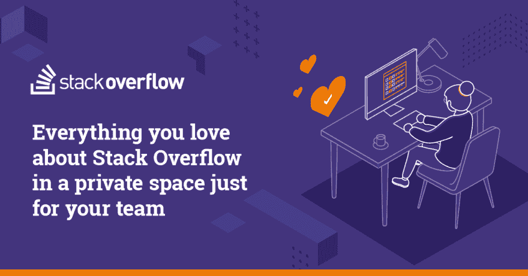
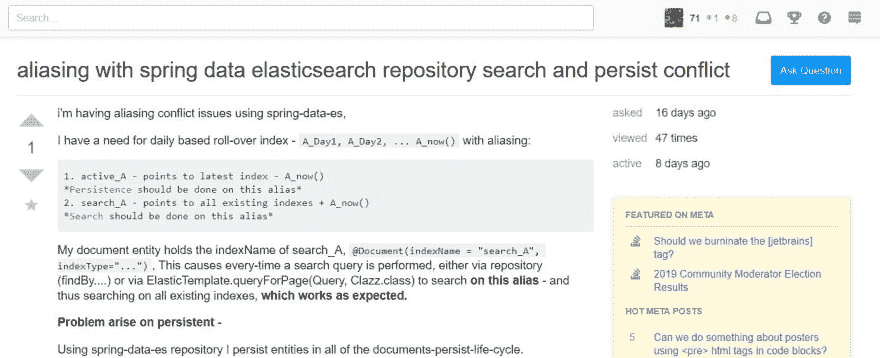
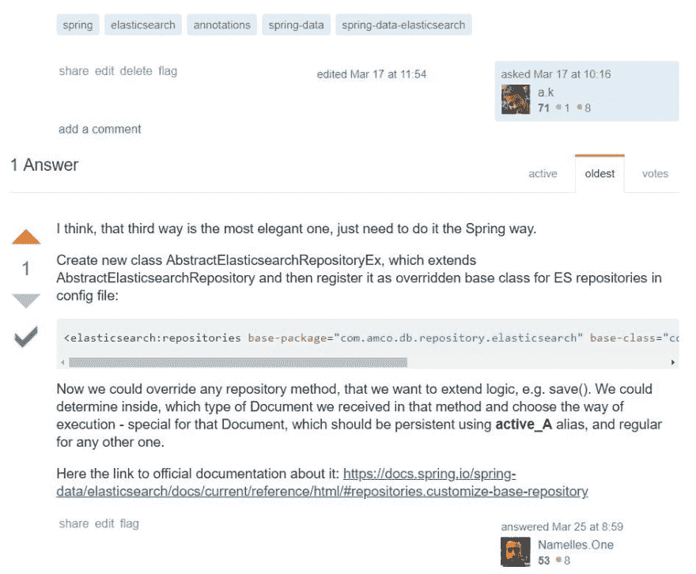

# 改进团队工作-“stack overflow for teams”风格。

> 原文：<https://dev.to/akotek/improving-team-work-stackoverflow-for-teams-style-163>

几周前， **Joel Spolsky** 来到特拉维夫，并(像往常一样)[进行了一场关于软件、stackoverflow 以及更多内容的有趣演讲](https://www.youtube.com/watch?v=zPd_gtEJjV8)。

Joel 提到了 StackOverflow (SO)的新特性-**‘SO for teams’**。

乔尔没有写文档、幻灯片、电子邮件或让你的知识消失，而是在你的公司/团队内部提供了 SO 的 **Q+A 格式，用于知识管理和保留:通过提问和回答问题来改善团队的知识共享。**

根据 Joel 的说法，它已经在许多公司中成功整合(“苹果”、“微软”等等)。不要在你所谓的内部知识系统中查找，只要搜索这个问题，就像你在外部处理编码问题时所做的那样。

除了知识保留之外，**这也是发展团队合作、产生更好的代码和指导初级开发人员的一个很好的工具。**

如果您不能将这个伟大的工具集成到您的团队中，会发生什么(成本太高，法规，公司 ZZ.......) ?不要放弃！

两周前，我遇到了与工作相关的实施问题。我已经想出了逻辑，但由于第三方代码问题，无法实现它。我在谷歌上搜索了这个问题，发现 2015 年有一个关于这个问题的未解决的 git-pull-request。我自己编码解决方案是可能的，包装第三方代码，但是我不喜欢我脑海中的任何解决方案-我想要一个更好的。

我打开了一个 SO 线程，但是**没有答案** -因为这个问题与我们自己的团队-实现和逻辑有太多的联系。我必须尽快提供结果，然后我想咨询其他团队成员，但是怎么做呢？

* * *

用 Skyping 或电子邮件联系我的其他团队成员**可能不容易或效率不高** -因为开发人员太忙于他们自己的任务，而且问题太宽泛。解决这个问题需要一些思考和时间，

但是我已经在 StackOverflow 中提出了质疑....为什么不通过 SO 线程咨询我的团队呢？

然后在我们的一次开发会议上，我注意到我遇到了一个问题，并把每个人都和我的 SO 线程联系起来。

我们很好，我希望通过你办公室里的一个帖子来理解和解决问题会容易得多，而不是面对面交谈或用 skype。除此之外，团队成员想要“展示”他们能够解决问题(也许还能赢得这样的分数？)以及团队成员之间关于谁解决问题更快的争论。用 SO 格式详细描述问题**有助于表达情感和“严肃性”,因为我花在定义和撰写问题上的时间也提高了我对问题的理解，我的团队成员也更认真地对待这个问题。**

此外，如果你已经找到了解决问题的方法，为什么不与整个社区分享呢？

一位学长提出了一个解决方案，**然后回答了 SO 线程** -

> 问题解决了。

总之，即使你没有为知识保留以及团队工作和知识转移集成的“SO-for-teams”平台，团队堆栈溢出的概念也会非常有用，因为你可以在你的团队中使用公共服务。使用 SO 平台咨询团队成员比电子邮件/Skype/face 2 面对面提问好得多，它使问题易于理解，它为问题添加了**情感**和“要点”(从而更快地解决问题)，它保留了数据备份，并支持社区。**试试看！**