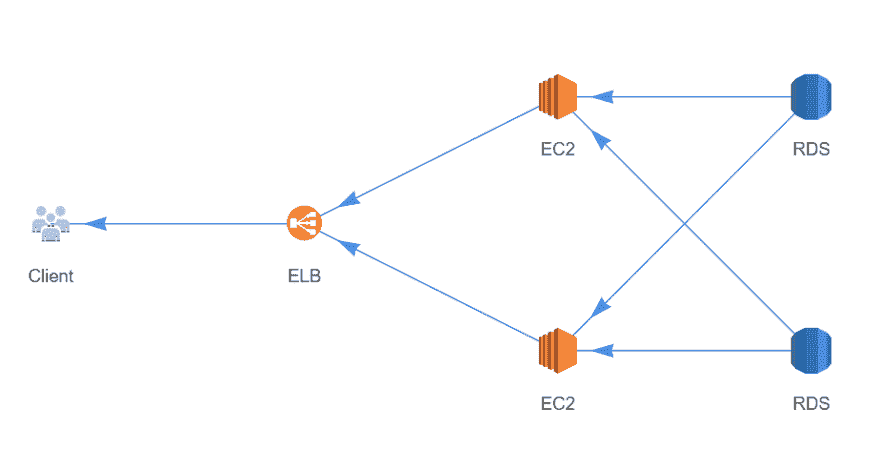

# 作为代码的基础结构图

> 原文：<https://dev.to/raoulmeyer/infrastructure-diagrams-as-code-3f3j>

创建基础架构图是一项非常乏味的工作。我注意到，例如，当一个新人想要理解我们的架构时，我倾向于抓起一支笔在白板上画出来。这很有效，但是它把我们所掌握的所有信息都保存在我们的大脑中。下次有人问，我会重新画一遍，也许会漏掉一些有趣的部分。

为了真正获得这些图表在任何时候都可用的所有好处，您希望保持它们是最新的。当你需要一个第三方工具来做这件事的时候，这就使得更新它们的工作量大大增加。

这就是为什么我建立了一个非常小的 Javascript 库，允许你用代码生成图表。目标是以一种自然易懂的方式指定您的基础架构。如果你想检查一下，就去 [Github 库](https://github.com/RaoulMeyer/diagram-as-code)吧。

## 工作原理

让我们直接看一个库如何工作的例子。假设我们想要绘制一个包含负载平衡器、负载平衡器后面的一些 web 服务器以及 web 服务器从中读取数据的一些数据库的基础架构。我们希望生成下图:

[](https://res.cloudinary.com/practicaldev/image/fetch/s--F-NK4tzX--/c_limit%2Cf_auto%2Cfl_progressive%2Cq_auto%2Cw_880/https://thepracticaldev.s3.amazonaws.com/i/4546qbnidnesr89ucymb.png)

我们将这样设置:

```
const { diagram, dac: { Client, Elb, Ec2Cluster, RdsCluster } } = window;

const client = new Client();
const loadbalancer = new Elb();
const webserver = new Ec2Cluster();
const databases = new RdsCluster();

client.getsDataFrom(loadbalancer);
loadbalancer.getsDataFrom(webserver);
webserver.getsDataFrom(databases);

diagram.render(); 
```

Enter fullscreen mode Exit fullscreen mode

我们首先指定构成我们基础设施的一系列东西。然后我们指定这些东西如何相互通信。最后我们绘制了图表。

指定节点之间关系的其他选项有`sendsDataTo()`和`exchangesDataWith()`。该库提供了您可以使用的大量基础设施组件(目前主要是 AWS)。他们都将得到一个漂亮的图标，对于一些人来说，还有一个集群的变化。

## 优点

将基础设施图指定为代码有几个好处。

因为它是代码，所以关于你在做什么和为什么做，它可能相当冗长。这很好，因为这允许您在图表中捕捉关系的意图。如果这还不够，你甚至可以添加评论，让事情变得超级清楚。

很容易将它添加到您的版本控制中。实际上，您还可以看到发生了什么变化，如果您添加了一个好的提交消息，甚至可以看到为什么会发生变化。对于图表工具经常使用的特殊文件格式，这很难做到。

不需要任何工具就可以轻松保持最新。任何有文本编辑器的人都可以更新你的文档。现在再也没有理由不更新技术文档了。

## 结论

对我来说，这种方法似乎非常有用，因为它降低了一个障碍，我发现这个障碍对于当前可用的工具来说相当高。很明显，能够在绘制图表的同时创建数字版本的图表有很大的好处。

如果你想尝试一下，可以查看一下 [Github 库](https://github.com/RaoulMeyer/diagram-as-code)。

您如何记录您的基础架构？你认为这种方法怎么样？我很有兴趣知道你的想法！另外，如果你知道任何做类似事情的工具或库，请让我知道！