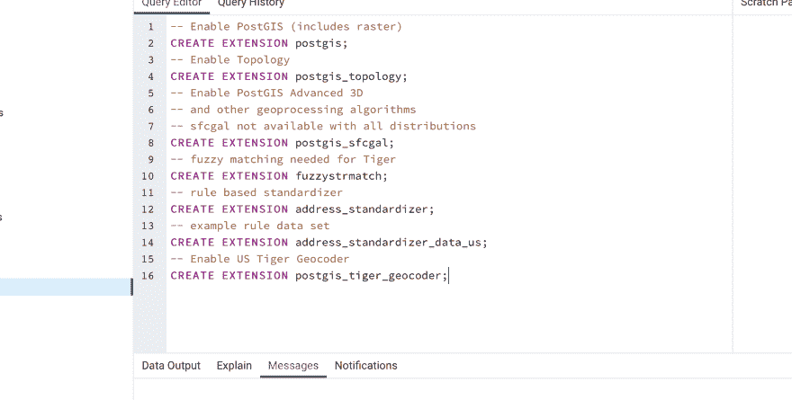
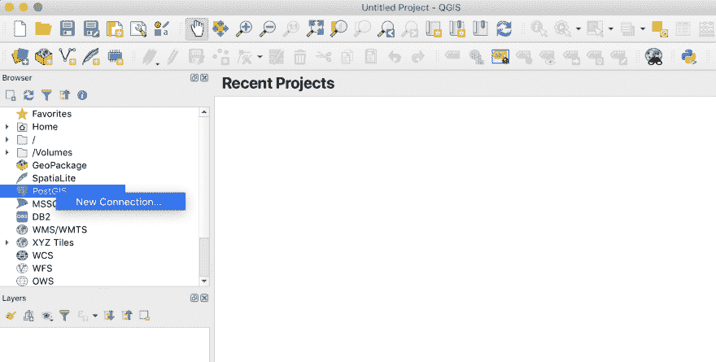
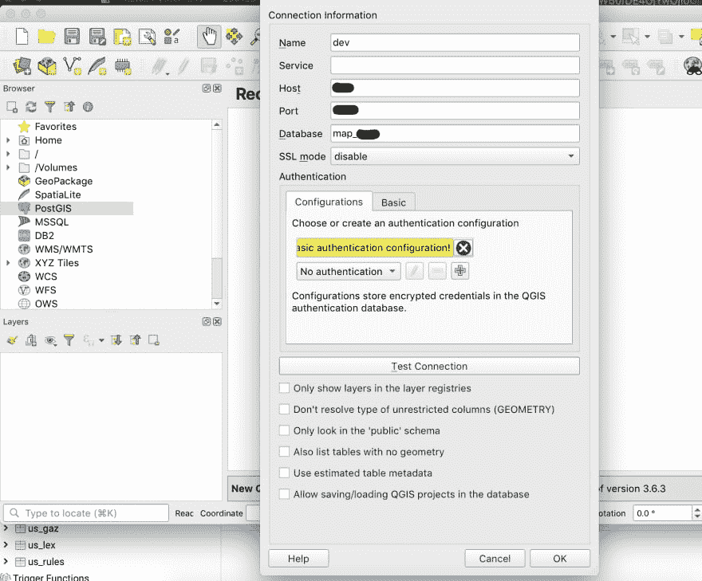
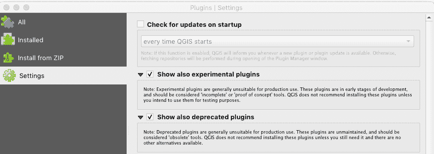
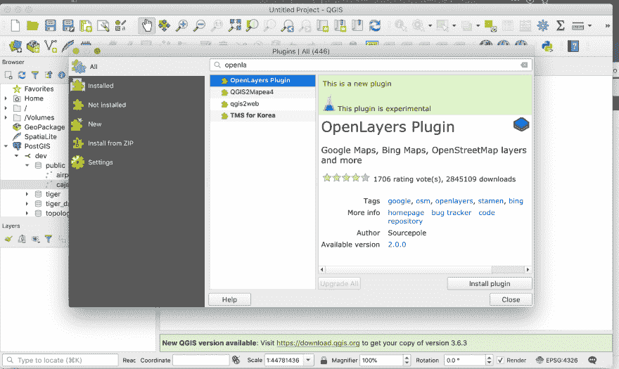
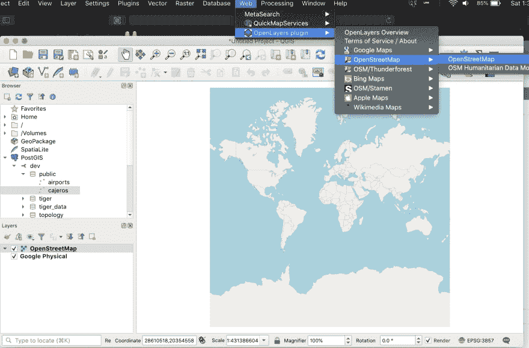
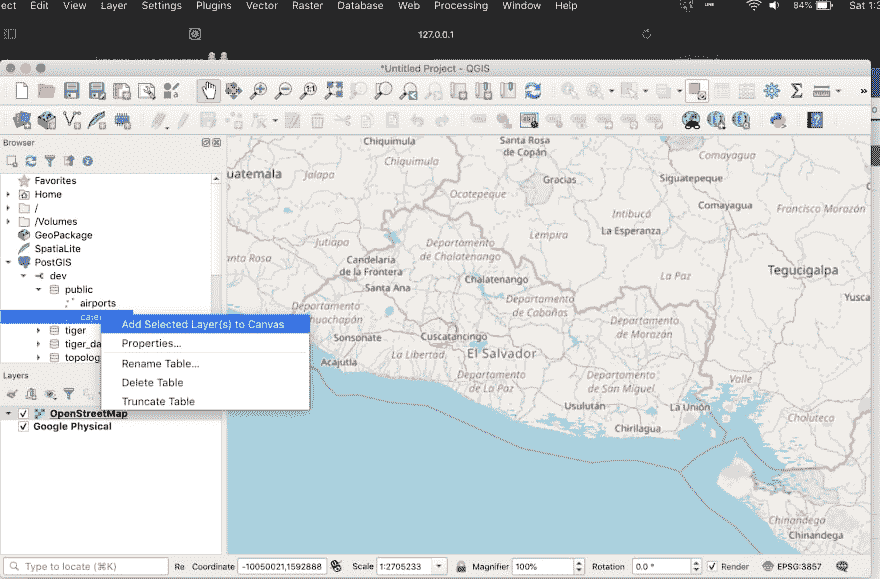
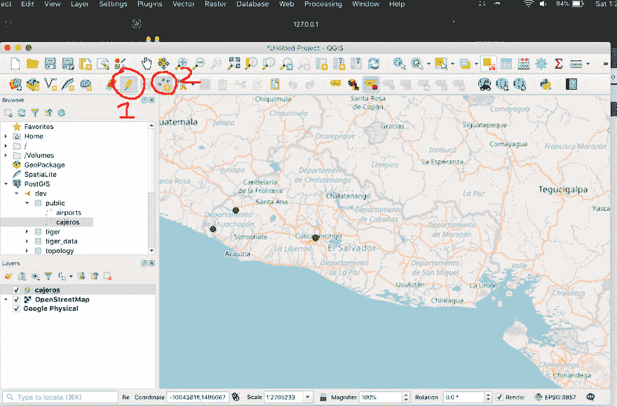

# 安装 PostGis 和 QGis、第一个地理数据库和简单插入

> 原文：<https://dev.to/ab0nilla/installing-postgis-and-qgis-first-geodatabase-and-simple-insert-5gj1>

嗨！，我有更长的时间没有写帖子了...ups xD。

今天我写一个小帖子向你解释:我如何安装 PostGis 插件，创建几何表，并插入数据。

我的服务器中的快速规格:Centos 7 最小安装，Postgres 11。我的 Macbook 中的快速规格:PgAdmin 4，QGis。

# 第一步:安装 PostGis 插件。

```
# yum install postgis2_11 
```

重要！！！:您服务器上的 Postgres 版本的最新编号。

# 第二步:SQL 时间。

我使用 PgAdmin，因为我的团队是非程序员或技术用户，也许我会写一篇文章解释这一点。

#### 2.1:创建数据库

#### 2.2:运行“启用 PostGIS”部分的脚本:【https://postgis.net/install/】T2

[](https://res.cloudinary.com/practicaldev/image/fetch/s--L17hEOoF--/c_limit%2Cf_auto%2Cfl_progressive%2Cq_auto%2Cw_880/https://thepracticaldev.s3.amazonaws.com/i/qwhpcuxaln21kkhpw1ed.png)

#### 2.3:在公共模式上创建一个简单的 Geo 表:

```
CREATE TABLE TABLEOFPOINTS
(
    id serial,
    Place character varying COLLATE pg_catalog."default" NOT NULL,
    dir character varying COLLATE pg_catalog."default",
    geog geography(Point,4326) NOT NULL,
    CONSTRAINT TABLEOFPINTS_pkey PRIMARY KEY (id)
) 
```

好了，现在你有了一个简单的积分表；不是多边形。

#### 第三步:运行 QGis(我在 3.4 上运行)并连接 PostGis

[](https://res.cloudinary.com/practicaldev/image/fetch/s--UU0c4VTE--/c_limit%2Cf_auto%2Cfl_progressive%2Cq_auto%2Cw_880/https://thepracticaldev.s3.amazonaws.com/i/p203j63bbl5j1bg9m9bd.png)

[](https://res.cloudinary.com/practicaldev/image/fetch/s--Ir8elB7D--/c_limit%2Cf_auto%2Cfl_progressive%2Cq_auto%2Cw_880/https://thepracticaldev.s3.amazonaws.com/i/5slfa21oage235rlmbhn.png)

#### 第四步:安装 OpenLayers

4.1:启用实验性和不推荐使用的插件

插件->管理和安装插件->设置

[](https://res.cloudinary.com/practicaldev/image/fetch/s---huCm7b7--/c_limit%2Cf_auto%2Cfl_progressive%2Cq_auto%2Cw_880/https://thepracticaldev.s3.amazonaws.com/i/oqx218mst03bydrdhm9t.png)

4.2 搜索并安装 OpenLayers

插件->管理和安装插件->所有
[](https://res.cloudinary.com/practicaldev/image/fetch/s--rGDC4Rkj--/c_limit%2Cf_auto%2Cfl_progressive%2Cq_auto%2Cw_880/https://thepracticaldev.s3.amazonaws.com/i/tddalwyywjb3kjwqga0w.png)

4.3 将 OpenLayers 插件添加到项目

Web->OpenLayers 插件->OpenStreetMap->OpenStreetMap

[](https://res.cloudinary.com/practicaldev/image/fetch/s--ODJ_jadw--/c_limit%2Cf_auto%2Cfl_progressive%2Cq_auto%2Cw_880/https://thepracticaldev.s3.amazonaws.com/i/gfqmr6iq47t5u78dxoyr.png)

#### 第五步:添加你的点图层(Postgres 空间表)

[](https://res.cloudinary.com/practicaldev/image/fetch/s--RRh-PXnZ--/c_limit%2Cf_auto%2Cfl_progressive%2Cq_auto%2Cw_880/https://thepracticaldev.s3.amazonaws.com/i/5po8ujerd1dgtop78tmi.png)

#### 第六步:制作积分

[](https://res.cloudinary.com/practicaldev/image/fetch/s--_SZ0PRCg--/c_limit%2Cf_auto%2Cfl_progressive%2Cq_auto%2Cw_880/https://thepracticaldev.s3.amazonaws.com/i/ob0af3nvjtpp6g549o39.png)

首先确保你已经选择了层“点的表格”

1-单击铅笔图标(切换编辑)。
2-点击“添加积分功能”，添加您的积分。
3-完成您的数据信息并点击“保存层编辑”图标

好吧，如果我是一个好老师，你可以创建点的空间数据库，基本使用 Qgis 和连接在你的第一个地理表；最后在你的数据库里加点。

接下来的一周，我需要使用地理表格来显示使用节点和 VUE 的点。我希望这篇文章对你有用，也希望你能听听关于 node 和 vue 的使用建议