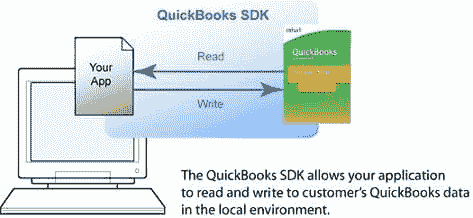
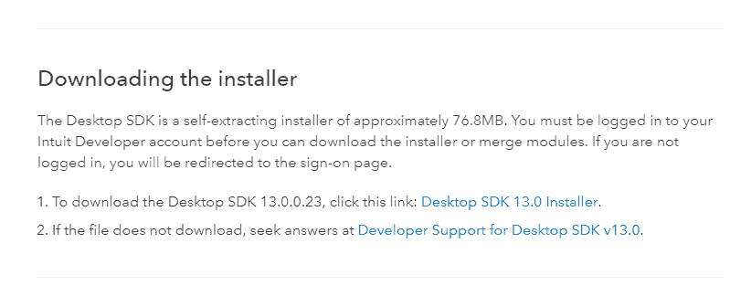
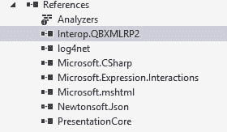
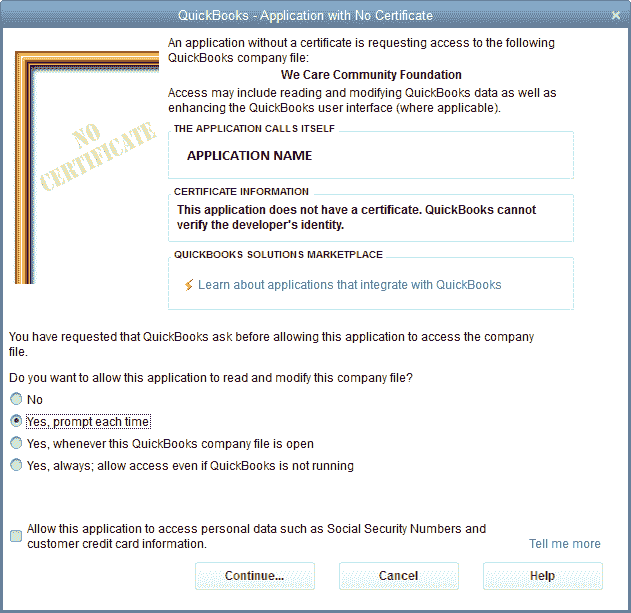

# 在应用程序中集成 QuickBooks 桌面

> 原文：<https://dev.to/rathodatman/integrate-quickbooks-desktop-in-application-3caf>

在不同的业务流程中，管理费用、销售和跟踪日常交易是不可忽视的首要任务之一。当这个词是关于会计时，企业家肯定会遇到 QuickBooks 这个词，但不知道它是什么，它是如何使用的？这个博客很适合你阅读。

**术语“QUICKBOOKS”上的灯**

QuickBooks 帮助你发现管理财务的简易性。它是由 Intuit 开发的最好的商业会计软件之一，旨在简化复杂的财务操作，如预算、工资、费用跟踪、库存、销售以及更多企业需求。

**《用智能进销存解决方案缓解纸张混乱压力——QuickBooks》**

 **QuickBooks 通过自动管理记账和发票文书工作来帮助您有效利用时间。QuickBooks [自动化了大部分会计流程](http://www.cmarix.com/finance-and-banking-enterprise-product-developement.html/)，比如计算销售税、跟踪产品和自动更新交易。目前，QuickBooks 提供在线和桌面两个版本。QuickBooks Desktop 是一个安装在办公桌面计算机上的软件。此外，QuickBooks online 是一种基于云的订阅服务，使您能够随时随地通过任何设备进行工作。然而，QuickBooks Desktop 仍然有很大的优势，因为管理大量的库存和作业成本很容易。

在线版和桌面版的集成是以不同的方式完成的。QuickBooks online 的集成是通过 OAuth 完成的，而 QuickBooks desktop 的集成是在可用 SDK 的帮助下完成的。

**让我们揭开 QuickBooks 桌面集成的真相**

QuickBooks 桌面的集成是在 QuickBooks 本身已经可用的 SDK 的帮助下完成的。将与 QuickBooks desktop 集成的应用程序将在同一台机器上或局域网中运行。该应用程序将通过 QBXML 与 QuickBooks Desktop 进行通信。QBXML 是专门为从应用程序与 QuickBooks Desktop 通信而开发的。

我们知道，在 QuickBooks 桌面 SDK 的帮助下，我们可以轻松地将应用程序连接到 QuickBooks 桌面，并可以从桌面读取数据或向桌面写入数据。如上所述，QuickBooks Desktop 和我们的应用程序之间的通信是通过 QBXML 格式处理的。因此，为了连接到桌面，我们需要从 QuickBooks 桌面读取数据并将数据写入 QuickBooks 桌面。为此，我们需要以 QBXML 格式将消息发送到 QuickBooks Desktop，并以 QBXML 格式从 QuickBooks Desktop 接收消息。

QuickBooks 桌面 SDK 允许我们的应用程序从本地环境中读取/写入数据，如下图所示:

**集成 QuickBooks 桌面的步骤**

所以在理解了整合的概念之后，你一定想知道如何才能做到这一点。按照以下几个步骤将 QuickBooks Desktop 集成到应用程序中:

1.QuickBooks 是 Intuit 提供的一款会计软件。因此，为了开始管理 QuickBooks，您需要在 Intuit 上拥有一个帐户。因此，第一步是创建一个 Intuit 开发者账户，你可以通过访问这个网址:[https://developer.intuit.com/app/developer/homepage](https://developer.intuit.com/app/developer/homepage)

2.希望你已经创建了你的开发者帐号。一旦你这样做了，为了访问 QuickBooks SDKs，你需要在这个 URL 的帮助下下载它们:
[https://developer . intuit . com/app/developer/qbdesktop/docs/get-started/download-and-install-the-SDK](https://developer.intuit.com/app/developer/qbdesktop/docs/get-started/download-and-install-the-sdk)

一旦你进入给定的页面，你会找到下载 SDK 的链接。

3.一旦您成功下载了 QuickBooks 桌面 SDK，您需要将它安装到您要开发应用程序的系统中。确保您遵循图片中给出的要点:

4.现在下一步是创建一个示例应用程序，您希望在其中集成 QuickBooks 桌面 SDK。

5.一旦创建了示例应用程序，您需要遵循以下路径:
C:\ Program Files(x86)\ Intuit \ QuickBooks 2017 \ Interop。QBXMLRP2Lib.dll，复制这个 DLL 并粘贴到你的示例应用程序中。

6.将此 DLL(动态链接库)的引用添加到您的应用程序中。除了将 DLL 复制粘贴到应用程序中并从应用程序中分配 DLL 引用之外，您还可以直接从原始源代码中提供 DLL 引用。但是，如果您将应用程序移动到不同的系统中，那么您可能会面临与此引用相关的问题。

7.为了将您的应用程序与 QuickBooks Desktop 连接，您需要创建它的对象并需要提供 QB 公司文件路径。一旦你这样做了，你需要打开一个连接。

request processor 2 request = new request processor 2()；
请求。OpenConnection2("，" TestQuickBook "，qbxmlrpconnectiontype . local qbd)；
串票=请求。begin session(@ " C:\ Users \ Public \ Documents \ Intuit \ QuickBooks \ Company Files \ qbcompanyfile . qbw "，qbfilemode . qbfileopendonotcare)；

这里，
RequestProcessor2 是 DLL 的对象，它将帮助我们从应用程序中与 QuickBooks Desktop 进行交互。

TestQuickBook 是您的应用程序的名称。

BeginSession 的第一个参数是公司文件的路径。QBCompanyFile.qbw 是您公司文件的文件名。

8.当您第一次运行上述代码时，您必须保持 QuickBooks Desktop 运行，因为它会请求对上述公司文件的读/写权限。提示符将显示如下:

在这里，你必须根据你的喜好选择一个选项。一般来说，你必须选择最后一个选项“是的，总是；即使 QuickBooks 没有运行也允许访问”。通过选择此选项，您的应用程序将不会依赖于 QuickBooks 是否正在运行。一旦您通过选择适当的选项继续上述步骤，您将从 QuickBooks 桌面得到如下确认提示:**