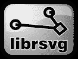

# 将 C++库与 Swift 集成—如何构建 Speculid

> 原文：<https://dev.to/leogdion/integrating-c-libraries-with-swift--how-speculid-is-built-4c30>

在文章 Objective-C 和 Swift——友好相处中，我谈到了我如何使用 Objective-C 在 Speculid 中集成 C++库和 Swift。今天，我要谈谈在你的 XCode 项目中使用 C++库的挑战。

[Speculid 是一个完全开源的应用程序](https://speculid.com/)，使用最新版本的 Xcode (10.1)构建，主要是在 Swift 中(我将解释为什么主要是而不仅仅是)。有了 Speculid，你**可以把一个单独的图形构建成一个完整的应用程序图标或图像集。**

因此，这意味着在。App 包。起初，我想在安装中加入 *Inkscape* 和 *ImageMagick* 。然而， *Inkscape* 还有其他依赖项，如 *XQuartz* 这一事实意味着这太麻烦了。因此，开罗和 librsvg 成为显而易见的选择。

## 将 Cairo 和 librsvg 与 Swift 集成

Speculid 的第一个版本需要安装两个软件包: [Inkscape](https://inkscape.org/) 和
T3】ImageMagick。每个应用程序都可以以某种组合方式用于读取、操作和导出 SVG、PNG、JPEG 或 PDF 文件。
结果，**需要这些软件包让用户体验变得笨拙和困难。**然而，由于它们是完整的应用程序，包含这两个包也会很麻烦。这就是为什么我研究集成 C++库——特别是其中的两个: [Cairo](https://cairographics.org/) **
和 **[libRSVG](https://developer.gnome.org/rsvg/)** 。**

被几个软件包使用， **Cairo** 和 **librsvg** 是图形和 svg 操作软件开发的领先库，尤其是在开源和 Linux 社区。**所以有了 Speculid v2.0，我集成并打包了这些库，作为读取 PNG 和 SVG 以及导出 PDF 和 PNG 文件的主要手段**。最重要的是，这两个库都可以通过[家酿](http://brew.sh/)安装在你的 Mac 上，使用命令:

`brew install cairo librsvg`

现在我们需要确保复制和链接文件。

## 正确链接和复制 C++库

为了使用 C++库，我们可以将每一段 C++代码编译成它们在 Speculid 中的单独库，或者集成已经编译好的库。起初，似乎编译代码是最干净有效的方式，除了每个库都有许多要求以及编译每个库的特殊标志。因此我决定走一条不同的路，使用编译好的库本身。

使用 HomeBrew 安装库之后，将 Cairo 和 librsvg 的目录复制到您的项目文件夹中。 **HomeBrew 将其应用程序和库存储在:**

因此，例如，**开罗**将位于:

一旦它被复制到您的项目中，在**构建阶段中有三个地方需要文件:**

*   **与图书馆链接— * *全部** 。需要列出 dylib** 文件
*   **复制文件— * *全部** 。dylib** 文件需要复制到**框架**文件夹中
*   **标题* *—全部** 。h** 文件需要列在**项目**下

在那之后，你应该可以走了。如果您在构建应用程序时有任何问题，**请仔细检查 Xcode 项目的构建阶段中是否列出了所有正确的文件**

## 在依赖地狱中保持组织

有了链接和嵌入的 C++库，你就可以运行这个应用程序，它可以顺畅地工作。然后，您将产品存档并打包，然后发送给其他人运行，他们会得到这样的结果:

不幸的是，像 Cairo 和 librsvg 这样的库通常都有自己的依赖项。但是，有几个命令可以帮助您:

*   如果我们想找出实际的依赖关系，该命令显示特定库所需要和使用的库的名称和版本号。
*   为了确保我们在开发人员的机器上安装了所有的依赖项，我们可以使用 HomeBrew 来查找与软件包一起安装的依赖项。安装后，我们可以将它们添加到我们的项目中，并将其包含在应用程序包中
*   一旦依赖项被复制并包含在我们的应用程序中，我们需要更新用于查找依赖项的路径。

### 聚集依赖

首先，我们需要通过添加由`otool -L`描述的动态库来确保我们已经在你的应用中包含了所有的依赖项。例如，如果我们在 Cairo 库上运行
`otool -L`,我们会得到:

因此，我们看到 Cairo 需要一些像 *pixman* 这样的库。谢天谢地，* *我们可以通过使用命令**
`brew deps
—tree`得到家酿依赖树:

谢天谢地，如果我们的开发机器上缺少了*皮克斯曼*，我们可以使用`brew install pixman`安装它，然后将*皮克斯曼*的家酿酒窖目录复制到我们的项目文件夹中。

再次确保动态库是构建阶段下构建过程的一部分。换句话说，在**构建阶段**下应该有这样的内容:

### 用`install_name_tool`更新引用

既然所有需要的依赖项都包含在应用程序中，我们需要告诉 Speculid 在哪里寻找依赖项依赖项在哪里寻找它各自的依赖项。这就是`install_name_tool`的用武之地。

#### 编写脚本来搜索和更新动态库

因此，对于此流程，我们将编写一个脚本来更新我们的依赖关系，
它需要执行以下操作:

1.  使用`otool -L`查找非系统安装的依赖项 1。更新每个动态库的 *id* 和使用@rpath 的路径，这是应用程序使用的运行时搜索路径。
2.  浏览我们的`Frameworks`文件夹中的每个文件，然后…
3.  再次更新 *id* 以及要使用的路径`@rpath`
4.  使用`otool -L`查找依赖关系 1 的每个依赖关系。并更新搜索路径以使用`@rpath`

结果如下:

让我们来分解一下…

#### 分解更新动态库

1.  使用`otool -L`查找非系统安装的依赖项
    。$ 1 是可执行文件或`${TARGET_BUILD_DIR}/${EXECUTABLE_PATH}`的路径。
    `otool -L`将列出所有的附属国。管道到 grep，我们可以过滤那些不是系统安装的结果，但是在像`/usr/local/opt`这样的地方是通过自制软件安装的。`awk -F' ' '{ print $1 }'`将把结果打印成我们可以在 for 循环中使用的格式。

2.  更新每个动态库的 *id* 和使用@rpath 的路径，这是应用程序使用的运行时搜索路径。
    在这里，我们遍历每个依赖项，并更新标识名和路径，以在我们的框架中查找依赖项来使用`@rpath`。

3.  浏览我们的`Frameworks`文件夹中的每个文件，然后…

4.  再次更新 *id* 以及要使用的路径`@rpath`

5.  使用`otool -L`来寻找依赖关系的每个依赖关系
    计算依赖关系的路径并运行`otool -L`来获得它的依赖关系。

6.  并更新搜索路径以使用`@rpath`

现在，应用程序和框架应该包含我们的应用程序在另一台机器上运行所需的所有内容。

*最新版本的脚本可以在
* [这里](https://gist.github.com/leogdion/88516f580108075c8b2d05ab7f895fd0)* 找到。*

## 结论

上次我们学习了[如何优化 Objective-C 和 Swift 代码，使它们能够很好地协同工作](https://learningswift.brightdigit.com/objective-c-and-swift-being-friendly/)。
今天我们学习了如何:

*   将家酿的 C++库集成到我们的项目中
*   验证是否包含所有依赖项
*   使用 install_name_tool 和脚本修复引用

所以有了 Speculid，运行主接口的 Swift 代码可以与 Objective-C 对话，Objective-C 与 C++库接口。无需外部应用程序或繁琐的安装。

如果有兴趣的话，可以看看我在安阿伯会议上做的关于这个话题的报告:

[https://www.youtube.com/embed/SxW5fs7_o18](https://www.youtube.com/embed/SxW5fs7_o18)

你在使用 C++库时面临的挑战是什么？你曾经为一个 iOS 应用程序使用过任何库吗？请在评论中告诉我。