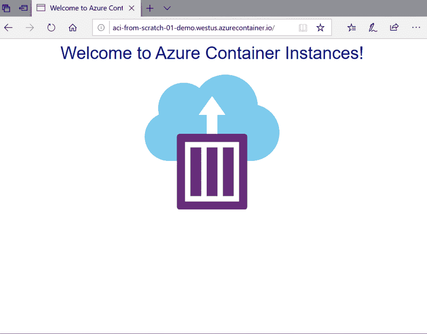
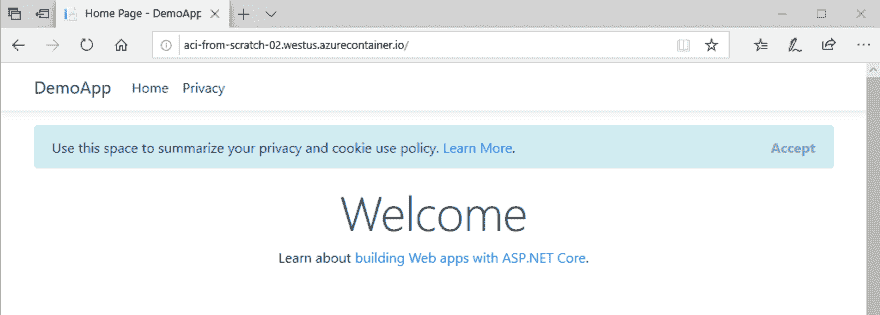

# Azure 容器实例简介

> 原文：<https://dev.to/azure/intro-to-azure-container-instances-10n0>

[Azure Container Instances(ACI)](https://azure.microsoft.com/en-us/services/container-instances/?WT.mc_id=devto-blog-aapowell)是在云中运行容器的最简单方式。没有必要担心 orchestrators，您可以按秒计费，所以为什么不开始呢！

为了帮助你开始，我从头开始创建了一个名为 [ACI 的 GitHub 库](https://github.com/aaronpowell/aci-from-scratch)，它将带你完成一系列使用 Azure CLI 和 ACI 的练习。你需要设置一个 Azure 账户才能开始，所以如果你没有的话，就去拿一个[免费试用版](https://azure.microsoft.com/en-us/free/?WT.mc_id=devto-blog-aapowell)。

## 创建您的首个 ACI 资源

当使用 Azure CLI 时，我们将使用`az container`命令，让我们开始使用演示映像创建一个:

```
az container create --resource-group aci-from-scratch-01 --name aci-from-scratch-01-demo --image microsoft/aci-helloworld --dns-name-label aci-from-scratch-01-demo --ports 80 
```

Enter fullscreen mode Exit fullscreen mode

*我假设您已经创建了一个名为`aci-from-scratch-01`的资源组，git 存储库涵盖了这个资源组。还要记住，我们正在创建的资源的名称需要是全局唯一的，所以我在演示中使用的名称您可能需要自己更改以避免冲突。*

此命令`az container create`用于在您指定的资源组中创建 ACI 资源。我们将它命名为`aci-from-scratch-01-demo`，这是将出现在门户中的内容，并告诉它我们将使用来自公共 Docker 图像存储库`microsoft/aci-helloworld`的图像(此处图像的代码为)。

因为这个映像包含一个 web 服务器，我们需要确保它是公开可用的，为此我们需要使用`--dns-name-label`给它一个 DNS 名称，并绑定容器需要的端口。因为这是一个 web 服务器，所以我们绑定端口 80。

现在我们的部署正在进行中，我们将很快启动并运行它，我们可以连接到我们的 web 服务器。要找到服务器的地址，我们可以使用`az container show` :

```
$> az container show --resource-group aci-from-scratch-01 --name aci-from-scratch-01-demo --query "{FQDN:ipAddress.fqdn,ProvisioningState:provisioningState}" --out table

FQDN ProvisioningState
------------------------------------------------------ -------------------
aci-from-scratch-01-demo.westus.azurecontainer.io Succeeded 
```

Enter fullscreen mode Exit fullscreen mode

我们对输出进行过滤，仅显示完全限定的域名(FQDN)和资源调配状态(正在部署、已部署、已停止等)。)使用`--query`参数。如果您抓取 FQDN 并将其粘贴到浏览器中，您将看到我们的演示应用程序正在运行！

[](https://res.cloudinary.com/practicaldev/image/fetch/s---AAQAIe6--/c_limit%2Cf_auto%2Cfl_progressive%2Cq_auto%2Cw_880/https://www.aaron-powell.cimg/aci-from-scratch/001.png)

最后，如果你想知道你的容器内部发生了什么，你可以使用`az container logs` :

```
az container logs --resource-group aci-from-scratch-01 --name aci-from-scratch-01-demo 
```

Enter fullscreen mode Exit fullscreen mode

这类似于运行一个`docker logs`命令，但也显示了一些来自 ACI 本身的信息。下面是我的输出:

```
listening on port 80
::ffff:10.240.255.56 - - [19/Mar/2019:04:03:33 +0000] "GET / HTTP/1.1" 200 1663 "-" "Mozilla/5.0 (Windows NT 10.0; Win64; x64) AppleWebKit/537.36 (KHTML, like Gecko) Chrome/64.0.3282.140 Safari/537.36 Edge/18.17763"
::ffff:10.240.255.56 - - [19/Mar/2019:04:40:21 +0000] "GET / HTTP/1.1" 200 1663 "-" "Mozilla/5.0 (Macintosh; Intel Mac OS X 10_11_6) AppleWebKit/601.7.7 (KHTML, like Gecko) Version/9.1.2 Safari/601.7.7" 
```

Enter fullscreen mode Exit fullscreen mode

## 使用 Azure 容器注册表

Azure Container Registry (ACR) 是一个私有的容器注册表，您可以在其中托管您的图像。ACR 与 ACI 配合得非常好，它允许您以最小的努力将两者链接在一起，这样您就可以托管您自己构建的容器。

我们使用`az acr`命令来处理 ACR，我们需要做的第一件事是创建我们的注册表:

```
$> az acr create --resource-group aci-from-scratch-02 --name acifromscratch02 --sku Basic --admin-enabled true

{
  "adminUserEnabled": false,
  "creationDate": "2019-03-19T05:16:02.230750+00:00",
  "id": "/subscriptions/7e2b0a07-47db-4a2e-bfca-03c0d5b75f15/resourceGroups/aci-from-scratch-02/providers/Microsoft.ContainerRegistry/registries/acifromscratch02",
  "location": "westus",
  "loginServer": "acifromscratch02.azurecr.io",
  "name": "acifromscratch02",
  "networkRuleSet": null,
  "provisioningState": "Succeeded",
  "resourceGroup": "aci-from-scratch-02",
  "sku": {
    "name": "Basic",
    "tier": "Basic"
  },
  "status": null,
  "storageAccount": null,
  "tags": {},
  "type": "Microsoft.ContainerRegistry/registries"
} 
```

Enter fullscreen mode Exit fullscreen mode

请注意，您给注册表起的名字只能是数字和字母。

这将使用最便宜的层`Basic`为我们创建一个注册表，但是如果你需要，你可以将`--sku`改为`Standard`或`Premium`。不同的 sku 主要代表增加的存储，特优还包括地理复制。我们还设置了`--admin-enabled true`,这样我们可以使用用户名/密码来推送注册中心，或者，您可以创建一个服务主体并使用它来进行身份验证。

从 JSON 的响应来看，最重要的信息是`loginServer`，在将图像推送到注册中心时，我们将需要它。

此外，在我们推送图像之前，我们需要将 Docker 登录到 ACR，您可以通过 Docker CLI 或使用`az acr login --name <registry name>`来完成。

现在是在图像上设置存储库的时候了，我们通过在图像名称前面加上前缀`loginServer`来给它一个完全限定的名称。假设我们之前已经构建了一个名为`aci-from-scratch-02:v1`的图像，我们将向它添加注册表，如下所示:

```
$> docker tag aci-from-scratch-02:v1 acifromscratch02.azurecr.io/aci-from-scratch-02:v1
$> docker push acifromscratch02.azurecr.io/aci-from-scratch-02:v1 
```

Enter fullscreen mode Exit fullscreen mode

当我们这样做时，通过添加存储库前缀，Docker 知道是将其推送到公共存储库还是第三方存储库，在我们的情况下，这是我们想要的。

然后我们可以检查 ACR，看看有哪些图像:

```
$> az acr repository list --name acifromscratch02 --output table
Result
------------------------
aci-from-scratch-02
$> az acr repository show-tags --name acifromscratch02 --repository aci-from-scratch-02 --output table
Result
-------------
v1 
```

Enter fullscreen mode Exit fullscreen mode

命令`az acr repository list`将向我们显示存储库中的内容，然后我们可以通过将名称设置为`--repository`选项在`az acr repository show-tags`中查看特定图像的标签。

是时候创建一个使用注册表的 ACI 了。因为我们已经启用了管理员帐户，所以我们需要获得登录密码:

```
az acr credential show --name acifromscratch02 --query "passwords[0].value" 
```

Enter fullscreen mode Exit fullscreen mode

理想情况下，你应该把它赋给你的 shell (bash/PowerShell/etc)中的一个变量。)而不是将其写入 stdout。这将避免它出现在 shells 的历史中，并可能被泄露。

我们提供了一个`--query "passwords[0].value"`,因为有两个密码，而我们只需要一个(有两个密码，所以有一个备份，以防其中一个被破坏并需要重置)。

现在我们可以向 ACI 提供凭证:

```
az container create --resource-group aci-from-scratch-02 --name aci-from-scratch-02 --image acifromscratch02.azurecr.io/aci-from-scratch-02:v1 --cpu 1 --memory 1 --registry-login-server acifromscratch02.azurecr.io --registry-username acifromscratch02 --registry-password <password> --dns-name-label aci-from-scratch-02 --ports 80 
```

Enter fullscreen mode Exit fullscreen mode

请注意，我们为登录服务器提供了映像名称，这样当 ACI 执行`docker pull`时，它就知道从哪里获取*。我们还提供了作为 ACR 的`loginServer`的`--registry-login-server`，以及 ACR 用户名和密码。*

[](https://res.cloudinary.com/practicaldev/image/fetch/s--6SqrXNNM--/c_limit%2Cf_auto%2Cfl_progressive%2Cq_auto%2Cw_880/https://www.aaron-powell.cimg/aci-from-scratch/002.png)

## 访问 Azure 服务

假设您正在构建一个在 ACI 中运行的应用程序，它需要访问另一个 Azure 资源，可能是 Azure SQL。

ACI 允许我们设置[环境变量](https://docs.microsoft.com/en-us/azure/container-instances/container-instances-environment-variables?WT.mc_id=devto-blog-aapowell)。这些工作就像你期望的那样来自 Docker，可以作为普通的环境变量或安全的环境变量来创建。两者之间的主要区别是，安全变量不会出现在 ACI 日志中，或者如果您查询容器的信息。

下面是我们如何为一个 web 应用程序创建一个 SQL 连接字符串，注意这里我没有使用安全的环境变量:

```
az container create --resource-group aci-from-scratch-03 --name aci-from-scratch-03 --image acifromscratch03.azurecr.io/aci-from-scratch-03:v1 --registry-login-server acifromscratch03.azurecr.io --registry-username acifromscratch03 --registry-password <password> --dns-name-label aci-from-scratch-03 --ports 80 --environment-variables 'SQLAZURECONNSTR_DefaultConnection'='Server=tcp:aci-from-scratch-03-sql.database.windows.net,1433;Database=aci-from-scratch;User ID=aci;Password=<sql password>;Encrypt=true;Connection Timeout=30;' 
```

Enter fullscreen mode Exit fullscreen mode

环境变量是`--environment-variables`，您可以通过在它们之间使用空格来设置多个。如果您要创建一个秘密的，那么您可以使用`--secrets`选项(但是请注意，它们将出现在执行命令的 CLI 中，所以您最好使用 shell 变量来插入它们)。

如果你打算使用秘密变量，最好使用[文件部署](https://docs.microsoft.com/en-us/azure/container-instances/container-instances-environment-variables?WT.mc_id=devto-blog-aapowell#yaml-deployment)或[资源管理器模板](https://docs.microsoft.com/en-au/azure/templates/Microsoft.ContainerInstance/2018-10-01/containerGroups?WT.mc_id=devto-blog-aapowell)，并在运行时将值注入文件。

## 结论

Azure 容器实例是运行容器的最简单的方式，无论是 web 服务器、数据处理作业，还是作为具有 Azure 功能/从逻辑应用程序触发的事件驱动架构的一部分等等..

查看我的 GitHub 库上的练习， [ACI 从头开始](https://github.com/aaronpowell/aci-from-scratch)，并逐步创建您的第一个容器实例。