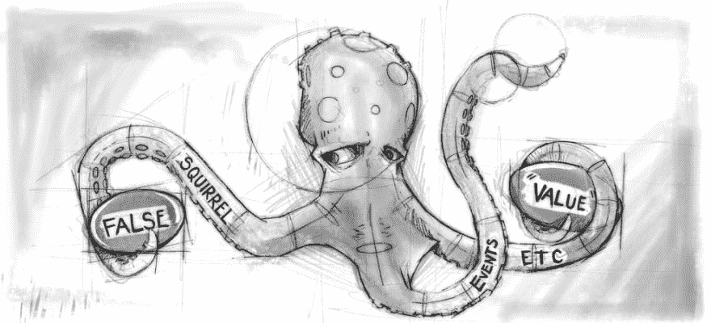
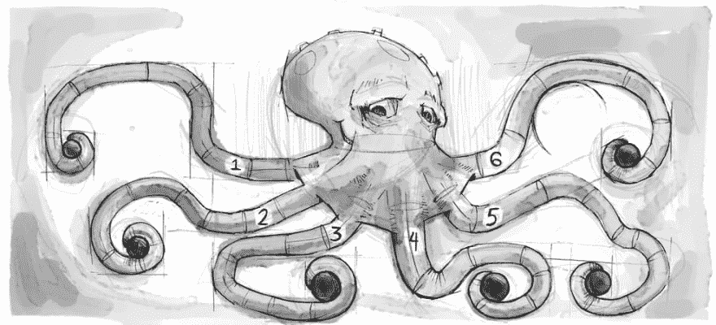

# XML 和 JSON 介绍#6: JSON

> 原文：<https://dev.to/katiekodes/intro-to-xml-and-json-6-json-30h3>

我们已经从" [30，000 英尺的高度](https://dev.to/katiekodes/intro-to-xml-and-json-56co)看到了 JSON

我们知道 JSON 可以帮助我们处理什么样的数据。

**让我们来学习如何写 JSON 吧！**

(让我们来谈谈章鱼。🐙谢谢，马林·哈弗贝克。)

* * *

警告:我担心 JSON 追逐 XML 可能会吃亏。

XML 和 JSON 都是编写“列表的列表”形式的数据的伟大标准，两者都值得按原样介绍*，而不是作为彼此的“比较和对比”。*

我*真的*希望你让这个系列能够在两者之间进行比较、对比和翻译。

然而，我**担心我会通过“与 XML 相比”来介绍 JSON，从而使 JSON 看起来比它的**复杂得多，因为我将不得不花很多时间来谈论你*不能*做的 XML 事情(通常在讨论你*能*做的 JSON 事情之前)。

请注意，JSON 通常被认为比 XML“更容易”读写。要查看 JSON 的解释，其中介绍了 JSON 本身，但没有将其定义为与 XML 相比较，请访问本文底部的附加参考资料中的链接。

最后，和 XML 一样，我们将会讨论很多关于条目、键和值的内容，所以如果你在开始今天的课程之前需要复习，请点击这里。

* * *

[](https://res.cloudinary.com/practicaldev/image/fetch/s--X-Ig0rYM--/c_limit%2Cf_auto%2Cfl_progressive%2Cq_auto%2Cw_880/https://katiekodes.cimg/booksmany.jpg)

## 本系列中的帖子

1.  概述[](/katiekodes) [## XML 和 JSON 简介

    ### 凯蒂 3 月 18 日 194 分钟阅读

    # XML# JSON#教程#初学者](/katiekodes/intro-to-xml-and-json-56co)
2.  表格与列表*(本帖)*[](/katiekodes) [## XML 和 JSON 介绍#2:数据的形状

    T12】凯蒂 3 月 25 日 198 分钟阅读# XML# JSON#教程#初学者](/katiekodes/intro-to-xml-and-json-2-datas-shape-3iji)
3.  XML 1[](/katiekodes)[T8】XML 和 JSON #3 简介:XML 条目和键

    ### 凯蒂四月 3 日 197 分钟阅读

    # XML# JSON#教程#初学者](/katiekodes/intro-to-xml-and-json-3-xml-items-keys-1m7i)
4.  XML 2[](/katiekodes)[T8】XML 和 JSON #4 简介:XML 值

    ### 凯蒂四月 3 日 197 分钟阅读

    # XML# JSON#教程#初学者](/katiekodes/dying-intro-to-xml-and-json-4-xml-values-5bi1)
5.  XML 3[](/katiekodes) [## XML 和 JSON 介绍#5: XML/CSV 转换

    ### 凯蒂四月 3 日 194 分钟阅读

    # XML# JSON#教程#初学者](/katiekodes/intro-to-xml-and-json-5-xml-csv-conversions-45n5)
6.  JSON[](/katiekodes)[T8】XML 和 JSON 介绍#6: JSON

    ### 凯蒂四月 26 日 1911 分钟阅读

    # XML# JSON#教程#初学者](/katiekodes/intro-to-xml-and-json-6-json-30h3)
7.  重述[](/katiekodes) [## XML 和 JSON 介绍#7:概述和实际应用

    ### 凯蒂四月 26 日 196 分钟阅读

    # XML# JSON#教程#初学者](/katiekodes/intro-to-xml-and-json-7-recap-and-real-world-use-5586)

* * *

[](https://res.cloudinary.com/practicaldev/image/fetch/s--knD9zkSC--/c_limit%2Cf_auto%2Cfl_progressive%2Cq_auto%2Cw_880/https://katiekodes.cimg/bouquet-wide.jpg)

## 查看“漂亮”的 XML & JSON

在这个系列中我们会有很多例子。我建议你编辑它们，并以一种“漂亮”的格式观看它们！ [XML](http://codebeautify.org/xmlviewer) ，[JSON](http://codebeautify.org/jsonviewer)——粘贴&点击“树形视图”。

警告:仅将样本数据放入上面的“美化”链接中。不要将公司的机密数据放入陌生人的网站。

* * *

[](https://res.cloudinary.com/practicaldev/image/fetch/s--yIt_QvAp--/c_limit%2Cf_auto%2Cfl_progressive%2Cq_auto%2Cw_880/https://upload.wikimedia.org/wikipedia/commons/e/ef/Json_obtenido.jpg)

## JSON 中的条目:“对象”

JSON 用来定义“对象”开始和结束的标点是一组“花括号”。看起来是这样的:

```
{} 
```

事实上，这对花括号*存在于你的文本文件*中，意味着它*在你的数据*中作为一个概念上的**项**存在。

* * *

### 空元素

花括号之间是否输入了任何内容并不重要。

“对象”仍然是“存在于”数据中的一个概念性项目，这仅仅是因为您创建了一对花括号来表示它。

如果它在大括号之间没有任何东西，你可以把它想象成 CSV 文件中除了逗号什么都没有的一行。

它还在那里！

只是一片空白。

* * *

[](https://res.cloudinary.com/practicaldev/image/fetch/s--_w6ys3oM--/c_limit%2Cf_auto%2Cfl_progressive%2Cq_auto%2Cw_880/https://katiekodes.cimg/octopus-wide.jpg)

## 一个独特的 JSON 概念:“列表”

当考虑“条目”、“键”和“值”时，很难准确解释 JSON“列表”是什么*(也称为“数组”)*，因为它不是其中的任何一个。

它肯定不会出现在 XML 或 CSV 中。

然而，编写 JSON 列表有一个非常明确的标点标准。

JSON 用来定义“列表”开始和结束的标点是一组“方括号”。看起来是这样的:

```
[] 
```

与空对象一样，在数据集中包含一个空列表是有效的。你是否认为这样做有意义，这是你必须回答的商业问题。)

稍后我将更详细地介绍如何以及何时利用 JSON 中的“列表”,所以不要太沉迷于此。

尽管如此，我还是想向您展示 JSON 中如何使用列表的快速预览。

还记得我们第二篇的[“生日创意清单”吗？](https://katiekodes.com/intro-xml-json-2/#example-1)

我可能会将 Ridhi 的“生日”&“收藏”**键-值对**放入一个 JSON 对象 *(Ridhi 是“项目”)*中，如下所示:

```
{  "Bday"  :  "Sep. 16",  "Collection"  :  "frogs"  } 
```

看看一个**对象***内部的每一个**值** *(如“青蛙”)*(如 Ridhi 的这个表示)**是如何被唯一键** *(如“收藏”)*？*

 *就像可以放在 XML 元素开始标记中的“属性”一样，“对象”中的 JSON 键-值对也有唯一的键。

说到丹*最喜欢的两种*食物:葡萄酒&泡菜时，这让我们有点为难。

我们要做什么？称它们为“食物 1”和“食物 2？”

```
{  "food 1"  :  "wine",  "food 2"  :  "pickles"  } 
```

呸。这几乎和试图将我们的“好友列表”制作成 CSV 文件一样糟糕。

相反，我们可以使用一个 JSON *列表*来包含*所有我们可能想要标记为“食物”的值*:

```
[  "wine",  "pickles"  ] 
```

看到没，不用为丹喜欢的每种食物都想出一个唯一的键名，这有多好？

这就是 JSON 列表的作用！

代表丹的整个对象可能看起来像这样:

```
{  "Bday"  :  "Jan. 27",  "Food"  :  [  "wine",  "pickles"  ]  } 
```

我喜欢 Marijn Haverbeke 在一本名为雄辩 JavaScript *(图片也来自该书)*的书中解释列表的方式:

[对象上的 Marijn](https://eloquentjavascript.net/2nd_edition/04_data.html#p_FolCMJfte3):

> “你可能会认为物体是有任意数量触须的章鱼，每个触须上都刺有一个名字。”
> 
> [](https://res.cloudinary.com/practicaldev/image/fetch/s--UJRJ5UM---/c_limit%2Cf_auto%2Cfl_progressive%2Cq_auto%2Cw_880/https://eloquentjavascript.net/2nd_edition/img/octopus-object.jpg)

[名单上的 Marijn](https://eloquentjavascript.net/2nd_edition/04_data.html#p_Rl8msr9DUz)*(又名“阵列”)*:

> “那么，数组只是一种专门用于存储事物序列的对象。……你可以看到它们是长而扁平的章鱼，所有的触角整齐地排成一行，标有数字。”
> 
> [](https://res.cloudinary.com/practicaldev/image/fetch/s--ZuKDAaoo--/c_limit%2Cf_auto%2Cfl_progressive%2Cq_auto%2Cw_880/https://eloquentjavascript.net/2nd_edition/img/octopus-array.jpg)

因此，在我们的数据中，**丹**是一只章鱼，它的“**食物**触手抓着另一只章鱼。内章鱼的触须上有*隐含的*数字标签，它的触须上拿着**酒**和**泡菜**之类的东西

* * *

[](https://res.cloudinary.com/practicaldev/image/fetch/s--V78VIA4Z--/c_limit%2Cf_auto%2Cfl_progressive%2Cq_auto%2Cw_880/https://katiekodes.cimg/keys_jumbled-wide.jpg)

## 【钥匙】&他们的“价值观”

指示“键-值对”来描述一个 JSON **对象** *(或**项**)*有点像[在 XML](https://katiekodes.com/intro-xml-json-3/#keys--their-values---approach-2-attributes) 中指示它们的第二种*(“属性”)*方法。

*   与 XML 属性一样，不允许多次使用一个键来描述任何给定的项*(尽管您可以在其他地方再次使用它)*。
*   **然而**，不像 XML 属性，在 JSON 中你**被允许**在这些键值对的值中嵌套东西。事实上，在 JSON 中，这是非常受鼓励的！

JSON 键-值对的标点符号也与 XML 属性略有不同:

> 1.  A key-value pair is connected by a **colon** ("`:`") in JSON. *(in XML, equal sign. )*
> 2.  The **key** of JSON attribute should be in **quotation mark** . *(In XML, it shouldn't be. )*
> 3.  Does the **value** **of a JSON attribute *not*** have to be in the **quotation mark** (In XML, the "value" of "attribute" must be enclosed in quotation marks. ) `5` is the number 5, but `'5'` is the text representation of this number.
> 4.  And the number special keyword `null` can be more easily interpreted as special values by JSON reading tools, if you remove the quotation marks *(although note that if you don't put them in quotation marks, don't include commas in numbers! )* 。
> 5.  The value of a JSON attribute can even be **another JSON object** or **a JSON list** . *(We will talk about this problem in a moment-it is very powerful. )*
> 6.  In JSON, you use **comma** to separate key-value pairs from each other. (In XML, you use spaces. )T52

这里又是我们的“Ridhi”对象，它有两个键值对:

```
{  "Bday"  :  "Sep. 16",  "Collection"  :  "frogs"  } 
```

而在 XML 列出键-值对的“属性”方法中，Ridhi 可能是这样的:

```
<Ridhi Bday="Sep. 16" Collection="frogs"/> 
```

* * *

[](https://res.cloudinary.com/practicaldev/image/fetch/s--WciBrTYz--/c_limit%2Cf_auto%2Cfl_progressive%2Cq_auto%2Cw_880/https://katiekodes.cimg/russiandolls-wide.jpg)

### 嵌套

因为与 XML 的属性符号相比，JSON 允许我们更灵活地使用“值”的内容，所以我们可以用 JSON:
中的 Dan 做到这一点

```
{  "Bday"  :  "Jan. 27",  "Food"  :  [  "wine",  "pickles"  ]  } 
```

这将是无效的 XML:

```
<Dan Bday="Jan. 27" Food=<wine/><pickles/> /> 
```

相反，我们必须使用 XML 的第一种方法来表示键-值对*(“项目中的项目”)*来表示丹的食物偏好:

```
<Dan Bday="Jan. 27">
    <food>wine</food>
    <food>pickles</food>
</Dan> 
```

* * *

[](https://res.cloudinary.com/practicaldev/image/fetch/s--KTxlv2zQ--/c_limit%2Cf_auto%2Cfl_progressive%2Cq_auto%2Cw_880/https://katiekodes.cimg/catfight.jpg)

### XML 与 JSON =不同的结构

如您所见，JSON 的结构与 XML 有着明显的不同。

尽管 XML 和 JSON 非常相似，尽管它们被设计成表示相同的数据形式，但是它们之间的细微差别意味着您在如何编写它们的问题上做出了完全不同的结构决策。

这种差异甚至会影响您选择 XML 还是 JSON。

这些差异也意味着，当你在读取别人的数据时，如果他们同时以 XML 和 JSON 的形式提供给你，你应该准备好数据在他们提供给你的两个文件之间的结构**会有所不同**—*，即使这两个文件代表相同的真实世界数据*。

* * *

[](https://res.cloudinary.com/practicaldev/image/fetch/s--srSLoUKl--/c_limit%2Cf_auto%2Cfl_progressive%2Cq_auto%2Cw_880/https://katiekodes.cimg/blankbusinesscard.jpg)

## JSON = BYON(“自带姓名”)

您注意到 JSON“对象”没有名字了吗？

我一直在说“Ridhi 物体”或“Ridhi 章鱼”，但里面没有任何东西真的说“Ridhi！”

```
{  "Bday"  :  "Sep. 16",  "Collection"  :  "frogs"  } 
```

XML 元素和 JSON 对象都表示“项目”的概念，但是 XML 元素有名称，而 JSON 对象没有。

如果您想要一个名为的 JSON 对象，您必须自己动手。

例如，可以用 XML 表示的东西如下:

```
<Shirt Color="" Fabric=""></Shirt> 
```

在 JSON 中可能会变成这样:

```
{  "type"  :  "Shirt",  "Color"  :  null,  "Fabric"  :  null  } 
```

看看我们是如何利用“ **type** 这个词在其他情况下并不需要作为一个“键”的名称这一事实，并声称对它拥有所有权的？

我们为“命名”JSON 对象所做的一切就是构造一个新的键-值对，并将其添加到对象*(为了便于阅读，最好作为第一个对象)*。

我们可以为 Ridhi 做类似的事情:

```
{  "Name"  :  "Ridhi",  "Bday"  :  "Sep. 16",  "Collection"  :  "frogs"  } 
```

* * *

[](https://res.cloudinary.com/practicaldev/image/fetch/s--8VtsIB4e--/c_limit%2Cf_auto%2Cfl_progressive%2Cq_auto%2Cw_880/https://katiekodes.cimg/cowgirls.jpg)

### 人名？我们不需要讨厌的名字！

不是所有的数据都需要名字。有时候，你*知道*你的数据里有什么。

当您的数据不需要名称时，JSON 比 XML 更简洁。

*   **问:**我怎么知道名字什么时候是不必要的？
*   **答:**如下:
    *   在同一嵌套层次上，您有一堆背靠背的概念“项目”
    *   他们都不需要一个“纯文本值”来代表他们真正的
    ***   它们都只包含描述它们**所拥有的**的键值对**

 **🚗 🚘 🚙 🚌 🏎️

让我们回到代表一个车队。

这里有一些 XML 表示一个车队，每辆车都有我们关心的不同的键值特征集。

```
<RootElement>
 <Car color="blue" trim="chrome" trunk="hatchback"/>
 <Car appeal="sporty" doors="2"/>
 <Car doors="4" color="red" make="Ford"/>
</RootElement> 
```

也许我们已经*知道*它们都是基于我们的数据背景的汽车。

也许把它们分别叫做“`Car`”感觉很傻。

一个相当好的 JSON 可能是:

```
[  {  "color"  :  "blue",  "trim"  :  "chrome",  "trunk"  :  "hatchback"  },  {  "appeal"  :  "sporty",  "doors"  :  "2"  },  {  "doors"  :  "4",  "color"  :  "red",  "make"  :  "Ford"  }  ] 
```

* * *

[](https://res.cloudinary.com/practicaldev/image/fetch/s--g9zykA9K--/c_limit%2Cf_auto%2Cfl_progressive%2Cq_auto%2Cw_880/https://katiekodes.cimg/ducksmarching.jpg)

## 语法精妙:背靠背的“宾语”

您**不能像您背靠背放置 XML 元素那样简单地背靠背列出 JSON 对象。**

**这不是有效的 JSON:**

```
{}  {} 
```

相反，您必须将它们放在方括号内，并用逗号分隔开*(也就是说，您必须使它们成为 **JSON 列表***的成员)。

(提示:记住不要在最后一个逗号后面加逗号，因为后面什么也没有。手动编辑 JSON 时，弄乱逗号是一个容易的复制/粘贴错误。)

**这个**就是你如何显示两个 JSON 对象在同一个级别:

```
[  {},  {}  ] 
```

请注意，换行符和制表符只是为了方便人们使用。这是同一个 JSON，写得更像你从第三方下载的 JSON:

```
[{},{}] 
```

* * *

[](https://res.cloudinary.com/practicaldev/image/fetch/s--MWXMgfgH--/c_limit%2Cf_auto%2Cfl_progressive%2Cq_auto%2Cw_880/https://katiekodes.cimg/beetroot.jpg)

## 语法精妙:词根

就像整个 XML 必须包含在一个元素中一样，整个 JSON **必须包含在一个“octopus”中。**

然而，你可以选择任何一种“章鱼”:

*   `{}`一个“物体”
*   【列表】`[]`

### 例子

这个**是**有效的 JSON——它有一个“对象”“外章鱼”

```
{"name"  :  "Dan",  "Bday"  :  "Jan. 27"} 
```

这是**而不是**有效的 JSON——太多的“外部章鱼”

```
{"name"  :  "Dan",  "Bday"  :  "Jan. 27"}  {"name"  :  "Ridhi",  "Bday"  :  "Sep. 16"} 
```

这个**是**有效的 JSON——它有一个“列表”“外章鱼”。

```
[  {"name"  :  "Dan",  "Bday"  :  "Jan. 27"},  {"name"  :  "Ridhi",  "Bday"  :  "Sep. 16"}  ] 
```

这是**而不是**有效的 JSON *(尽管正在讨论让它被视为“外章鱼”规则的特殊例外)* :

```
"wine" 
```

这个**是**有效的 JSON——它有一个“列表”“外章鱼”。

```
["wine"] 
```

这个**是**有效的 JSON——它有一个“列表”“外章鱼”。

```
["wine","pickles"] 
```

这个**是**有效的 JSON——它有一个“对象”“外章鱼”

```
{"food"  :  "wine"} 
```

这是**不是**有效的 JSON——仔细看……根本没有“外章鱼”。

```
"food"  :  "wine" 
```

* * *

## 再次列举

[](https://res.cloudinary.com/practicaldev/image/fetch/s--t61mtbpi--/c_limit%2Cf_auto%2Cfl_progressive%2Cq_auto%2Cw_880/https://katiekodes.cimg/laundrystack-wide.jpg)

注意，列表中的值可能是明文/数字/ `null` /另一个列表/另一个项目*(**对象**)*等。

*(就像“对象”中键值对的“值”可以是明文、数字、`null`、列表、另一个对象等。)*

* * *

[](https://res.cloudinary.com/practicaldev/image/fetch/s--WdD4DMbJ--/c_limit%2Cf_auto%2Cfl_progressive%2Cq_auto%2Cw_880/https://katiekodes.cimg/shoppingbags.jpg)

## 外卖

1.  JSON 和 XML 都需要一个围绕数据集全部内容的“根”项。
2.  JSON 有“列表”，这需要思考“octopi”来理解它们在存储数据中扮演的角色。
    *   列表不太像项目、键、*或*值，我们一直在引用这些概念*(尽管根据“章鱼”理论，列表只是一种奇怪的、特殊的项目)*。
3.  JSON 命名事物不像 XML 命名事物那样明确。
    *   这是好是坏取决于你的商业案例。
4.  JSON 允许您使用引号来表示您希望值如何被处理*(作为纯文本，作为数字，等等)。)*。

* * *

[](https://res.cloudinary.com/practicaldev/image/fetch/s--X-Ig0rYM--/c_limit%2Cf_auto%2Cfl_progressive%2Cq_auto%2Cw_880/https://katiekodes.cimg/booksmany.jpg)

## 附加资源

*   [Squarespace 对 JSON 的介绍](https://developers.squarespace.com/what-is-json)
*   [马特·道尔对 JSON 的介绍](https://www.elated.com/json-basics/)
*   TutorialsPoint 的 JSON 系列( [1 -语法](https://www.tutorialspoint.com/json/json_syntax.htm)、 [2 -数据类型](https://www.tutorialspoint.com/json/json_data_types.htm)、 [3 -与 XML 的比较](https://www.tutorialspoint.com/json/json_comparison.htm))
*   [W3Resource 关于 JSON 中涉及到的标点符号的快速参考指南](https://www.w3resource.com/JSON/structures.php)
*   Mozilla 为 JavaScript 程序员提供的 JSON 简介，如果你不是程序员，这本书还是很容易读懂的。你可以忽略他们谈论用 JavaScript 编码的部分。
*   如果你真的很喜欢计算机，JSON 的官方规范是由 5 张简短但复杂的图片组成的。***