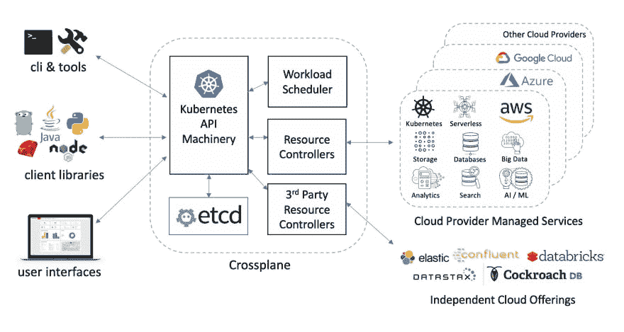

# 交叉平面介绍:开源多云控制平面

> 原文：<https://dev.to/infinitecompute/introducing-crossplane-open-source-multicloud-control-plane--3o6a>

今天我们将介绍[交叉平面](https://github.com/crossplaneio/crossplane)，开源的多云控制平面。它在现有托管服务的基础上公开了工作负载和资源抽象，从而在云提供商之间实现高度的工作负载可移植性。单个交叉板支持跨广泛的提供商、产品、供应商、地区和集群对服务和基础架构进行配置和全生命周期管理。Crossplane 提供了一个用于云计算的通用 API、一个工作负载调度器和一组智能控制器，可以跨云实现工作自动化。

[](https://res.cloudinary.com/practicaldev/image/fetch/s--2XQqM16q--/c_limit%2Cf_auto%2Cfl_progressive%2Cq_auto%2Cw_880/https://upbound.github.io/www-staging/blog/architecture.jpg)

Crossplane 提供了一个声明式管理风格的 API，涵盖了广泛的可移植抽象，包括数据库、消息队列、存储桶、数据管道、无服务器、集群等等。它基于流行的 Kubernetes 项目的[声明性资源模型](https://docs.google.com/document/d/1RmHXdLhNbyOWPW_AtnnowaRfGejw-qlKQIuLKQWlwzs/edit#heading=h.sa6p0aye4ide)，并将容器编排中的许多经验应用于多云工作负载和资源编排。

该项目支持开发人员和管理员之间关注点的清晰分离。开发人员定义工作负载，而不必担心实施细节、环境约束和策略。管理员可以定义环境细节和策略。关注点的分离导致了更高程度的可重用性并降低了复杂性。

它包括一个工作负载调度器，在部署工作负载及其资源时，该调度器可以考虑许多标准，包括功能、可用性、可靠性、成本、区域和性能。调度程序与专门的资源控制器一起工作，以确保管理员设置的策略得到遵守。

# 走查

让我们看一个使用 Crossplane 运行可移植工作负载的例子。我们将使用熟悉的 Wordpress 应用程序的容器工作负载。Wordpress 在容器中运行，需要一个 MySQL 数据库实例。Crossplane 支持开发人员和管理员之间的关注点的清晰分离，在本演练中，我们将只考虑开发人员的观点。我们将假设管理员预先配置了交叉面板来使用 AWS 资源。

使用 Crossplane，开发人员编写可移植的配置，通常不关心云提供商、凭证和环境的其他细节。让我们首先为 wordpress 需要的 MySQL 数据库实例创建配置。这个配置充当对 MySQL 数据库服务器实例的请求，我们称之为资源声明。

```
apiVersion: database.crossplane.io/v1alpha1
kind: MySQLInstance
metadata:
 name: wordpress-db
 namespace: demo
spec:
 version: 5.7
 highly-available: true
 autoUpgradePolicy: minor
 encrypted: true
 size: 100Gi 
```

*规范*定义了独立于任何实现的 MySQL 实例的需求。例如，我们的示例 wordpress 需要 5.7 版的 MySQL，一个跨故障域分布的高可用性实例，加密存储，基于次要版本的自动升级策略，以及 100 GB 的存储。其余的实现或特定于环境的细节来自管理员定义的默认资源类。要供应数据库，我们可以运行以下命令:

```
kubectl apply -f wordpress-db.yaml 
```

接下来让我们创建一个工作负载配置，定义一个容器工作负载来运行 wordpress。工作负载是一个可调度的工作单元，包含负载以及工作负载应该在哪里以及如何运行的要求。工作负载调度器负责部署工作负载，在这种情况下，它将被调度在管理员提供的 EKS Kubernetes 集群上运行。

这个工作负载指定了要传播到目标集群的 Kubernetes 部署、服务和名称空间。它还请求 Kubernetes 的最低版本，但是可以包括与集群的功能相匹配的其他请求。

```
apiVersion: container.crossplane.io/v1alpha1
kind: Workload
metadata:
 name: wordpress
 namespace: demo
spec:
 # the version of Kubernetes desired
 clusterVersion: 1.10
 # the namespace to create on a target cluster
 targetNamespace: wordpress
 # this is a template for a deployment to be created on a target cluster
 targetDeployment:
   metadata:
     name: wordpress
     labels:
       app: wordpress
   strategy:
     type: Recreate
   template:
     metadata:
       labels:
         app: wordpress
     spec:
       containers:
       - name: wordpress
         image: wordpress:4.6.1-apache
         env:
         - name: WORDPRESS_DB_HOST
           valueFrom:
             secretKeyRef:
              name: wordpress-db-connection
              key: endpoint
         - name: WORDPRESS_DB_USER
           valueFrom:
            secretKeyRef:
             name: wordpress-db-connection
             key: username
         - name: WORDPRESS_DB_PASSWORD
           valueFrom:
            secretKeyRef:
             name: wordpress-db-connection
             key: password
         ports:
         - containerPort: 80
           name: wordpress
 # this is a template for a service to be created on a target cluster
 targetService:
   metadata:
     name: wordpress
   spec:
     ports:
       - port: 80
     selector:
       app: wordpress
     type: LoadBalancer
 # these are the resource used by this workload. The secret holding the connection
 # information will be generated and propagated to the target cluster.
 resources:
 - name: wordpress-db
   kind: MySqlInstance
   secretName: wordpress-db-connection 
```

工作负载还引用它在 **resources:** 部分中消耗的所有资源。这有助于跨平面设置工作负载和资源之间的连接，并创建保存连接信息的对象。在这个例子中，创建了一个名为**的秘密，它包含一个连接字符串、用户和密码。这个秘密将被传播到目标集群，这样它就可以被 wordpress 容器使用。让我们继续创建工作负载:**

```
kubectl apply -f wordpress-workload.yaml 
```

此时，调度程序将分配这个工作负载，几分钟后，wordpress 应该在 EKS 集群中启动并运行，并使用 RDS 数据库。

注意，开发者创建了 wordpress 的可移植配置。在开发者创作的任何配置中都没有提到 AWS、RDS 或 EKS。他们不必设置 VPC、安全组、IAM 策略以及环境和云提供商的其他细节。他们只关心自己的工作量及其要求。同样的配置运行 Azure 或 GCP 没有任何变化。

# 我们为什么要创建交叉平面？

Upbound 的使命是创建一个更加开放的云计算平台，提供更多的选择和更少的束缚。每个云的核心都是一个控制平面，我们希望交叉平面能够成为开放云的控制平面。借助开放式控制平台，任何人都可以添加新的 API 和控制器，并对其进行扩展，以管理商业或开源云服务和资源。它充当跨服务的公共集成点，以及更开放的应用程序和工具生态系统的基础。

Crossplane 是社区驱动的，我们很早就开放了这个项目，希望开源社区能加入我们，让多云成为现实。

> GitLab 首席执行官兼联合创始人 Sid Sijbrandij 表示:“正如我们所知，Crossplane 有机会改变云行业。“我们的客户越来越希望能够在多个云环境中部署他们的代码。目前可用的选择过于复杂且受供应商驱动，但有了 Crossplane，编排云的能力变得简单了。我们期待与他们合作实现这一愿景，并成为 Crossplane 上部署的第一款复杂应用。”

要深入了解 Crossplane，请参阅[架构](https://docs.google.com/document/d/1whncqdUeU2cATGEJhHvzXWC9xdK29Er45NJeoemxebo/edit?usp=sharing)文档、我们的[文档](https://github.com/crossplaneio/crossplane#getting-started-and-documentation)和我们的 github [回购](https://github.com/crossplaneio/crossplane#getting-started-and-documentation)。

Crossplane 是由 Upbound 赞助的项目。通过在 [Twitter](https://twitter.com/crossplane_io) 或 [GitHub](https://github.com/crossplaneio/crossplane) 上关注 Crossplane，了解最新的 Crossplane 新闻。