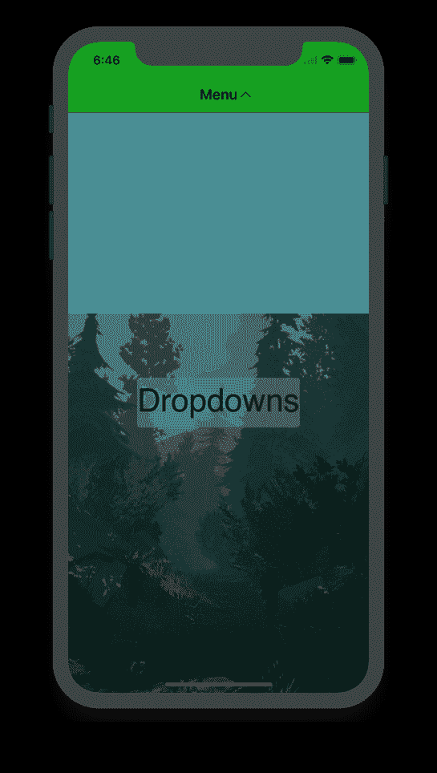
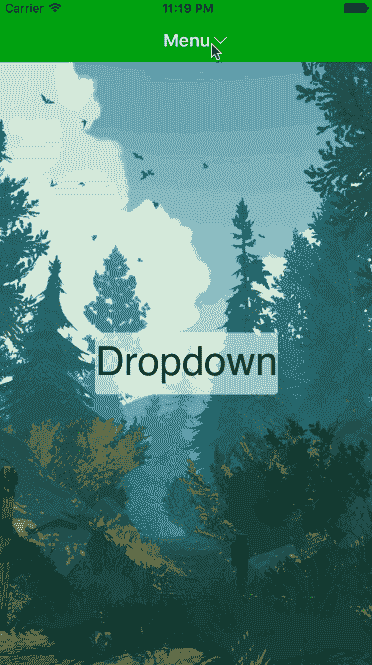

# 引入下拉菜单——轻松地将下拉菜单添加到 iOS 应用程序

> 原文：<https://dev.to/onmyway133/introducing-dropdowns-add-dropdown-to-ios-app-easily-11b>

我正在做一个新的框架，[下拉菜单](https://github.com/onmyway133/Dropdowns)

下拉菜单提供了在应用程序中显示下拉菜单的最快方式。它是非常轻量级的，只需提供一个项目列表和你想要处理的动作闭包。

[](https://res.cloudinary.com/practicaldev/image/fetch/s--xDNDGSVc--/c_limit%2Cf_auto%2Cfl_progressive%2Cq_auto%2Cw_880/https://github.com/onmyway133/Dropdowns/raw/master/Screenshots/x.png)

[](https://res.cloudinary.com/practicaldev/image/fetch/s--nS9f4rKa--/c_limit%2Cf_auto%2Cfl_progressive%2Cq_66%2Cw_880/https://github.com/onmyway133/Dropdowns/raw/master/Screenshots/dropdown.gif)

Dropdowns 的工作原理是将子视图`UIViewController`显示为标题视图的下拉列表。最常见的用例是从 UINavigationController 显示，从这个意义上说，你可以创建一个项目列表，并提供给 TitleView。

```
let items = ["World", "Sports", "Culture", "Business", "Travel"]
let titleView = TitleView(navigationController: navigationController!, title: "Menu", items: items)
titleView?.action = { [weak self] index in
  print("select \(index)")
}

navigationItem.titleView = titleView 
```

对于定制，默认情况下，下拉菜单使用`TableController`，在`UITableView`中显示项目列表。我们可以使用 contentController 自定义显示任何你想要的内容。

```
let contentController = TableController(items: items, initialIndex: 0)
let dropdown = DropdownController(contentController: contentController, navigationController: navigationController) 
```