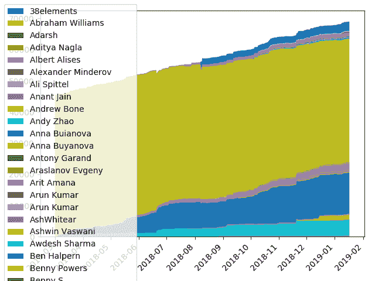
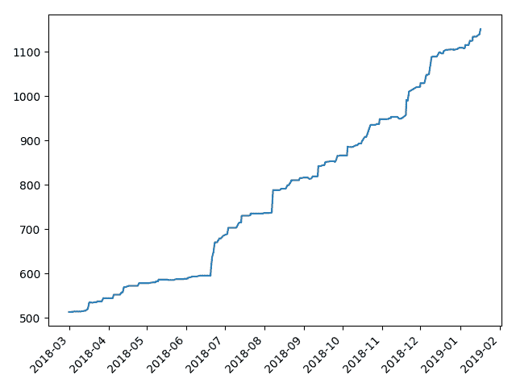
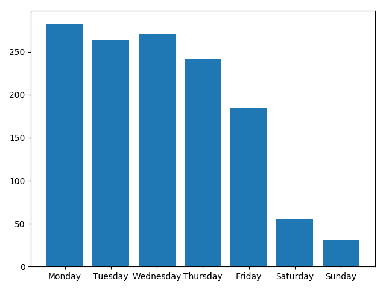
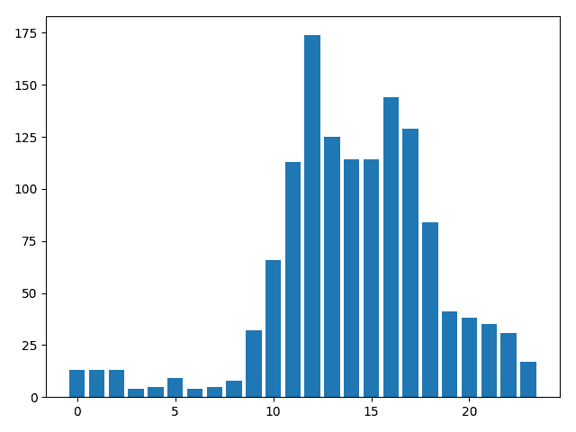

# Git Hammer 简介:Git 仓库的统计数据

> 原文：<https://dev.to/vorahsa/introducing-git-hammer-statistics-for-git-repositories-3ej9>

我一直觉得，每次我在一个更长的项目中，我最终都会组合一些简单的 shell 脚本来从项目 git 存储库中收集统计数据。这些都是临时的，需要为每个特定的项目量身定制，跟踪数字进度的唯一方法是运行它们并保存输出。

最近我有一些空闲时间，所以我决定最终写一个合适的程序来为我做这些事情。它现在可以做我以前的特别脚本所做的一切事情(实际上更好一些)，它存储它计算的任何东西，所以它只需要很少的时间来保持最新，我对它的功能和代码非常满意，我可以放心地发布它。所以，遇见[饭桶锤](https://github.com/asharov/git-hammer)。

## 它有什么作用？

我的脚本中最重要的是每个人的行数。本质上，该脚本将在每个源文件上运行`git blame`,并将所有计数加在一起。在某种程度上，这也是 Git Hammer 的核心。另一件事是统计所有的测试并按人分组。但是 Git Hammer 知道所有的提交，所以它可以只基于提交而不是它们的内容进行多种统计。至少理论上是这样；我还没有实现太多。

一个很好的特性是支持多存储库项目。在我第一次开始计划 Git Hammer 的项目中，我们有主应用程序，但也有其他存储库中的几个支持库。这些库是由同一个团队开发的，但是它们被分离出来，以允许其他项目也可以使用它们。因此，将所有这些存储库合并到一组统计数据下是有意义的。

## 图表

我们来看看 Git Hammer 能画的一些图。我使用 [dev.to repository](https://github.com/thepracticaldev/dev.to) 来实现这些。首先，让我们看看每个作者的行数:

这当然显示了现有代码被导入到一个新的存储库中的情况。这也不是一个很好的图表:带有作者姓名的图例覆盖了部分数据，并且没有显示几乎所有的作者。在有许多贡献者的存储库上运行这种程序肯定会发现问题。

有多少测试正在编写？这次让我们只看一下原始测试计数。

看起来是个不错的发展。新的测试是沿着新的代码编写的。

我们还可以查看提交发生的时间。一张图表示一周中的几天，另一张图表示一天中的几个小时。

看起来主要是日常工作:大多数提交发生在周一到周五，大约在工作时间。

顺便说一下，最后这张图揭示了一个错误。我对我的图表非常满意，但是当我第一次看到 dev.to 的一小时图时，它显示了大多数活动发生在晚上。当然，这是一个时区问题:在处理过程中的某个时刻，提交时间被转换为我的本地时区(柏林)。由于大部分犯罪发生在纽约，这使得时间提前了 6 个小时。所以我做了似乎是最常见的建议:我将与提交相关联的时区显式存储在数据库中，然后在读取显示时使用它。

## 跑步需要多长时间？

对存储库中的每个文件运行`git blame`听起来可能需要很长时间。它可以。我的旧项目的主存储库需要大约 4 分钟。当然，Git Hammer 并不是每次提交都从头开始运行。相反，它使用 git 提供的 diffs 来调整可能已经改变的计数。在我的 Macbook Pro 上处理 dev.to 存储库(最新版本中大约 1300 次提交，70000 行代码)只花了 6 分钟。

较大的存储库是不同的情况。我的旧项目有超过 33000 次提交，可能有 250000 行代码，需要 12 个小时才能完成。幸运的是，这个进程只使用了大约 20%的 CPU，甚至到最后还使用了不到 2 GB 的内存，所以我可以在它运行的时候继续工作。然而，可能需要的时间比存储库的大小增长得更快，所以尝试一个真正大规模的存储库可能不是一个好主意。

## 未来的计划

Git Hammer 几乎已经是一个可用的库了。这可能是下一步:修复库中没有意义的东西，如果需要的话，可能会添加一些配置点，并上传到 [PyPI](https://pypi.org/) 。我还有一个长期的希望，那就是制作一个使用 Git Hammer 在 Web 上显示项目统计数据的 Web 服务。

欢迎任何贡献，从功能的想法开始。代码库也不是很大，因为许多繁重的工作都是由 GitPython 和 SQLAlchemy 处理的。所以对于许多 Python 开发者来说，这可能是容易理解的。

## 小心

从代码中获取统计数据只是为了娱乐。它们没有什么意义，在特定的项目团队之外没有任何意义，也不应该作为任何决策的基础。