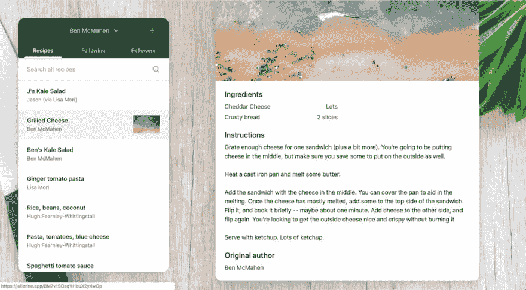
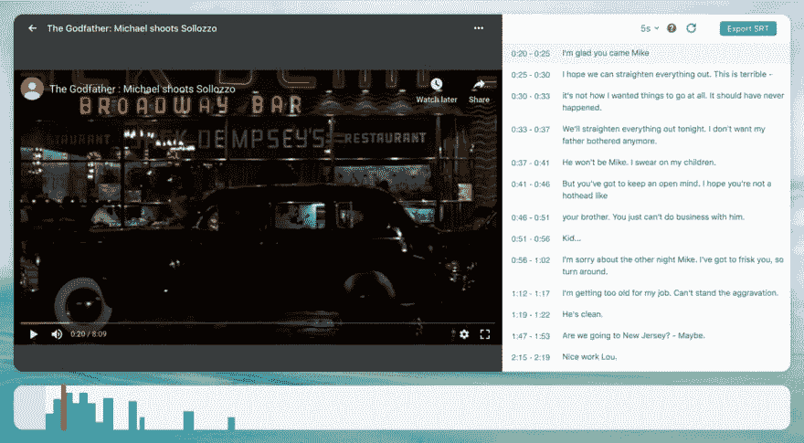

# 介绍 Sancho UI

> 原文：<https://dev.to/bmcmahen/introducing-sancho-ui-ba9>

Sancho 是一个开源的、反应灵敏的、可访问的设计系统，由 React、Typescript 和 Emotion 构建。查看[文档](http://sancho-ui.com)或检查 [Github](https://github.com/bmcmahen/sancho) 上的代码。

<figure><source type="image/webp">
<source type="image/jpeg">
[](https://res.cloudinary.com/practicaldev/image/fetch/s--ZBY-wExu--/c_limit%2Cf_auto%2Cfl_progressive%2Cq_auto%2Cw_880/https://www.benmcmahen.com/static/a611328a899a4d4863a29b09beec0acc/8a8fe/preview.jpg)

<figcaption>julienne . app 和 Captioner.app 的图片，都是用桑丘构建的。</figcaption>

</figure>

#### Sancho 的目标是提供一套漂亮的通用组件，你可以自己制作。

Sancho 设计的主要目标是提供一组 UI 组件，这些组件美观实用，但足够通用，可以在大多数环境中使用，并且具有足够的可扩展性，可以定制成自己的组件。

我发现，许多最近的设计系统都是以一个独特的、与众不同的风格为特定的项目而构建的，如果你的工作看起来不像一个现有的项目，就很难使用。像 Material-UI 这样的东西确实很棒，但是它的风格与 Google 品牌非常相似。在这方面，Bootstrap 一直让我感到与众不同——它提供了一套漂亮的、有点通用的样式和组件，开箱即用，但很容易修改。感觉 Bootstrap 是为你量身定做的。

桑丘试图在这方面复制 Bootstrap。它的设计并不特别独特，而且它实现了许多我喜欢的来自现有设计系统的想法。这也意味着它可以通过组合[主题变量](https://sancho-ui.com/#theme)和组件[组合技术](https://sancho-ui.com/#styling%20and%20emotion)来扩展。

#### 响应式设计真的很难。桑丘使它变得更容易。

出于各种原因，许多基于 react 的设计系统没有将响应式设计作为优先事项。桑丘尽最大努力让移动设计和触摸交互尽可能好。这表现在一些更小的细节上。

Sancho 在适当的上下文中提供了滚动锁定。下面是一个在`Sheet`中滚动的例子。

<video loop="true"><source type="video/mp4" src="https://www.benmcmahen.com/prevent-scroll-3-e78ebb9ac8d547de753cfa80d866e444.m4v"></video> 

Sancho 提供了一个响应的 popover，它在大屏幕上充当常规的 popover，但在移动设备上变成了底层。

<video loop="true"><source type="video/mp4" src="https://www.benmcmahen.com/responsive-popover-03066fe18ee0fb9466ca7b856a1b3e21.m4v"></video> 

桑丘的标签在较小的屏幕上滚动显示。

<video loop="true"><source type="video/mp4" src="https://www.benmcmahen.com/tabs-scroll-e5396f03107ba188e3579f9220aa65cb.m4v"></video> 

目标是确保 Sancho 在触摸设备上看起来和*感觉*像在桌面上一样好，这一目标通常难以实现，令人惊讶和沮丧。使用 Sancho 组件有望让您的生活变得轻松一些。

#### 桑丘有黑暗模式。

Sancho 为其所有组件提供了一个黑暗模式，这使得建立一个黑暗和光明模式版本的网站变得相对容易。

<figure><source type="image/webp">
<source type="image/jpeg">
[](https://res.cloudinary.com/practicaldev/image/fetch/s--EDFsVU29--/c_limit%2Cf_auto%2Cfl_progressive%2Cq_auto%2Cw_880/https://www.benmcmahen.com/static/8cfb801de8621dfda5f77962e99b26f0/8a8fe/dark-light-docs.jpg)

<figcaption>文档演示了亮暗两种模式</figcaption>

</figure>

但也许更重要的是，黑暗和光明模式可以在你网站的不同部分同时使用。这使得构建类似导航条的东西变得容易，导航条有深色的背景和浅色的主题组件和文本。只需用`DarkMode`组件:
包装相关元素

```
import { DarkMode } from 'sancho'

function App() {
  return (
    <div>
      <DarkMode>
        <NavigationBar />
      </DarkMode>
      <Container>
        <MainContent />
      </Container>
    </div>
  )
} 
```

你可以在[toast-notes](https://toasted-notes.netlify.com/)网站上看到这一点，网站上有一个深色背景和浅色文字的英雄。甚至连按钮都被微妙地改变，以在黑暗的背景上提供更大的对比度。

#### 桑乔是用打字稿、情感和反应建成的。

Sancho 是完全类型化的，因为它是用 Typescript 构建的。这意味着你的主题是类型化的，这确保你只能访问一个存在于你的主题对象中的值。

```
/** @jsx jsx */
import { jsx } from '@emotion/core'
import { useTheme } from 'sancho'

function App() {
  const theme = useTheme()
  return (
    <div
      css={{
        background: theme.colors.background.tint1,
        fontSize: theme.sizes.giant, // typescript will tell you this doesn't exist
      }}
    >
      Hello world
    </div>
  )
} 
```

我发现将 Emotion 的`css` prop 与 typescript 的键入和 VSCode 的自动完成结合使用，很大程度上使得`Box`组件或类似于 [styled-system](https://github.com/styled-system/styled-system) 的东西变得不必要。Emotion 的`css` prop 也使得编写风格和改变现有组件变得容易。

```
/** @jsx jsx */
import { jsx } from '@emotion/core'
import { Alert, useTheme } from 'sancho'

function MyCustomAlert() {
  const theme = useTheme()
  return (
    <Alert
      title="This Alert has an altered appearance"
      css={{
        maxWidth: '300px',
        '& .Alert__bar': {
          display: 'none',
        },
        '& .Alert__content': {
          padding: theme.spaces.sm,
        },
      }}
    />
  )
} 
```

#### 桑乔支撑着摇晃的树。仅捆绑您需要的组件。

您不太可能需要使用 Sancho 提供的所有组件。桑丘是完全树摇动的，这意味着只有那些你使用的组件会被包含在你的最终版本中。

如果将`Text`和`IconArrowRight`导入到一个`create-react-app`捆绑的应用程序中，最终的 Sancho 相关构建大小就是`8.4kb minified`。

#### 用 Sancho 构建的两个开源项目。

[Julienne.app](http://julienne.app) 是一款和家人朋友分享菜谱的小 app。查看[来源](https://github.com/bmcmahen/julienne)。

<source type="image/webp">
<source type="image/jpeg">
[](https://res.cloudinary.com/practicaldev/image/fetch/s--hTMHFseA--/c_limit%2Cf_auto%2Cfl_progressive%2Cq_auto%2Cw_880/https://www.benmcmahen.com/static/a318eac6b40ff885d922c07e77394dd1/8a8fe/julienne-screenshot.jpg)

[Captioner.app](https://captioner.app/) 提供了一种在网络浏览器中为视频制作字幕的方法。查看[来源](https://github.com/bmcmahen/captioner)。

<source type="image/webp">
<source type="image/jpeg">
[](https://res.cloudinary.com/practicaldev/image/fetch/s--yKGnTCjV--/c_limit%2Cf_auto%2Cfl_progressive%2Cq_auto%2Cw_880/https://www.benmcmahen.com/static/a3b4a15097f1aa8aae57bf392d3db592/8a8fe/captioner-screenshot.jpg)

#### 进一步资源

*   [桑丘在 Github 上](https://github.com/bmcmahen/sancho)
*   [桑丘-UI 文档](http://sancho-ui.com)
*   [朱莉恩](http://julienne.app)
*   [注解](http://captioner.app)
*   [敬酒笔记](https://toasted-notes.netlify.com/)

(这是一篇发表在我 benmcmahen.com 博客上的文章。点击这里[可以在线阅读。)](https://www.benmcmahen.com/introducing-sancho/)